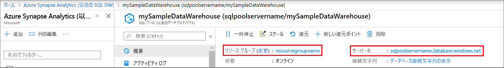

# <a name="quickstart-pause-and-resume-compute-in-dedicated-sql-pool-formerly-sql-dw-with-azure-powershell"></a>クイックスタート: Azure PowerShell を使用して専用 SQL プール (以前の SQL DW) のコンピューティングを一時停止、再開する

Azure PowerShell を使用して、専用 SQL プール (以前の SQL DW) のコンピューティング リソースを一時停止および再開できます。
Azure サブスクリプションをお持ちでない場合は、開始する前に[無料](https://azure.microsoft.com/free/)アカウントを作成してください。

## <a name="before-you-begin"></a>開始する前に

[!INCLUDE [updated-for-az](../../../includes/updated-for-az.md)]

このクイックスタートでは、一時停止および再開できる専用 SQL プール (以前の SQL DW) が既にあることを前提としています。 作成する必要がある場合は、[ポータルでの作成と接続](create-data-warehouse-portal.md)に関する記事に従って、**mySampleDataWarehouse** という名前の専用 SQL プール (以前の SQL DW) を作成することができます。

## <a name="log-in-to-azure"></a>Azure にログインする

[Connect-AzAccount](/powershell/module/az.accounts/connect-azaccount?toc=/azure/synapse-analytics/sql-data-warehouse/toc.json&bc=/azure/synapse-analytics/sql-data-warehouse/breadcrumb/toc.json) コマンドで Azure サブスクリプションにログインし、画面上の指示に従います。

```powershell
Connect-AzAccount
```

使用しているサブスクリプションを確認するには、[Get-AzSubscription](/powershell/module/az.accounts/get-azsubscription?toc=/azure/synapse-analytics/sql-data-warehouse/toc.json&bc=/azure/synapse-analytics/sql-data-warehouse/breadcrumb/toc.json) を実行します。

```powershell
Get-AzSubscription
```

既定ではない別のサブスクリプションを使用する必要がある場合は、[Set-AzContext](/powershell/module/az.accounts/set-azcontext?toc=/azure/synapse-analytics/sql-data-warehouse/toc.json&bc=/azure/synapse-analytics/sql-data-warehouse/breadcrumb/toc.json) を実行します。

```powershell
Set-AzContext -SubscriptionName "MySubscription"
```

## <a name="look-up-dedicated-sql-pool-formerly-sql-dw-information"></a>専用 SQL プール (以前の SQL DW) 情報を参照する

一時停止して再開する予定の専用 SQL プール (以前の SQL DW) のデータベース名、サーバー名、リソース グループを見つけます。

専用 SQL プール (以前の SQL DW) の場所の情報を検索するには、こちらの手順に従います。

1. [Azure portal](https://portal.azure.com/) にサインインします。
1. Azure portal の左側のページで **[Azure Synapse Analytics (以前の SQL DW)]** をクリックします。
1. **[Azure Synapse Analytics (以前の SQL DW)]** ページから **[mySampleDataWarehouse]** を選択します。 SQL プールが開きます。

    

1. 専用 SQL プール (以前の SQL DW) の名前を書き留めます。これはデータベース名です。 サーバー名とリソース グループも書き留めます。
1. PowerShell コマンドレットで使用するのは、サーバー名の最初の部分のみです。 前の図では、サーバーの完全名は sqlpoolservername.database.windows.net です。 PowerShell コマンドレットでは、サーバー名として **sqlpoolservername** を使用します。

## <a name="pause-compute"></a>コンピューティングの一時停止

コストを節約するために、オンデマンドでコンピューティング リソースを一時停止および再開できます。 たとえば、夜間と週末にデータベースを使用しない場合、その期間にデータベースを一時停止して、日中に再開することができます。

>[!NOTE]
>データベースが一時停止されている間、コンピューティング リソースへの課金は行われません。 ただし、ストレージに対する課金は引き続き行われます。

データベースを一時停止するには、[Suspend-AzSqlDatabase](/powershell/module/az.sql/suspend-azsqldatabase?toc.json&bc=/azure/synapse-analytics/sql-data-warehouse/breadcrumb/toc.json) コマンドレットを使用します。 次の例は、**sqlpoolservername** という名前のサーバーでホストされている **mySampleDataWarehouse** という名前の SQL プールを一時停止します。 このサーバーは、**myResourceGroup** という名前の Azure リソース グループ内にあります。

```Powershell
Suspend-AzSqlDatabase –ResourceGroupName "myResourceGroup" `
–ServerName "sqlpoolservername" –DatabaseName "mySampleDataWarehouse"
```

次の例では、$database オブジェクトにデータベースを取り込みます。 オブジェクトは [Suspend-AzSqlDatabase](/powershell/module/az.sql/suspend-azsqldatabase?toc.json&bc=/azure/synapse-analytics/sql-data-warehouse/breadcrumb/toc.json) にパイプ処理されます。 結果は、オブジェクト resultDatabase に格納されます。 最後のコマンドは結果を表示します。

```Powershell
$database = Get-AzSqlDatabase –ResourceGroupName "myResourceGroup" `
–ServerName "sqlpoolservername" –DatabaseName "mySampleDataWarehouse"
$resultDatabase = $database | Suspend-AzSqlDatabase
$resultDatabase
```

## <a name="resume-compute"></a>コンピューティングの再開

データベースを開始するには、[Resume-AzSqlDatabase](/powershell/module/az.sql/resume-azsqldatabase?toc.json&bc=/azure/synapse-analytics/sql-data-warehouse/breadcrumb/toc.json) コマンドレットを使用します。 次の例は、**sqlpoolservername** という名前のサーバーでホストされている **mySampleDataWarehouse** という名前のデータベースを開始します。 このサーバーは、**myResourceGroup** という名前の Azure リソース グループ内にあります。

```Powershell
Resume-AzSqlDatabase –ResourceGroupName "myResourceGroup" `
–ServerName "sqlpoolservername" -DatabaseName "mySampleDataWarehouse"
```

次の例では、$database オブジェクトにデータベースを取り込みます。 オブジェクトは [Resume-AzSqlDatabase](/powershell/module/az.sql/resume-azsqldatabase?toc=/azure/synapse-analytics/sql-data-warehouse/toc.json&bc=/azure/synapse-analytics/sql-data-warehouse/breadcrumb/toc.json) にパイプ処理され、結果が $resultDatabase に格納されます。 最後のコマンドは結果を表示します。

```Powershell
$database = Get-AzSqlDatabase –ResourceGroupName "myResourceGroup" `
–ServerName "sqlpoolservername" –DatabaseName "mySampleDataWarehouse"
$resultDatabase = $database | Resume-AzSqlDatabase
$resultDatabase
```

## <a name="check-status-of-your-sql-pool-operation"></a>SQL プールの操作の状態の確認

専用 SQL プール (以前の SQL DW) の状態を確認するには、[Get-AzSqlDatabaseActivity](/powershell/module/az.sql/Get-AzSqlDatabaseActivity?toc.json&bc=/azure/synapse-analytics/sql-data-warehouse/breadcrumb/toc.json) コマンドレットを使用します。

```Powershell
Get-AzSqlDatabaseActivity -ResourceGroupName "myResourceGroup" -ServerName "sqlpoolservername" -DatabaseName "mySampleDataWarehouse"
```

## <a name="clean-up-resources"></a>リソースをクリーンアップする

データ ウェアハウス ユニットと専用 SQL プール (以前の SQL DW) に格納されているデータに対して課金されます。 これらのコンピューティングとストレージのリソースは別々に請求されます。

- データをストレージ内に保持する場合は、コンピューティングを一時停止します。
- それ以上課金されないようにする場合は、SQL プールを削除できます。

必要に応じて、以下の手順でリソースをクリーンアップします。

1. [Azure portal](https://portal.azure.com) にサインインし、SQL プールをクリックします。

    

2. コンピューティング リソースを一時停止するには、 **[一時停止]** ボタンをクリックします。 SQL プールが一時停止すると、ボタンの表示が **[開始]** になります。  コンピューティング リソースを再開するには、 **[開始]** をクリックします。

3. コンピューティング リソースやストレージに課金されないように SQL プールを削除するには、 **[削除]** をクリックします。

4. 作成した SQL Server を削除するには、**sqlpoolservername.database.windows.net** をクリックした後、 **[削除]** をクリックします。  サーバーを削除すると、サーバーに割り当てられているすべてのデータベースが削除されるので、削除には注意してください。

5. リソース グループを削除するには、**myResourceGroup** をクリックして、 **[リソース グループの削除]** をクリックします。

## <a name="next-steps"></a>次のステップ

SQL プールに関する理解をさらに深めるために、[専用 SQL プール (以前の SQL DW) へのデータの読み込み](./load-data-from-azure-blob-storage-using-copy.md)に関する記事に進んでください。 コンピューティング機能の管理の詳細については、[コンピューティングの管理の概要](sql-data-warehouse-manage-compute-overview.md)に関する記事を参照してください。