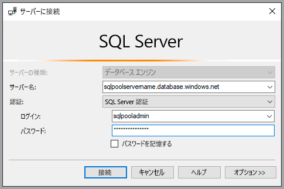
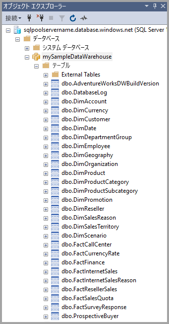
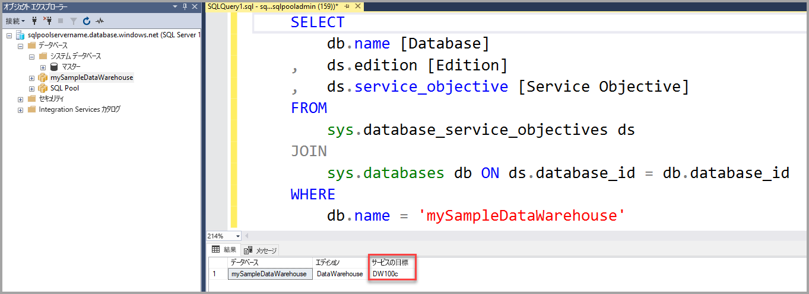

# <a name="quickstart-scale-compute-for-dedicated-sql-pool-formerly-sql-dw-in-azure-synapse-analytics-using-t-sql"></a>クイックスタート: Azure Synapse Analytics の専用 SQL プール (以前の SQL DW) に使用されるコンピューティングを T-SQL を使用してスケーリングする

T-SQL と SQL Server Management Studio (SSMS) を使用して、専用 SQL プール (以前の SQL DW) のコンピューティングをスケーリングします。 [コンピューティングをスケールアウト](sql-data-warehouse-manage-compute-overview.md)してパフォーマンスを向上させます。または、コンピューティングをスケールバックしてコストを削減します。

Azure サブスクリプションをお持ちでない場合は、開始する前に[無料](https://azure.microsoft.com/free/)アカウントを作成してください。

## <a name="before-you-begin"></a>開始する前に

最新バージョンの [SQL Server Management Studio](/sql/ssms/download-sql-server-management-studio-ssms?toc=/azure/synapse-analytics/sql-data-warehouse/toc.json&bc=/azure/synapse-analytics/sql-data-warehouse/breadcrumb/toc.json&view=azure-sqldw-latest&preserve-view=true) (SSMS) をダウンロードしてインストールします。

## <a name="create-a-dedicated-sql-pool-formerly-sql-dw"></a>専用 SQL プール (以前の SQL DW) を作成する

[ポータルでの作成と接続に関するクイックスタート](create-data-warehouse-portal.md)を使用して、**mySampleDataWarehouse** という名前の専用 SQL プール (以前の SQL DW) を作成します。 クイックスタートを完了して、ファイアウォール規則があり、SQL Server Management Studio 内から専用 SQL プール (以前の SQL DW) に接続できることを確認します。

## <a name="connect-to-the-server-as-server-admin"></a>サーバー管理者としてサーバーに接続する

このセクションでは、[SQL Server Management Studio](/sql/ssms/download-sql-server-management-studio-ssms?toc=/azure/synapse-analytics/sql-data-warehouse/toc.json&bc=/azure/synapse-analytics/sql-data-warehouse/breadcrumb/toc.json&view=azure-sqldw-latest&preserve-view=true) (SSMS) を使って、Azure SQL Server に対する接続を確立します。

1. SQL Server Management Studio を開きます。

2. **[サーバーへの接続]** ダイアログ ボックスで、次の情報を入力します。

   | 設定       | 推奨値 | 説明 |
   | ------------ | ------------------ | ------------------------------------------------- |
   | サーバーの種類 | データベース エンジン | この値は必須です |
   | サーバー名 | 完全修飾サーバー名 | 例: **mySampleDataWarehouseservername.database.windows.net** |
   | 認証 | SQL Server 認証 | このチュートリアルで構成した認証の種類は "SQL 認証" のみです。 |
   | ログイン | サーバー管理者アカウント | サーバーの作成時に指定したアカウントです。 |
   | Password | サーバー管理者アカウントのパスワード | サーバーの作成時に指定したパスワードです。 |

    

3. **[Connect]** をクリックします。 SSMS で [オブジェクト エクスプローラー] ウィンドウが開きます。

4. オブジェクト エクスプローラーで、 **[データベース]** を展開します。 **mySampleDataWarehouse** を展開して、新しいデータベースのオブジェクトを表示します。

    

## <a name="view-service-objective"></a>サービス目標の表示

サービス目標設定には、専用 SQL プール (以前の SQL DW) の Data Warehouse ユニットの数が含まれています。

専用 SQL プール (以前の SQL DW) に使用されている現在の Data Warehouse ユニットを確認するには、次の手順に従います。

1. **mySampleDataWarehouseservername.database.windows.net** への接続で、**System Databases** を展開します。
2. **master** を右クリックし、 **[新しいクエリ]** を選択します。 新しいクエリ ウィンドウが開きます。
3. 次のクエリを実行して、sys.database_service_objectives 動的管理ビューから選択します。

    ```sql
    SELECT
        db.name [Database]
    ,    ds.edition [Edition]
    ,    ds.service_objective [Service Objective]
    FROM
         sys.database_service_objectives ds
    JOIN
        sys.databases db ON ds.database_id = db.database_id
    WHERE
        db.name = 'mySampleDataWarehouse'
    ```

4. 次の結果は、**mySampleDataWarehouse** のサービス目標が DW400 であることを示しています。

    

## <a name="scale-compute"></a>コンピューティングのスケーリング

専用 SQL プール (以前の SQL DW) では、Data Warehouse ユニットを調整してコンピューティング リソースを増減させることができます。 [ポータルでの作成と接続](create-data-warehouse-portal.md)では、**mySampleDataWarehouse** を作成し、それを 400 DWU で初期化しました。 次の手順では、**mySampleDataWarehouse** の DWU を調整します。

Data Warehouse ユニットを変更するには:

1. **master** を右クリックし、 **[新しいクエリ]** を選択します。
2. [ALTER DATABASE](/sql/t-sql/statements/alter-database-azure-sql-database?toc=/azure/synapse-analytics/sql-data-warehouse/toc.json&bc=/azure/synapse-analytics/sql-data-warehouse/breadcrumb/toc.json&view=azure-sqldw-latest&preserve-view=true) T-SQL ステートメントを使用して、サービス目標を変更します。 次のクエリを実行して、サービス目標を DW300 に変更します。

    ```Sql
    ALTER DATABASE mySampleDataWarehouse
    MODIFY (SERVICE_OBJECTIVE = 'DW300c');
    ```

## <a name="monitor-scale-change-request"></a>スケール変更要求の監視

以前の変更要求の進行状況を確認するには、`WAITFORDELAY` T-SQL 構文を使用して [sys.dm_operation_status](/sql/relational-databases/system-dynamic-management-views/sys-dm-operation-status-azure-sql-database?view=azure-sqldw-latest&preserve-view=true) 動的管理ビュー (DMV) をポーリングします。

サービス オブジェクトの変更状態をポーリングするには:

1. **master** を右クリックし、 **[新しいクエリ]** を選択します。
2. 次のクエリを実行して、[sys.dm_operation_status](/sql/relational-databases/system-dynamic-management-views/sys-dm-operation-status-azure-sql-database?view=azure-sqldw-latest&preserve-view=true) DMV をポーリングします。

    ```sql
    WHILE
    (
        SELECT TOP 1 state_desc
        FROM sys.dm_operation_status
        WHERE
            1=1
            AND resource_type_desc = 'Database'
            AND major_resource_id = 'mySampleDataWarehouse'
            AND operation = 'ALTER DATABASE'
        ORDER BY
            start_time DESC
    ) = 'IN_PROGRESS'
    BEGIN
        RAISERROR('Scale operation in progress',0,0) WITH NOWAIT;
        WAITFOR DELAY '00:00:05';
    END
    PRINT 'Complete';
    ```

3. 結果の出力には、状態のポーリングのログが表示されます。

    

## <a name="check-dedicated-sql-pool-formerly-sql-dw-state"></a>専用 SQL プール (以前の SQL DW) の状態の確認

専用 SQL プール (以前の SQL DW) が一時停止すると、T-SQL で接続することはできません。 専用 SQL プール (以前の SQL DW) の現在の状態を確認する場合は、PowerShell コマンドレットを使用できます。 例については、[PowerShell を使用して専用 SQL プール (以前の SQL DW) の状態を確認する](quickstart-scale-compute-powershell.md#check-data-warehouse-state)方法に関するセクションを参照してください。

## <a name="check-operation-status"></a>操作の状態の確認

専用 SQL プール (以前の SQL DW) に対するさまざまな管理操作に関する情報を返すには、[sys.dm_operation_status](/sql/relational-databases/system-dynamic-management-views/sys-dm-operation-status-azure-sql-database?toc=/azure/synapse-analytics/sql-data-warehouse/toc.json&bc=/azure/synapse-analytics/sql-data-warehouse/breadcrumb/toc.json&view=azure-sqldw-latest&preserve-view=true) DMV で次のクエリを実行します。 たとえば、操作と操作の状態 (IN_PROGRESS または COMPLETED) が返されます。

```sql
SELECT *
FROM
    sys.dm_operation_status
WHERE
    resource_type_desc = 'Database'
AND
    major_resource_id = 'mySampleDataWarehouse'
```

## <a name="next-steps"></a>次のステップ

ここでは、専用 SQL プール (以前の SQL DW) の計算をスケーリングする方法について学習しました。 Azure Synapse Analytics に関する理解をさらに深めるために、データの読み込みに関するチュートリアルに進んでください。

> [!div class="nextstepaction"]
>[専用 SQL プールにデータを読み込む](./load-data-from-azure-blob-storage-using-copy.md)