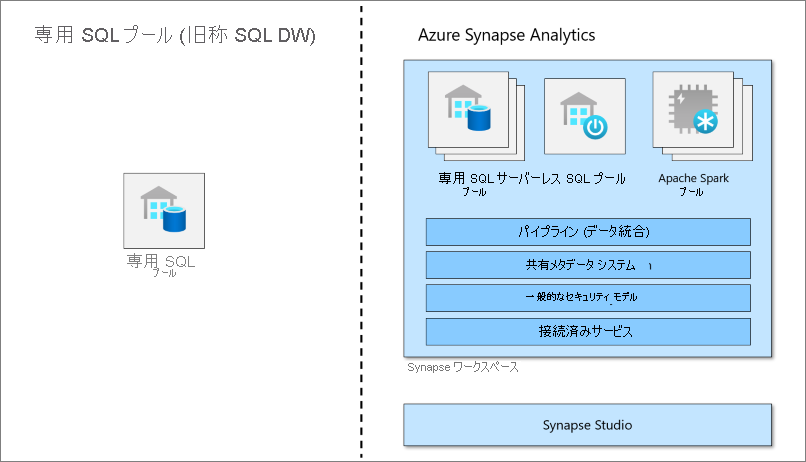

# Azure Synapse Analytics の専用 SQL プール (以前の SQL DW) とは

Azure Synapse Analytics は、エンタープライズ データ ウェアハウスとビッグ データ分析がまとめられた分析サービスです。 専用 SQL プール (以前の SQL DW) は、Azure Synapse Analytics で提供されているエンタープライズ データ ウェアハウス機能を指します。

専用 SQL プール (以前の SQL DW) は、Synapse SQL を使用するときにプロビジョニングされる分析リソースのコレクションを表します。 専用 SQL プール (以前の SQL DW) のサイズは、Data Warehouse ユニット (DWU) によって決まります。

専用 SQL プールの作成後、簡単な [PolyBase](/sql/relational-databases/polybase/polybase-guide?toc=/azure/synapse-analytics/sql-data-warehouse/toc.json&bc=/azure/synapse-analytics/sql-data-warehouse/breadcrumb/toc.json&view=azure-sqldw-latest&preserve-view=true) T-SQL クエリを使用してビッグ データをインポートしてから、分散クエリ エンジンの機能を利用してハイ パフォーマンスの分析を実行することができます。 データの統合と分析を進めると、専用 SQL プール (以前の SQL DW) は、企業がより迅速で確実な分析情報を得るために信頼できる唯一の真実になります。

> [!NOTE]
>詳細については、[Azure Synapse Analytics のドキュメント](../overview-what-is.md)を参照してください。
> 

## ビッグ データ ソリューションの主要コンポーネント

データ ウェアハウジングは、クラウドベースのエンドツーエンドなビッグ データ ソリューションの主要コンポーネントです。

クラウド データ ソリューションでは、多様なソースのデータがビッグ データ ストアに取り込まれます。 ビッグ データ ストアに取り込まれた後は、Hadoop、Spark、および機械学習アルゴリズムがデータの準備とトレーニングを行います。 データで複雑な分析を行う準備が整うと、専用 SQL プールは PolyBase を使用してビッグ データ ストアのクエリを実行します。 PolyBase は、専用 SQL プール (以前の SQL DW) のテーブルにデータを読み込むために標準の T-SQL クエリを使用します。

専用 SQL プール (以前の SQL DW) は、列指向ストレージを使用してリレーショナル テーブルにデータを格納します。 この形式により、データのストレージ コストが大幅に削減され、クエリのパフォーマンスが向上します。 データを格納すると、大規模な分析を実行できます。 従来のデータベース システムと比較すると、分単位かかっていた分析クエリが秒単位に、日単位が時間単位に短縮されます。

分析結果は世界中のレポート データベースやアプリケーションに移動できます。 また、ビジネスの分析に洞察を加え、適切な情報に基づいた決断を下すことができるようになります。

## 次のステップ

- [Azure Synapse アーキテクチャ](massively-parallel-processing-mpp-architecture.md)の詳細
- すばやく[専用 SQL プールを作成する](create-data-warehouse-portal.md)
- [サンプル データを読み込む](./load-data-from-azure-blob-storage-using-copy.md)
- [ビデオ](https://azure.microsoft.com/documentation/videos/index/?services=sql-data-warehouse)を確認する

または、次の Azure Synapse リソースも確認できます。

- [ブログ](https://azure.microsoft.com/blog/tag/azure-sql-data-warehouse/)を検索する
- [機能要求](https://feedback.azure.com/forums/307516-sql-data-warehouse)を送信する
- [サポート チケットを作成](sql-data-warehouse-get-started-create-support-ticket.md)
- [Microsoft Q&A 質問ページ](/answers/topics/azure-synapse-analytics.html)を検索する
- [Stack Overflow フォーラム](https://stackoverflow.com/questions/tagged/azure-sqldw)を検索する