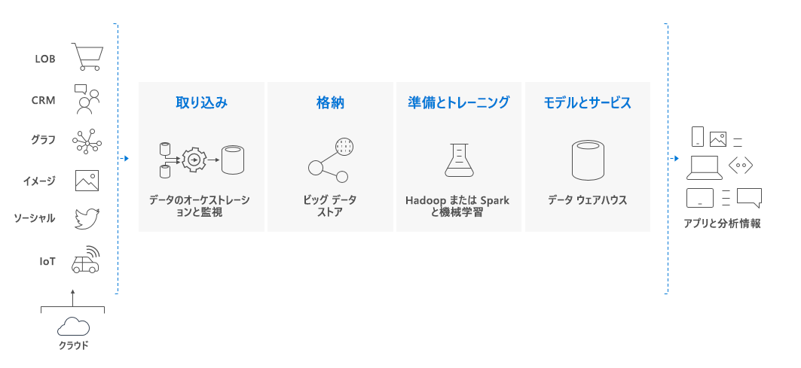

# Azure Synapse Analytics (旧称 SQL DW) とは

> [!NOTE] 
>詳細については、[Azure Synapse (ワークスペース プレビュー) のドキュメント](../overview-what-is.md)を参照してください。
>

Azure Synapse は、エンタープライズ データ ウェアハウスとビッグ データ分析がまとめられた分析サービスです。 サーバーレスのオンデマンド リソースまたはプロビジョニング済みのリソースを使用しながら大規模に、各自の条件で自由にデータを照会することができます。 Azure Synapse では、これら 2 つの環境を 1 つにした統合エクスペリエンスを使用して、データの取り込み、準備、管理、提供を行い、BI と機械学習の差し迫ったニーズに対応できます。

Azure Synapse には、次の 4 つのコンポーネントがあります。

- Synapse SQL:完全な T-SQL ベースの分析 – 一般公開
  - SQL プール (DWU プロビジョニング単位の課金)
  - SQL オンデマンド (処理された TB 単位の課金) (プレビュー)
- Spark:緊密に統合された Apache Spark (プレビュー)
- Synapse パイプライン:ハイブリッド データ統合 (プレビュー)
- Studio:統一ユーザー エクスペリエンス (プレビュー)

## Azure Synapse の Synapse SQL プール

Synapse SQL プールは、Azure Synapse で一般提供されているエンタープライズ データ ウェアハウス機能を指します。

SQL プールは、Synapse SQL を使用するときにプロビジョニングされる分析リソースのコレクションを表します。 SQL プールのサイズは、Data Warehouse ユニット (DWU) によって決まります。

簡単な [PolyBase](/sql/relational-databases/polybase/polybase-guide?toc=/azure/synapse-analytics/sql-data-warehouse/toc.json&bc=/azure/synapse-analytics/sql-data-warehouse/breadcrumb/toc.json&view=azure-sqldw-latest) T-SQL クエリを使用してビッグ データをインポートしてから、MPP の機能を利用してハイ パフォーマンスの分析を実行します。 統合と分析を進めると、Synapse SQL プールは、企業がより迅速で確実な分析情報を得るために信頼できる唯一の真実になります。  

## ビッグ データ ソリューションの主要コンポーネント

データ ウェアハウジングは、クラウドベースのエンドツーエンドなビッグ データ ソリューションの主要コンポーネントです。

クラウド データ ソリューションでは、多様なソースのデータがビッグ データ ストアに取り込まれます。 ビッグ データ ストアに取り込まれた後は、Hadoop、Spark、および機械学習アルゴリズムがデータの準備とトレーニングを行います。 データで複雑な分析を行う準備が整うと、Synapse SQL プールは PolyBase を使用してビッグ データ ストアのクエリを実行します。 PolyBase は、Synapse SQL プールのテーブルにデータを読み込むために標準の T-SQL クエリを使用します。

Synapse SQL プールは、列指向ストレージを使用してリレーショナル テーブルにデータを格納します。 この形式にすると、データのストレージ コストが大幅に少なくなり、クエリのパフォーマンスが改善されます。 データを格納すると、大規模な分析を実行できます。 従来のデータベース システムと比較すると、分単位かかっていた分析クエリが秒単位に、日単位が時間単位に短縮されます。

分析結果は世界中のレポート データベースやアプリケーションに移動できます。 また、ビジネスの分析に洞察を加え、適切な情報に基づいた決断を下すことができるようになります。

## 次のステップ

- [Azure Synapse アーキテクチャ](massively-parallel-processing-mpp-architecture.md)の詳細
- [SQL プールの簡易作成](create-data-warehouse-portal.md)
- [サンプル データを読み込む](load-data-from-azure-blob-storage-using-polybase.md)
- [ビデオ](https://azure.microsoft.com/documentation/videos/index/?services=sql-data-warehouse)を確認する

または、次の Azure Synapse リソースも確認できます。

- [ブログ](https://azure.microsoft.com/blog/tag/azure-sql-data-warehouse/)を検索する
- [機能要求](https://feedback.azure.com/forums/307516-sql-data-warehouse)を送信する
- [サポート チケットを作成](sql-data-warehouse-get-started-create-support-ticket.md)
- [MSDN フォーラム](https://social.msdn.microsoft.com/Forums/azure/home?forum=AzureSQLDataWarehouse)を検索する
- [Stack Overflow フォーラム](https://stackoverflow.com/questions/tagged/azure-sqldw)を検索する
