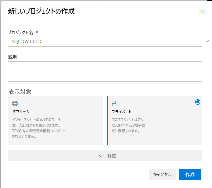
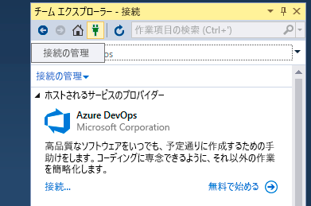
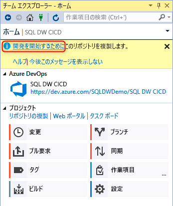
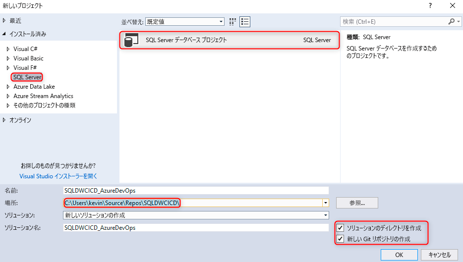
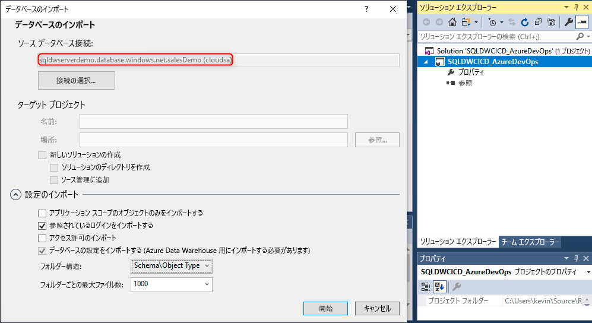
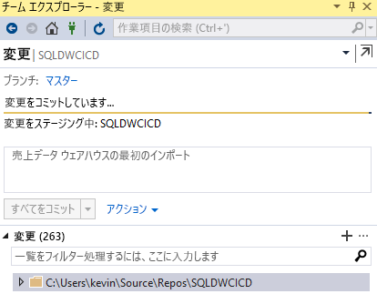
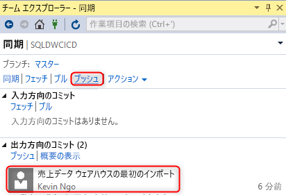
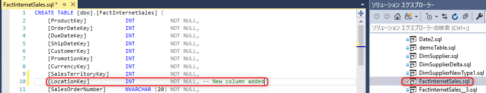
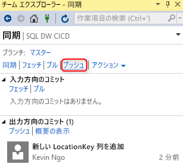
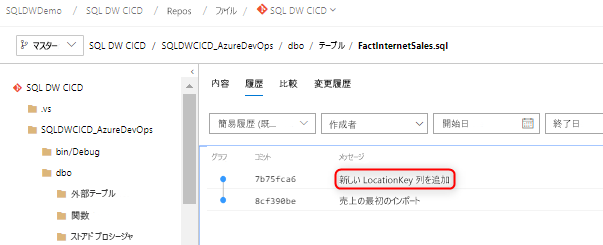

# Azure Synapse Analytics の専用 SQL プールを対象としたソース管理の統合

このチュートリアルでは、SQL Server Data Tools (SSDT) データベース プロジェクトをソース管理と統合する方法について概説します。  ソース管理の統合は、Azure Synapse Analytics の専用 SQL プール リソースを使用して継続的インテグレーションと継続的デプロイのパイプラインを構築するための最初の手順です。

## 開始する前に

- [Azure DevOps 組織](https://azure.microsoft.com/services/devops/)にサインアップします
- [作成と接続](create-data-warehouse-portal.md)に関するチュートリアルを実行します
- [Visual Studio 2019 をインストール](https://visualstudio.microsoft.com/vs/older-downloads/)します

## Azure DevOps を設定して接続する

1. Azure DevOps 組織内で、Azure Repo リポジトリを介して SSDT データベース プロジェクトをホストするプロジェクトを作成します。

   

2. Visual Studio を開き、 **[接続の管理]** を選択して、手順 1 の Azure DevOps 組織とプロジェクトに接続します。

   

3. **[接続の管理]** 、 **[Connect to a project]\(プロジェクトに接続\)** の順に選択してプロジェクトに接続します。
 
    

4. 手順 1 で作成したプロジェクトを探し、 **[接続]** を選択します。
 
    

3. プロジェクトからお使いのローカル コンピューターに Azure DevOps リポジトリを複製します

   

Visual Studio を使用したプロジェクトの接続の詳細については、「[チーム エクスプローラーのプロジェクトに接続する](/visualstudio/ide/connect-team-project?view=vs-2019&preserve-view=true)」を参照してください。 Visual Studio を使用したリポジトリの複製に関するガイダンスは、「[既存の Git リポジトリを複製する](/azure/devops/repos/git/clone?tabs=visual-studio)」をご確認ください。 

## プロジェクトを作成して接続する

1. Visual Studio で、**ローカルの複製されたリポジトリ** に、ディレクトリとローカル Git リポジトリの両方を含む新しい SQL Server データベース プロジェクトを作成します。

     

2. 空の sqlproject を右クリックし、お使いのデータ ウェアハウスをデータベース プロジェクトにインポートします。

     

3. Visual Studio のチーム エクスプローラーで、ローカル Git リポジトリに対する変更をコミットします。

     

4. これで、複製されたリポジトリで変更がローカルにコミットされたので、Azure DevOps プロジェクトの Azure Repo リポジトリに変更を同期してプッシュします。

   

     

## 検証

1. Visual Studio SQL Server Data Tools (SSDT) から対象のデータベース プロジェクトのテーブル列を更新して、変更が Azure Repo にプッシュされたことを確認します。

   

2. 変更をコミットしてローカル リポジトリから Azure Repo にプッシュします。

   

3. Azure Repo リポジトリに変更がプッシュされたことを確認します。

   

4. (**省略可能**) SSDT を使用し、Schema Compare を使用してターゲット専用 SQL プールへの変更を更新し、Azure Repo リポジトリおよびローカル リポジトリ内のオブジェクト定義に確実に専用 SQL プールが反映されるようにします。

## 次のステップ

- [専用 SQL プールのための開発](sql-data-warehouse-overview-develop.md)