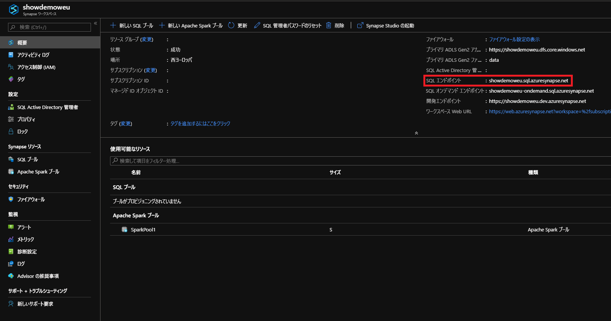
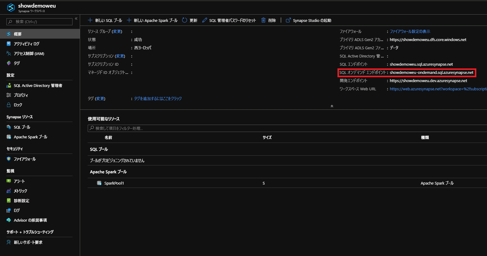

# <a name="connect-to-synapse-sql"></a>Synapse SQL に接続する
Azure Synapse Analytics の Synapse SQL 機能に接続します。

## <a name="supported-tools-for-sql-on-demand-preview"></a>SQL オンデマンド (プレビュー) でサポートされるツール

完全にサポートされているツールは Azure Data Studio (プレビュー) です。

SQL Server Management Studio は、バージョン 18.4 から部分的にサポートされています。 接続やクエリなどの機能には制限があります。

## <a name="find-your-server-name"></a>サーバー名を検索する

次の例の SQL プールのサーバー名は、showdemoweu.sql.azuresynapse.net です。
次の例の SQL オンデマンドのサーバー名は、showdemoweu-ondemand.sql.azuresynapse.net です。

完全修飾サーバー名を検索するには、次の手順に従います。

1. [Azure ポータル](https://portal.azure.com)にアクセスします。
2. **[Synapse ワークスペース]** をクリックします。
3. 接続先のワークスペースをクリックします。
4. [概要] に移動します。
5. サーバーの完全名を見つけます。

## <a name="sql-pool"></a>**SQL プール**



## <a name="sql-on-demand"></a>**SQL オンデマンド**



## <a name="supported-drivers-and-connection-strings"></a>サポートされるドライバーと接続文字列
Synapse SQL プールでは、[ADO.NET](https://msdn.microsoft.com/library/e80y5yhx(v=vs.110).aspx)、[ODBC](https://msdn.microsoft.com/library/jj730314.aspx)、[PHP](https://msdn.microsoft.com/library/cc296172.aspx?f=255&MSPPError=-2147217396)、および [JDBC](https://msdn.microsoft.com/library/mt484311(v=sql.110).aspx) がサポートされています。 最新のバージョンとドキュメントを確認するには、これらドライバーのいずれかをクリックしてください。 使用しているドライバーの接続文字列を Azure Portal から自動的に生成するには、上の例にある **[データベース接続文字列の表示]** をクリックします。 以下に、各ドライバーの接続文字列の例を示します。

> [!NOTE]
> 断続的に切断された場合でも接続を保持できるように、接続のタイムアウトを 300 秒に設定することを検討してください。

### <a name="adonet-connection-string-example"></a>ADO.NET 接続文字列の例

```csharp
Server=tcp:{your_server}.sql.azuresynapse.net,1433;Database={your_database};User ID={your_user_name};Password={your_password_here};Encrypt=True;TrustServerCertificate=False;Connection Timeout=30;
```

### <a name="odbc-connection-string-example"></a>ODBC 接続文字列の例

```csharp
Driver={SQL Server Native Client 11.0};Server=tcp:{your_server}.sql.azuresynapse.net,1433;Database={your_database};Uid={your_user_name};Pwd={your_password_here};Encrypt=yes;TrustServerCertificate=no;Connection Timeout=30;
```

### <a name="php-connection-string-example"></a>PHP 接続文字列の例

```PHP
Server: {your_server}.sql.azuresynapse.net,1433 \r\nSQL Database: {your_database}\r\nUser Name: {your_user_name}\r\n\r\nPHP Data Objects(PDO) Sample Code:\r\n\r\ntry {\r\n   $conn = new PDO ( \"sqlsrv:server = tcp:{your_server}.sql.azuresynapse.net,1433; Database = {your_database}\", \"{your_user_name}\", \"{your_password_here}\");\r\n    $conn->setAttribute( PDO::ATTR_ERRMODE, PDO::ERRMODE_EXCEPTION );\r\n}\r\ncatch ( PDOException $e ) {\r\n   print( \"Error connecting to SQL Server.\" );\r\n   die(print_r($e));\r\n}\r\n\rSQL Server Extension Sample Code:\r\n\r\n$connectionInfo = array(\"UID\" => \"{your_user_name}\", \"pwd\" => \"{your_password_here}\", \"Database\" => \"{your_database}\", \"LoginTimeout\" => 30, \"Encrypt\" => 1, \"TrustServerCertificate\" => 0);\r\n$serverName = \"tcp:{your_server}.sql.azuresynapse.net,1433\";\r\n$conn = sqlsrv_connect($serverName, $connectionInfo);
```

### <a name="jdbc-connection-string-example"></a>JDBC 接続文字列の例

```Java
jdbc:sqlserver://yourserver.sql.azuresynapse.net:1433;database=yourdatabase;user={your_user_name};password={your_password_here};encrypt=true;trustServerCertificate=false;hostNameInCertificate=*.sql.azuresynapse.net;loginTimeout=30;
```

## <a name="connection-settings"></a>接続の設定
Synapse SQL では、接続とオブジェクトの作成時に一部の設定が標準化されます。 これらの設定をオーバーライドすることはできません。設定には次のものがあります。

| データベースの設定 | 値 |
|:--- |:--- |
| [ANSI_NULLS](/sql/t-sql/statements/set-ansi-nulls-transact-sql?toc=/azure/synapse-analytics/toc.json&bc=/azure/synapse-analytics/breadcrumb/toc.json&view=azure-sqldw-latest) |ON |
| [QUOTED_IDENTIFIERS](/sql/t-sql/statements/set-quoted-identifier-transact-sql?toc=/azure/synapse-analytics/toc.json&bc=/azure/synapse-analytics/breadcrumb/toc.json&view=azure-sqldw-latest) |ON |
| [DATEFORMAT](/sql/t-sql/statements/set-dateformat-transact-sql?toc=/azure/synapse-analytics/toc.json&bc=/azure/synapse-analytics/breadcrumb/toc.json&view=azure-sqldw-latest) |mdy |
| [DATEFIRST](/sql/t-sql/statements/set-datefirst-transact-sql?toc=/azure/synapse-analytics/toc.json&bc=/azure/synapse-analytics/breadcrumb/toc.json&view=azure-sqldw-latest) |7 |

## <a name="recommendations"></a>Recommendations

**SQL オンデマンド** クエリを実行するために推奨されるツールは、[Azure Data Studio](get-started-azure-data-studio.md) と Azure Synapse Studio です。

## <a name="next-steps"></a>次のステップ
Visual Studio を使用して接続とクエリを行うには、 [Visual Studio を使用したクエリ](../sql-data-warehouse/sql-data-warehouse-query-visual-studio.md?toc=/azure/synapse-analytics/toc.json&bc=/azure/synapse-analytics/breadcrumb/toc.json)に関するページをご覧ください。 認証オプションの詳細については、[Synapse SQL に対する認証](../sql-data-warehouse/sql-data-warehouse-authentication.md?toc=/azure/synapse-analytics/toc.json&bc=/azure/synapse-analytics/breadcrumb/toc.json)に関するページを参照してください。