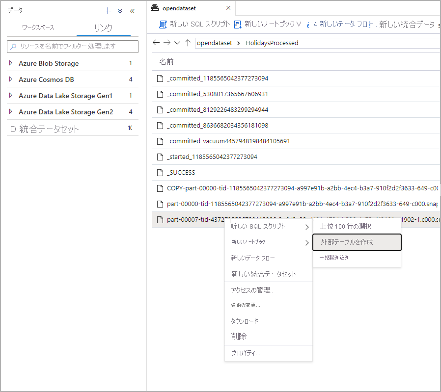
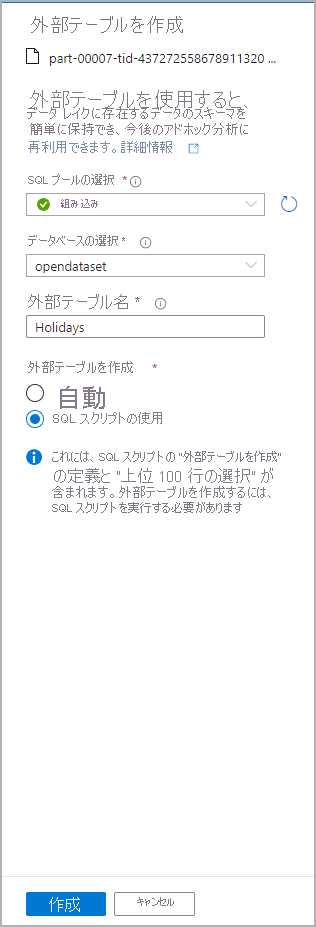
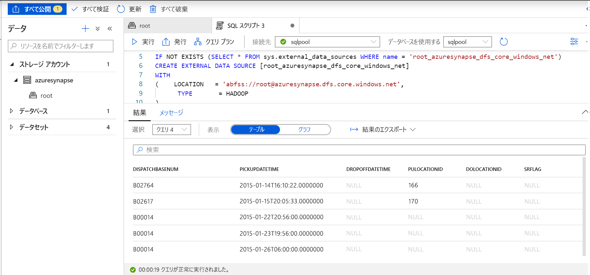
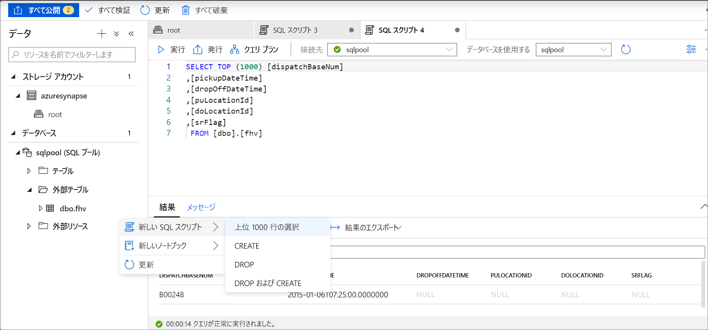

# <a name="use-external-tables-with-synapse-sql"></a>Synapse SQL で外部テーブルを使用する

外部テーブルは、Hadoop、Azure Storage BLOB、または Azure Data Lake Storage にあるデータを参照します。 外部テーブルは、Azure Storage 内のファイルからデータを読み取ったり、ファイルにデータを書き込んだりするために使用されます。 Synapse SQL では、外部テーブルを使用して、SQL プールまたは SQL オンデマンド (プレビュー) に対するデータの読み取りと書き込みを行えます。

## <a name="external-tables-in-sql-pool"></a>SQL プールの外部テーブル

SQL プールでは、外部テーブルを使用して以下を行えます。

- Transact-SQL ステートメントを使用して、Azure Blob Storage と Azure Data Lake Gen2 に対するクエリを実行する。
- Azure Blob Storage と Azure Data Lake Storage から SQL プールにデータのインポートと格納を行う。

[CREATE TABLE AS SELECT](../sql-data-warehouse/sql-data-warehouse-develop-ctas.md?toc=/azure/synapse-analytics/toc.json&bc=/azure/synapse-analytics/breadcrumb/toc.json) ステートメントと組み合わせて使用する場合は、外部テーブルから選択するとデータが SQL プール内のテーブルにインポートされます。 [COPY ステートメント](/sql/t-sql/statements/copy-into-transact-sql?toc=/azure/synapse-analytics/toc.json&bc=/azure/synapse-analytics/breadcrumb/toc.json&view=azure-sqldw-latest)に加えて、外部テーブルはデータの読み込みにも便利です。 読み込みのチュートリアルについては、[PolyBase を使用した Azure Blob Storage からのデータの読み込み](../sql-data-warehouse/load-data-from-azure-blob-storage-using-polybase.md?toc=/azure/synapse-analytics/toc.json&bc=/azure/synapse-analytics/breadcrumb/toc.json)に関するページを参照してください。

## <a name="external-tables-in-sql-on-demand-preview"></a>SQL オンデマンドの外部テーブル (プレビュー)

SQL オンデマンドの場合は、以下を行うために外部テーブルを使用します。

- Transact-SQL ステートメントを使用して、Azure Blob Storage または Azure Data Lake Storage 内のデータのクエリを実行する
- [CETAS](develop-tables-cetas.md) を使用して、SQL オンデマンドのクエリ結果を Azure Blob Storage または Azure Data Lake Storage 内のファイルに格納する。

次の手順を通じて、SQL オンデマンドを使用して外部テーブルを作成できます。

1. CREATE EXTERNAL DATA SOURCE
2. CREATE EXTERNAL FILE FORMAT
3. CREATE EXTERNAL TABLE

## <a name="create-external-data-source"></a>CREATE EXTERNAL DATA SOURCE

外部データ ソースは、ストレージ アカウントへの接続に使用されます。 完全なドキュメントについては、[こちら](/sql/t-sql/statements/create-external-data-source-transact-sql?toc=/azure/synapse-analytics/toc.json&bc=/azure/synapse-analytics/breadcrumb/toc.json&view=azure-sqldw-latest)で概説されています。

## <a name="syntax-for-create-external-data-source"></a>CREATE EXTERNAL DATA SOURCE の構文

```syntaxsql
CREATE EXTERNAL DATA SOURCE <data_source_name>
WITH
(    LOCATION         = '<prefix>://<path>' )
[;]
```

## <a name="arguments-for-create-external-data-source"></a>CREATE EXTERNAL DATA SOURCE の引数

data_source_name: データ ソースのユーザー定義の名前を指定します。 名前は、データベース内で一意である必要があります。

LOCATION = `'<prefix>://<path>'`: 接続プロトコルと外部データ ソースへのパスを指定します。 パスには、`'<prefix>://<path>/container'` の形式でコンテナー、`'<prefix>://<path>/container/folder'` の形式でフォルダーを含めることができます。

| 外部データ ソース        | 場所プレフィックス | ロケーション パス                                         |
| --------------------------- | --------------- | ----------------------------------------------------- |
| Azure Blob Storage          | `wasb[s]`       | `<container>@<storage_account>.blob.core.windows.net` |
| Azure Data Lake Store Gen 1 | `adl`           | `<storage_account>.azuredatalake.net`                 |
| Azure Data Lake Store Gen 2 | `abfs[s]`       | `<container>@<storage_account>.dfs.core.windows.net`  |

## <a name="example-for-create-external-data-source"></a>CREATE EXTERNAL DATA SOURCE の例

次の例では、New York データ セットを参照する Azure Data Lake Gen2 の外部データ ソースを作成します。

```sql
CREATE EXTERNAL DATA SOURCE AzureDataLakeStore
WITH
  -- Please note the abfss endpoint when your account has secure transfer enabled
  ( LOCATION = 'abfss://newyorktaxidataset.azuredatalakestore.net' ,
    CREDENTIAL = ADLS_credential ,
    TYPE = HADOOP
  ) ;
```

## <a name="create-external-file-format"></a>CREATE EXTERNAL FILE FORMAT

Azure Blob Storage または Azure Data Lake Storage に格納される外部データを定義する外部ファイル形式オブジェクトを作成します。 外部ファイル形式の作成は、外部テーブルを作成するための前提条件です。 完全なドキュメントは[こちら](/sql/t-sql/statements/create-external-file-format-transact-sql?toc=/azure/synapse-analytics/toc.json&bc=/azure/synapse-analytics/breadcrumb/toc.json&view=azure-sqldw-latest)にあります。

外部ファイル形式を作成することで、外部テーブルによって参照されるデータの実際のレイアウトを指定します。

## <a name="syntax-for-create-external-file-format"></a>CREATE EXTERNAL FILE FORMAT の構文

```syntaxsql
-- Create an external file format for PARQUET files.  
CREATE EXTERNAL FILE FORMAT file_format_name  
WITH (  
    FORMAT_TYPE = PARQUET  
    [ , DATA_COMPRESSION = {  
        'org.apache.hadoop.io.compress.SnappyCodec'  
      | 'org.apache.hadoop.io.compress.GzipCodec'      }  
    ]);  

--Create an external file format for DELIMITED TEXT files
CREATE EXTERNAL FILE FORMAT file_format_name  
WITH (  
    FORMAT_TYPE = DELIMITEDTEXT  
    [ , FORMAT_OPTIONS ( <format_options> [ ,...n  ] ) ]  
    );  

<format_options> ::=  
{  
    FIELD_TERMINATOR = field_terminator  
    | STRING_DELIMITER = string_delimiter
    | First_Row = integer
    | USE_TYPE_DEFAULT = { TRUE | FALSE }
    | Encoding = {'UTF8' | 'UTF16'}
}
```

## <a name="arguments-for-create-external-file-format"></a>CREATE EXTERNAL FILE FORMAT の引数

file_format_name: 外部ファイル形式の名前を指定します。

FORMAT_TYPE = [ PARQUET | DELIMITEDTEXT]: 外部データの形式を指定します。

- PARQUET: Parquet 形式を指定します。
- DELIMITEDTEXT: フィールド ターミネータとも呼ばれる、列区切り記号付きのテキスト形式を指定します。

FIELD_TERMINATOR = *field_terminator*: 区切りテキスト ファイルにのみ適用されます。 フィールド ターミネータは、テキスト区切りファイルでの各フィールド (列) の終了を示す 1 つ以上の文字を指定します。 既定値はパイプ文字 (ꞌ|ꞌ) です。

例 :

- FIELD_TERMINATOR = '|'
- FIELD_TERMINATOR = ' '
- FIELD_TERMINATOR = ꞌ\tꞌ

STRING_DELIMITER = *string_delimiter*: テキスト区切りのファイル内の文字列型のデータにはフィールド ターミネータを指定します。 文字列の区切り記号の長さは 1 文字または複数文字とし、単一引用符で囲みます。 既定値は空の文字列 ("") です。

例 :

- STRING_DELIMITER = '"'
- STRING_DELIMITER = '*'
- STRING_DELIMITER = ꞌ,ꞌ

FIRST_ROW = *First_row_int*: 最初に読み取られる行の番号を指定し、すべてのファイルに適用します。 値を 2 に設定すると、データの読み込み時に各ファイルの最初の行 (ヘッダー行) がスキップされます。 行は、行ターミネータ (/r/n、/r、/n) の存在に基づいてスキップされます。

USE_TYPE_DEFAULT = { TRUE | **FALSE** }: テキスト ファイルからデータを取得するときに、区切りテキスト ファイル内の不足値を処理する方法を指定します。

TRUE: テキスト ファイルからデータを取得するときは、外部テーブルの定義内の対応する列に既定値のデータ型を使用して、各不足値を格納します。 たとえば、不足値を次の値に置き換えます。

- 列が numeric 型の列として定義されている場合は 0 decimal 型の列はサポートされておらず、エラーになります。
- 列が string 型の列である場合は空の文字列 ("") です。
- 列が date 列の場合は 1900-01-01 です。

FALSE: すべての不足値を NULL として格納します。 区切りテキスト ファイルで単語 NULL を使って格納されている NULL 値は、文字列 "NULL" としてインポートされます。

Encoding = {'UTF8' | 'UTF16'}: SQL オンデマンドでは、UTF8 および UTF16 でエンコードされた区切りテキスト ファイルを読み取ることができます。

DATA_COMPRESSION = *data_compression_method*: この引数では、外部データのデータ圧縮方法を指定します。 外部テーブルからの読み取り時には、これは無視されます。 [CETAS](develop-tables-cetas.md) を使用して外部テーブルに書き込む場合にのみ使用されます。

PARQUET ファイル形式の種類では、次の圧縮方法がサポートされています。

- DATA_COMPRESSION = 'org.apache.hadoop.io.compress.GzipCodec'
- DATA_COMPRESSION = 'org.apache.hadoop.io.compress.SnappyCodec'

## <a name="example-for-create-external-file-format"></a>CREATE EXTERNAL FILE FORMAT の例

次の例では、国勢調査ファイルの外部ファイル形式を作成します。

```sql
CREATE EXTERNAL FILE FORMAT census_file_format
WITH
(  
    FORMAT_TYPE = PARQUET,
    DATA_COMPRESSION = 'org.apache.hadoop.io.compress.SnappyCodec'
)
```

## <a name="create-external-table"></a>CREATE EXTERNAL TABLE

CREATE EXTERNAL TABLE コマンドでは、Azure Blob Storage または Azure Data Lake Storage 内に格納されたデータにアクセスするために Synapse SQL の外部テーブルを作成します。 

## <a name="syntax-for-create-external-table"></a>CREATE EXTERNAL TABLE の構文

```syntaxsql
CREATE EXTERNAL TABLE { database_name.schema_name.table_name | schema_name.table_name | table_name }
    ( <column_definition> [ ,...n ] )  
    WITH (
        LOCATION = 'folder_or_filepath',  
        DATA_SOURCE = external_data_source_name,  
        FILE_FORMAT = external_file_format_name
    )  
[;]  

<column_definition> ::=
column_name <data_type>
    [ COLLATE collation_name ]
```

## <a name="arguments-create-external-table"></a>CREATE EXTERNAL TABLE の引数

*{ database_name.schema_name.table_name | schema_name.table_name | table_name }*

作成するテーブルの 1 つから 3 つの部分で構成される名前。 外部テーブルの場合、SQL オンデマンドではテーブルのメタデータのみが格納されます。 SQL オンデマンドでは、実際のデータの移動または格納は行われません。

<column_definition>, ...*n* ]

CREATE EXTERNAL TABLE では、列名、データ型、NULL 値の許容、照合順序を構成できます。 外部テーブルに対して DEFAULT CONSTRAINT を使用することはできません。

>[!IMPORTANT]
>データ型と列の数を含む列の定義は、外部ファイルのデータと一致している必要があります。 不一致がある場合、実際のデータに対してクエリを実行するときに、ファイルの行が拒否されます。

Parquet ファイルからの読み取りの場合は、読み取りたい列だけを指定して、残りをスキップすることができます。

LOCATION = '*folder_or_filepath*'

Azure Blob Storage にある実際のデータのフォルダーまたはファイル パスとファイル名を指定します。 ルート フォルダーから、場所を開始します。 ルート フォルダーは、外部データ ソースで指定されたデータの場所です。

フォルダーの LOCATION を指定すると、SQL オンデマンドのクエリで外部テーブルから選択が行われ、そのフォルダーからファイルが取得されます。

> [!NOTE]
> Hadoop や PolyBase とは異なり、SQL オンデマンドではサブフォルダーは返されません。 ファイル名が下線 (_) またはピリオド (.) で始まるファイルが返されます。

この例では、LOCATION='/webdata/' である場合、SQL オンデマンドのクエリで mydata.txt と _hidden.txt から行が返されます。 mydata2.txt と mydata3.txt はサブフォルダー内にあるため、これらは返されません。


DATA_SOURCE = *external_data_source_name*: 外部データの場所が含まれている外部データ ソースの名前を指定します。 外部データ ソースを作成するには、[CREATE EXTERNAL DATA SOURCE](#create-external-data-source) を使用します。

FILE_FORMAT = *external_file_format_name*: 外部データのファイルの種類と圧縮方法を格納する外部ファイル形式のオブジェクトの名前を指定します。 外部ファイル形式を作成するには、[CREATE EXTERNAL FILE FORMAT](#create-external-file-format) を使用します。

## <a name="permissions-create-external-table"></a>CREATE EXTERNAL TABLE のアクセス許可

外部テーブルから選択を行うには、適切な資格情報のほか、リストと読み取りのアクセス許可が必要です。

## <a name="example-create-external-table"></a>CREATE EXTERNAL TABLE の例

次の例では、外部テーブルを作成します。 最初の行が返されます。

```sql
CREATE EXTERNAL TABLE census_external_table
(
    decennialTime varchar(20),
    stateName varchar(100),
    countyName varchar(100),
    population int,
    race varchar(50),
    sex    varchar(10),
    minAge int,
    maxAge int
)  
WITH (
    LOCATION = '/parquet/',
    DATA_SOURCE = population_ds,  
    FILE_FORMAT = census_file_format
)
GO

SELECT TOP 1 * FROM census_external_table
```

## <a name="create-and-query-external-tables-from-a-file-in-azure-data-lake"></a>Azure Data Lake 内のファイルから外部テーブルを作成してクエリを実行する

Data Lake の探索機能を使用することで、ファイルを右クリックするだけで、SQL プールまたは SQL オンデマンドを使って外部テーブルを作成してクエリを実行できるようになりました。

## <a name="prerequisites"></a>前提条件

- 少なくとも ADLS Gen2 アカウントに対するストレージ BLOB データ共同作成者 ARM アクセス ロールがある状態で、ワークスペースにアクセスできる必要があります

- SQL プールまたは SQL オンデマンドで外部テーブルを[作成してクエリを実行するためのアクセス許可](/sql/t-sql/statements/create-external-table-transact-sql?toc=/azure/synapse-analytics/toc.json&bc=/azure/synapse-analytics/breadcrumb/toc.json&view=azure-sqldw-latest#permissions-2)が少なくとも必要です

- ADLS Gen2 アカウントに関連付けられているリンクされたサービスには、**ファイルへのアクセス権が必要です**。 たとえば、リンクされたサービスの認証メカニズムがマネージド ID の場合、ワークスペースのマネージド ID には、ストレージ アカウントに対するストレージ BLOB 閲覧者アクセス許可が少なくとも必要です

[データ] パネルで、外部テーブルの作成元にするファイルを選択します。
> [!div class="mx-imgBorder"]
>

ダイアログ ウィンドウが開きます。 SQL プールか SQL オンデマンドを選択し、テーブルに名前を付けて [スクリプトを開く] を選択します。

> [!div class="mx-imgBorder"]
>

SQL スクリプトは、ファイルからのスキーマの推論によって自動的に生成されます。
> [!div class="mx-imgBorder"]
>

スクリプトを実行します。 このスクリプトでは、Select Top 100 *. が自動的に実行されます。
> [!div class="mx-imgBorder"]
>

外部テーブルが作成されました。今後この外部テーブルの内容を探索するために、ユーザーは [データ] ペインから直接クエリを実行できます。
> [!div class="mx-imgBorder"]
>

## <a name="next-steps"></a>次のステップ

クエリの結果を Azure Storage の外部テーブルに保存する方法については、[CETAS](develop-tables-cetas.md) に関する記事をご覧ください。 または、[Spark テーブル](develop-storage-files-spark-tables.md)に対するクエリをすぐに開始できます。
