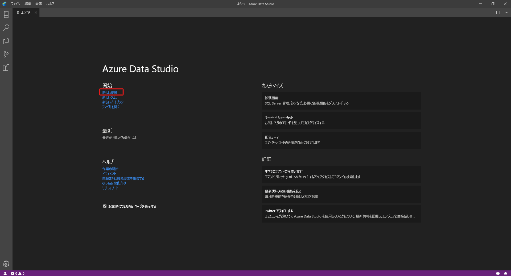
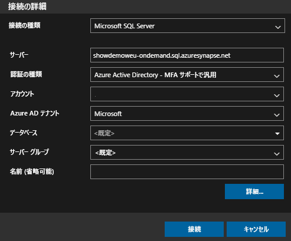
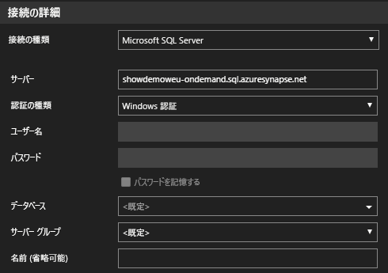
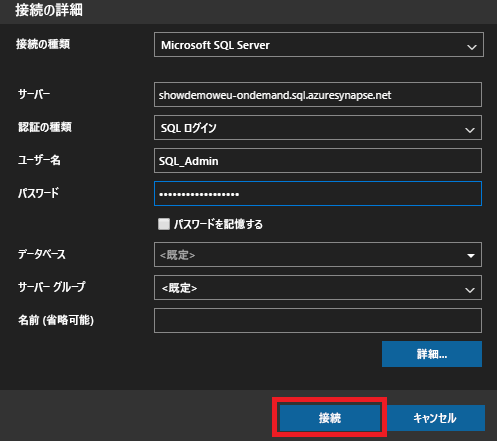
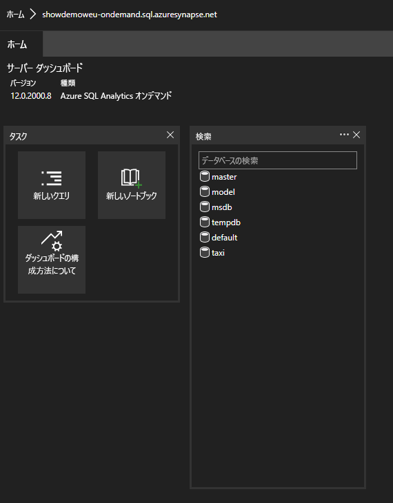
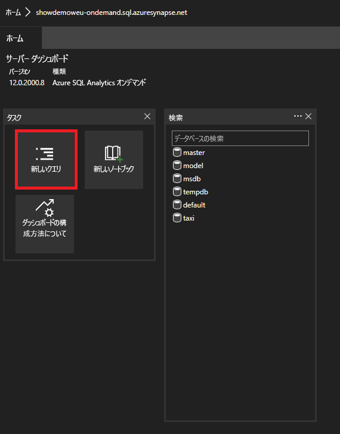

# <a name="connect-to-synapse-sql-with-azure-data-studio-preview"></a>Azure Data Studio (プレビュー) を使用して Synapse SQL に接続する

> [!div class="op_single_selector"]
>
> * [Azure Data Studio](get-started-azure-data-studio.md)
> * [Power BI](get-started-power-bi-professional.md)
> * [Visual Studio](../sql-data-warehouse/sql-data-warehouse-query-visual-studio.md?toc=/azure/synapse-analytics/toc.json&bc=/azure/synapse-analytics/breadcrumb/toc.json)
> * [sqlcmd](get-started-connect-sqlcmd.md)
> * [SSMS](get-started-ssms.md)

[Azure Data Studio (プレビュー)](/sql/azure-data-studio/download-azure-data-studio?toc=/azure/synapse-analytics/toc.json&bc=/azure/synapse-analytics/breadcrumb/toc.json&view=azure-sqldw-latest) を使用して Azure Synapse Analytics の Synapse SQL に接続し、クエリを実行することができます。 

## <a name="connect"></a>接続する

Synapse SQL に接続するには、Azure Data Studio を開いて **[新しい接続]** を選択します。



**[接続の種類]** に **[Microsoft SQL Server]** を選択します。

この接続には、次のパラメーターが必要になります。

* **サーバー:** `<Azure Synapse workspace name>`-ondemand.sql.azuresynapse.net 形式のサーバー
* **データベース:** データベース名

> [!NOTE]
> **SQL オンデマンド (プレビュー)** を使用する場合、URL は次のようになります。
>
> - `<Azure Synapse workspace name>`-ondemand.sql.azuresynapse.net
>
> **SQL プール**を使用する場合、URL は次のようになります。
>
> - `<Azure Synapse workspace name>`.sql.azuresynapse.net

**[認証の種類]** として、 **[Windows 認証]** 、 **[Azure Active Directory]** 、 **[SQL ログイン]** のいずれかを選択します。

認証の種類として **[SQL ログイン]** を使用する場合は、ユーザー名とパスワードのパラメーターを追加します。

* **ユーザー:** サーバーのユーザー。`<User>` 形式で指定します。
* **パスワード:** ユーザーに関連付けられているパスワード

Azure Active Directory を使用するには、必要な認証の種類を選択する必要があります。



このスクリーンショットは、 **[Windows 認証]** の **[接続の詳細]** を示しています。



このスクリーンショットは、 **[SQL ログイン]** を使用した **[接続の詳細]** を示しています。



ログインに成功すると、次のようなダッシュボードが表示されます。

## <a name="query"></a>クエリ

接続後、Synapse SQL のインスタンスに対し、サポートされている [Transact-SQL (T-SQL)](/sql/t-sql/language-reference?toc=/azure/synapse-analytics/toc.json&bc=/azure/synapse-analytics/breadcrumb/toc.json&view=azure-sqldw-latest) ステートメントを使用してクエリを実行することができます。 最初に、ダッシュボード ビューから **[新しいクエリ]** を選択します。



たとえば、SQL オンデマンドを使用して [Parquet ファイルを照会](query-parquet-files.md)するには、次の Transact-SQL ステートメントを使用します。

```sql
SELECT COUNT(*)
FROM  
OPENROWSET(
    BULK 'https://azureopendatastorage.blob.core.windows.net/censusdatacontainer/release/us_population_county/year=20*/*.parquet',
    FORMAT='PARQUET'
)
```
## <a name="next-steps"></a>次のステップ 
Synapse SQL に接続する他の方法を詳しく見てみましょう。 

- [SSMS](get-started-ssms.md)
- [Power BI](get-started-power-bi-professional.md)
- [Visual Studio](../sql-data-warehouse/sql-data-warehouse-query-visual-studio.md?toc=/azure/synapse-analytics/toc.json&bc=/azure/synapse-analytics/breadcrumb/toc.json)
- [sqlcmd](get-started-connect-sqlcmd.md)
 
