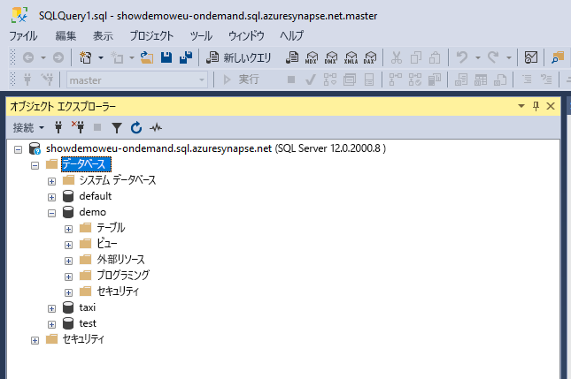
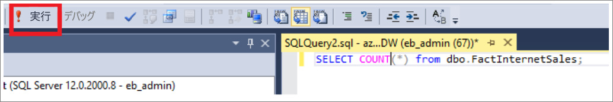
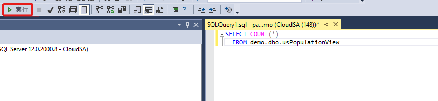
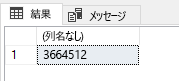

# <a name="connect-to-synapse-sql-with-sql-server-management-studio-ssms"></a>SQL Server Management Studio (SSMS) を使用して Synapse SQL に接続する
> [!div class="op_single_selector"]
> * [Azure Data Studio](get-started-azure-data-studio.md)
> * [Power BI](get-started-power-bi-professional.md)
> * [Visual Studio](../sql-data-warehouse/sql-data-warehouse-query-visual-studio.md?toc=/azure/synapse-analytics/toc.json&bc=/azure/synapse-analytics/breadcrumb/toc.json)
> * [sqlcmd](../sql/get-started-connect-sqlcmd.md)
> * [SSMS](get-started-ssms.md)
> 
> 

[SQL Server Management Studio (SSMS)](/sql/ssms/download-sql-server-management-studio-ssms) から SQL オンデマンド (プレビュー) または SQL プール リソースを使用して、Azure Synapse Analytics の Synapse SQL に接続し、クエリを実行することができます。 

### <a name="supported-tools-for-sql-on-demand-preview"></a>SQL オンデマンド (プレビュー) でサポートされるツール

[Azure Data Studio](/sql/azure-data-studio/download-azure-data-studio) は、バージョン 1.18.0 以降、完全にサポートされます。 SSMS は、バージョン 18.5 以降、部分的にサポートされています。接続してクエリを実行する場合にのみ使用できます。

> [!NOTE]
> クエリの実行時に AAD ログインの接続が 1 時間以上開いていると、AAD に依存するクエリは失敗します。 これには、AAD パススルーと、AAD とやり取りするステートメント (CREATE EXTERNAL PROVIDER など) を使用したストレージのクエリが含まれます。 これは、SSMS や ADS のクエリ エディターなど、接続を開いたままにするすべてのツールに影響します。 Synapse Studio のように、新しい接続を開いてクエリを実行するツールは影響を受けません。
> この問題を軽減するには、SSMS を再起動するか、ADS で接続および切断します。 。
## <a name="prerequisites"></a>前提条件

開始する前に、以下の前提条件を確認してください。  

* [SQL Server Management Studio (SSMS)](/sql/ssms/download-sql-server-management-studio-ssms)。 
* SQL プールの場合、既存のデータ ウェアハウスが必要です。 作成するには、[SQL プールの作成](../quickstart-create-sql-pool-portal.md)に関する記事を参照してください。 SQL オンデマンドの場合は、あらかじめ作成時点でワークスペースにプロビジョニングされています。 
* 完全修飾 SQL サーバー名。 調べる方法については、「[Synapse SQL に接続する](connect-overview.md)」を参照してください。

## <a name="connect"></a>接続する

### <a name="sql-pool"></a>SQL プール

SQL プールを使用して Synapse SQL に接続するには、次の手順に従います。 

1. SQL Server Management Studio (SSMS) を開きます。 
1. **[サーバーへの接続]** ダイアログ ボックスの各フィールドに値を入力し、 **[接続]** を選択します。 
  
    ![[サーバーへの接続]](../sql-data-warehouse/media/sql-data-warehouse-query-ssms/connect-object-explorer1.png)
   
   * **[サーバー名]** : 前の手順で特定した**サーバー名**を入力します。
   * **認証**:認証の種類を選択します ( **[SQL Server 認証]** 、 **[Active Directory 統合認証]** など)。
   * **[ユーザー名]** と **[パスワード]** : 先ほど [SQL Server 認証] を選択した場合は、ユーザー名とパスワードを入力します。

1. **オブジェクト エクスプローラー**で Azure SQL Server を展開します。 サンプル AdventureWorksDW データベースなど、サーバーに関連付けられているデータベースを確認できます。 データベースを展開することで、テーブルを表示できます。
   
    


### <a name="sql-on-demand-preview"></a>SQL オンデマンド (プレビュー)

SQL オンデマンドを使用して Synapse SQL に接続するには、次の手順に従います。 

1. SQL Server Management Studio (SSMS) を開きます。
1. **[サーバーへの接続]** ダイアログ ボックスの各フィールドに値を入力し、 **[接続]** を選択します。 
   
    ![[サーバーへの接続]](./media/get-started-ssms/connect-object-explorer1.png)
   
   * **[サーバー名]** : 前の手順で特定した**サーバー名**を入力します。
   * **認証**:認証の種類を選択します ( **[SQL Server 認証]** 、 **[Active Directory 統合認証]** など)。
   * **[ユーザー名]** と **[パスワード]** : 先ほど [SQL Server 認証] を選択した場合は、ユーザー名とパスワードを入力します。
   * **[Connect]** をクリックします。

4. 確認のために、Azure SQL Server を展開します。 サーバーに関連付けられているデータベースが表示されます。 *[demo]* を展開すると、サンプル データベースの内容が表示されます。
   
    


## <a name="run-a-sample-query"></a>サンプル クエリの実行

### <a name="sql-pool"></a>SQL プール

これでデータベース接続が確立されました。データを照会することができます。

1. SQL Server オブジェクト エクスプローラーでデータベースを右クリックします。
2. **[新しいクエリ]** を選択します。 新しいクエリ ウィンドウが開きます。
   
    ![[新しいクエリ]](../sql-data-warehouse/media/sql-data-warehouse-query-ssms/new-query.png)
3. 次の T-SQL クエリをクエリ ウィンドウにコピーします。
   
    ```sql
    SELECT COUNT(*) FROM dbo.FactInternetSales;
    ```
4. クエリを実行します。 そのためには、`Execute` をクリックするか、ショートカット キー (`F5`) を使用します。
   
    
5. クエリ結果を確認します。 この例では、FactInternetSales テーブルに 60,398 行が含まれています。
   
    

### <a name="sql-on-demand"></a>SQL オンデマンド

これでデータベース接続が確立されました。データを照会することができます。

1. SQL Server オブジェクト エクスプローラーでデータベースを右クリックします。
2. **[新しいクエリ]** を選択します。 新しいクエリ ウィンドウが開きます。
   
    ![[新しいクエリ]](./media/get-started-ssms/new-query.png)
3. 次の T-SQL クエリをクエリ ウィンドウにコピーします。
   
    ```sql
    SELECT COUNT(*) FROM demo.dbo.usPopulationView
    ```
4. クエリを実行します。 そのためには、`Execute` をクリックするか、ショートカット キー (`F5`) を使用します。
   
    
5. クエリ結果を確認します。 この例では、usPopulationView ビューに 3,664,512 個の行が存在します。
   
    

## <a name="next-steps"></a>次のステップ
これで接続してクエリを実行することができます。[Power BI でデータを視覚化](get-started-power-bi-professional.md)してみてください。

Azure Active Directory 認証を使用するために環境を構成する方法については、[Synapse SQL に対する認証](../sql-data-warehouse/sql-data-warehouse-authentication.md?toc=/azure/synapse-analytics/toc.json&bc=/azure/synapse-analytics/breadcrumb/toc.json)に関するページを参照してください。

