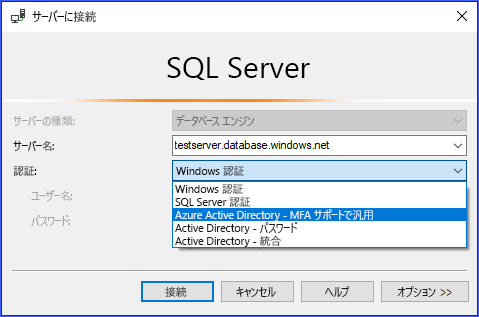
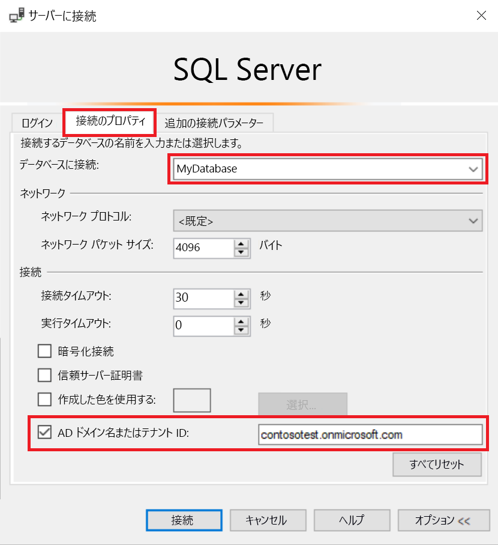
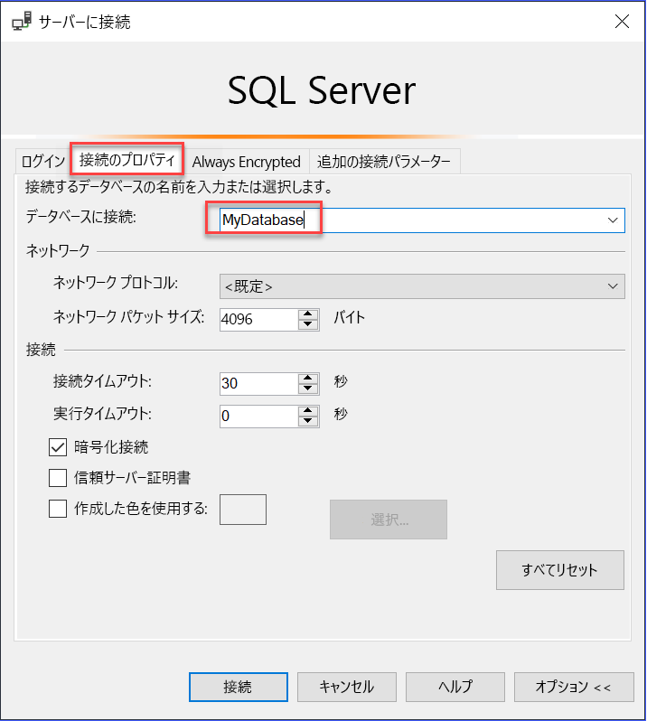

# Synapse SQL で多要素 AAD 認証を使用する (MFA の SSMS サポート)

Synapse SQL では、"*Active Directory ユニバーサル認証*" を使用して、SQL Server Management Studio (SSMS) からの接続をサポートしています。 

この記事ではさまざまな認証オプションの違いについて説明し、また、ユニバーサル認証の使用に関連する制限事項について説明します。 

**最新の SSMS のダウンロード** - クライアント コンピューターで、「[SQL Server Management Studio (SSMS) のダウンロード](https://msdn.microsoft.com/library/mt238290.aspx)」から SSMS の最新版をダウンロードします。 

**最新の SSMS のダウンロード** - クライアント コンピューターで、「[SQL Server Management Studio (SSMS) のダウンロード](/sql/ssms/download-sql-server-management-studio-ssms?toc=/azure/synapse-analytics/toc.json&bc=/azure/synapse-analytics/breadcrumb/toc.json&view=azure-sqldw-latest)」から SSMS の最新版をダウンロードします。

この記事で説明されているすべての機能を使用するには、2017 年 7 月以降のバージョン 17.2 を使用してください。  一番新しい接続ダイアログ ボックスは次の画像のようになっているはずです。

  

## 5 つの認証オプション  

Active Directory ユニバーサル認証は、次の 2 つの非対話型の認証方式をサポートします。
    - `Active Directory - Password` 認証
    - `Active Directory - Integrated` 認証

非対話型の認証モデルも 2 つあり、さまざまなアプリケーション (ADO.NET、JDCB、ODC など) で利用できます。 これら 2 つの方式では、ポップアップ ダイアログ ボックスは表示されません。

- `Active Directory - Password`
- `Active Directory - Integrated`

Azure Multi-Factor Authentication (MFA) もサポートする対話型の方式:

- `Active Directory - Universal with MFA`

Azure MFA を使えば、簡単なサインイン プロセスというユーザーの要求を満たしながら、データとアプリケーションへのアクセスを保護できます。 電話、テキスト メッセージ、スマート カードと PIN、モバイル アプリ通知など、簡単な各種確認オプションによって強力な認証が実現するため、ユーザーは自分に最も合った方法を選択できます。 Azure AD との対話型 MFA はポップアップ ダイアログ ボックスで検証できます。

Multi-Factor Authentication の説明については、 [Multi-Factor Authentication](../../active-directory/authentication//concept-mfa-howitworks.md?toc=/azure/synapse-analytics/toc.json&bc=/azure/synapse-analytics/breadcrumb/toc.json)に関する記事を参照してください。

### Azure AD ドメイン名またはテナント ID パラメーター

[SSMS バージョン 17](/sql/ssms/download-sql-server-management-studio-ssms?toc=/azure/synapse-analytics/toc.json&bc=/azure/synapse-analytics/breadcrumb/toc.json&view=azure-sqldw-latest) 以降では、別の Azure Active ディレクトリから現在の Active Directory にゲスト ユーザーとしてインポートされたユーザーは、接続時に Azure AD のドメイン名またはテナント ID を指定できます。 

ゲスト ユーザーには、他の Azure AD や、outlook.com、hotmail.com、live.com などの Microsoft アカウントまたは gmail.com などのその他のアカウントから招待されたユーザーが含まれます。 この情報により、**Active Directory MFA ユニバーサル認証**の際に、正しい認証機関を識別できます。 また、このオプションでは、outlook.com、hotmail.com、live.com などの Microsoft のアカウント (MSA) および MSA 以外のアカウントのサポートが必要です。 

ユニバーサル認証を使用して認証される、これらすべてのユーザーは、Azure AD ドメイン名またはテナント ID を入力する必要があります。 このパラメーターは、Azure サーバーがリンクしている、現在の Azure AD ドメイン名またはテナント ID を表しています。 

たとえば、Azure サーバーが Azure AD ドメイン `contosotest.onmicrosoft.com` と関連付けられていて、このドメインにユーザー `joe@contosodev.onmicrosoft.com` が Azure AD ドメイン `contosodev.onmicrosoft.com` からインポートされたユーザーとしてホストされている場合、このドメイン名はこのユーザーを `contosotest.onmicrosoft.com` として認証する必要があります。 

ユーザーが Azure サーバーにリンクされている Azure AD のネイティブ ユーザーであるが、MSA アカウントではない場合、ドメイン名またはテナント ID は必要ありません。 

**[データベースへの接続]** ダイアログ ボックスにパラメーターを入力するには (SSMS バージョン 17.2 以降)、ダイアログ ボックスに入力し、 **[Active Directory] で [Universal with MFA]\(MFA ユニバーサル認証\)** を選択し、 **[オプション]** をクリックして、 **[ユーザー名]** ボックスに入力し、 **[接続のプロパティ]** タブをクリックします。 

**[AD ドメインの名前またはテナントの ID]** ボックスをオンにし、ドメイン名 (**contosotest.onmicrosoft.com**) またはテナント ID の GUID などの認証機関を入力します。  

   

SSMS 18.x 以降を実行している場合、ゲスト ユーザーの AD ドメイン名またはテナント ID は不要です。18.x 以降では自動的に認識されます。

   

### Azure AD の企業間サポート   
ゲスト ユーザーとして Azure AD B2B シナリオでサポートされている Azure AD ユーザー ([Azure B2B コラボレーションの概要](../../active-directory/b2b/what-is-b2b.md?toc=/azure/synapse-analytics/toc.json&bc=/azure/synapse-analytics/breadcrumb/toc.json)に関するページを参照してください) は、Synapse SQL に、現在 Azure AD で作成されているグループのメンバーとしてのみ接続でき、特定のデータベース内の Transact-SQL `CREATE USER` ステートメントを使用して手動でマップされます。 

たとえば、`steve@gmail.com` を Azure AD `contosotest` に招待 (Azure Ad ドメイン `contosotest.onmicrosoft.com` を使用) した場合、Azure AD グループ `usergroup` を、`steve@gmail.com` メンバーを含む Azure AD で作成する必要があります。 次に、このグループを、Azure AD SQL 管理者または Azure AD DBO が Transact-SQL `CREATE USER [usergroup] FROM EXTERNAL PROVIDER` ステートメントを実行することによって、特定のデータベース (すなわち、MyDatabase) に作成する必要があります。 

データベース ユーザーを作成すると、SSMS 認証オプション `Active Directory – Universal with MFA support` を使用して、ユーザー `steve@gmail.com` は `MyDatabase` にログインできるようになります。 

ユーザー グループには、既定では接続権限のみが付与されており、追加のデータ アクセス権限は通常の方法で付与する必要があります。 

ゲスト ユーザーとしてのユーザー `steve@gmail.com` は、SSMS の **[接続プロパティ]** ダイアログ ボックスをオンにして、AD ドメイン名 `contosotest.onmicrosoft.com` を追加する必要があることに注意してください。 **[AD ドメインの名前またはテナントの ID]** オプションは MFA ユニバーサル接続オプションでのみサポートされており、それ以外の場合はグレーで表示されます。

## Synapse SQL のユニバーサル認証の制限事項

- SSMS および SqlPackage.exe は、現在、Active Directory ユニバーサル認証を介して MFA 認証できる、唯一のツールです。
- SSMS バージョン 17.2 では、MFA ユニバーサル認証を使用してマルチ ユーザーの同時アクセスをサポートしています。 バージョン 17.0 および 17.1 では、ユニバーサル認証を使用して SSMS のインスタンスにログインできるのは、1 つの Azure Active Directory アカウントのみに制限されています。 別の Azure AD アカウントとしてログインするには、SSMS の別のインスタンスを使用する必要があります (この制限は Active Directory ユニバーサル認証に限定されます。 Active Directory パスワード認証、Active Directory 統合認証、または SQL Server 認証の使用時は別のサーバーにログインできます)。
- SSMS では、オブジェクト エクスプローラー、クエリ エディター、クエリ ストアの視覚化で Active Directory ユニバーサル認証がサポートされます。
- SSMS バージョン 17.2 では、データベースのエクスポート/抽出/データの展開を支援する DacFx ウィザードが提供されています。 ユニバーサル認証を使用して、初期認証ダイアログ ボックスで特定のユーザーが認証されると、DacFx ウィザードは他のすべての認証方法についても同じように機能します。
- SSMS テーブル デザイナーは、ユニバーサル認証をサポートしていません。
- サポートされているバージョンの SSMS を使用する必要があることを除き、Active Directory ユニバーサル認証に関する追加のソフトウェア要件はありません。  
- ユニバーサル認証用の Active Directory Authentication Library (ADAL) バージョンは、最新のリリース バージョン ADAL.dll 3.13.9 に更新されました。 「[Active Directory 認証ライブラリ 3.14.1](https://www.nuget.org/packages/Microsoft.IdentityModel.Clients.ActiveDirectory/)」を参照してください。  

## 次のステップ
詳細については、[SQL Server Management Studio を使用した Synapse SQL への接続](get-started-ssms.md)に関するページを参照してください。 

