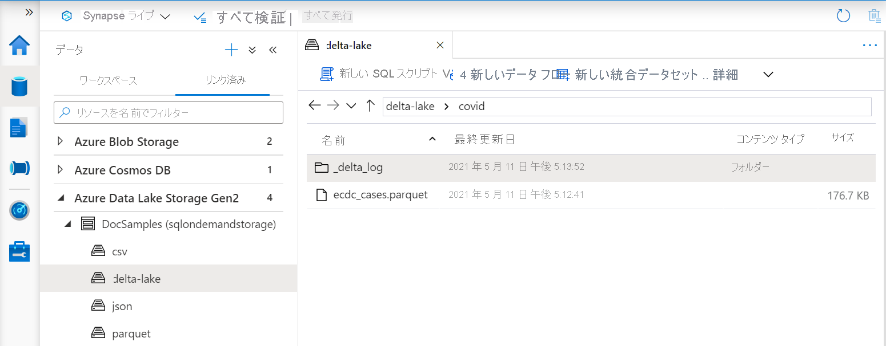
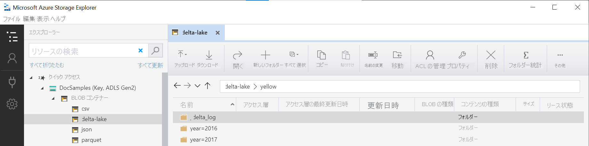

# <a name="query-delta-lake-files-using-serverless-sql-pool-in-azure-synapse-analytics"></a>Azure Synapse Analytics でサーバーレス SQL プールを使用して Delta Lake ファイルのクエリを実行する

この記事では、サーバーレス SQL プールを使用して Apache Delta Lake ファイルを読み取るクエリを作成する方法について説明します。
Delta Lake は、ACID (原子性、一貫性、分離性、持続性) トランザクションを Apache Spark とビッグ データ ワークロードに導入するオープンソースのストレージ レイヤーです。

Synapse ワークスペースのサーバーレス SQL プールを使用すると、Delta Lake 形式で格納されているデータを読み取り、レポート ツールに提供できます。 サーバーレス SQL プールは、Apache Spark、Azure Databricks、または Delta Lake 形式の他のプロデューサーを使用して作成された Delta Lake ファイルを読み取ることができます。

Azure Synapse の Apache Spark プールを使用すると、データ エンジニアが Scala、PySpark、.NET を使用して Delta Lake ファイルを変更できます。 サーバーレス SQL プールは、データ アナリストがデータ エンジニアによって作成された Delta Lake ファイルに関するレポートを作成するのに役立ちます。

## <a name="quickstart-example"></a>クイック スタートの例

[OPENROWSET](develop-openrowset.md) 関数を使用すると、ルート フォルダーの URL を指定することで、Delta Lake ファイルの内容を読み取ることができます。

### <a name="read-delta-lake-folder"></a>Delta Lake フォルダーの読み取り

`DELTA` ファイルの内容を確認する最も簡単な方法は、[OPENROWSET](develop-openrowset.md) 関数にファイルの URL を指定し、`DELTA` 形式を指定することです。 ファイルが一般公開されている場合、または Azure AD ID でこのファイルにアクセスできる場合は、次の例に示すようなクエリを使用して、ファイルの内容を表示することができます。

```sql
SELECT TOP 10 *
FROM OPENROWSET(
    BULK 'https://sqlondemandstorage.blob.core.windows.net/delta-lake/covid/',
    FORMAT = 'delta') as rows;
```

列名とデータ型は、Delta Lake ファイルから自動的に読み取られます。 `OPENROWSET` 関数は、文字列に対して VARCHAR(1000) のような最善の推測型を使用します。

`OPENROWSET` 関数の URI は、`_delta_log` というサブフォルダーを含むルート Delta Lake フォルダーを参照する必要があります。

> [!div class="mx-imgBorder"]
>

このサブフォルダーがない場合は、Delta Lake 形式が使用されていません。 次の Apache Spark Python スクリプトを使用して、フォルダー内のプレーンな Parquet ファイルを Delta Lake 形式に変換できます。

```python
%%pyspark
from delta.tables import *
deltaTable = DeltaTable.convertToDelta(spark, "parquet.`abfss://delta-lake@sqlondemandstorage.dfs.core.windows.net/covid`")
```

クエリのパフォーマンスを向上させるために、[`WITH` 句に](#explicitly-specify-schema)明示的な型を指定することを検討してください。

> [!NOTE]
> サーバーレス Synapse SQL プールでは、スキーマ推論を使用して列とその型が自動的に決定されます。 スキーマ推論のルールは、Parquet ファイルで使用されるルールと同じです。
> SQL のネイティブ型への Delta Lake の型マッピングについては、[Parquet の型マッピング](develop-openrowset.md#type-mapping-for-parquet)に関するページを確認してください。 

ファイルにアクセスできることを確認します。 ファイルが SAS キーまたはカスタム Azure ID で保護されている場合は、[SQL ログインのためのサーバー レベルの資格情報](develop-storage-files-storage-access-control.md?tabs=shared-access-signature#server-scoped-credential)を設定する必要があります。

> [!IMPORTANT]
> Delta Lake ファイル内の文字列値は UTF-8 エンコードを使用してエンコードされているため、UTF-8 データベース照合順序 (`Latin1_General_100_BIN2_UTF8` など) を使用するようにしてください。
> Delta Lake ファイル内のテキスト エンコードと照合順序が一致しないと、予期しない変換エラーが発生する可能性があります。
> 現在のデータベースの既定の照合順序は、`alter database current collate Latin1_General_100_BIN2_UTF8` という T-SQL ステートメントを使用して簡単変更できます。

### <a name="data-source-usage"></a>データ ソースの使用状況

前の例では、ファイルへの完全なパスを使用しました。 別の方法として、ストレージのルート フォルダーを示す場所を持つ外部データ ソースを作成します。 外部データ ソースを作成したら、データ ソースと `OPENROWSET` 関数内のファイルへの相対パスを使用します。 この方法では、ファイルの完全な絶対 URI を使用する必要はありません。 その後で、ストレージの場所にアクセスするためのカスタム資格情報を定義できます。

> [!IMPORTANT]
> データ ソースは、カスタム データベースにのみ作成できます (マスター データベースや、Apache Spark プールからレプリケートされたデータベースではありません)。 

以下のサンプルを使用するには、次の手順を完了する必要があります。
1. [NYC Yellow Taxi](https://azure.microsoft.com/services/open-datasets/catalog/nyc-taxi-limousine-commission-yellow-taxi-trip-records/) ストレージ アカウントを参照するデータソースで **データベースを作成** します。 
1. 手順 1 で作成したデータベースで[セットアップ スクリプト](https://github.com/Azure-Samples/Synapse/blob/master/SQL/Samples/LdwSample/SampleDB.sql)を実行して、オブジェクトを初期化します。 このセットアップ スクリプトにより、データ ソース、データベース スコープの資格情報、これらのサンプルで使用される外部ファイル形式が作成されます。

データベースを作成し、コンテキストをデータベースに切り替えた場合 (クエリ エディターでデータベースを選択するための `USE database_name` ステートメントまたはドロップダウンを使用)、データ セットのルート URI を含む外部データソースを作成し、それを使用して Delta Lake ファイルのクエリを実行できます。

```sql
CREATE EXTERNAL DATA SOURCE DeltaLakeStorage
WITH ( LOCATION = 'https://sqlondemandstorage.blob.core.windows.net/delta-lake/' );
GO

SELECT TOP 10 *
FROM OPENROWSET(
        BULK 'covid',
        DATA_SOURCE = 'DeltaLakeStorage',
        FORMAT = 'delta'
    ) as rows;
```

データ ソースが SAS キーまたはカスタム ID で保護されている場合は、[データベース スコープ資格情報を使用してデータ ソース](develop-storage-files-storage-access-control.md?tabs=shared-access-signature#database-scoped-credential)を構成できます。

### <a name="explicitly-specify-schema"></a>スキーマを明示的に指定する

`OPENROWSET` を使用すると、`WITH` 句によってファイルから読み取る列を明示的に指定できます。

```sql
SELECT TOP 10 *
FROM OPENROWSET(
        BULK 'covid',
        DATA_SOURCE = 'DeltaLakeStorage',
        FORMAT = 'delta'
    )
    WITH ( date_rep date,
           cases int,
           geo_id varchar(6)
           ) as rows;
```

結果セット スキーマを明示的に指定することで、型のサイズを最小化し、ペシミスティックな VARCHAR (1000) ではなく文字列型の列に対してより正確な型 VARCHAR (6) を使用できます。 型を最小化すると、クエリのパフォーマンスが大幅に向上する可能性があります。

> [!IMPORTANT]
> 必ず `WITH` 句の文字列の列すべてに対して UTF-8 照合順序 (`Latin1_General_100_BIN2_UTF8` など) を明示的に指定するようにしてください。または、データベース レベルで UTF-8 照合順序を設定してください。
> ファイル内のテキスト エンコードと文字列の列の照合順序が一致しないと、予期しない変換エラーが発生する可能性があります。
> 現在のデータベースの既定の照合順序は、`alter database current collate Latin1_General_100_BIN2_UTF8` という T-SQL ステートメントを使用して簡単変更できます。
> `geo_id varchar(6) collate Latin1_General_100_BIN2_UTF8` という定義を使用して、列の型に照合順序を簡単に設定できます。

## <a name="dataset"></a>データセット

[NYC Yellow Taxi](https://azure.microsoft.com/services/open-datasets/catalog/nyc-taxi-limousine-commission-yellow-taxi-trip-records/) データセットがこのサンプルで使用されます。 [CSV ファイルを読み取る](query-parquet-files.md)のと同じ方法で、Parquet ファイルに対してクエリを実行できます。 唯一の違いは、`FILEFORMAT` パラメーターを `PARQUET` に設定する必要があることです。 この記事の例では、Parquet ファイルの読み取りについて詳細を示します。


### <a name="query-partitioned-data"></a>パーティション分割されたデータに対してクエリを実行する
このサンプルで指定されたデータ セットは、個別のサブフォルダーに分割 (パーティション分割) されます。
[Parquet](query-parquet-files.md) とは異なり、`FILEPATH` 関数を使用して特定のパーティションを対象にする必要はありません。 `OPENROWSET` は、Delta Lake フォルダー構造内のパーティション分割列を識別し、これらの列を使用してデータを直接クエリできるようにします。 この例では、2017 年の最初の 3 か月について、年、月、および payment_type 別の料金が示されています。

```sql
SELECT
        YEAR(pickup_datetime) AS year,
        passenger_count,
        COUNT(*) AS cnt
FROM  
    OPENROWSET(
        BULK 'yellow',
        DATA_SOURCE = 'DeltaLakeStorage',
        FORMAT='DELTA'
    ) nyc
WHERE
    nyc.year = 2017
    AND nyc.month IN (1, 2, 3)
    AND pickup_datetime BETWEEN CAST('1/1/2017' AS datetime) AND CAST('3/31/2017' AS datetime)
GROUP BY
    passenger_count,
    YEAR(pickup_datetime)
ORDER BY
    YEAR(pickup_datetime),
    passenger_count;
```

`OPENROWSET` 関数は、where 句の `year` および `month` と一致しないパーティションを削除します。 このファイル/パーティションの排除手法では、データセットを大幅に削減し、パフォーマンスを向上させ、クエリのコストを削減できます。

`OPENROWSET` 関数の中にあるフォルダー名 (この例では `yellow`) は、`DeltaLakeStorage` データ ソース内の `LOCATION` を使用して連結され、`_delta_log` というサブフォルダーを含むルート Delta Lake フォルダーへの参照となっている必要があります。

> [!div class="mx-imgBorder"]
>

このサブフォルダーがない場合は、Delta Lake 形式が使用されていません。 次の Apache Spark Python スクリプトを使用して、フォルダー内のプレーンな Parquet ファイルを Delta Lake 形式に変換できます。

```python
%%pyspark
from delta.tables import *
deltaTable = DeltaTable.convertToDelta(spark, "parquet.`abfss://delta-lake@sqlondemandstorage.dfs.core.windows.net/yellow`", "year INT, month INT")
```

`DeltaTable.convertToDeltaLake` 関数の 2 番目の引数は、フォルダー パターン (この例では `year=*/month=*`) とその型の一部であるパーティション分割列 (年と月) を表します。

## <a name="limitations"></a>制限事項

- 制限事項と既知の問題については、[Synapse サーバーレス SQL プールのセルフヘルプ ページ](resources-self-help-sql-on-demand.md#delta-lake)をご覧ください。
- 現時点では、Azure Synapse Analytics の Spark プールとサーバーレス SQL プールの両方が、Delta Lake 形式をサポートしています。 サーバーレス SQL プールでは、Delta Lake ファイルの更新はサポートされていません。 Spark プールからサーバーレス SQL プールに共有されるのは、Parquet 形式のテーブルのみです。 詳細については、「[共有 Spark テーブル](../metadata/table.md#shared-spark-tables)」を参照してください。

## <a name="next-steps"></a>次のステップ

次の記事に進んで、[Parquet の入れ子にされた型に対してクエリを実行](query-parquet-nested-types.md)する方法を学習してください。
Delta Lake ソリューションの構築を続行する場合は、Delta Lake フォルダーに[ビュー](create-use-views.md#delta-lake-views)または[外部テーブル](create-use-external-tables.md#delta-lake-external-table)を作成する方法について学習してください。

## <a name="see-also"></a>関連項目

- [Delta Lake とは](../spark/apache-spark-what-is-delta-lake.md)
- [Azure Synapse Analytics の Apache Spark プールで Delta Lake を使用する方法を理解する](../spark/apache-spark-delta-lake-overview.md)
- [Azure Databricks Delta Lake のベスト プラクティス](/azure/databricks/best-practices-index)
- [Delta Lake ドキュメント ページ](https://docs.delta.io/latest/delta-intro.html)
- [既知の問題と制限](resources-self-help-sql-on-demand.md#delta-lake)
