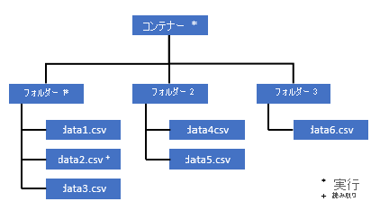
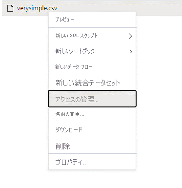
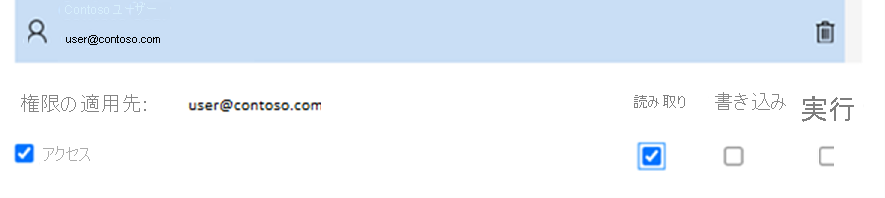

# <a name="self-help-for-serverless-sql-pool"></a>サーバーレス SQL プールのセルフヘルプ

この記事には、Azure Synapse Analytics のサーバーレス SQL プールでよく発生する問題のトラブルシューティング方法に関する情報が含まれています。

## <a name="synapse-studio"></a>Synapse Studio

### <a name="serverless-sql-pool-is-grayed-out-in-synapse-studio"></a>Synapse Studio でサーバーレス SQL プールがグレー表示される

Synapse Studio がサーバーレス SQL プールへの接続を確立できない場合、サーバーレス SQL プールがグレー表示されるか、状態が "オフライン" と表示されます。 通常、この問題は次のいずれかの場合に発生します。

1) Azure Synapse バックエンドとの通信がネットワークによって妨げられている。 最も頻繁なケースは、ポート 1443 がブロックされているケースです。 サーバーレス SQL プールを動作させるには、このポートのブロックを解除します。 これ以外の問題が原因でサーバーレス SQL プールが動作しなくなることがあります。[詳細については、完全なトラブルシューティング ガイドを参照してください](../troubleshoot/troubleshoot-synapse-studio.md)。
2) サーバーレス SQL プールにログインするアクセス許可がない。 ユーザーがアクセスできるようにするには、Azure Synapse ワークスペース管理者がワークスペース管理者または SQL 管理者ロールにユーザーを追加する必要があります。 [詳細については、アクセス制御に関する完全なガイドを参照してください](../security/synapse-workspace-access-control-overview.md)。

### <a name="query-fails-with-error-websocket-connection-was-closed-unexpectedly"></a>クエリがエラーで失敗する: Websocket connection was closed unexpectedly. (Websocket 接続が予期せずに閉じられました。)

"Websocket connection was closed unexpectedly" (Websocket 接続が予期せずに閉じられました) というエラー メッセージでクエリが失敗する場合は、たとえばネットワークの問題のために Synapse Studio へのブラウザー接続が中断されたことを意味します。 

この問題を解決するには、このクエリを再実行します。 環境でこのメッセージが頻繁に発生する場合は、ネットワーク管理者にサポートを依頼し、ファイアウォールの設定を調べて、[こちらのトラブルシューティング ガイドで詳細を確認](../troubleshoot/troubleshoot-synapse-studio.md)します。 

問題が引き続き発生する場合は、Azure portal で[サポート チケット](../../azure-portal/supportability/how-to-create-azure-support-request.md)を作成し、Synapse Studio でさらに調査するのではなく、同じクエリを [Azure Data Studio](/sql/azure-data-studio/download-azure-data-studio) または [SQL Server Management Studio](/sql/ssms/download-sql-server-management-studio-ssms) で試してください。

## <a name="query-execution"></a>クエリ実行

### <a name="query-fails-because-file-cannot-be-opened"></a>ファイルを開くことができないため、クエリが失敗する

"File cannot be opened because it does not exist or it is used by another process" (ファイルが存在しないか、別のプロセスで使用されているため、開くことができません) というエラーでクエリが失敗したときに、ファイルが存在し、かつ別のプロセスで使用されていないことが確認されている場合は、サーバーレス SQL プールがファイルにアクセスできないことを意味します。 この問題が発生するのは、通常、Azure Active Directory ID にファイルへのアクセス権がないか、ファイアウォールによってファイルへのアクセスがブロックされているためです。 サーバーレス SQL プールでは、既定で、Azure Active Directory ID を使用してファイルへのアクセスを試みます。 この問題を解決するには、ファイルにアクセスするための適切な権限を持っている必要があります。 最も簡単な方法は、クエリの対象となるストレージ アカウントに対する "ストレージ BLOB データ共同作成者" ロールを自分に付与することです。 
- [詳細については、ストレージの Azure Active Directory アクセス制御に関する完全なガイドを参照してください](../../storage/blobs/assign-azure-role-data-access.md)。 
- [「Azure Synapse Analytics でサーバーレス SQL プールのストレージ アカウント アクセスを制御する」を参照してください](develop-storage-files-storage-access-control.md)。

#### <a name="alternative-to-storage-blob-data-contributor-role"></a>ストレージ BLOB データ共同作成者ロールに代わるもの

ストレージ BLOB データ共同作成者を許可する代わりに、ファイルのサブセットに対してさらに細かいアクセス許可を付与することもできます。 

* このコンテナー内の一部のデータにアクセスする必要があるすべてのユーザーには、ルート (コンテナー) までのすべての親フォルダーに対する実行アクセス許可も必要です。 [Azure Data Lake Storage Gen2 で ACL を設定する方法](../../storage/blobs/data-lake-storage-explorer-acl.md)の詳細を確認してください。 

> [!NOTE]
> コンテナー レベルの実行アクセス許可は、Azure Data Lake Gen2 内で設定する必要があります。
> フォルダーに対するアクセス許可は、Azure Synapse 内で設定できます。 


この例で data2.csv のクエリを実行する場合は、次のアクセス許可が必要です。 
   - コンテナーに対する実行アクセス許可
   - folder1 に対する実行アクセス許可 
   - data2.csv に対する読み取りアクセス許可



* アクセスしたいデータに対する完全なアクセス許可を持つ管理者ユーザーで Azure Synapse にログインします。

* データ ペインで、ファイルを右クリックして [アクセスの管理] を選択します。



* 少なくとも "読み取り" アクセス許可を選択し、ユーザーの UPN またはオブジェクト ID を入力して (user@contoso.com など)、[追加] をクリックします

* このユーザーに読み取りアクセス許可を付与します。


> [!NOTE]
> ゲスト ユーザーの場合は、Azure Synapse で直接行うことはできないので、Azure Data Lake サービスを使用して直接行う必要があります。 

### <a name="query-fails-because-it-cannot-be-executed-due-to-current-resource-constraints"></a>現在のリソース制約によりクエリを実行できないため、クエリが失敗する 

"This query can't be executed due to current resource constraints (現在のリソース制約のため、このクエリを実行できません)" というエラー メッセージでクエリが失敗する場合、リソースの制約により、サーバーレス SQL プールが現時点でクエリを実行できないことを意味します。 

- 適切なサイズのデータ型が使用されていることを確認してください。  

- クエリで Parquet ファイルを対象にする場合は、既定で VARCHAR(8000) になるため、文字列型の列に対して明示的な型を定義することを検討してください。 [推論されたデータ型を確認します](./best-practices-serverless-sql-pool.md#check-inferred-data-types)。

- 対象のクエリが CSV ファイルをターゲットとしている場合は、[統計を作成する](develop-tables-statistics.md#statistics-in-serverless-sql-pool)ことを検討してください。 

- クエリを最適化するには、[サーバーレス SQL プールのパフォーマンスのベスト プラクティス](./best-practices-serverless-sql-pool.md)に関するページを参照してください。  

### <a name="could-not-allocate-tempdb-space-while-transferring-data-from-one-distribution-to-another"></a>あるディストリビューションから別のディストリビューションにデータを転送しているときに、tempdb 領域を割り当てられなかった

このエラーは、[現在のリソース制約エラーによりクエリを実行できないため、汎用クエリが失敗する](#query-fails-because-it-cannot-be-executed-due-to-current-resource-constraints)特殊なケースです。 このエラーは、`tempdb` データベースに割り当てられたリソースがクエリを実行するには不十分な場合に返されます。 

サポート チケットを提出する前に、同じ軽減策とベスト プラクティスを適用してください。

### <a name="query-fails-with-error-while-handling-an-external-file"></a>外部ファイルの処理中に、クエリがエラーで失敗する 

"外部ファイルの処理でエラーが発生しました: 最大エラー数に達しました" というエラー メッセージでクエリが失敗する場合は、指定した列の型と読み込む必要があるデータが一致していないことを意味します。 エラーおよび検索する行および列に関する詳細な情報を取得するには、パーサーのバージョンを "2.0" から "1.0" に変更します。 

#### <a name="example"></a>例
このクエリ 1 でファイル "names.csv" のクエリを実行した場合、Azure Synapse SQL サーバーレスからこのようなエラーが返されます。 

names.csv
```csv
Id,first name, 
1,Adam
2,Bob
3,Charles
4,David
5,Eva
```

クエリ 1: 
```sql
SELECT
    TOP 100 *
FROM
    OPENROWSET(
        BULK '[FILE-PATH OF CSV FILE]',
        FORMAT = 'CSV',
        PARSER_VERSION='2.0',
       FIELDTERMINATOR =';',
       FIRSTROW = 2
    ) 
    WITH (
    [ID] SMALLINT, 
    [Text] VARCHAR (1) COLLATE Latin1_General_BIN2 
)

    AS [result]
```
原因:

`Error handling external file: ‘Max error count reached’. File/External table name: [filepath].`

パーサーのバージョンをバージョン 2.0 からバージョン 1.0 に変更するとすぐに、エラー メッセージが問題の特定に役立つようになります。 新しいエラー メッセージは、代わりに次のようになります。 

`Bulk load data conversion error (truncation) for row 1, column 2 (Text) in data file [filepath]`

"切り捨て" は、列の型が小さすぎてデータが収まらないことを意味します。 この "names.csv" ファイルに含まれる最長の名は 7 文字です。 したがって、少なくとも VARCHAR(7) のデータ型を使用する必要があります。 エラーは、次のコード行で発生します。 

```sql 
    [Text] VARCHAR (1) COLLATE Latin1_General_BIN2
```
このようにクエリを変更すると、エラーが解決されます。デバッグ後に、パフォーマンスを最大にするため、パーサーのバージョンを 2.0 に変更します。 どのようなときにどちらのパーサー バージョンを使用するのかについて詳しくは、[こちら](develop-openrowset.md)を参照してください。 

```sql 
SELECT
    TOP 100 *
FROM
    OPENROWSET(
        BULK '[FILE-PATH OF CSV FILE]',
        FORMAT = 'CSV',
        PARSER_VERSION='2.0',
        FIELDTERMINATOR =';',
        FIRSTROW = 2
    ) 
    WITH (
    [ID] SMALLINT, 
    [Text] VARCHAR (7) COLLATE Latin1_General_BIN2 
)

    AS [result]
```

### <a name="cannot-bulk-load-because-the-file-could-not-be-opened"></a>ファイルを開けなかったので、一括読み込みできません

このエラーは、クエリの実行中にファイルが変更された場合に返されます。 通常、次のようなエラーが発生します。`Cannot bulk load because the file {file path} could not be opened. Operating system error code 12(The access code is invalid.).`

サーバーレス SQL プールでは、クエリの実行中に変更されたファイルを読み取ることはできません。 クエリではファイルをロックできません。 変更操作が **追加** されたことがわかっている場合は、オプション `{"READ_OPTIONS":["ALLOW_INCONSISTENT_READS"]}` を設定してみます。 [追加専用ファイルに対してクエリを実行する](query-single-csv-file.md#querying-appendable-files)方法または[追加専用ファイルにテーブルを作成する](create-use-external-tables.md#external-table-on-appendable-files)方法を参照してください。

### <a name="query-fails-with-conversion-error"></a>変換エラーでクエリが失敗する
"データ ファイル <ファイル パス> の行 n、列 m <列名> の一括読み込みデータ変換エラー (型の不一致または指定されたコードページでは無効な文字)" というエラー メッセージでクエリが失敗する場合は、データ型が行番号 n および列 m の実際のデータと一致しなかったことを意味します。 

たとえば、データ内は整数のみと予想したのに、行 n に文字列があった場合、このエラー メッセージが表示されます。 この問題を解決するには、ファイルと選択したデータ型を調べます。 また、行区切り記号とフィールド ターミネータの設定が正しいかどうかも確認します。 次の例では、列の型として VARCHAR を使用して検査を行う方法を示します。 フィールド ターミネータ、行区切り記号、引用符のエスケープの詳細については、[こちら](query-single-csv-file.md)を参照してください。 

#### <a name="example"></a>例 
このクエリ 1 でファイル "names.csv" のクエリを実行した場合、Azure Synapse SQL サーバーレスからこのようなエラーが返されます。 

names.csv
```csv
Id, first name, 
1,Adam
2,Bob
3,Charles
4,David
five,Eva
```

クエリ 1: 
```sql 
SELECT
    TOP 100 *
FROM
    OPENROWSET(
        BULK '[FILE-PATH OF CSV FILE]',
        FORMAT = 'CSV',
        PARSER_VERSION='1.0',
       FIELDTERMINATOR =',',
       FIRSTROW = 2
    ) 
    WITH (
    [ID] SMALLINT, 
    [Firstname] VARCHAR (25) COLLATE Latin1_General_BIN2 
)

    AS [result]
```

このエラーの原因: `Bulk load data conversion error (type mismatch or invalid character for the specified codepage) for row 6, column 1 (ID) in data file [filepath]`

この問題に対処するには、データを参照し、情報に基づいて決定する必要があります。 この問題の原因になっているデータを確認するには、最初にデータ型を変更する必要があります。 列 "ID" をデータ型 "SMALLINT" でクエリする代わりに、VARCHAR (100) を使用してこの問題を分析します。 この少し変更したクエリ 2 を使用すると、データを処理して名前の一覧を表示できるようになります。 

クエリ 2: 
```sql
SELECT
    TOP 100 *
FROM
    OPENROWSET(
        BULK '[FILE-PATH OF CSV FILE]',
        FORMAT = 'CSV',
        PARSER_VERSION='1.0',
       FIELDTERMINATOR =',',
       FIRSTROW = 2
    ) 
    WITH (
    [ID] VARCHAR(100), 
    [Firstname] VARCHAR (25) COLLATE Latin1_General_BIN2 
)

    AS [result]
```

names.csv
```csv
Id, first name, 
1,Adam
2,Bob
3,Charles
4,David
five,Eva
```

データの 5 行目の ID に予期しない値が含まれているようです。 このような状況では、データのビジネス所有者と、このようなデータの破損を回避する方法について同意することが重要です。 アプリケーション レベルで防止ができず、ID のすべてのデータ型を処理する必要がある場合は、ここでは適切なサイズの VARCHAR しか使用できない可能性があります。

> [!Tip]
> VARCHAR() をできるだけ短くしてみます。 パフォーマンスが低下する可能性があるため、可能な場合は VARCHAR(MAX) を避けます。 

### <a name="the-result-table-does-not-look-like-expected-result-columns-are-empty-or-unexpected-loaded"></a>結果のテーブルが予期したようにならない。 結果列が空であるか、予期せず読み込まれる。 

クエリは失敗しないが、結果のテーブルが想定どおりに読み込まれない場合は、行区切り記号またはフィールド ターミネータの選択が誤っている可能性があります。 この問題を解決するには、別のデータ検索方法に設定を変更する必要があります。 結果テーブルが表示されたら、次の例のようにこのクエリのデバッグを簡単に行うことができます。 

#### <a name="example"></a>例
このクエリ 1 でファイル "names.csv" のクエリを実行した場合、Azure Synapse SQL サーバーレスから正しくない結果テーブルが返されます。 

names.csv
```csv
Id,first name, 
1,Adam
2,Bob
3,Charles
4,David
5,Eva
```

```sql
SELECT
    TOP 100 *
FROM
    OPENROWSET(
        BULK '[FILE-PATH OF CSV FILE]',
        FORMAT = 'CSV',
        PARSER_VERSION='1.0',
       FIELDTERMINATOR =';',
       FIRSTROW = 2
    ) 
    WITH (
    [ID] VARCHAR(100), 
    [Firstname] VARCHAR (25) COLLATE Latin1_General_BIN2 
)

    AS [result]
```

この結果テーブルが発生します

| id            |   firstname   | 
| ------------- |-------------  | 
| 1,Adam        | NULL | 
| 2,Bob         | NULL | 
| 3,Charles     | NULL | 
| 4,David       | NULL | 
| 5,Eva         | NULL | 

列 "firstname" に値がないようです。 代わりに、すべての値が列 "ID" に含まれます。 それらの値は、コンマで区切られています。 この問題は、フィールド ターミネータとしてセミコロン記号の代わりにコンマを選択する必要があるコード行によって発生しました。

```sql
FIELDTERMINATOR =';',
```

この 1 文字を変更すると、問題が解決します。

```sql
FIELDTERMINATOR =',',
```

クエリ 2 によって作成される結果テーブルは、想定したようになります。 

クエリ 2:
```sql
SELECT
    TOP 100 *
FROM
    OPENROWSET(
        BULK '[FILE-PATH OF CSV FILE]',
        FORMAT = 'CSV',
        PARSER_VERSION='1.0',
       FIELDTERMINATOR =',',
       FIRSTROW = 2
    ) 
    WITH (
    [ID] VARCHAR(100), 
    [Firstname] VARCHAR (25) COLLATE Latin1_General_BIN2 
)

    AS [result]
``` 

は、次の値は返します。

| id            |   firstname   | 
| ------------- |-------------  | 
| 1        | Adam | 
| 2         | Bob | 
| 3     | Charles | 
| 4       | David | 
| 5         | Eva | 


### <a name="query-fails-with-error-column-column-name-of-type-type-name-is--not-compatible-with-external-data-type-external-data-type-name"></a>次のエラーでクエリが失敗する: 型 <型名> の列 <列名> は外部データ型 <外部データ型名> と互換性がありません 

"型 <型名> の列 <列名> は外部データ型 <外部データ型名> と互換性がありません" というエラー メッセージでクエリが失敗する場合は、PARQUET データ型を間違った SQL データ型にマップしようとした可能性があります。 たとえば、parquet ファイルに浮動小数点数 (12.89 など) の価格の列があり、それを INT にマップしようとした場合、このエラー メッセージが表示されます。 

これを解決するには、ファイルと選択したデータ型を調べます。 こちらの[マッピング テーブル](develop-openrowset.md#type-mapping-for-parquet)は、SQL データ型の選択に役立ちます。 ベスト プラクティスのヒント: それ以外の場合は VARCHAR データ型に解決される列のマッピングのみを指定します。 可能な場合は VARCHAR を回避すると、クエリのパフォーマンスが向上します。 

#### <a name="example"></a>例
このクエリ 1 でファイル "taxi-data.parquet" のクエリを実行した場合、Azure Synapse SQL サーバーレスからこのようなエラーが返されます。

taxi-data.parquet:

|PassengerCount |SumTripDistance|AvgTripDistance |
|---------------|---------------|----------------|
| 1 | 2635668.66000064 | 6.72731710678951 |
| 2 | 172174.330000005 | 2.97915543404919 |
| 3 | 296384.390000011 | 2.8991352022851  |
| 4 | 12544348.58999806| 6.30581582240281 |
| 5 | 13091570.2799993 | 111.065989028627 |

クエリ 1: 
```sql
SELECT
    *
FROM
    OPENROWSET(
        BULK '<filepath>taxi-data.parquet',
        FORMAT='PARQUET'
    )  WITh
        (
        PassengerCount INT, 
        SumTripDistance INT, 
        AVGTripDistance FLOAT
        )

    AS [result]
```

このエラーの原因: 

`Column 'SumTripDistance' of type 'INT' is not compatible with external data type 'Parquet physical type: DOUBLE', please try with 'FLOAT'. File/External table name: '<filepath>taxi-data.parquet'.`

このエラー メッセージは、データ型に互換性がないことを示し、INT ではなく FLOAT を使用することが既に提案されています。 したがって、エラーは次のコード行で発生します。 

```sql
SumTripDistance INT, 
```

この少し変更したクエリ 2 を使用すると、データを処理して 3 つの列をすべて表示できるようになります。 

クエリ 2: 
```sql
SELECT
    *
FROM
    OPENROWSET(
        BULK '<filepath>taxi-data.parquet',
        FORMAT='PARQUET'
    )  WITh
        (
        PassengerCount INT, 
        SumTripDistance FLOAT, 
        AVGTripDistance FLOAT
        )

    AS [result]
```

### <a name="waitiocompletion-call-failed"></a>`WaitIOCompletion` 呼び出しに失敗しました

このメッセージは、リモート ストレージ (Azure Data Lake) からデータを読み取る IO 操作の完了を待機しているときにクエリが失敗したことを示します。ストレージがサーバーレス SQL プールと同じリージョンに配置されていること、および既定で一時停止されている `archive access` ストレージを使用していないことを確認してください。 ストレージのメトリックを確認し、ストレージ レイヤーに I/O 要求を飽和させる可能性のある (新しいファイルをアップロードしている) 他のワークロードがないことを確認します。

### <a name="incorrect-syntax-near-not"></a>'NOT' 付近に不適切な構文があります。

このエラーは、列定義に `NOT NULL` 制約を含む列を含む外部テーブルがいくつかあることを示します。 テーブルを更新して、列定義から `NOT NULL` を削除します。 

### <a name="inserting-value-to-batch-for-column-type-datetime2-failed"></a>列の種類 DATETIME2 のバッチに値を挿入できませんでした

Parquet/Delta Lake ファイルに格納されている datetime 値を `DATETIME2` 列として表すことはできません。 Spark を使用してこのファイル内の最小値を調べ、0001-01-03 未満の日付があることを確認します。 Parquet (一部の Spark バージョン) で値を書き込むために使用されるユリウス暦と、サーバーレス SQL プールで使用されるグレゴリオ暦との間に 2 日の差がある場合があり、それによって、無効な (負の) 日付値に変換されることがあります。 

Spark を使用してこれらの値を更新してみます。 次のサンプルは、Delta Lake で値を更新する方法を示しています。

```spark
from delta.tables import *
from pyspark.sql.functions import *

deltaTable = DeltaTable.forPath(spark, 
             "abfss://my-container@myaccount.dfs.core.windows.net/delta-lake-data-set")
deltaTable.update(col("MyDateTimeColumn") < '0001-02-02', { "MyDateTimeColumn": null } )
```

## <a name="configuration"></a>構成

### <a name="query-fails-with-please-create-a-master-key-in-the-database-or-open-the-master-key-in-the-session-before-performing-this-operation"></a>クエリが次のエラーで失敗する: この操作を実行するには、マスター キーをデータベースに作成するか、またはセッション内のマスター キーを開いてください。

"この操作を実行するには、マスター キーをデータベースに作成するか、またはセッション内のマスター キーを開いてください" というエラー メッセージでクエリが失敗する場合は、ユーザー データベースが現時点でマスター キーにアクセスできないことを意味します。 

ほとんどの場合、新しいユーザー データベースだけを作成し、マスター キーをまだ作成していません。 

これを解決するには、次のクエリを使用してマスター キーを作成します。

```sql
CREATE MASTER KEY [ ENCRYPTION BY PASSWORD ='password' ];
```

> [!NOTE]
> ここで、"password" は別のシークレットに置き換えます。 

### <a name="create-statement-is-not-supported-in-master-database"></a>CREATE ステートメントがマスター データベースでサポートされていない

次のエラー メッセージが表示され、クエリが失敗します。

> "クエリを実行できませんでした。 エラー:CREATE EXTERNAL TABLE/DATA SOURCE/DATABASE SCOPED CREDENTIAL/FILE FORMAT はマスター データベースでサポートされていません" 

つまり、サーバーレス SQL プールのマスター データベースでは次を作成できません。
  - 外部テーブル
  - 外部データ ソース
  - データベース スコープ資格情報
  - 外部ファイル形式

解決方法:

  1. ユーザー データベースの作成:

```sql
CREATE DATABASE <DATABASE_NAME>
```

  2. マスター データベースについて前に失敗した <DATABASE_NAME> のコンテキストで CREATE ステートメントを実行します。 
  
  外部ファイル形式の作成例:
    
```sql
USE <DATABASE_NAME>
CREATE EXTERNAL FILE FORMAT [SynapseParquetFormat] 
WITH ( FORMAT_TYPE = PARQUET)
```

### <a name="operation-is-not-allowed-for-a-replicated-database"></a>操作はレプリケートされたデータベースでは許可されていません。
   
データベースで SQL オブジェクトやユーザーを作成したり、アクセス許可を変更したりしようとしている場合、"操作 CREATE USER はレプリケートされたデータベースでは許可されていません" のようなエラーが発生する可能性があります。 このエラーは、[Spark プールと共有されている](../metadata/database.md)データベースでオブジェクトを作成しようとすると返されます。 Apache Spark プールからレプリケートされたデータベースは読み取り専用です。 レプリケートされたデータベースに T-SQL を使用して新しいオブジェクトを作成することはできません。

別のデータベースを作成し、3 部構成の名前とデータベース間クエリを使用して、同期された[テーブル](../metadata/table.md)を参照します。

## <a name="cosmos-db"></a>Cosmos DB

次の表に、考えられるエラーとトラブルシューティングの操作を示します。

| エラー | 根本原因 |
| --- | --- |
| 構文エラー:<br/> - `Openrowset` 付近に不適切な構文があります。<br/> - `...` は、`BULK OPENROWSET` プロバイダー オプションとして認識されません。<br/> - `...` 付近に不適切な構文があります。 | 考えられる根本原因:<br/> - 最初のパラメーターとして CosmosDB を使用していません。<br/> - 3 番目のパラメーターで識別子の代わりに文字列リテラルを使用しています。<br/> - 3 番目のパラメーター (コンテナー名) が指定されていません。 |
| CosmosDB 接続文字列でエラーが発生しました。 | - アカウント、データベース、またはキーが指定されていません。 <br/> - 接続文字列に認識されないオプションがいくつかあります。<br/> - 接続文字列の末尾にセミコロン `;` が記述されています。 |
| CosmosDB パスを解決できませんでした。エラー: "アカウント名が正しくありません" または "データベース名が正しくありません"。 | 指定されたアカウント名、データベース名、またはコンテナーが見つからないか、指定されたコレクションで分析ストレージが有効になっていません。|
| CosmosDB パスを解決できませんでした。エラー: "シークレット値が正しくありません" または "シークレットが null または空です"。 | アカウント キーが無効であるか、存在しません。 |
| 型 `type name` の列 `column name` は外部データ型 `type name` と互換性がありません。 | `WITH` 句に指定された列の型が Azure Cosmos DB コンテナーの型と一致しません。 セクション「[Azure Cosmos DB から SQL 型へのマッピング](query-cosmos-db-analytical-store.md#azure-cosmos-db-to-sql-type-mappings)」で説明されているように列の型を変更するか、または `VARCHAR` 型を使用してください。 |
| すべてのセルで、この列には `NULL` 値が含まれます。 | `WITH` 句の列名またはパス式が間違っている可能性があります。 `WITH` 句の列名 (または列の型の後のパス式) は、Azure Cosmos DB コレクションの一部のプロパティ名と一致する必要があります。 比較では、"*大文字と小文字が区別されます*"。 たとえば、`productCode` と `ProductCode` は異なるプロパティです。 |

[Azure Synapse Analytics のフィードバック ページ](https://feedback.azure.com/d365community/forum/9b9ba8e4-0825-ec11-b6e6-000d3a4f07b8)で、提案や問題を報告できます。

### <a name="utf-8-collation-warning-is-returned-while-reading-cosmosdb-string-types"></a>CosmosDB の文字列型の読み取り中に UTF-8 照合順序の警告が返される

`OPENROWSET` 列の照合順序のエンコードが UTF-8 でない場合、サーバーレス SQL プールからコンパイル時警告が返されます。 現在のデータベースで実行されるすべての `OPENROWSET` 関数の既定の照合順序は、`alter database current collate Latin1_General_100_CI_AS_SC_UTF8` という T-SQL ステートメントを使用して簡単に変更できます。

文字列述語を使ってデータをフィルター処理するときに、[Latin1_General_100_BIN2_UTF8 照合順序](best-practices-serverless-sql-pool.md#use-proper-collation-to-utilize-predicate-pushdown-for-character-columns)を使用すると最適なパフォーマンスが得られます。

### <a name="some-rows-are-not-returned"></a>一部の行が返されない

- トランザクション ストアと分析ストアの間には同期遅延があります。 Cosmos DB のトランザクション ストアに入力したドキュメントは、分析ストアに表示されるまでに 2 から 3 分かかる場合があります。
- ドキュメントが[スキーマ制約](../../cosmos-db/analytical-store-introduction.md#schema-constraints)に違反している可能性があります。 

### <a name="query-returns-null-values"></a>クエリから `NULL` 値が返される

Azure Synapse SQL では、次の場合、トランザクション ストアにある値の代わりに `NULL` が返されます。
- トランザクション ストアと分析ストアの間には同期遅延があります。 Cosmos DB のトランザクション ストアに入力した値は、分析ストアに表示されるまでに 2 から 3 分かかる場合があります。
- `WITH` 句の列名またはパス式が間違っている可能性があります。 `WITH` 句の列名 (または列の型の後のパス式) は Cosmos DB コレクションのプロパティ名と一致する必要があります。 比較では、大文字と小文字が区別されます (たとえば、`productCode` と `ProductCode` は異なるプロパティです)。 列名が Cosmos DB のプロパティ名と完全に一致することを確認します。
- 1,000 を超えるプロパティや 127 を超える入れ子レベルなど、一部の[スキーマ制約](../../cosmos-db/analytical-store-introduction.md#schema-constraints)に違反している場合、プロパティが分析ストレージに移動されない可能性があります。
- 適切に定義された[スキーマ表現](../../cosmos-db/analytical-store-introduction.md#schema-representation)を使用している場合、トランザクション ストア内の値の型が正しくない可能性があります。 適切に定義されたスキーマにより、ドキュメントをサンプリングすることで、各プロパティの型がロックされます。 トランザクション ストアに追加された、型が一致しない値は、間違った値として扱われ、分析ストアに移行されません。 
- 完全に忠実な[スキーマ表現](../../cosmos-db/analytical-store-introduction.md#schema-representation)を使用している場合は、プロパティ名の後に型のサフィックスを追加していることを確認します (例: `$.price.int64`)。 参照先のパスに値が表示されない場合は、異なる型のパス (例: `$.price.float64`) の下に格納されている可能性があります。 [完全に忠実なスキーマで Cosmos DB コレクションのクエリを実行する方法](query-cosmos-db-analytical-store.md#query-items-with-full-fidelity-schema)に関する記事を参照してください。

### <a name="column-is-not-compatible-with-external-data-type"></a>列に外部データ型との互換性がない

`WITH` 句で指定されている値が分析ストレージ内の基になる Cosmos DB の型と一致せず、暗黙的に変換できません。 スキーマで `VARCHAR` 型を使用してください。

### <a name="resolving-cosmosdb-path-has-failed"></a>CosmosDB パスの解決に失敗しました

エラーが発生した場合: `Resolving CosmosDB path has failed with error 'This request is not authorized to perform this operation.'`、Cosmos DB で [プライベート エンドポイントを使用します] チェックボックスをオンにします。 プライベート エンドポイントを使用して SQL サーバーレスで分析ストアにアクセスできるようにするには、[Azure Cosmos DB 分析ストアのプライベート エンドポイントを構成する](../../cosmos-db/analytical-store-private-endpoints.md#using-synapse-serverless-sql-pools)必要があります。

### <a name="cosmosdb-performance-issues"></a>Cosmos DB のパフォーマンスの問題

予期しないパフォーマンスの問題が発生している場合は、次のようなベスト プラクティスを適用していることを確認してください。
- クライアント アプリケーション、サーバーレス プール、および Cosmos DB 分析ストレージを[同じリージョン](best-practices-serverless-sql-pool.md#colocate-your-azure-cosmos-db-analytical-storage-and-serverless-sql-pool)に配置したことを確認する。
- [最適なデータ型](best-practices-serverless-sql-pool.md#use-appropriate-data-types)で `WITH` 句を使用していることを確認する。
- 文字列述語を使ってデータをフィルター処理するときに、[Latin1_General_100_BIN2_UTF8 照合順序](best-practices-serverless-sql-pool.md#use-proper-collation-to-utilize-predicate-pushdown-for-character-columns)を使用していることを確認する。
- キャッシュされる可能性があるクエリを繰り返している場合は、[クエリ結果を Azure Data Lake Storage に格納するために CETAS](best-practices-serverless-sql-pool.md#use-cetas-to-enhance-query-performance-and-joins) を使用してみる。

## <a name="delta-lake"></a>Delta Lake

サーバーレス SQL プールでの Delta Lake のサポートに関して、いくつかの制限事項と既知の問題があります。
- [OPENROWSET](./develop-openrowset.md) 関数または外部テーブルの場所で、ルート Delta Lake フォルダーを参照していることを確認します。
  - ルート フォルダーには、`_delta_log` という名前のサブフォルダーが必要です。 `_delta_log` フォルダーがない場合、クエリは失敗します。 そのフォルダーがない場合は、Apache Spark プールを使用して [Delta Lake に変換する](../spark/apache-spark-delta-lake-overview.md?pivots=programming-language-python#convert-parquet-to-delta)必要があるプレーンな Parquet ファイルを参照しています。
  - パーティション スキーマを記述するためにワイルドカードを指定しないでください。 Delta Lake パーティションは、Delta Lake クエリによって自動的に識別されます。 
- Apache Spark プールで作成された Delta Lake テーブルは、サーバーレス SQL プールで自動的に使用できるようになりません。 このような Delta Lake テーブルに対して、T-SQL 言語を使用してクエリを実行するには、[CREATE EXTERNAL TABLE](./create-use-external-tables.md#delta-lake-external-table) ステートメントを実行し、形式として Delta を指定します。
- 外部テーブルでは、パーティション分割はサポートされていません。 パーティションの除去を利用するには、Delta Lake フォルダーの[パーティション分割されたビュー](create-use-views.md#delta-lake-partitioned-views)を使用します。 以下の既知の問題と回避策を参照してください。
- サーバーレス SQL プールでは、タイム トラベル クエリはサポートされていません。 [Azure フィードバック サイト](https://feedback.azure.com/d365community/idea/8fa91755-0925-ec11-b6e6-000d3a4f07b8)でこの機能に投票することができます。 [履歴データの読み取り](../spark/apache-spark-delta-lake-overview.md?pivots=programming-language-python#read-older-versions-of-data-using-time-travel)には、Azure Synapse Analytics で Apache Spark プールを使用します。
- サーバーレス SQL プールでは、Delta Lake ファイルの更新はサポートされていません。 サーバーレス SQL プールを使用して、最新バージョンの Delta Lake のクエリを実行できます。 [Delta Lake の更新](../spark/apache-spark-delta-lake-overview.md?pivots=programming-language-python#update-table-data) には、Azure Synapse Analytics で Apache Spark プールを使用します。
- Azure Synapse Analytics のサーバーレス SQL プールでは、[ブルーム フィルター](/azure/databricks/delta/optimizations/bloom-filters)を使用したデータセットはサポートされていません。
- Delta Lake のサポートは、専用 SQL プールでは使用できません。 Delta Lake ファイルのクエリにはサーバーレス プールを使用していることを確認してください。

### <a name="content-of-directory-on-path-cannot-be-listed"></a>パス上のディレクトリの内容を一覧表示できない

サーバーレス SQL プールで Delta Lake トランザクション ログ フォルダーを読み取ることができない場合、次のエラーが返されます。

```
Msg 13807, Level 16, State 1, Line 6
Content of directory on path 'https://.....core.windows.net/.../_delta_log/*.json' cannot be listed.
```

`_delta_log` フォルダーが存在することを確認します (Delta Lake 形式に変換されていないプレーンな Parquet ファイルのクエリを実行している可能性があります)。

`_delta_log` フォルダーが存在する場合は、基になる Delta Lake フォルダーに対する読み取りおよび一覧表示の両方のアクセス許可を持っていることを確認します。
FORMAT='CSV' を使用して直接 \*.json ファイルを読み取ってみます (URI を BULK パラメーターに含める)。

```sql
select top 10 * 
from openrowset(BULK 'https://.....core.windows.net/.../_delta_log/*.json', 
FORMAT='csv', FIELDQUOTE = '0x0b', FIELDTERMINATOR ='0x0b', ROWTERMINATOR = '0x0b') with (line varchar(max)) as logs
```

このクエリが失敗した場合、呼び出し元には、基になるストレージ ファイルを読み取るためのアクセス許可がありません。 

最も簡単な方法は、クエリを実行しようとしているストレージ アカウントに対する `Storage Blob Data Contributor` ロールを自分に付与することです。 
- [詳細については、ストレージの Azure Active Directory アクセス制御に関する完全なガイドを参照してください](../../storage/blobs/assign-azure-role-data-access.md)。 
- [「Azure Synapse Analytics でサーバーレス SQL プールのストレージ アカウント アクセスを制御する」を参照してください](develop-storage-files-storage-access-control.md)。

### <a name="json-text-is-not-properly-formatted"></a>JSON テキストの形式が正しくない

このエラーは、サーバーレス SQL プールが Delta Lake トランザクション ログを読み取ることができないことを示します。 次のようなエラーが表示されることがあります。

```
Msg 13609, Level 16, State 4, Line 1
JSON text is not properly formatted. Unexpected character '' is found at position 263934.
Msg 16513, Level 16, State 0, Line 1
Error reading external metadata.
```
Delta Lake データ セットが破損していないことを確認します。 Azure Synapse の Apache Spark プールを使用して、Delta Lake フォルダーの内容を読み取ることができることを確認します。 これにより、`_delta_log` ファイルが破損していないことを確認します。

**回避策** - Apache Spark プールを使用して Delta Lake データセットにチェックポイントを作成し、クエリを再実行してみてください。 チェックポイントによってトランザクションの JSON ログ ファイルが集計され、問題が解決する可能性があります。

データ セットが有効な場合は、[サポート チケットを作成](../../azure-portal/supportability/how-to-create-azure-support-request.md#create-a-support-request)し、追加情報を入力します。
- 列の追加または削除やテーブルの最適化などの変更を行わないでください。これにより、Delta Lake トランザクション ログ ファイルの状態が変わる可能性があります。
- `_delta_log` フォルダーの内容を新しい空のフォルダーにコピーします。 `.parquet data` ファイルはコピー **しない** でください。
- 新しいフォルダーにコピーしたコンテンツを読み取り、同じエラーが発生していることを確認してください。
- コピーした `_delta_log` ファイルの内容を Azure サポートに送信します。

これで、引き続き Spark プールで Delta Lake フォルダーを使用できるようになりました。 これの共有が許可されている場合は、Microsoft サポートにコピーしたデータを提供します。 Azure チームは、`delta_log` ファイルの内容を調査し、考えられるエラーとその回避策に関する詳細情報を提供します。

### <a name="partitioning-column-returns-null-values"></a>パーティション分割列から NULL 値が返される

**状態**: 解決済み

**リリース**: 2021 年 8 月

### <a name="column-of-type-varchar-is-not-compatible-with-external-data-type-parquet-column-is-of-nested-type"></a>"VARCHAR" 型の列は、外部データ型 "Parquet 列が入れ子にされた型" と互換性がありません

**状態**: 解決済み

**リリース**: 2021 年 10 月

### <a name="cannot-parse-field-type-in-json-object"></a>JSON オブジェクト内の "type" フィールドを解析できない

**状態**: 解決済み

**リリース**: 2021 年 10 月

### <a name="cannot-find-value-of-partitioning-column-in-file"></a>ファイルのパーティション分割列の値が見つからない 

**状態**: 解決済み

**リリース**: 2021 年 11 月

### <a name="resolving-delta-log-on-path--failed-with-error-cannot-parse-json-object-from-log-file"></a>"ログ ファイルから JSON オブジェクトを解析できない" エラーによりパス ... のデルタ ログの解決が失敗する

**状態**: 解決済み

**リリース**: 2021 年 11 月

## <a name="performance"></a>パフォーマンス

サーバーレス SQL プールでは、データ セットのサイズとクエリの複雑さに基づいて、リソースがクエリに割り当てられます。 クエリに提供されるリソースに影響を与えたり、制限したりすることはできません。 場合によっては、予期しないクエリ パフォーマンスの低下が発生する場合があり、根本的な原因を特定します。

### <a name="query-duration-is-very-long"></a>クエリの実行時間が非常に長い 

Synapse Studio を使用している場合は、SQL Server Management Studio や Azure Data Studio など、いくつかのデスクトップ クライアントを使用してみてください。 Synapse Studio は、HTTP プロトコルを使用してサーバーレス プールに接続する Web クライアントです。これは一般的に、SQL Server Management Studio または Azure Data Studio で使用されるネイティブ SQL 接続よりも低速です。

実行時間が 30 分を超えるクエリがある場合は、クライアントに結果を返す速度が遅いことを示しています。 サーバーレス SQL プールの実行には 30 分の制限があり、それ以上の時間は結果のストリーミングに費やされています。

クエリの実行速度が遅い場合は、次の問題を確認してください。
-   そのクライアント アプリケーションがサーバーレス SQL プール エンドポイントと併置されていることを確認します。 リージョンをまたいでクエリを実行すると、結果セットの待機時間が長くなり、ストリーミングが低速になることがあります。
-   結果セットの低速ストリーミングの原因となるネットワークの問題がないことを確認します 
-   クライアント アプリケーションに十分なリソースがあること (たとえば、CPU の使用率が 100% になっていないこと) を確認します。 
-   ストレージ アカウントまたは cosmosDB 分析ストレージが、サーバーレス SQL エンドポイントと同じリージョンに配置されていることを確認してください。

[リソースを併置](best-practices-serverless-sql-pool.md#client-applications-and-network-connections)するためのベスト プラクティスを参照してください。

### <a name="high-variations-in-query-durations"></a>クエリの実行時間が大きく異なる

同じクエリを実行していて、クエリの実行時間に違いが見られる場合、この動作を引き起こす可能性のあるいくつかの理由が考えられます。  
- これがクエリの最初の実行かどうかを確認します。 初めてクエリを実行するときに、プランを作成するために必要な統計情報が収集されます。 統計情報は、基になるファイルをスキャンすることによって収集されるため、クエリの実行時間が長くなる場合があります。 Synapse Studio では、クエリの前に実行される追加の "全体統計の作成" クエリが SQL 要求一覧に表示されます。
- 統計情報はしばらくすると期限切れになる可能性があるため、サーバーレス プールによって統計がスキャンされて再構築される必要があるので、定期的にパフォーマンスへの影響が見られる可能性があります。 クエリの前に実行される追加の "全体統計の作成" クエリが SQL 要求一覧に表示されている場合があります。
- 長時間クエリを実行したときに、同じエンドポイントで実行されている追加のワークロードがあるかどうかを確認します。 サーバーレス SQL エンドポイントによって、並列実行されているすべてのクエリに均等にリソースが割り当てられるため、クエリが遅延する可能性があります。

## <a name="connections"></a>接続

### <a name="sql-on-demand-is-currently-unavailable"></a>SQL オンデマンドが現在使用できない

サーバーレス SQL プールのエンドポイントは、使用されていない場合は自動的に非アクティブになります。 エンドポイントは、次の SQL 要求を任意のクライアントから受信したときに自動的にアクティブ化されます。 場合によっては、最初のクエリが実行されたときにエンドポイントが正しく起動しないことがあります。 このようなケースはほとんどの場合、一時的なエラーです。 クエリを再試行すると、インスタンスがアクティブ化されます。

長時間このメッセージが表示される場合は、Azure portal を通じてサポート チケットを提出してください。

### <a name="cannot-connect-from-synapse-studio"></a>Synapse Studio から接続できない

「[Synapse Studio](#synapse-studio)」セクションをご覧ください。

## <a name="security"></a>セキュリティ

### <a name="aad-service-principal-login-failures-when-spi-is-creating-a-role-assignment"></a>SPI によるロールの割り当て作成中の AAD サービス プリンシパルのログイン エラー
別の SPI を使用してサービス プリンシパル ID または　AAD アプリに対してロールの割り当てを作成する場合や、既に作成してログインに失敗した場合は、次のエラーが発生する可能性があります。
```
Login error: Login failed for user '<token-identified principal>'.
```
サービス プリンシパルのログインは、SID としてアプリケーション ID を使用して作成する必要があります (オブジェクト ID ではありません)。 サービス プリンシパルには既知の制限があります。これにより、別の SPI やアプリに対してロールの割り当てを作成するときに、Azure Synapse サービスが Microsoft Graph からアプリケーション ID をフェッチできないようになっています。  

#### <a name="solution-1"></a>解決策 #1
Azure portal から [Synapse Studio] > [管理] > [アクセス制御] に移動し、目的のサービス プリンシパルに Synapse 管理者または Synapse SQL 管理者を手動で追加します。

#### <a name="solution-2"></a>解決策 #2
SQL コードを使用して、適切なログインを手動で作成する必要があります。
```sql
use master
go
CREATE LOGIN [<service_principal_name>] FROM EXTERNAL PROVIDER;
go
ALTER SERVER ROLE sysadmin ADD MEMBER [<service_principal_name>];
go
```

#### <a name="solution-3"></a>解決策 #3
PowerShell を使用して、Synapse 管理者のサービス プリンシパルを設定することもできます。 [Az.Synapse モジュール](/powershell/module/az.synapse)をインストールしておく必要があります。
この解決策では、`-ObjectId "parameter"` を指定して New-AzSynapseRoleAssignment コマンドレットを使用します。そのパラメーター フィールドには、ワークスペース管理者の Azure サービス プリンシパルの資格情報を使用してアプリケーション ID を指定します (オブジェクト ID ではありません)。 PowerShell スクリプト: 
```azurepowershell
$spAppId = "<app_id_which_is_already_an_admin_on_the_workspace>"
$SPPassword = "<application_secret>"
$tenantId = "<tenant_id>"
$secpasswd = ConvertTo-SecureString -String $SPPassword -AsPlainText -Force
$cred = New-Object -TypeName System.Management.Automation.PSCredential -ArgumentList $spAppId, $secpasswd

Connect-AzAccount -ServicePrincipal -Credential $cred -Tenant $tenantId

New-AzSynapseRoleAssignment -WorkspaceName "<workspaceName>" -RoleDefinitionName "Synapse Administrator" -ObjectId "<app_id_to_add_as_admin>" [-Debug]
```

#### <a name="validation"></a>検証
サーバーレス SQL エンドポイントに接続し、SID `app_id_to_add_as_admin` を使用した外部ログインが作成されていることを確認します。
```sql
select name, convert(uniqueidentifier, sid) as sid, create_date
from sys.server_principals where type in ('E', 'X')
```
または、先ほど設定した管理者アプリを使用して、サーバーレス SQL エンドポイントにログインしてみます。

## <a name="constraints"></a>制約

ワークロードに影響する可能性があるいくつかの一般的なシステム制約があります。

| プロパティ | 制限事項 |
|---|---|
| サブスクリプションあたりの Synapse ワークスペースの最大数 | 20 |
| サーバーレス プールあたりのデータベースの最大数 | 20 (Apache Spark プールから同期されたデータベースを含まない) |
| Apache Spark プールから同期されたデータベースの最大数 | 制限なし |
| データベースあたりのデータベース オブジェクトの最大数 | データベース内のすべてのオブジェクトの合計数は 2,147,483,647 を超えることはできません ([SQL Server データベース エンジンでの制限事項](/sql/sql-server/maximum-capacity-specifications-for-sql-server#objects)に関するページを参照) |
| 識別子の最大長 (文字数) | 128 ([SQL Server データベース エンジンでの制限事項](/sql/sql-server/maximum-capacity-specifications-for-sql-server#objects)に関するページを参照)|
| 最大クエリ期間 | 30 分 |
| 結果セットの最大サイズ | 最大 200 GB (同時実行クエリ間で共有) |
| 最大コンカレンシー | 制限はなく、クエリの複雑さとスキャンされたデータの量によって異なります。 1 つのサーバーレス SQL プールで、軽量クエリを実行している 1,000 個のアクティブ セッションを同時に処理できますが、クエリがより複雑な場合、または大量のデータをスキャンする場合は数が減少します。 |

## <a name="next-steps"></a>次のステップ

サーバーレス SQL プールの使用方法について詳しくは、次の記事を参照してください。

- [単一の CSV ファイルに対するクエリを実行する](query-single-csv-file.md)

- [フォルダーと複数の CSV ファイルに対してクエリを実行する](query-folders-multiple-csv-files.md)

- [特定のファイルに対してクエリを実行する](query-specific-files.md)

- [Parquet ファイルに対してクエリを実行する](query-parquet-files.md)

- [Parquet の入れ子にされた型に対してクエリを実行する](query-parquet-nested-types.md)

- [JSON ファイルに対するクエリを実行する](query-json-files.md)

- [ビューの作成と使用](create-use-views.md)

- [外部テーブルの作成と使用](create-use-external-tables.md)

- [クエリ結果をストレージに格納する](create-external-table-as-select.md)
