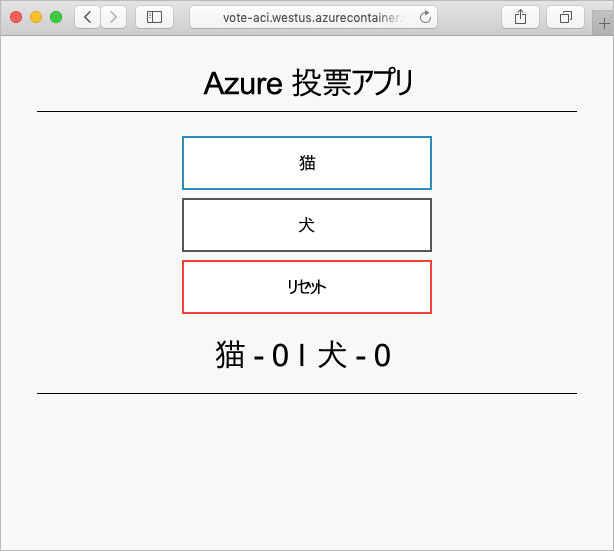

# <a name="create-a-terraform-configuration-for-azure"></a>Azure 用の Terraform 構成の作成

この例では、Terraform 構成を作成し、この構成を Azure にデプロイする操作を体験します。 完了すると、Azure Cosmos DB インスタンス、Azure Container インスタンス、およびこの 2 つのリソース間で動作するアプリケーションがデプロイされます。 このドキュメントでは、Terraform ツールが事前にインストールされている Azure Cloud Shell ですべての作業を行うことを前提としています。 自分のシステム上でこの例の作業を行いたい場合は、[ここ](../virtual-machines/linux/terraform-install-configure.md)の指示に従って Terraform をインストールすることができます。

## <a name="create-first-configuration"></a>最初の構成を作成する

このセクションでは、Azure Cosmos DB インスタンスの構成を作成します。

**[今すぐ試す]** を選択して、Azure Cloud Shell を開きます。 開いたら、「`code .`」と入力して、Cloud Shell のコード エディターを開きます。

```azurecli-interactive
code .
```

次の Terraform 構成をコピーして貼り付けます。

この構成では、Azure リソース グループ、ランダム整数、および Azure Cosmos DB インスタンスをモデル化しています。 ランダム整数は、Cosmos DB インスタンス名に使用されます。 いくつかの Cosmos DB 設定も構成されています。 Cosmos DB Terraform 構成の完全な一覧については、[Cosmos DB Terraform のリファレンス](https://www.terraform.io/docs/providers/azurerm/r/cosmosdb_account.html)を参照してください。

完了したら、ファイルを `main.tf` として保存します。 この操作は、コード エディターの右上部分にある省略記号を使用して実行できます。

```azurecli-interactive
resource "azurerm_resource_group" "vote-resource-group" {
  name     = "vote-resource-group"
  location = "westus"
}

resource "random_integer" "ri" {
  min = 10000
  max = 99999
}

resource "azurerm_cosmosdb_account" "vote-cosmos-db" {
  name                = "tfex-cosmos-db-${random_integer.ri.result}"
  location            = "${azurerm_resource_group.vote-resource-group.location}"
  resource_group_name = "${azurerm_resource_group.vote-resource-group.name}"
  offer_type          = "Standard"
  kind                = "GlobalDocumentDB"

  consistency_policy {
    consistency_level       = "BoundedStaleness"
    max_interval_in_seconds = 10
    max_staleness_prefix    = 200
  }

  geo_location {
    location          = "westus"
    failover_priority = 0
  }
}
```

[terraform init](https://www.terraform.io/docs/commands/init.html) コマンドを実行すると、作業ディレクトリが初期化されます。 Cloud Shell のターミナルで `terraform init` を実行して、新しい構成をデプロイする準備をします。

```azurecli-interactive
terraform init
```

[terraform plan](https://www.terraform.io/docs/commands/plan.html) コマンドを使用すると、構成が適切に書式化されていることを検証し、どのリソースが作成、更新、または破棄されるかを視覚化することができます。 結果をファイルに保存して、後で構成を適用するために使用することができます。

`terraform plan` を実行して、新しい Terraform 構成をテストします。

```azurecli-interactive
terraform plan --out plan.out
```

[terraform apply](https://www.terraform.io/docs/commands/apply.html) を使用し、プラン ファイルの名前を指定して、構成を適用します。 このコマンドを実行すると、Azure サブスクリプション内のリソースがデプロイされます。

```azurecli-interactive
terraform apply plan.out
```

完了すると、リソース グループが作成され、Azure Cosmos DB インスタンスがリソース グループにデプロイされたことを確認できます。

## <a name="update-configuration"></a>構成を更新する

Azure コンテナー インスタンスを含めるように構成を更新します。 コンテナーは、Cosmos DB のデータを読み書きするアプリケーションを実行します。

次の構成を `main.tf` ファイルの末尾にコピーします。 完了したらファイルを保存します。

`COSMOS_DB_ENDPOINT` と `COSMOS_DB_MASTERKEY` の 2 つの環境変数が設定されます。 これらの変数には、データベースにアクセスするための場所とキーが保持されます。 これらの変数の値は、最後の手順で作成されたデータベース インスタンスから取得されます。 このプロセスは、補間と呼ばれます。 Terraform の補間の詳細については、「[Interpolation Syntax (補間の構文)](https://www.terraform.io/docs/configuration/interpolation.html)」を参照してください。


この構成には、コンテナー インスタンスの完全修飾ドメイン名 (FQDN) を返す出力ブロックも含まれています。

```azurecli-interactive
resource "azurerm_container_group" "vote-aci" {
  name                = "vote-aci"
  location            = "${azurerm_resource_group.vote-resource-group.location}"
  resource_group_name = "${azurerm_resource_group.vote-resource-group.name}"
  ip_address_type     = "public"
  dns_name_label      = "vote-aci"
  os_type             = "linux"

  container {
    name   = "vote-aci"
    image  = "microsoft/azure-vote-front:cosmosdb"
    cpu    = "0.5"
    memory = "1.5"
    ports {
      port     = 80
      protocol = "TCP"
    }

    secure_environment_variables = {
      "COSMOS_DB_ENDPOINT"  = "${azurerm_cosmosdb_account.vote-cosmos-db.endpoint}"
      "COSMOS_DB_MASTERKEY" = "${azurerm_cosmosdb_account.vote-cosmos-db.primary_master_key}"
      "TITLE"               = "Azure Voting App"
      "VOTE1VALUE"          = "Cats"
      "VOTE2VALUE"          = "Dogs"
    }
  }
}

output "dns" {
  value = "${azurerm_container_group.vote-aci.fqdn}"
}
```

`terraform plan` を実行して、更新されたプランを作成し、加えられる変更を視覚化します。 Azure コンテナー インスタンス リソースが構成に追加されたことを確認できます。

```azurecli-interactive
terraform plan --out plan.out
```

最後に、`terraform apply` を実行して構成を適用します。

```azurecli-interactive
terraform apply plan.out
```

完了したら、コンテナー インスタンスの FQDN をメモします。

## <a name="test-application"></a>アプリケーションをテストする

コンテナー インスタンスの FQDN に移動します。 すべてが適切に構成されている場合は、次のアプリケーションが表示されます。



## <a name="clean-up-resources"></a>リソースのクリーンアップ

完了したら、[terraform destroy](https://www.terraform.io/docs/commands/destroy.html) コマンドを使用して、Azure リソースとリソース グループを削除できます。

```azurecli-interactive
terraform destroy -auto-approve
```

## <a name="next-steps"></a>次の手順

この例では、Terraform 構成を作成、デプロイ、および破棄しました。 Azure で Terraform を使用する方法の詳細については、Azure Terraform プロバイダーのドキュメントを参照してください。

> [!div class="nextstepaction"]
> [Azure Terraform プロバイダー](https://www.terraform.io/docs/providers/azurerm/)
