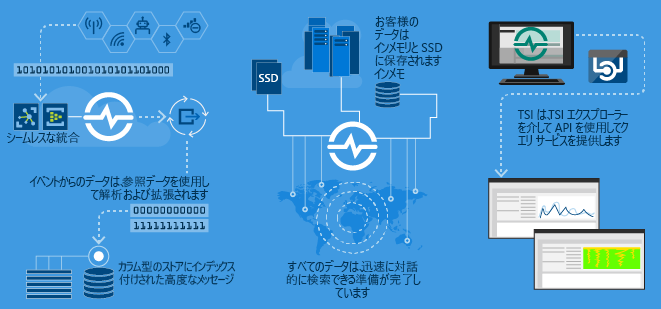
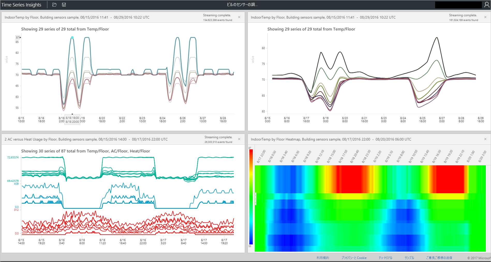

# Azure Time Series Insights とは

Time Series Insights は、IoT デバイスによって生成されるデータなど、大量の時系列データの保存、視覚化、照会を目的としています。  クラウドの時系列データを保存、管理、照会、または視覚化する場合は、Time Series Insights が適しています。  

Time Series Insights には 4 つの主要な仕事があります。

- 1 番目として、Azure IoT Hub や Azure Event Hubs などのクラウド ゲートウェイと完全に統合します。 Time Series Insights はこれらのイベント ソースに簡単に接続して、メッセージや、クリーンな行と列でデータを保持する構造から、JSON を解析します。 メタデータとテレメトリを結合し、単票形式のストア内のデータにインデックスを作成します。
- 2 番目として、Time Series Insights はデータのストレージを管理します。 いつでもデータに簡単にアクセスできるように、最大 400 日間、メモリと SSD にデータを格納します。 必要に応じて、何十億ものイベントに対する対話形式の照会を数秒で行うことができます。
- 3 番目として、Time Series Insights では、TSI エクスプローラーによる視覚化をすぐに利用できます。  
- 4 番目として、Time Series Insights のクエリ サービスは、TSI エクスプローラーと API の両方で提供されます。簡単に統合できる API を使うと、時系列データをカスタム アプリケーションに埋め込むことができます。  

社内向けまたは外部顧客向けのアプリケーションを作成する場合、時系列データのインデックス作成、保存、集計用のバックエンドとして Time Series Insights を使用できます。 Time Series Insights 上で、カスタムの視覚化機能やユーザー エクスペリエンスを構築できます。  Time Series Insights では、このシナリオを実現するために、Query API が公開されています。  

データが時系列かどうかわからない場合は、知っておくべきことがあります。  時系列データは、資産やプロセスの経時的な変化を表します。  時系列データには、タイムスタンプを含み、軸として時間が最も重要であるという、他のデータにはない特徴があります。  一般に、時系列データは時間順に到着し、通常はデータベースに対する更新ではなく挿入として扱われます。  Time Series Insights では、すべての新しいイベントをキャプチャし、行として保存するため、変化が経時的に測定されます。これにより、過去に遡ったり、将来の変化を予測したりできます。  大量の時系列データの保存、インデックス作成、照会、分析、視覚化は困難な場合があります。  

## 主なシナリオ

- スケーラブルな方法での時系列データの保存  
  - Time Series Insights の中核となるのは、時系列データを念頭に設計されたデータベースです。  このデータベースはスケーラブルであり、完全に管理されているため、Time Series Insight はイベントの保存と管理を処理します。

- ほぼリアルタイムのデータ探索  
  - Time Series Insights には、環境にストリーミングされるすべてのデータを視覚化するエクスプローラーが用意されています。  イベント ソースの接続後すぐに、Time Series Insight 内でイベント データを表示、探索、照会できます。  このデータは、デバイスが予想どおりにデータを出力しているかどうかを検証し、IoT 資産の正常性、生産性、全体的な有効性を監視する際に役立ちます。  

- 根本原因分析と異常検出
  - Time Series Insights は、多段階の根本原因分析を実行して保存するために、パターンやパースペクティブ ビューなどのツールを備えています。  さらに、Time Series Insights は Azure Stream Analytics などのアラート サービスと連携しているので、Time Series Insights エクスプローラーにアラートや検出された異常をほぼリアルタイムで表示できます。  

- 複数の異なる場所からストリーミングされた時系列データのグローバル ビューによる複数の資産/サイトの比較
  - Time Series Insights 環境に複数のイベント ソースを接続できます。  つまり、複数の異なる場所からストリーミングされたデータをほぼリアルタイムで一緒に表示できます。  ユーザーは、この可視性を利用してビジネス リーダーとデータを共有できます。また、専門知識を応用して問題の解決やベスト プラクティスの適用を支援し、知識を共有できる各分野の専門家とのコラボレーションを向上させることもできます。

- Time Series Insights 上での顧客アプリケーションの作成 
  - Time Series Insights は REST Query API を公開しているので、時系列データを使用するアプリケーションを作成できます。

## 機能

- **すぐに開始できる**: Azure Time Series Insights では、事前のデータ準備は不要です。 Azure IoT Hub またはイベント ハブに含まれる数百万のイベントに数分で接続できます。 接続後、センサー データを視覚化および操作して、IoT ソリューションを迅速に検証できます。 コードを記述しなくてもデータを操作できます。
新しい言語を習得する必要はありません。Time Series Insights は、詳しい知識のあるユーザー向けの自由書式の詳細なクエリ画面と、ポイント アンド クリックで操作できる探索機能を備えています。
- **ほぼリアルタイムの洞察**: Time Series Insights では、1 日あたり数百万件のセンサー イベントを取り込むことができます (待ち時間は 1 分)。 Time Series Insights では、傾向や異常を特定してセンサー データに関する洞察が得られるため、根本原因分析を実行し、コストのかかるダウンタイムを回避できます。 リアルタイム データと履歴データ間の相互相関が実現するため、Time Series Insights を使用すると、ユーザーはデータに隠れていた傾向を発見することができます。
- **カスタム ソリューションの構築**: Azure Time Series Insights のデータを既存のアプリケーションに埋め込んだり、Time Series Insights REST API を使用して新しいカスタム ソリューションを作成したりできます。 洞察を他のユーザーが探索できるように、カスタマイズされたビューを作成して共有できます。
- **スケーラビリティ**: Time Series Insights は、大規模に IoT をサポートするように設計されています。 1 日あたり 100 万～ 1 億件のイベントをイングレスできます (既定のリテンション期間は 31 日間)。 履歴データと共に、ライブ データ ストリームをほぼリアルタイムで視覚化して分析できます。 今後は、エンタープライズ規模に合わせてイングレス レートと保有率が増加します。

## 使用の開始
5 分足らずで使用を開始できます。 

1.  使用を開始するには、Azure Portal で Time Series Insights 環境をプロビジョニングします。 
2.  Azure IoT Hub やイベントハブなどのイベント ソースを接続します。  
3.  参照データをアップロードします (これは追加のサービスではありません)。
4.  Time Series Insights エクスプローラーを使用して、数分でデータを表示できます。

## Time Series Insights エクスプローラー
次の図は、エクスプローラーを使用して表示された Time Series Insights データの例を示しています。

## 次の手順
 - [デモ環境で Time Series Insights エクスプローラーを使用して探索する](./time-series-quickstart.md)
 - [独自の Time Series Insights 環境を計画する](time-series-insights-environment-planning.md)

