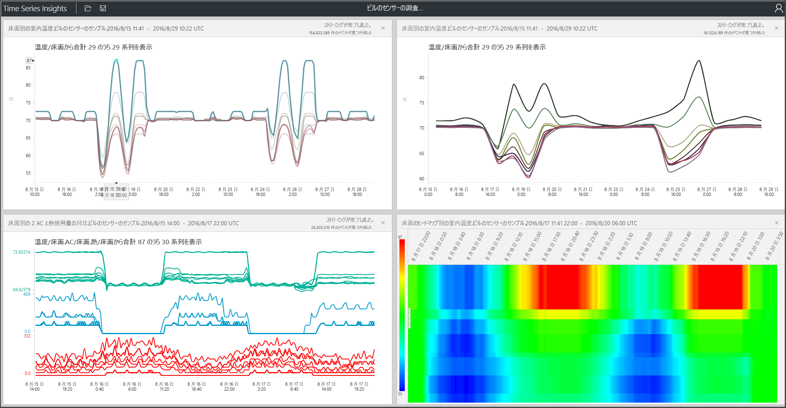

# Azure Time Series Insights とは

Azure Time Series Insights は、IoT デバイスによって生成されたデータなどの大量の時系列データの格納、視覚化、クエリ実行のために構築されています。 クラウドの時系列データを保存、管理、照会、または視覚化する場合は、Time Series Insights が適しています。

Time Series Insights には 4 つの主要な仕事があります。

- Azure IoT Hub や Azure Event Hubs などのクラウド ゲートウェイと完全に統合します。 Time Series Insights はこれらのイベント ソースに簡単に接続して、メッセージや、クリーンな行と列でデータを保持する構造から、JSON を解析します。 メタデータとテレメトリを結合し、単票形式のストア内のデータにインデックスを作成します。
- Time Series Insights は、データのストレージを管理します。 いつでもデータに簡単にアクセスできるように、最大 400 日間、メモリと SSD にデータが格納されます。 必要に応じて、何十億ものイベントに対する対話形式の照会を数秒で行うことができます。
- Time Series Insights は、Time Series Insights エクスプローラー経由ですぐに使用できる視覚化を提供します。
- Time Series Insights では、クエリ サービスが提供されます。これは、Time Series Insights エクスプローラーと、時系列データをカスタム アプリケーションに組み込むために簡単に統合できる API の両方で使用できます。

社内使用向け、または外部の顧客が使用するアプリケーションをビルドする場合は、バック エンドとして Time Series Insights を使用できます。 これを使用して、時系列データのインデックス作成、格納、集計を行うことができます。 ここでカスタムの視覚化機能やユーザー エクスペリエンスを構築するには、[クライアント SDK](https://github.com/microsoft/tsiclient/blob/master/docs/API.md) を使用します。 Time Series Insights にはまた、これらのカスタマイズされたシナリオを可能にするための[クエリ API](how-to-shape-query-json.md) もいくつか用意されています。

時系列データは、資産やプロセスの経時的な変化を表します。 時系列データにはタイムスタンプでインデックスが付けられ、最も重要な軸である時間に沿ってデータが整理されます。 一般に時系列データは時間順に到着するので、データベースに対する更新ではなく挿入として扱われます。

大量の時系列データの格納、インデックス作成、クエリ、分析、視覚化は困難な可能性があります。
Azure Time Series Insights では、すべての新しいイベントが行としてキャプチャおよび格納され、変更が時間とともに効率的に測定されます。 これにより、時間をさかのぼって過去から分析情報を導き出し、将来の変更を予測することができます。

## ビデオ

### クラウドベースの IoT 分析プラットフォームである Azure Time Series Insights について詳しく説明します。 

## 主なシナリオ

- スケーラブルな方法で時系列データを保存する。

   Time Series Insights の中核となるのは、時系列データを念頭に設計されたデータベースです。 このデータベースはスケーラブルであり、完全に管理されているため、Time Series Insight によってイベントの保存と管理が処理されます。

- ほぼリアルタイムでデータを調査する。

   Time Series Insights には、環境にストリーミングされるすべてのデータを視覚化するエクスプローラーが用意されています。 イベント ソースに接続するとすぐに、Time Series Insights 内でイベント データの表示、調査、クエリを行うことができます。 このデータは、デバイスが予想どおりにデータを出力しているかどうかを検証し、IoT 資産の正常性、生産性、全体的な有効性を監視する際に役立ちます。

- 根本原因分析を実行し、異常を検出する。

   Time Series Insights は、多段階の根本原因分析を実行して保存するために、パターンやパースペクティブ ビューなどのツールを備えています。 また、Time Series Insights は Azure Stream Analytics などのアラート サービスと連携しているので、Time Series Insights エクスプローラーにアラートや検出された異常をほぼリアルタイムで表示できます。

- 複数の資産またはサイトを比較するために、複数の異なる場所からストリーミングされた時系列データのグローバル ビューを取得する。

   Time Series Insights 環境に複数のイベント ソースを接続できます。 この方法では、複数の異なる場所からストリーミングされるデータを、ほぼリアルタイムでまとめて表示できます。 ユーザーはこの可視性を利用して、ビジネス リーダーとデータを共有できます。 問題の解決、ベスト プラクティスの適用、学習の共有に役立つ専門知識を活用できるドメインの専門家と、より適切に共同作業を行うできます。

- Time Series Insights 上で顧客アプリケーションを作成する。

   Time Series Insights では REST Query API が公開されており、これを使用して、時系列データを使用するアプリケーションを作成できます。

## 機能

- **すぐに使い始められる**: Azure Time Series Insights では、データ準備が必要ないので、IoT ハブまたはイベント ハブで数百万のイベントに簡単に接続できます。 接続後、センサー データを視覚化および操作して、IoT ソリューションを迅速に検証できます。 コードを記述することなくデータを操作でき、新しい言語を習得する必要はありません。 Time Series Insights は、詳しい知識のあるユーザー向けの自由書式の詳細なクエリ画面と、ポイント アンド クリックで操作できる調査機能を備えています。

- **ほぼリアルタイムの分析情報**: Time Series Insights では、1 分の待機時間んで、1 日あたり数百万件のセンサー イベントを取り込むことができます。 Time Series Insights を使用すると、センサー データに関する分析情報を取得できます。 これを使用して、傾向や異常を特定したり、根本原因を分析したり、コストのかかるダウンタイムを回避します。 リアルタイム データと履歴データ間の相互相関により、データに隠された傾向を見つけることができます。

- **カスタム ソリューションの構築**: Azure Time Series Insights データを既存のアプリケーションに組み込みます。 また、Time Series Insights REST API を使用して、新しいカスタム ソリューションを作成することもできます。 洞察を他のユーザーが探索できるように、カスタマイズされたビューを作成して共有できます。

- **スケーラビリティ**:Time Series Insights は、大規模な IoT をサポートするように設計されています。 1 日あたり 100 万～ 1 億件のイベントをイングレスできます (既定のリテンション期間は 31 日間)。 履歴データと共に、ライブ データ ストリームをほぼリアルタイムで視覚化して分析できます。

## はじめに

作業を開始するには、次の手順に従います。

1. Azure portal で新しい Time Series Insights 環境をプロビジョニングします。
1. IoT ハブやイベント ハブなどのイベント ソースに接続します。
1. 参照データをアップロードします。 これは追加のサービスではありません。
1. Time Series Insights エクスプローラーを使用して、数分でデータを確認および表示できます。

## エクスプローラー

Azure Time Series Insights エクスプローラーを使用して、データの傾向を表示、分析、および検出します。

[Azure Time Series Insights エクスプローラー](time-series-insights-explorer.md)を使用してデータから分析情報を引き出す方法について学習します。

## 次のステップ

- Azure Time Series Insights 一般公開版の[無料デモンストレーション環境](./time-series-quickstart.md)を探索します。

- [Time Series Insights 環境の計画](time-series-insights-environment-planning.md)方法について詳しく学習します。
