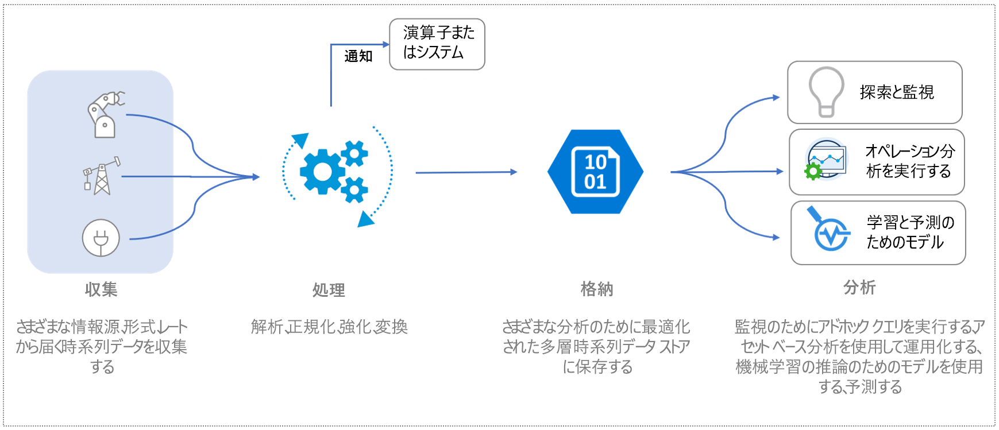
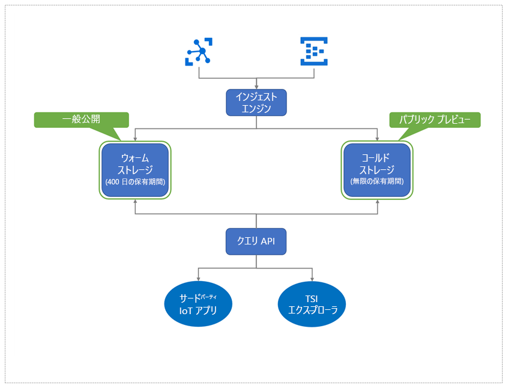

# Azure Time Series Insights プレビューとは

Azure Time Series Insights プレビューは、エンド ツー エンドのサービスとしてのプラットフォーム (PaaS) のオファリングです。 これを使って、モノのインターネット (IoT) スケールでデータの収集、処理、保存、分析、およびクエリを行うことができます。このデータは、時系列に対して高度にコンテキスト化、最適化されています。 

Time Series Insights は、アドホックなデータ探索と運用分析のために設計されています。 これは拡張性が高く、カスタマイズされたサービス オファリングであり、産業用 IoT デプロイの広範なニーズを満たします。

## ビデオ

Azure Time Series Insight プレビューの詳細を確認してください。

> [!VIDEO https://channel9.msdn.com/Shows/Internet-of-Things-Show/Azure-Time-Series-Insights-e2e-solution-for-industrial-IoT-analytics/player]

## IoT データの定義

アセットを大量に消費する組織の産業用 IoT データは、産業環境にはデバイスとセンサーの多様な性質があるため、構造的な一貫性を欠いていることがよくあります。 これらのストリームからのデータには、大きなギャップ、場合によってはメッセージの破損、誤った測定値という特徴があります。 IoT データは、エンドツーエンド ワークフローのコンテキストを追加する、ファーストパーティまたはサードパーティのソース (CRM や ERP など) に由来する追加データ入力のコンテキストで意味を持つことがよくあります。 気象データなどのサードパーティのデータ ソースからの入力は、特定のインストールでテレメトリ ストリームを強化するために役立ちます。 

このことは、運用およびビジネスの目的に使用されるデータはほんの一部であり、分析にはコンテキスト化が必要であることを意味します。 多くの場合、産業用データは、長期間にわたる詳細に分析し、傾向を理解して相関させるために履歴化されます。 収集された IoT データをアクションにつながる分析情報に変換するには、以下のことが必要です。 

* 分析用にデータをクリーンアップ、フィルター、補間、変換、および準備するためのデータ処理。
* データ内を移動したりデータを理解したりするための、つまりデータを正規化したりコンテキスト化したりするための構造。
* 処理 (または派生) されたデータと生データを長期または無期限に保持するためのコスト効率の高いストレージ。

このようなデータが、業務分析および業務レポートに対して、一貫性と包括性を備えた現時点での正しい情報を提供します。

次の図は、一般的な IoT データ フローを示しています。

## 産業用 IoT の Azure Time Series Insights

IoT の領域は多様であり、製造業、自動車、エネルギー、公共事業、スマート ビルディング、コンサルティングなど、さまざまな業界にわたって顧客がいます。 この幅広い産業用 IoT 市場において、大規模な IoT データを対象とした包括的な分析を提供するクラウド ネイティブ ソリューションは進化し続けています。 

Azure Time Series Insights はこの市場のニーズに対応するために、時系列データのコンテキスト化、アセットベースの分析情報、および検出、トレンド分析、異常検出、運用インテリジェンスに対応するクラス最高のユーザー エクスペリエンスのための豊富なセマンティック モデリングを備えたターンキーのエンドツーエンド IoT 分析ソリューションを提供しています。 

豊富な運用分析プラットフォームと対話型のデータ探索機能を組み合わせて Time Series Insights を使用し、IoT アセットから収集したデータからより多くの価値を引き出すことができます。 プレビュー オファリングでは以下がサポートされています。 

* ウォーム分析とコールド分析を使用した多層ストレージ ソリューションにより、ウォームとコールド間でデータをルーティングし、過去数十年の履歴データに対して運用インテリジェンスを行うオプションを顧客に提供できます。 

    *   より短期間のデータに対して頻繁に多数のクエリを実行するための高度に対話的なウォーム分析ソリューション 
    *   Azure Storage に基づくスケーラブルでパフォーマンスが高く、コストが最適化された時系列のデータ レイクで、顧客は数年分の時系列データを数秒で傾向を分析できます。 

* アセットとデバイスからの派生したシグナルと生のシグナルに関連付けられたドメインおよびメタデータを表すセマンティック モデルのサポート。

* 顧客が所有する Azure ストレージ アカウントに履歴時系列データを保存する柔軟な分析プラットフォーム。これにより、顧客は IoT データの所有権を持つことができます。 データはオープン ソースの Apache Parquet 形式で保存され、予測分析、機械学習、使い慣れたテクノロジ (Spark、Databricks、Jupyter など) を使用して行われるその他のカスタム計算など、さまざまなデータ シナリオにまたがる接続と相互運用を可能になります。

* 強化されたクエリ API とユーザー エクスペリエンスを備えた豊富な分析。これは、アセットベースの Data Analytics と、詳細な分析のための補間、スカラーおよび集計関数、カテゴリ変数、散布図、およびタイム シフト時系列信号のサポートを備えた豊富なアドホック データ分析を組み合わせたものです。

*   エンタープライズ IoT 顧客のスケール、パフォーマンス、セキュリティ、および信頼性のニーズに対応するエンタープライズ レベルのプラットフォーム。

* エンドツーエンド分析のための拡張性と統合のサポート。 Time Series Insights には、さまざまなデータ シナリオに対応する拡張可能な分析プラットフォームが用意されています。 Time Series Insights Power BI コネクタ。このコネクタにより、お客様が Time Series Insights で実行したクエリを Power BI に直接取り込むことができ、BI の統合ビューと時系列の分析を 1 つのウィンドウに表示できます。

次の図はデータ フローの概要です。

  

Azure Time Series Insights には、データ処理、ストレージ (データとメタデータ)、およびクエリのスケーラブルな従量課金モデルが用意されているため、顧客はビジネス ニーズに合わせて使用量を調整できます。 
 
こうした重要な産業用 IoT 機能が導入された Time Series Insights には、以下のような重要な利点もあります。  

| | |
| ---| ---|
| IoT 規模の時系列データに対応する多層ストレージ | データを取り込むための共有データ処理パイプラインを使うと、ウォーム ストアとコールド ストアの両方にデータを取り込むことができます。 対話型クエリにはウォーム ストアを使用し、大量のデータを保存するにはコールド ストアを使用します。 ハイ パフォーマンスのアセットベースのクエリを利用する方法の詳細については、[クエリ](./time-series-insights-update-tsq.md)に関する記事を参照してください。 |
| 未加工のテレメトリをコンテキスト化してアセット ベースの分析情報を生成する時系列モデル | タイム シリーズ モデルを使うと、時系列データのインスタンス、階層、型、および変数を作成できます。 タイム シリーズ モデルの詳細については、「[タイム シリーズ モデル](./time-series-insights-update-tsm.md)」を参照してください。  |
| 他のデータ ソリューションとの円滑で連続的な統合 | Time Series Insights のコールド ストアのデータは、オープンソースの Apache Parquet ファイルに[格納](./time-series-insights-update-storage-ingress.md)されます。 これにより、ビジネス インテリジェンス、高度な機械学習、および予測分析を含むシナリオで、他のデータ ソリューション (ファースト パーティまたはサード パーティ) とのデータ統合が可能になります。 |
| ほぼリアルタイムのデータ探索 | [Azure Time Series Insights プレビュー エクスプローラー](./time-series-insights-update-explorer.md)のユーザー エクスペリエンスは、取り込みのパイプライン経由ですべてのデータ ストリーミングの視覚化を提供しています。 イベント ソースを接続すると、イベント データの表示、調査、クエリを行うことができるようになります。 これにより、デバイスが想定どおりにデータを出力しているかどうかを検証できます。 IoT アセットの正常性、生産性、全体的な有効性を監視することもできます。 | 
| 拡張性と統合 | Azure Time Series Insights Power BI Connector の統合は、Time Series Explorer のユーザー エクスペリエンスで**エクスポート** オプションを介して使用でき、ユーザー エクスペリエンスで作成した時系列クエリを Power BI デスクトップに直接エクスポートし、その時系列グラフを他の BI 分析と共に表示できます。 これにより、IoT の時系列などのさまざまなデータ ソースからの分析が 1 つのウィンドウに表示されるので、Power BI に投資した産業用 IoT 企業が新しいクラスのシナリオを実現できるようになります。 | 
| Time Series Insights プラットフォーム上に構築されたカスタム アプリケーション | Time Series Insights では、[JavaScript SDK](https://github.com/microsoft/tsiclient/blob/master/docs/API.md) がサポートされています。 SDK では、豊富なコントロールとクエリへの簡単なアクセスが提供されます。 SDK を使用し、ビジネス ニーズに合わせて、Time Series Insights 上にカスタム IoT アプリケーションを構築します。 また、Time Series Insights の [Query API](./time-series-insights-update-tsq.md) を直接使用して、カスタム IoT アプリケーションへのデータを生成できます。 |

## 次のステップ

Azure Time Series Insights プレビューの概要:

> [!div class="nextstepaction"]
> [クイックスタート ガイド](./time-series-insights-update-quickstart.md)

ユース ケースの学習:

> [!div class="nextstepaction"]
> [Azure Time Series Insights プレビューのユース ケース](./time-series-insights-update-use-cases.md)