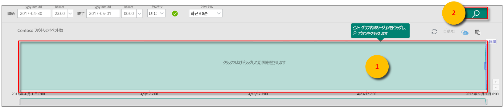
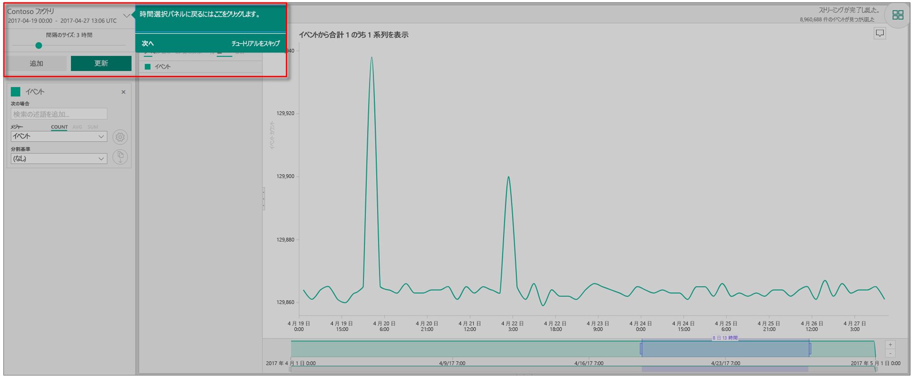
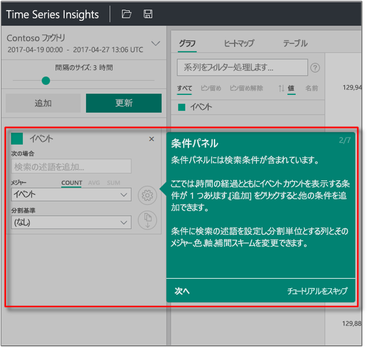
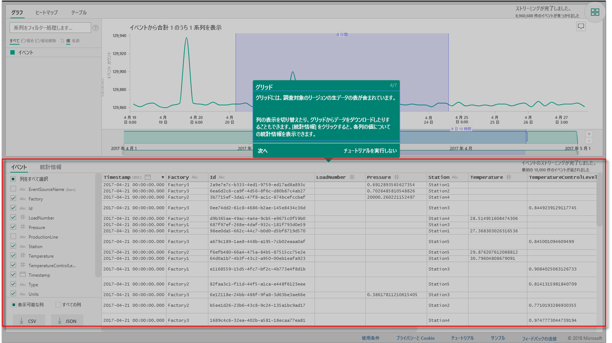
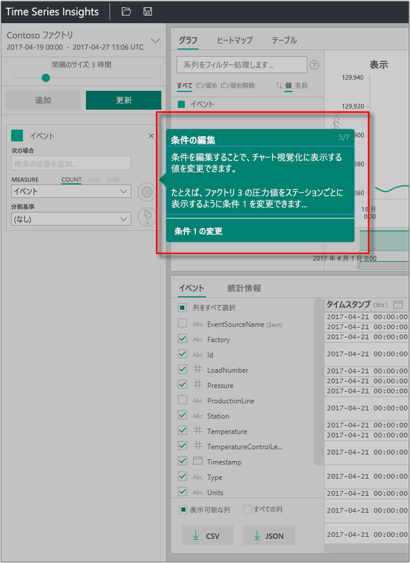
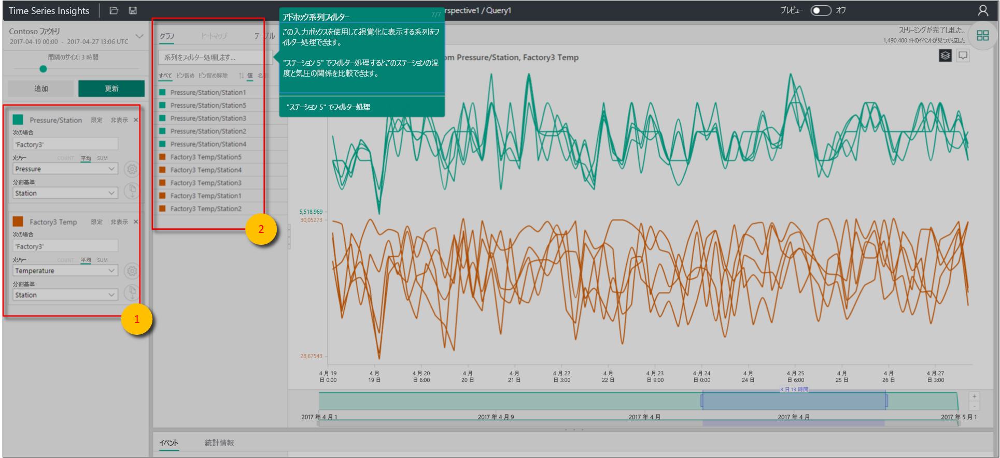

# クイック スタート:Azure Time Series Insights の探索

この Azure Time Series Insights エクスプローラー クイック スタートは、無料のデモンストレーション環境で Time Series Insights の使用を開始するときに役立ちます。 このクイックスタートでは、Web ブラウザーで大量の IoT データを視覚化する方法を学習し、現在一般提供されている主な機能を知ることができます。

Azure Time Series Insights は、数十億件の IoT イベントを同時に簡単に調査および分析できるようにする、フル マネージドの分析、ストレージ、および視覚化サービスです。 データの全体像が示され、これを使用してすばやく IoT ソリューションを検証したり、ミッション クリティカルなデバイスに発生するコストのかかるダウンタイムを回避したりできます。 Azure Time Series Insights は、ほぼリアルタイムで隠れた傾向を発見したり、異常を特定したり、根本原因分析を実施したりするために役立ちます。

柔軟性を高めるために、強力な [REST API](./time-series-insights-update-tsq.md) および[クライアント SDK](https://github.com/microsoft/tsiclient) を介して、Azure Time Series Insights を既存のアプリケーションに追加できます。 API を使用すると、時系列データの保存やクエリを行ったり、任意のクライアント アプリケーションで時系列データを使用したりすることができます。 クライアント SDK を使用して、既存のアプリケーションに UI コンポーネントを追加することもできます。

この Time Series Insights エクスプローラー クイックスタートでは、現在一般提供されている機能のガイド付きツアーを提供します。

> [!IMPORTANT]
> [無料の Azure アカウント](https://azure.microsoft.com/free/?ref=microsoft.com&utm_source=microsoft.com&utm_medium=docs&utm_campaign=visualstudio)を、まだお持ちでない場合は、作成します。

## デモ環境を準備する

1. ブラウザーで、[一般提供デモ](https://insights.timeseries.azure.com/demo)に移動します。

1. メッセージが表示されたら、Azure アカウントの資格情報を使用して Time Series Insights エクスプローラーにサインインします。

1. Time Series Insights のクイック ツアー ページが表示されます。 **[次へ]** を選択してクイック ツアーを開始します。

   [![クイックスタートの開始 - [次へ] を選択する](media/quickstart/quickstart-welcome.png)](media/quickstart/quickstart-welcome.png#lightbox)

## デモ環境を調査する

1. **日時選択パネル**が表示されます。 このパネルを使用して、視覚化する期間を選択します。

   

1. 時間枠を選択してリージョン内にドラッグします。 次に **[検索]** を選択します。

   

   Time Series Insights には、指定した期間のグラフが表示されます。 その折れ線グラフ内でさまざまなアクションを実行できます。 たとえば、フィルター処理、ピン留め、並べ替え、積み重ねができます。

   **日時選択パネル**に戻るには、次に示すように下矢印を選択します。

   

1. 新しい検索条件を追加するには、**条件パネル**で **[追加]** を選択します。

   

1. グラフでは、リージョンを選択し、そのリージョンを右クリックして **[Explore Events] \(イベントの探索)** を選択できます。

   [![[イベントの探索]](media/quickstart/quickstart-explore-events.png)](media/quickstart/quickstart-explore-events.png#lightbox)

   探索しているリージョンの生データのグリッドが表示されます。

   

## データを選択およびフィルター処理する

1. 条件を編集してグラフ内の値を変更します。 別の条件を追加して、さまざまな種類の値を相互に関連付けます。

   

1. 選択した検索条件をすべて表示するには、 **[系列をフィルター処理します]** ボックスを空のままにします。系列のフィルター処理を行うには、 **[系列をフィルター処理します]** ボックスに、思い付いたフィルター条件を入力します。

   

   クイック スタートの場合は、「**Station5**」と入力して、そのステーションの温度と圧力を相互に関連付けます。

クイック スタートを完了したら、別の視覚化を作成するためにサンプル データ セットを試してみることができます。

## リソースをクリーンアップする

チュートリアルを完了したので、作成したリソースをクリーンアップします。

1. [Azure portal](https://portal.azure.com) の左側のメニューにある **[すべてのリソース]** を選択し、目的の Azure Time Series Insights リソース グループを見つけます。
1. **[削除]** を選択してリソース グループ全体 (およびその中に含まれるすべてのリソース) を削除するか、各リソースを個別に削除します。

## 次のステップ

独自の Time Series Insights 環境を作成する準備ができました:
> [!div class="nextstepaction"]
> [Time Series Insights 環境の計画](time-series-insights-environment-planning.md)
