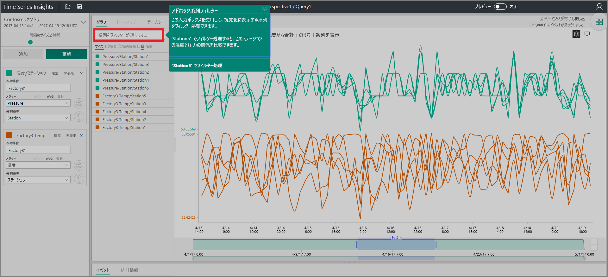

# クイック スタート:Azure Time Series Insights の探索

無料のデモンストレーション環境で Azure Time Series Insights の使用を開始できるように、クイック スタート エクスプローラーが用意されています。 それを使用して、Web ブラウザーで大量の IoT データを視覚化する方法を学習し、現在一般公開されている主な機能を知ることができます。

Azure Time Series Insights は、数十億件の IoT イベントを同時に簡単に調査および分析できるようにする、フル マネージドの分析、ストレージ、および視覚化サービスです。 データの全体像が示され、これを使用してすばやく IoT ソリューションを検証したり、ミッション クリティカルなデバイスに発生するコストのかかるダウンタイムを回避したりできます。 Azure Time Series Insights を通じて、ほぼリアルタイムで隠れた傾向を発見したり、異常を特定したり、根本原因分析を実施したりできます。

柔軟性を高めるために、強力な [REST API](./time-series-insights-update-tsq.md) および[クライアント SDK](./tutorial-create-tsi-sample-spa.md) を介して、Azure Time Series Insights を既存のアプリケーションに追加できます。 API を使用すると、時系列データの保存やクエリを行ったり、任意のクライアント アプリケーションで時系列データを使用したりすることができます。 クライアント SDK を使用して、既存のアプリケーションに UI コンポーネントを追加することもできます。

Time Series Insights エクスプローラーは、現在一般公開されている機能のガイド ツアーです。

## デモ環境を準備する

1. [無料の Azure アカウント](https://azure.microsoft.com/free/?ref=microsoft.com&utm_source=microsoft.com&utm_medium=docs&utm_campaign=visualstudio)をまだ作成していない場合は、作成します。

1. ブラウザーで、[一般公開デモ](https://insights.timeseries.azure.com/demo)に移動します。

1. メッセージが表示されたら、Azure アカウントの資格情報を使用して Time Series Insights エクスプローラーにサインインします。

1. Time Series Insights のクイック ツアー ページが表示されます。 **[次へ]** をクリックしてクイック ツアーを開始します。

   [![[次へ] をクリックする](media/quickstart/quickstart1.png)](media/quickstart/quickstart1.png#lightbox)

## デモ環境を調査する

1. **日時選択パネル**が表示されます。 このパネルを使用して、視覚化する期間を選択します。

   

1. リージョン内をクリックしてドラッグしてから、 **[検索]** ボタンをクリックします。

   

   Time Series Insights には、指定した期間のグラフが表示されます。 折れ線グラフを使用して、フィルター処理、ピン留め、並べ替え、積み重ねなどのさまざまなアクションを実行できます。

   **日時選択パネル**に戻るには、次に示すように下矢印をクリックします。

   

1. 新しい検索用語を追加するには、 **[用語] パネル**で **[追加]** をクリックします。

   

1. グラフでは、リージョンを選択し、そのリージョンを右クリックして **[Explore Events] \(イベントの探索)** を選択できます。

   [![[イベントの探索]](media/quickstart/quickstart6.png)](media/quickstart/quickstart6.png#lightbox)

   探索しているリージョンの生データのグリッドが表示されます。

   

## データを選択およびフィルター処理する

1. 用語を編集してグラフ内の値を変更し、別の用語を追加して異なる型の値を相互に関連付けます。

   

1. 系列のフィルター処理を行うには、 **[系列をフィルター処理します]** ボックスに、思い付いたフィルター用語を入力します。 クイック スタートの場合は、「**Station5**」と入力して、そのステーションの温度と圧力を相互に関連付けます。

   

クイック スタートを完了したら、別の視覚化を作成するためにサンプル データ セットを試してみることができます。

## 次の手順

独自の Time Series Insights 環境を作成する準備ができました。
> [!div class="nextstepaction"]
> [Time Series Insights 環境の計画](time-series-insights-environment-planning.md)
