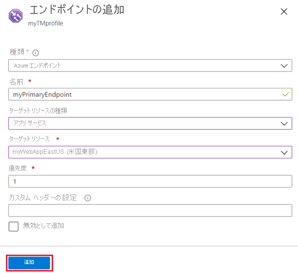

# クイック スタート:Azure portal を使用した Traffic Manager プロファイルの作成

このクイック スタートでは、Web アプリケーションの高可用性を実現する Traffic Manager プロファイルの作成方法について説明します。

このクイック スタートでは、Web アプリケーションの 2 つのインスタンスについて見ていきます。 これらは、それぞれ別の Azure リージョンで実行されています。 皆さんは、[エンドポイントの優先度](traffic-manager-routing-methods.md#priority)に基づいて Traffic Manager プロファイルを作成します。 このプロファイルにより、Web アプリケーションを実行しているプライマリ サイトにユーザー トラフィックを誘導します。 Traffic Manager では、Web アプリケーションが継続的に監視されます。 プライマリ サイトが利用できなくなった場合には、バックアップ サイトへの自動フェールオーバーが実行されます。

Azure サブスクリプションをお持ちでない場合は、ここで[無料アカウント](https://azure.microsoft.com/free/?WT.mc_id=A261C142F)を作成してください。

## Azure へのサインイン

[Azure Portal](https://portal.azure.com) にサインインします。

## 前提条件

このクイック スタートでは、2 つの異なる Azure リージョン ("*米国東部*" と "*西ヨーロッパ*") にデプロイされた、2 つの Web アプリケーション インスタンスが必要になります。 これらインスタンスは、それぞれ Traffic Manager のプライマリとフェールオーバーのエンドポイントとして機能します。

1. 画面の左上で、**[リソースの作成]** > **[Web]** > **[Web アプリ]** を選択します。
2. **[Web アプリ]** で、次の設定を入力または選択します。

    | Setting | 値 |
    | ------- | ----- |
    | アプリの名前 | Web アプリの一意の名前を入力します。  |
    | サブスクリプション | Web アプリの適用先となるサブスクリプションを選択します。 |
    | リソース グループ | **[新規作成]** を選択し、「*myResourceGroupTM1*」と入力します。 |
    | OS | オペレーティング システムとして、**[Windows]** を選択します。 |
    | [発行] | 発行する形式として、**[コード]** を選択します。 |

3. **[App Service プラン/場所]** を選択します。
4. **[App Service プラン]** で、**[新規作成]** を選択します。
5. **[新しい App Service プラン]** で、次の設定を入力または選択します。

    | Setting | 値 |
    | ------- | ----- |
    | App Service プラン | 「*myAppServicePlanEastUS*」と入力します。 |
    | Location | 米国東部 |
    | [価格レベル]  | S1 Standard |

6. **[OK]** を選択します。

7. **[Web アプリ]** で、**[作成]** を選択します。 Web アプリが正常にデプロイされると、既定の Web サイトが作成されます。

8. 別の Azure リージョンに 2 つ目の Web サイトを作成するには、次の設定を使用して、手順 1. から手順 7. を繰り返します。

    | Setting | 値 |
    | --------| ----- |
    | Name | Web アプリの一意の名前を入力します。 |
    | サブスクリプション | Web アプリの適用先となるサブスクリプションを選択します。 |
    | リソース グループ | **[新規作成]** を選択し、「*myResourceGroupTM2*」と入力します。 |
    | OS | オペレーティング システムとして、**[Windows]** を選択します。 |
    | [発行] | 発行する形式として、**[コード]** を選択します。 |
    | App Service プラン/場所 | 「*myAppServicePlanWestEurope*」と入力します。 |
    | Location | 西ヨーロッパ |
    | [価格レベル]  | S1 Standard |

## Traffic Manager プロファイルの作成

エンドポイントの優先度に基づいてユーザー トラフィックを誘導する Traffic Manager プロファイルを作成します。

1. 画面の左上で、**[リソースの作成]** > **[ネットワーク]** > **[Traffic Manager プロファイル]** の順に選択します。
2. **[Traffic Manager プロファイルの作成]** ブレードで、次の設定を入力するか、選択します。

    | Setting | 値 |
    | --------| ----- |
    | Name | Traffic Manager プロファイルの一意の名前を入力します。|
    | ルーティング方法 | **[優先順位]** を選択します。|
    | サブスクリプション | Traffic Manager プロファイルの適用先となるサブスクリプションを選択します。 |
    | リソース グループ | *myResourceGroupTM1* を選択します。|
    | Location |この設定は、リソース グループの場所を指定するものです。 グローバルにデプロイされる Traffic Manager プロファイルには影響しません。|

3. **作成**を選択します。

## Traffic Manager エンドポイントの追加

すべてのユーザー トラフィックのルーティング先となるプライマリ エンドポイントとして、"*米国東部*" に Web サイトを追加します。 "*西ヨーロッパ*" に、フェールオーバー エンドポイントとして Web サイトを追加します。 プライマリ エンドポイントが使用できない場合、トラフィックは自動的にフェールオーバー エンドポイントにルーティングされます。

1. ポータルの検索バーで、前のセクションで作成した Traffic Manager プロファイルの名前を入力します。
2. 検索結果からプロファイルを選択します。
3. **[Traffic Manager プロファイル]** の **[設定]** セクションで、**[エンドポイント]** を選択し、**[追加]** を選択します。
4. 次の設定を入力または選択します。

    | Setting | 値 |
    | ------- | ------|
    | type | **[Azure エンドポイント]** を選択します。 |
    | Name | 「*myPrimaryEndpoint*」と入力します。 |
    | ターゲット リソースの種類 | **[App Service]** を選択します。 |
    | ターゲット リソース | **[アプリ サービスの選択]** > **[米国東部]** を選択します。 |
    | 優先順位 | **[1]** を選択します。 正常なトラフィックはすべてこのエンドポイントに送られます。 |

    

5. **[OK]** を選択します。
6. 2 つ目の Azure リージョンのフェールオーバー エンドポイントを作成するには、次の設定を使用して手順 3. と手順 4. を繰り返します。

    | Setting | 値 |
    | ------- | ------|
    | type | **[Azure エンドポイント]** を選択します。 |
    | Name | 「*myFailoverEndpoint*」と入力します。 |
    | ターゲット リソースの種類 | **[App Service]** を選択します。 |
    | ターゲット リソース | **[アプリ サービスの選択]** > **[西ヨーロッパ]** を選択します。 |
    | 優先順位 | **[2]** を選択します。 プライマリ エンドポイントが正常でない場合、すべてのトラフィックはこのフェールオーバー エンドポイントに送られます。 |

7. **[OK]** を選択します。

2 つのエンドポイントが追加されると、それらが **Traffic Manager プロファイル**に表示されます。 監視の状態が**オンライン**になったことに注目してください。

## Traffic Manager プロファイルのテスト

このセクションでは、Traffic Manager プロファイルのドメイン名を確認します。 また、プライマリ エンドポイントを使用できないように構成します。 最後に、Web アプリがまだ使用できることを確認します。 これは、Traffic Manager によってトラフィックがフェールオーバー エンドポイントへと送信されるためです。

### DNS 名を確認する

1. ポータルの検索バーで、前のセクションで作成した **Traffic Manager プロファイル**の名前を検索します。
2. Traffic Manager プロファイルを選択します。 **[概要]** が表示されます。
3. **[Traffic Manager プロファイル]** に、新しく作成した Traffic Manager プロファイルの DNS 名が表示されます。
  
   

### Traffic Manager の動作確認

1. Web ブラウザーで、Traffic Manager プロファイルの DNS 名を入力して、Web アプリの既定の Web サイトを確認します。

    > [!NOTE]
    > このクイック スタート シナリオでは、すべての要求がプライマリ エンドポイントにルーティングされます。 これは**優先度 1** に設定されています。

    

2. Traffic Manager のフェールオーバー動作を確認するために、次の手順でプライマリ サイトを無効にします。
    1. [Traffic Manager プロファイル] ページで、**[概要]** セクションから **[myPrimaryEndpoint]** を選択します。
    2. *[myPrimaryEndpoint]* で **[無効]** > **[保存]** を選択します。
    3. **[myPrimaryEndpoint]** を閉じます。 状態が **[無効]** になったことを確認してください。
3. 新しい Web ブラウザー セッションで Web サイトを表示するために、Traffic Manager プロファイルの DNS 名を前の手順からコピーします。
4. Web アプリがまだ使用できることを確認します。

プライマリ エンドポイントが使用できないため、フェールオーバー エンドポイントにルーティングされました。

## リソースのクリーンアップ

完了したら、リソース グループ、Web アプリケーション、およびすべての関連リソースを削除します。 これを行うには、ダッシュ ボードから個々 の項目を選択し、各ページの上部にある **[削除]** を選択します。

## 次の手順

このクイック スタートでは、Traffic Manager プロファイルを作成しました。 これにより、ユーザー トラフィックを高可用性 Web アプリケーション用にルーティングすることができます。 トラフィックのルーティングについて理解を深めるために、引き続き Traffic Manager のチュートリアルをご覧ください。

> [!div class="nextstepaction"]
> [Traffic Manager のチュートリアル](tutorial-traffic-manager-improve-website-response.md)
