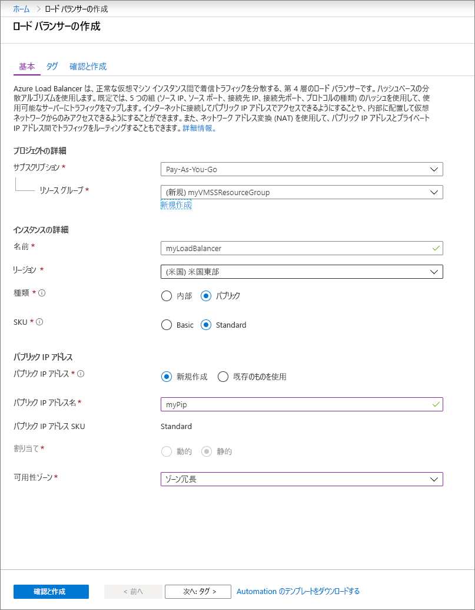
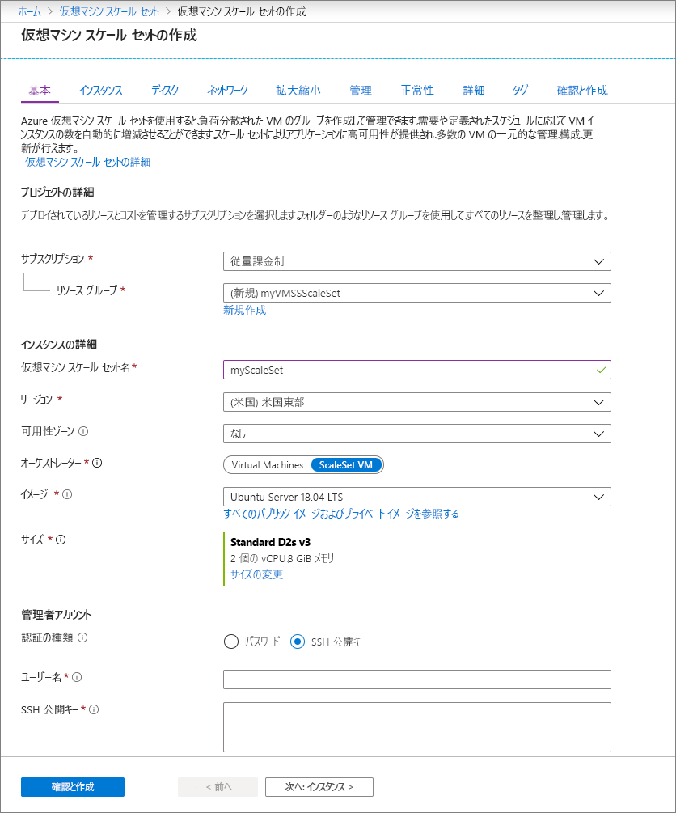

# クイック スタート:Azure Portal での仮想マシン スケール セットの作成

仮想マシン スケール セットを使用すると、同一の自動スケールの仮想マシンのセットをデプロイおよび管理できます。 スケール セット内の VM の数を手動で拡張したり、CPU などのリソースの使用率、メモリの需要、またはネットワーク トラフィックに基づいて自動的にスケールする規則を定義したりすることができます。 その後、Azure ロード バランサーがトラフィックをスケール セット内の VM インスタンスに分散します。 このクイック スタートでは、Azure Portal で仮想マシン スケール セットを作成します。

Azure サブスクリプションをお持ちでない場合は、開始する前に [無料アカウント](https://azure.microsoft.com/free/?WT.mc_id=A261C142F) を作成してください。

## Azure にログインする
Azure Portal (https://portal.azure.com ) にログインします。

## ロード バランサーの作成

Azure [Load Balancer](../load-balancer/load-balancer-overview.md) は、受信トラフィックを正常な仮想マシン インスタンス間で分散します。 

最初に、ポータルを使用してパブリック Standard Load Balancer を作成します。 作成する名前とパブリック IP アドレスは、ロード バランサーのフロント エンドとして自動的に構成されます。

1. 検索ボックスに「**ロード バランサー**」と入力します。 検索結果の **[マーケットプレース]** で、 **[ロード バランサー]** を選択します。
1. **[ロード バランサーの作成]** ページの **[基本]** タブで、次の情報を入力または選択します。

    | 設定                 | 値   |
    | ---| ---|
    | サブスクリプション  | サブスクリプションを選択します。    |    
    | Resource group | **[新規作成]** を選択し、テキスト ボックスに「*myVMSSResourceGroup*」と入力します。|
    | 名前           | *myLoadBalancer*         |
    | リージョン         | **[米国東部]** を選択します。       |
    | Type          | **[パブリック]** を選択します。       |
    | SKU           | **[Standard]** を選択します。       |
    | パブリック IP アドレス | **[新規作成]** を選択します。 |
    | パブリック IP アドレス名  | *MyPip*   |
    | 割り当て| 静的 |

1. 完了したら、 **[確認および作成]** を選択します。 
1. 検証に合格したら、 **[作成]** を選択します。 

## 仮想マシン スケール セットを作成する
Windows Server イメージまたは Linux イメージ (RHEL、CentOS、Ubuntu、SLES など) を含むスケール セットをデプロイできます。

1. 検索ボックスに「**スケール セット**」と入力します。 結果の **[マーケットプレース]** で、 **[仮想マシン スケール セット]** を選択します。 **[仮想マシン スケール セットを作成する]** ページが開きます。 
1. **[基本]** タブの **[Project details] (プロジェクトの詳細)** で、正しいサブスクリプションが選択されていることを確認し、リソース グループの **[新規作成]** を選択します。 名前として「*myVMSSResourceGroup*」と入力し、 **[OK]** を選択します。 
1. スケール セットの名前として「*myScaleSet*」と入力します。
1. **[リージョン]** で、自分の地域に近いリージョンを選択します。
1. **[オーケストレーター]** の **[ScaleSet VMs] (スケールセット VM)** の既定値はそのままにします。
1. **[イメージ]** のマーケットプレース イメージを選択します。 この例では、 *[Ubuntu Server 18.04 LTS]* を選択しました。
1. 目的のユーザー名を入力して、任意の認証の種類を選択します。
   - **パスワード**は、12 文字以上で指定する必要があります。また、1 つの小文字、1 つの大文字、1 つの数字、1 つの特殊文字という複雑さの 4 つの要件のうち、3 つを満たしている必要があります。 詳細については、[ユーザー名とパスワードの要件](../virtual-machines/windows/faq.md#what-are-the-username-requirements-when-creating-a-vm)を参照してください。
   - Linux OS ディスク イメージを選択した場合は、代わりに **[SSH public key]\(SSH 公開キー\)** を選択できます。 公開キーのみを指定してください ( *~/.ssh/id_rsa.pub* など)。 ポータルから Azure Cloud Shell を使用して、[SSH キー](../virtual-machines/linux/mac-create-ssh-keys.md)を作成および使用することができます。
   
    

1. **[次へ]** を選択して、他のページを移動します。 
1. **[インスタンス]** および **[ディスク]** ページの既定値はそのままにします。
1. **[ネットワーク]** ページの **[負荷分散]** で、 **[はい]** を選択して、スケール セット インスタンスをロード バランサーの背後に配置します。 
1. **[負荷分散のオプション]** で、 **[Azure Load Balancer]** を選択します。
1. **[ロード バランサーを選択します]** で、前に作成した *[myLoadBalancer]* を選択します。
1. **[Select a backend pool] (バックエンド プールを選択します)** で、 **[新規作成]** を選択し、「*myBackendPool*」と入力して **[作成]** を選択します。
1. 完了したら、 **[確認および作成]** を選択します。 
1. 検証に合格したら、 **[作成]** を選択してスケール セットをデプロイします。

## リソースをクリーンアップする
必要がなくなったら、リソース グループ、スケール セット、およびすべての関連リソースを削除します。 それを行うには、スケール セットのリソース グループを選択してから **[削除]** を選択します。

## 次のステップ
このクイック スタートでは、Azure Portal で基本的なスケール セットを作成しました。 さらに学習するには、Azure 仮想マシン スケール セットを作成および管理する方法についてのチュートリアルに進んでください。

> [!div class="nextstepaction"]
> [Azure 仮想マシン スケール セットの作成と管理](tutorial-create-and-manage-powershell.md)
