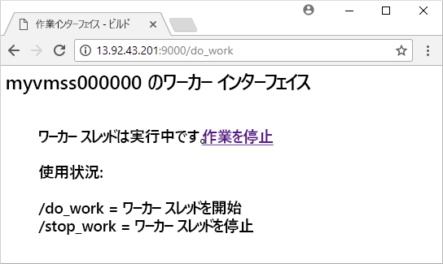

# <a name="quickstart-create-a-linux-virtual-machine-scale-set-with-an-azure-template"></a>クイック スタート: Azure テンプレートを使用して Linux 仮想マシン スケール セットを作成する
仮想マシン スケール セットを使用すると、同一の自動スケールの仮想マシンのセットをデプロイおよび管理できます。 スケール セット内の VM の数を手動で拡張したり、CPU などのリソースの使用率、メモリの需要、またはネットワーク トラフィックに基づいて自動的にスケールする規則を定義したりすることができます。 その後、Azure ロード バランサーがトラフィックをスケール セット内の VM インスタンスに分散します。 このクイック スタートでは、Azure Resource Manager テンプレートを使用して、仮想マシン スケール セットを作成し、サンプル アプリケーションをデプロイします。

Azure サブスクリプションをお持ちでない場合は、開始する前に [無料アカウント](https://azure.microsoft.com/free/?WT.mc_id=A261C142F) を作成してください。

[!INCLUDE [cloud-shell-try-it.md](../../includes/cloud-shell-try-it.md)]

CLI をローカルにインストールして使用する場合、このチュートリアルでは、Azure CLI バージョン 2.0.29 以降を実行していることが要件です。 バージョンを確認するには、`az --version` を実行します。 インストールまたはアップグレードする必要がある場合は、「[Azure CLI 2.0 のインストール]( /cli/azure/install-azure-cli)」を参照してください。


## <a name="define-a-scale-set-in-a-template"></a>テンプレート内にスケール セットを定義する
Azure Resource Manager テンプレートを使用して、関連するリソースのグループをデプロイできます。 テンプレートは JavaScript Object Notation (JSON) で記述され、アプリケーションの Azure インフラストラクチャ環境全体を定義します。 1 つのテンプレートで、仮想マシン スケール セットの作成、アプリケーションのインストール、および自動スケール ルールの構成を実行できます。 変数やパラメーターを使用してこのテンプレートを再利用することで、既存のスケール セットを更新したり、追加のスケール セットを作成したりできます。 テンプレートは、Azure ポータル、Azure CLI 2.0、Azure PowerShell を介してデプロイすることも、継続的インテグレーション/継続的デリバリー (CI/CD) パイプラインから呼び出すこともできます。

テンプレートの詳細については、「[Azure Resource Manager の概要](https://docs.microsoft.com/azure/azure-resource-manager/resource-group-overview#template-deployment)」を参照してください。

テンプレートを使用してスケールを作成するには、適切なリソースを定義します。 仮想マシン スケール セットのリソースの種類のコア部分は次のとおりです。

| プロパティ                     | プロパティの説明                                  | テンプレート値の例                    |
|------------------------------|----------------------------------------------------------|-------------------------------------------|
| type                         | 作成する Azure リソースの種類                            | Microsoft.Compute/virtualMachineScaleSets |
| name                         | スケール セットの名前                                       | myScaleSet                                |
| location                     | スケール セットを作成する場所                     | 米国東部                                   |
| sku.name                     | 各スケール セット インスタンスの VM サイズ                  | Standard_A1                               |
| sku.capacity                 | 最初に作成する VM インスタンスの数           | 2                                         |
| upgradePolicy.mode           | 変更が発生した場合の VM インスタンスのアップグレード モード              | 自動                                 |
| imageReference               | VM インスタンスに使用するプラットフォームまたはカスタム イメージ | Canonical Ubuntu Server 16.04-LTS         |
| osProfile.computerNamePrefix | 各 VM インスタンス名のプレフィックス                     | myvmss                                    |
| osProfile.adminUsername      | 各 VM インスタンスのユーザー名                        | azureuser                                 |
| osProfile.adminPassword      | 各 VM インスタンスのパスワード                        | P@ssw0rd!                                 |

 次の例は、コア スケール セットのリソース定義を示しています。 スケール セット テンプレートをカスタマイズするために、VM サイズや初期容量を変更したり、別のプラットフォームやカスタム イメージを使用したりできます。

```json
{
  "type": "Microsoft.Compute/virtualMachineScaleSets",
  "name": "myScaleSet",
  "location": "East US",
  "apiVersion": "2017-12-01",
  "sku": {
    "name": "Standard_A1",
    "capacity": "2"
  },
  "properties": {
    "upgradePolicy": {
      "mode": "Automatic"
    },
    "virtualMachineProfile": {
      "storageProfile": {
        "osDisk": {
          "caching": "ReadWrite",
          "createOption": "FromImage"
        },
        "imageReference":  {
          "publisher": "Canonical",
          "offer": "UbuntuServer",
          "sku": "16.04-LTS",
          "version": "latest"
        }
      },
      "osProfile": {
        "computerNamePrefix": "myvmss",
        "adminUsername": "azureuser",
        "adminPassword": "P@ssw0rd!"
      }
    }
  }
}
```

 サンプルを短くするために、仮想ネットワーク インターフェイス カード (NIC) の構成は示されていません。 ロード バランサーなどの追加コンポーネントも示されていません。 [この記事の最後に](#deploy-the-template)完全なスケール セット テンプレートが示されています。


## <a name="add-a-sample-application"></a>サンプル アプリケーションを追加する
スケール セットをテストするには、基本的な Web アプリケーションをインストールします。 スケール セットをデプロイするとき、VM 拡張機能によって、デプロイ後の構成とオートメーション タスク (アプリのインストールなど) を提供できます。 スクリプトは、Azure ストレージや GitHub からダウンロードできます。また、拡張機能の実行時に Azure Portal に提供することもできます。 拡張機能をスケール セットに適用するには、上記のリソース例に *extensionProfile* セクションを追加します。 拡張機能プロファイルは、通常、次のプロパティを定義します。

- 拡張機能の種類
- 拡張機能の発行元
- 拡張機能のバージョン
- 構成またはインストール スクリプトの場所
- VM インスタンスで実行するコマンド

[Linux 上の Python HTTP サーバー](https://github.com/Azure/azure-quickstart-templates/tree/master/201-vmss-bottle-autoscale) テンプレートでは、カスタム スクリプト拡張機能を使用して、[Bottle](http://bottlepy.org/docs/dev/)、Python Web フレームワーク、および単純な HTTP サーバーをインストールします。 

**fileUris** には 2 つのスクリプト  - *installserver.sh*と *workserver.py*が定義されます。 これらのファイルが GitHub からダウンロードされた後、*commandToExecute*によって、アプリをインストールして構成する `bash installserver.sh` が実行されます。

```json
"extensionProfile": {
  "extensions": [
    {
      "name": "AppInstall",
      "properties": {
        "publisher": "Microsoft.Azure.Extensions",
        "type": "CustomScript",
        "typeHandlerVersion": "2.0",
        "autoUpgradeMinorVersion": true,
        "settings": {
          "fileUris": [
            "https://raw.githubusercontent.com/Azure/azure-quickstart-templates/master/201-vmss-bottle-autoscale/installserver.sh",
            "https://raw.githubusercontent.com/Azure/azure-quickstart-templates/master/201-vmss-bottle-autoscale/workserver.py"
          ],
          "commandToExecute": "bash installserver.sh"
        }
      }
    }
  ]
}
```


## <a name="deploy-the-template"></a>テンプレートのデプロイ
[Linux 上の Python HTTP サーバー](https://github.com/Azure/azure-quickstart-templates/tree/master/201-vmss-bottle-autoscale) テンプレートは、次の **[Deploy to Azure]** ボタンを使用してデプロイできます。 このボタンは、Azure ポータルを開き、完全なテンプレートを読み込み、スケール セットの名前、インスタンス数、管理者の資格情報などのいくつかのパラメーターの入力を求めます。

[](https://portal.azure.com/#create/Microsoft.Template/uri/https%3A%2F%2Fraw.githubusercontent.com%2FAzure%2Fazure-quickstart-templates%2Fmaster%2F201-vmss-bottle-autoscale%2Fazuredeploy.json)

次のように Azure CLI 2.0 で [az group deployment create](/cli/azure/group/deployment#az_group_deployment_create) を使用して、Python HTTP サーバーを Linux にインストールすることもできます。

```azurecli-interactive
# Create a resource group
az group create --name myResourceGroup --location EastUS

# Deploy template into resource group
az group deployment create \
    --resource-group myResourceGroup \
    --template-uri https://raw.githubusercontent.com/Azure/azure-quickstart-templates/master/201-vmss-bottle-autoscale/azuredeploy.json
```

プロンプトに応答して、VM インスタンスのスケール セットの名前、インスタンスの数、および 管理者の資格情報を指定します。 スケール セットとサポート リソースを作成するのに数分かかります。


## <a name="test-your-scale-set"></a>スケール セットのテスト
動作中のスケール セットを表示するには、Web ブラウザーでサンプル Web アプリケーションにアクセスします。 次のように [az network public-ip list](/cli/azure/network/public-ip#show) を使用してロード バランサーのパブリック IP アドレスを取得します。

```azurecli-interactive
az network public-ip list \
    --resource-group myResourceGroup \
    --query [*].ipAddress -o tsv
```

ロード バランサーのパブリック IP アドレスを *http://publicIpAddress:9000/do_work* 形式で Web ブラウザーに入力します。 ロード バランサーは、次の例に示すように、VM インスタンスのいずれかにトラフィックを配分します。




## <a name="clean-up-resources"></a>リソースのクリーンアップ
必要がなくなったら、次のように [az group delete](/cli/azure/group#az_group_delete) を使用して、リソース グループ、スケール セット、およびすべての関連リソースを削除できます。 `--no-wait` パラメーターは、操作の完了を待たずにプロンプトに制御を戻します。 `--yes` パラメーターは、追加のプロンプトを表示せずにリソースの削除を確定します。

```azurecli-interactive
az group delete --name myResourceGroup --yes --no-wait
```


## <a name="next-steps"></a>次の手順
このクイック スタートでは、Azure テンプレートを使用して Linux スケール セットを作成し、カスタム スクリプト拡張機能を使用して基本的な Python Web サーバーを VM インスタンスにインストールしました。 さらに学習するには、Azure 仮想マシン スケール セットを作成および管理する方法についてのチュートリアルに進んでください。

> [!div class="nextstepaction"]
> [Azure 仮想マシン スケール セットの作成と管理](tutorial-create-and-manage-cli.md)