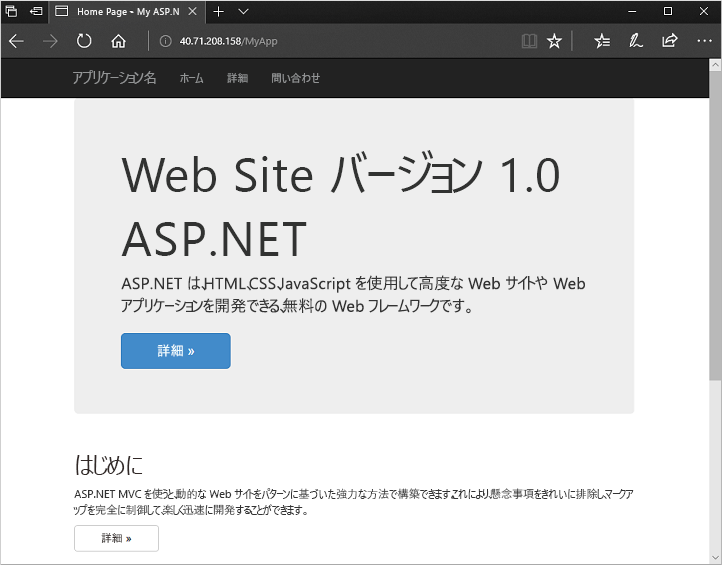

# <a name="quickstart-create-a-windows-virtual-machine-scale-set-with-an-azure-template"></a>クイック スタート:Azure テンプレートを使用して Windows 仮想マシン スケール セットを作成する

仮想マシン スケール セットを使用すると、同一の自動スケールの仮想マシンのセットをデプロイおよび管理できます。 スケール セット内の VM の数を手動で拡張したり、CPU などのリソースの使用率、メモリの需要、またはネットワーク トラフィックに基づいて自動的にスケールする規則を定義したりすることができます。 その後、Azure ロード バランサーがトラフィックをスケール セット内の VM インスタンスに分散します。 このクイック スタートでは、Azure Resource Manager テンプレートを使用して、仮想マシン スケール セットを作成し、サンプル アプリケーションをデプロイします。

[!INCLUDE [About Azure Resource Manager](../../includes/resource-manager-quickstart-introduction.md)]

Azure サブスクリプションをお持ちでない場合は、開始する前に [無料アカウント](https://azure.microsoft.com/free/?WT.mc_id=A261C142F) を作成してください。

## <a name="prerequisites"></a>前提条件

[なし] :

## <a name="create-a-scale-set"></a>スケール セットを作成する

Azure Resource Manager テンプレートを使用して、関連するリソースのグループをデプロイできます。 1 つのテンプレートで、仮想マシン スケール セットの作成、アプリケーションのインストール、および自動スケール ルールの構成を実行できます。 変数やパラメーターを使用してこのテンプレートを再利用することで、既存のスケール セットを更新したり、追加のスケール セットを作成したりできます。 テンプレートは、Azure portal、Azure CLI、Azure PowerShell、継続的インテグレーション/継続的デリバリー (CI/CD) パイプラインからデプロイすることができます。

### <a name="review-the-template"></a>テンプレートを確認する

このクイック スタートで使用されるテンプレートは [Azure クイック スタート テンプレート](https://azure.microsoft.com/resources/templates/201-vmss-windows-webapp-dsc-autoscale/)からのものです。

:::code language="json" source="~/quickstart-templates/201-vmss-windows-webapp-dsc-autoscale/azuredeploy.json" range="1-397" highlight="236-325":::

テンプレートでは、次のリソースが定義されています。

- [**Microsoft.Network/virtualNetworks**](/azure/templates/microsoft.network/virtualnetworks)
- [**Microsoft.Network/publicIPAddresses**](/azure/templates/microsoft.network/publicipaddresses)
- [**Microsoft.Network/loadBalancers**](/azure/templates/microsoft.network/loadbalancers)
- [**Microsoft.Compute/virtualMachineScaleSets**](/azure/templates/microsoft.compute/virtualmachinescalesets)
- [**Microsoft.Insights/autoscaleSettings**](/azure/templates/microsoft.insights/autoscalesettings)

#### <a name="define-a-scale-set"></a>スケール セットを定義する

強調表示されている部分が、スケール セット リソースの定義です。 テンプレートを使用してスケールを作成するには、適切なリソースを定義します。 仮想マシン スケール セットのリソースの種類のコア部分は次のとおりです。

| プロパティ                     | プロパティの説明                                  | テンプレート値の例                    |
|------------------------------|----------------------------------------------------------|-------------------------------------------|
| type                         | 作成する Azure リソースの種類                            | Microsoft.Compute/virtualMachineScaleSets |
| name                         | スケール セットの名前                                       | myScaleSet                                |
| location                     | スケール セットを作成する場所                     | 米国東部                                   |
| sku.name                     | 各スケール セット インスタンスの VM サイズ                  | Standard_A1                               |
| sku.capacity                 | 最初に作成する VM インスタンスの数           | 2                                         |
| upgradePolicy.mode           | 変更が発生した場合の VM インスタンスのアップグレード モード              | 自動                                 |
| imageReference               | VM インスタンスに使用するプラットフォームまたはカスタム イメージ | Microsoft Windows Server 2016 Datacenter  |
| osProfile.computerNamePrefix | 各 VM インスタンス名のプレフィックス                     | myvmss                                    |
| osProfile.adminUsername      | 各 VM インスタンスのユーザー名                        | azureuser                                 |
| osProfile.adminPassword      | 各 VM インスタンスのパスワード                        | P@ssw0rd!                                 |

スケール セット テンプレートをカスタマイズするために、VM サイズや初期容量を変更することができます。 また、別のプラットフォームやカスタム イメージを使用することもできます。

#### <a name="add-a-sample-application"></a>サンプル アプリケーションを追加する

スケール セットをテストするには、基本的な Web アプリケーションをインストールします。 スケール セットをデプロイするとき、VM 拡張機能によって、デプロイ後の構成とオートメーション タスク (アプリのインストールなど) を提供できます。 スクリプトは、Azure ストレージや GitHub からダウンロードできます。また、拡張機能の実行時に Azure Portal に提供することもできます。 拡張機能をスケール セットに適用するには、上記のリソース例に *extensionProfile* セクションを追加します。 拡張機能プロファイルは、通常、次のプロパティを定義します。

- 拡張機能の種類
- 拡張機能の発行元
- 拡張機能のバージョン
- 構成またはインストール スクリプトの場所
- VM インスタンスで実行するコマンド

テンプレートでは、PowerShell DSC 拡張機能を使用して、IIS で実行される ASP.NET MVC アプリをインストールします。

インストール スクリプトは、GitHub からダウンロードされます。これは *url* として定義されます。 次に、拡張機能は、*IISInstall.ps1* スクリプトの *InstallIIS* を実行します。これらは *Script*と *function* として定義されます。 ASP.NET アプリ自体は Web 配置パッケージとして提供され、GitHub からダウンロードされます。これは、*WebDeployPackagePath* として定義されます。

## <a name="deploy-the-template"></a>テンプレートのデプロイ

テンプレートは、 **[Deploy to Azure]\(Azure へのデプロイ\)** ボタンを選択することでデプロイできます。 このボタンは、Azure ポータルを開き、完全なテンプレートを読み込み、スケール セットの名前、インスタンス数、管理者の資格情報などのいくつかのパラメーターの入力を求めます。

[](https://portal.azure.com/#create/Microsoft.Template/uri/https%3A%2F%2Fraw.githubusercontent.com%2FAzure%2Fazure-quickstart-templates%2Fmaster%2F201-vmss-windows-webapp-dsc-autoscale%2Fazuredeploy.json)

Resource Manager テンプレートは、Azure PowerShell を使用してデプロイすることもできます。

```azurepowershell-interactive
# Create a resource group
New-AzResourceGroup -Name myResourceGroup -Location EastUS

# Deploy template into resource group
New-AzResourceGroupDeployment `
    -ResourceGroupName myResourceGroup `
    -TemplateURI https://raw.githubusercontent.com/Azure/azure-quickstart-templates/master/201-vmss-windows-webapp-dsc-autoscale/azuredeploy.json

# Update the scale set and apply the extension
Update-AzVmss `
    -ResourceGroupName myResourceGroup `
    -VmScaleSetName myVMSS `
    -VirtualMachineScaleSet $vmssConfig
```

プロンプトに応答して、VM インスタンスのスケール セットの名前と管理者の資格情報を指定します。 スケール セットが作成され、拡張機能を適用してアプリを構成するのに 10 ～ 15 分かかる可能性があります。

## <a name="test-the-deployment"></a>展開をテスト

動作中のスケール セットを表示するには、Web ブラウザーでサンプル Web アプリケーションにアクセスします。 次のように [Get-AzPublicIpAddress](/powershell/module/az.network/get-azpublicipaddress) を使用して、ロード バランサーのパブリック IP アドレスを取得します。

```azurepowershell-interactive
Get-AzPublicIpAddress -ResourceGroupName myResourceGroup | Select IpAddress
```

ロード バランサーのパブリック IP アドレスを *http:\//publicIpAddress/MyApp* 形式で Web ブラウザーに入力します。 ロード バランサーは、次の例に示すように、VM インスタンスのいずれかにトラフィックを配分します。



## <a name="clean-up-resources"></a>リソースをクリーンアップする

必要がなくなったら、[Remove-AzResourceGroup](/powershell/module/az.resources/remove-azresourcegroup) を使用して、リソース グループ、スケール セットを削除できます。 `-Force` パラメーターは、追加のプロンプトを表示せずにリソースの削除を確定します。 `-AsJob` パラメーターは、操作の完了を待たずにプロンプトに制御を戻します。

```azurepowershell-interactive
Remove-AzResourceGroup -Name "myResourceGroup" -Force -AsJob
```

## <a name="next-steps"></a>次のステップ

このクイック スタートでは、Azure テンプレートを使用して Windows スケール セットを作成し、PowerShell DSC 拡張機能を使用して基本的な ASP.NET アプリを VM インスタンスにインストールしました。 さらに学習するには、Azure 仮想マシン スケール セットを作成および管理する方法についてのチュートリアルに進んでください。

> [!div class="nextstepaction"]
> [Azure 仮想マシン スケール セットの作成と管理](tutorial-create-and-manage-powershell.md)
