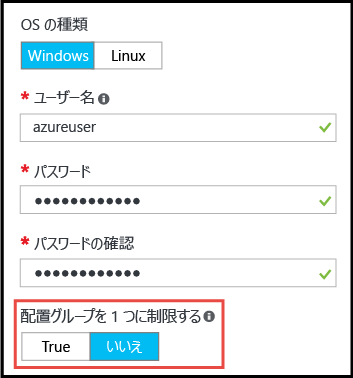

# <a name="working-with-large-virtual-machine-scale-sets"></a>大規模な仮想マシン スケール セットの使用
現在、最大 1,000 個の VM を容量とした Azure [仮想マシン スケール セット](/azure/virtual-machine-scale-sets/)を作成できるようになりました。 このドキュメントの "_大規模な仮想マシン スケール セット_" は、100 個を超える VM にスケーリングできるスケール セットとして定義されています。 この機能はスケール セット プロパティで設定されています (_singlePlacementGroup=False_)。 

大規模なスケール セットのある部分 (負荷分散や障害ドメインなど) の動作は、標準的なスケール セットとは異なります。 このドキュメントでは、大規模なスケール セットの特性を説明するほか、アプリケーションでこれらをうまく使用するために知っておくべきことについても説明します。 

クラウド インフラストラクチャの大規模なデプロイでは、一般的な手法として一連の "_スケール ユニット_" を作成します。たとえば、複数の VNET やストレージ アカウントに複数の VM のスケール セットを作成します。 この手法では、単一の VM に比べて管理が容易になります。また、複数のスケール ユニットは、多くのアプリケーション、特に、他のスタック可能なコンポーネント (複数の仮想ネットワークやエンドポイントなど) を必要とするアプリケーションに役立ちます。 ただし、アプリケーションに 1 つの大規模クラスターが必要な場合は、最大 1,000 個の VM で構成される 1 つのスケール セットをデプロイすることがより簡単になります。 シナリオの例には、一元化されたビッグ データのデプロイや、ワーカー ノードの大規模なプールのシンプルな管理を必要とするコンピューティング グリッドが含まれます。 大規模なスケール セットは、VM スケール セットの[接続されたデータ ディスク](virtual-machine-scale-sets-attached-disks.md)と組み合わせて使用すると、数千のコアとペタバイト規模のストレージで構成されているスケーラブルなインフラストラクチャを&1; 回の操作でデプロイできます。

## <a name="placement-groups"></a>配置グループ 
"_大規模な_" スケール セットを特別なものにするのは、VM の数ではなく、それに含まれる "_配置グループ_" の数です。 配置グループは、Azure 可用性セットに似た構造で、独自の障害ドメインとアップグレード ドメインが備わっています。 既定では、スケール セットは、最大サイズが 100 個の VM である 1 つの配置グループで構成されます。 _singlePlacementGroup_ というスケール セット プロパティが _false_ に設定されている場合、そのスケール セットは、複数の配置グループで構成することができ、0 ～ 1,000 個の VM が含まれます。 既定値の _true_ に設定されている場合、スケール セットは 1 つの配置グループで構成され、0 ～ 100 個の VM が含まれます。

## <a name="checklist-for-using-large-scale-sets"></a>大規模なスケール セットを使用するためのチェックリスト
アプリケーションで大規模なスケール セットを効率的に使用できるかどうかを判断するには、次の要件を検討してください。

- 大規模なスケール セットには、Azure Managed Disks が必要です。 Managed Disks を使用して作成されていないスケール セットには、複数のストレージ アカウントが必要です (VM 20 個につき 1 つ)。 大規模なスケール セットは、ストレージの管理オーバーヘッドを軽減し、サブスクリプションのストレージ アカウントの上限に達するリスクを回避するために、Managed Disks のみで動作するように設計されています。 Managed Disks を使用しない場合、スケール セットは 100 個の VM に制限されます。
- Azure Marketplace イメージから作成されたスケール セットは、最大 1,000 個の VM にスケールアップできます。
- カスタム イメージ (自身で作成してアップロードした VM イメージ) から作成されたスケール セットは、現在、最大 100 個の VM にスケールアップできます。
- Azure Load Balancer によるレイヤー&4; の負荷分散は、複数の配置グループで構成されたスケール セットではまだサポートされていません。 Azure Load Balancer を使用する必要がある場合は、スケール セットが&1; つの配置グループを使用するよう構成されていることを確認してください。これは既定の設定です。
- Azure Application Gateway によるレイヤー&7; の負荷分散は、すべてのスケール セットでサポートされています。
- 1 つのスケール セットは&1; つのサブネットで定義されます。サブネットには、必要なすべての VM にとって十分な規模のアドレス空間があることを確認してください。 既定では、スケール セットはオーバープロビジョニングされ (デプロイ時またはスケールアウト時に追加の VM が作成されますが、これについては課金されません)、デプロイの信頼性とパフォーマンスが向上します。 スケールする予定の VM の数よりもアドレス空間が 20% 大きくなることを考慮に入れておいてください。
- 多数の VM をデプロイする予定の場合は、コンピューティング コアのクォータ制限の引き上げが必要になることがあります。
- 配置グループ内で一貫性があるのは、障害ドメインとアップグレード ドメインのみです。 VM が個別の物理ハードウェアで均等に分散されているため、このアーキテクチャでは、スケール セットの全体的な可用性が変更されることはありません。ただし、これは、2 つの VM が異なるハードウェア上にあることを保証する必要がある場合、これらの VM が同じ配置グループ内の別々の障害ドメインに配置されるようにすることを意味します。 障害ドメインと配置グループ ID は、スケール セット VM の "_インスタンス ビュー_" に表示されます。 スケール セット VM のインスタンス ビューは、[Azure リソース エクスプローラー](https://resources.azure.com/)で表示できます。


## <a name="creating-a-large-scale-set"></a>大規模なスケール セットを作成する
Azure Portal でスケール セットを作成するときに、複数の配置グループへのスケールを許可することができます。これには、_[基本]_ ブレードの _[Limit to a single placement group (1 つの配置グループに制限する)]_ オプションを _[False]_ に設定します。 このオプションが _[False]_ に設定されていると、"_インスタンス数_" の値を最大 1,000 に指定することができます。



大規模な VM スケール セットは、[Azure CLI](https://github.com/Azure/azure-cli) の _az vmss create_ コマンドを使用して作成できます。 このコマンドを実行すると、_instance-count_ 引数に基づいて、サブネット サイズなど、インテリジェントな既定値が設定されます。

```bash
az group create -l southcentralus -n biginfra
az vmss create -g biginfra -n bigvmss --image ubuntults --instance-count 1000
```
_vmss create_ コマンドでは、構成値を指定しない場合に既定で特定の構成値が使用されます。 上書きできる使用可能なオプションを表示するには、次のように入力します。
```bash
az vmss create --help
```

Azure Resource Manager テンプレートを構成して大規模なスケール セットを作成している場合、このテンプレートによって Azure Managed Disks に基づいたスケール セットが作成されることを確認してください。 _Microsoft.Compute/virtualMAchineScaleSets_ リソースの _properties_ セクションで、_singlePlacementGroup_ プロパティを _false_ に設定できます。 次の JSON フラグメントは、スケール セット テンプレートの先頭部分を示しています。これには、VM 容量が 1,000 であることと _"singlePlacementGroup" : false_ 設定が含まれています。
```json
{
  "type": "Microsoft.Compute/virtualMachineScaleSets",
  "location": "australiaeast",
  "name": "bigvmss",
  "sku": {
    "name": "Standard_DS1_v2",
    "tier": "Standard",
    "capacity": 1000
  },
  "properties": {
    "singlePlacementGroup": false,
    "upgradePolicy": {
      "mode": "Automatic"
    }
```
大規模なスケール セット テンプレートの完全な例については、[https://github.com/gbowerman/azure-myriad/blob/master/bigtest/bigbottle.json](https://github.com/gbowerman/azure-myriad/blob/master/bigtest/bigbottle.json) を参照してください。

## <a name="converting-an-existing-scale-set-to-span-multiple-placement-groups"></a>複数の配置グループをまたぐように既存のスケール セットを変換する
既存の VM スケール セットで 100 個を超える VM にスケールできるようにするには、スケール セット モデルで _singplePlacementGroup_ プロパティを _false_ に変更する必要があります。 このプロパティの変更は、[Azure リソース エクスプローラー](https://resources.azure.com/)を使用してテストできます。 既存のスケール セットを探し、_[編集]_ を選択して、_singlePlacementGroup_ プロパティを変更します。 このプロパティが表示されていない場合は、スケール セットの表示に以前のバージョンの Microsoft.Compute API を使用している可能性があります。

>[!NOTE] 
スケール セットは、1 つの配置グループのみのサポート (既定の動作) から複数の配置グループのサポートに変更できますが、その逆の変換を行うことはできません。 そのため、変換する前に、大規模なスケール セットのプロパティを理解しておく必要があります。 特に、Azure Load Balancer によるレイヤー&4; の負荷分散は不要であることを確認してください。

## <a name="additional-notes"></a>その他のメモ
大規模なスケール セット、データ ディスクが接続されたスケール セット、Azure Managed Disks のサポートは、Microsoft.Compute API の [_2016-04-30-preview_](https://github.com/Azure/azure-rest-api-specs/blob/master/arm-compute/2016-04-30-preview/swagger/compute.json) バージョンに追加されました。 このバージョン以降の API で構築された任意の SDK またはコマンドライン ツールを使用できます。


<!--HONumber=Feb17_HO2-->


