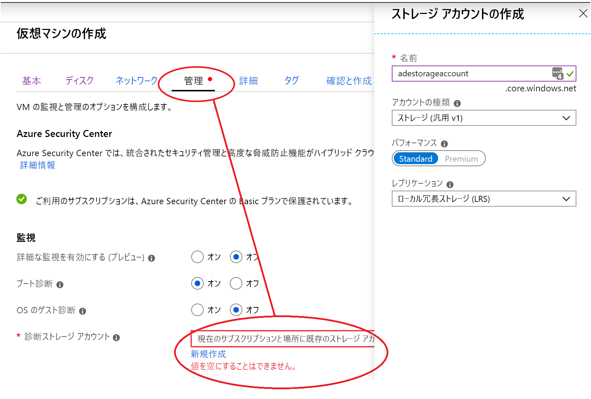
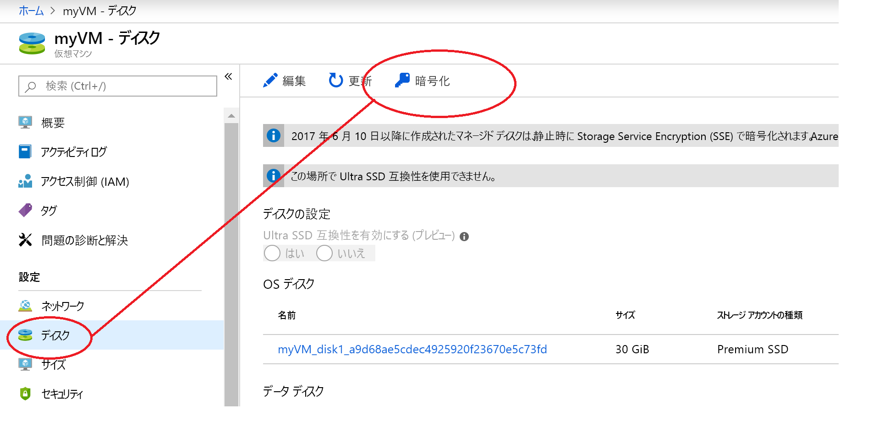
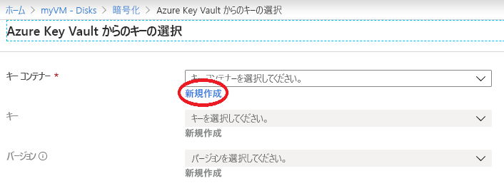
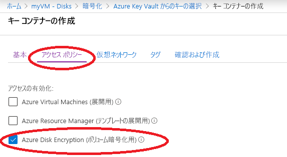

# クイック スタート:Azure portal を使用して仮想マシンを作成、暗号化する

Azure 仮想マシン (VM) は、Azure portal で作成できます。 Azure portal では、ブラウザー ベースのユーザー インターフェイスを使用して、VM とその関連リソースを作成できます。 このクイックスタートでは、Ubuntu 18.04 LTS を実行する Linux 仮想マシン (VM) のデプロイと、暗号化キーを格納するためのキー コンテナーの作成、VM の暗号化を Azure portal を使用して行います。

Azure サブスクリプションをお持ちでない場合は、開始する前に [無料アカウント](https://azure.microsoft.com/free/?WT.mc_id=A261C142F) を作成してください。

## Azure へのサインイン

[Azure portal](https://portal.azure.com) にサインインします。

## 仮想マシンの作成

1. Azure portal の左上隅にある **[リソースの作成]** を選択します。
1. [新規] ページの [人気順] で、 **[Ubuntu Server 18.04 LTS]** を選択します。
1. **[基本]** タブの **[プロジェクトの詳細]** で、正しいサブスクリプションが選択されていることを確認します。
1. **[リソース グループ]** で、先ほどキー コンテナーを作成するときに作成したリソース グループを選択します (例: **myResourceGroup**)。
1. **[仮想マシン名]** に「*MyVM*」と入力します。
1. **[リージョン]** で、先ほどキー コンテナーを作成するときに使用したものと同じリージョンを選択します (例: **米国東部**)。
1. **[サイズ]** が *[Standard D2s v3]* になっていることを確認します。
1. **[管理者アカウント]** で **[パスワード]** を選択します。 ユーザー名とパスワードを入力します。
    
1. [管理] タブを選択し、[診断ストレージ アカウント] が存在することを確認します。 ストレージ アカウントがない場合は、[新規作成] を選択して新しいアカウントに名前を付け、[OK] を選択します。
1. [Review + Create]\(レビュー + 作成\) をクリックします。
1. **[仮想マシンの作成]** ページで、これから作成しようとしている VM の詳細を確認できます。 準備ができたら **[作成]** を選択します。

VM がデプロイされるまでに数分かかります。 デプロイが完了したら、次のセクションに移動してください。

## 仮想マシンを暗号化する

1. VM のデプロイが完了したら、 **[リソースに移動]** を選択します。
1. 左側のサイド バーで **[ディスク]** を選択します。
1. [ディスク] 画面で **[暗号化]** を選択します。 

    

1. 暗号化画面の **[Disks to encrypt]\(暗号化するディスク\)** で **[OS とデータ ディスク]** を選択します。
1. **[暗号化設定]** の **[暗号化用のキー コンテナーとキーを選択する]** を選択します。
1. **[Azure Key Vault からのキーの選択]** 画面で **[新規作成]** を選択します。

    

1. **[キー コンテナーの作成]** 画面で、[リソース グループ] が VM の作成に使用したものと同じであることを確認します。
1. キー コンテナーに名前を付けます。  すべてのキー コンテナーに Azure 全体で一意の名前を付ける必要があります。
1. **[アクセス ポリシー]** タブで、 **[Azure Disk Encryption (ボリューム暗号化用)]** チェック ボックスをオンにします。

    

1. **[Review + create]\(レビュー + 作成\)** を選択します。  
1. キー コンテナーが検証を通過した後、 **[作成]** を選択します。 **[Azure Key Vault からのキーの選択]** 画面が再度表示されます。
1. **[キー]** フィールドは空白のままにして、 **[選択]** を選択します。
1. 暗号化画面の上部の **[保存]** をクリックします。 VM が再起動されることを示す警告がポップアップ表示されます。 **[はい]** をクリックします。

## リソースをクリーンアップする

必要がなくなったら、リソース グループ、仮想マシン、およびすべての関連リソースを削除できます。 これを行うには、仮想マシンのリソース グループを選択し、[削除] を選択した後、削除するリソース グループの名前を確認します。

## 次のステップ

このクイックスタートでは、暗号化キーに使用できるキー コンテナーを作成し、仮想マシンを作成して、その暗号化を有効にしました。  

> [!div class="nextstepaction"]
> [Azure Disk Encryption の概要](disk-encryption-overview.md)
