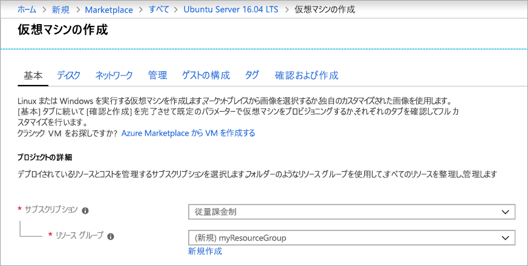
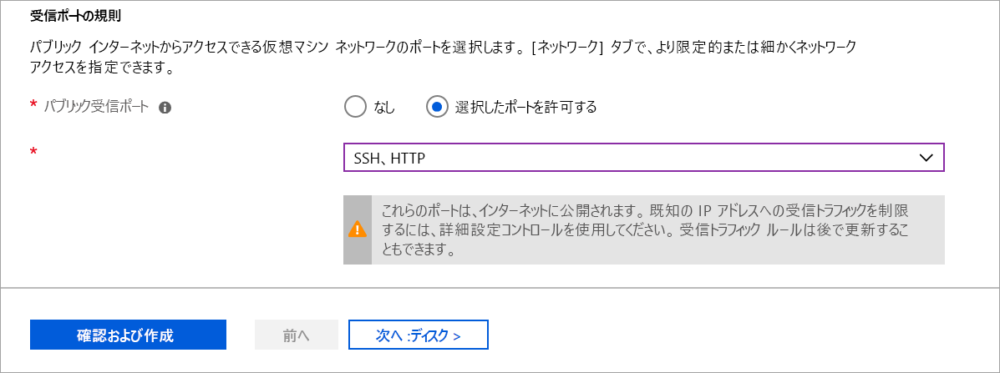

# <a name="quickstart-create-a-linux-virtual-machine-in-the-azure-portal"></a>クイック スタート:Azure portal で Linux 仮想マシンを作成する

Azure 仮想マシン (VM) は、Azure portal で作成できます。 Azure portal では、ブラウザー ベースのユーザー インターフェイスを使用して、VM とその関連リソースを作成できます。 このクイック スタートでは、Azure portal を使用して、Ubuntu 16.04 LTS を実行する Linux 仮想マシン (VM) をデプロイする方法を示します。 また、VM の動作を確認するために、VM に SSH 接続し、NGINX Web サーバーをインストールします。

Azure サブスクリプションをお持ちでない場合は、開始する前に [無料アカウント](https://azure.microsoft.com/free/?WT.mc_id=A261C142F) を作成してください。

## <a name="create-ssh-key-pair"></a>SSH キー ペアの作成

このクイック スタートを完了するには、SSH キー ペアが必要です。 既存の SSH キーの組がある場合は、この手順をスキップできます。

Bash シェルを開き、[ssh-keygen](https://www.ssh.com/ssh/keygen/) を使用して SSH キー ペアを作成します。 Bash シェルがローカル コンピューターにない場合は、[Azure Cloud Shell](https://shell.azure.com/bash) を使用してください。  

```bash
ssh-keygen -t rsa -b 2048
```

上のコマンドは、公開キーと秘密キーを既定の名前 (`id_rsa`) で `~/.ssh directory` に生成します。 このコマンドからは、公開キーの完全パスが返されます。 `cat` に公開キーのパスを指定すれば、その内容が表示されます。

```bash 
cat ~/.ssh/id_rsa.pub
```

このコマンドの出力結果を保存します。 VM にログインするための管理者アカウントを構成する際に必要となります。

PuTTy の使用を含む SSH キー ペアの作成方法の詳細については、[Windows で SSH キーを使用する方法](ssh-from-windows.md)に関するページを参照してください。

Cloud Shell を使用して SSH キーの組を作成した場合、[Cloud Shell により自動的にマウントされる](https://docs.microsoft.com/azure/cloud-shell/persisting-shell-storage) Azure ファイル共有にキー ペアが格納されます。 キーを取得するまでは、このファイル共有またはストレージ アカウントを削除しないでください。削除すると、VM にアクセスできなくなります。 

## <a name="sign-in-to-azure"></a>Azure へのサインイン

[Azure Portal](https://portal.azure.com) にサインインします。

## <a name="create-virtual-machine"></a>仮想マシンの作成

1. Azure portal の左上隅にある **[リソースの作成]** を選択します。

1. Azure Marketplace リソースの一覧の上にある検索ボックスで Canonical の **Ubuntu Server 16.04 LTS** を検索して選択し、 **[作成]** を選択します。

1. **[基本]** タブの **[Project details] (プロジェクトの詳細)** で、正しいサブスクリプションが選択されていることを確認し、 **[リソース グループ]** で **[新規作成]** を選択します。 ポップアップで、リソース グループの名前として「*myResourceGroup*」と入力し、 **[OK]** を選択します。 

    

1. **[Instance details] (インスタンスの詳細)** で、 **[仮想マシン名]** として「*myVM*」と入力し、 **[リージョン]** として *[米国東部]* を選択します。 他の既定値はそのままにします。

    ![[Instance details] (インスタンスの詳細) セクション](./media/quick-create-portal/instance-details.png)

1. **[Administrator account] (管理者アカウント)** で、 **[SSH Public Key] (SSH 公開キー)** を選択し、ユーザー名を入力して公開キーをテキスト ボックスに貼り付けます。 公開キーの先頭または末尾の空白はすべて削除します。

    ![[Administrator account] (管理者アカウント)](./media/quick-create-portal/administrator-account.png)

1. **[受信ポートの規則]**  >  **[Public inbound ports] (パブリック受信ポート)** で、 **[Allow selected ports] (選択されたポートを許可する)** を選択してから、ドロップダウンから **[SSH (22)]** と **[HTTP (80)]** を選択します。 

    

1. 残りの既定値はそのままにして、ページの一番下にある **[Review + create] (確認および作成)** ボタンを選択します。

1. **[仮想マシンの作成]** ページで、これから作成しようとしている VM の詳細を確認できます。 準備ができたら **[作成]** を選択します。

VM がデプロイされるまでに数分かかります。 デプロイが完了したら、次のセクションに移動してください。

    
## <a name="connect-to-virtual-machine"></a>仮想マシンへの接続

VM との SSH 接続を作成します。

1. VM の概要ページの **[接続]** ボタンを選択します。 

    

2. **[Connect to virtual machine]\(仮想マシンへの接続\)** ページで、ポート 22 を介して IP アドレスで接続する既定のオプションをそのまま使用します。 **[VM ローカル アカウントを使用してログインする]** に、接続コマンドが表示されます。 ボタンをクリックしてこのコマンドをコピーします。 SSH 接続コマンドの例を次に示します。

    ```bash
    ssh azureuser@10.111.12.123
    ```

3. SSH キーの組を作成したときと同じ Bash シェル ([Azure Cloud Shell](https://shell.azure.com/bash) またはローカルの Bash シェルなど) を使用して、SSH 接続コマンドをシェルに貼り付け、SSH セッションを作成します。 

## <a name="install-web-server"></a>Web サーバーのインストール

VM の動作を確認するために、NGINX Web サーバーをインストールします。 SSH セッションからパッケージ ソースを更新し、最新の NGINX パッケージをインストールします。

```bash
sudo apt-get -y update
sudo apt-get -y install nginx
```

完了したら、`exit` と入力して SSH セッションを終了します。


## <a name="view-the-web-server-in-action"></a>動作中の Web サーバーを表示する

任意の Web ブラウザーを使用して、NGINX の既定のウェルカム ページを表示します。 Web アドレスとして、VM のパブリック IP アドレスを入力します。 パブリック IP アドレスは、VM の概要ページで確認できるほか、先ほど使用した SSH 接続文字列にも含まれています。


## <a name="clean-up-resources"></a>リソースのクリーンアップ

必要がなくなったら、リソース グループ、仮想マシン、およびすべての関連リソースを削除できます。 これを行うには、仮想マシンのリソース グループを選択し、 **[削除]** を選択して、削除するリソース グループの名前を確認します。

## <a name="next-steps"></a>次の手順

このクイック スタートでは、単純な仮想マシンをデプロイし、ネットワーク セキュリティ グループと規則を作成し、基本的な Web サーバーをインストールしました。 Azure 仮想マシンの詳細については、Linux VM のチュートリアルを参照してください。

> [!div class="nextstepaction"]
> [Azure Linux 仮想マシンのチュートリアル](./tutorial-manage-vm.md)
