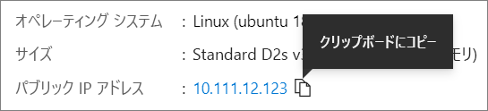

# <a name="quickstart-create-a-linux-virtual-machine-in-the-azure-portal"></a>クイック スタート:Azure portal で Linux 仮想マシンを作成する

Azure 仮想マシン (VM) は、Azure portal で作成できます。 Azure portal は、Azure リソースを作成するためのブラウザーベースのユーザー インターフェイスです。 このクイックスタートでは、Azure portal を使用して、Ubuntu 18.04 LTS を実行する Linux 仮想マシン (VM) をデプロイする方法を示します。 また、VM の動作を確認するために、VM に SSH 接続し、NGINX Web サーバーをインストールします。

Azure サブスクリプションをお持ちでない場合は、開始する前に [無料アカウント](https://azure.microsoft.com/free/?WT.mc_id=A261C142F) を作成してください。

## <a name="sign-in-to-azure"></a>Azure へのサインイン

まだの場合は [Azure portal](https://portal.azure.com) にサインインします。

## <a name="create-virtual-machine"></a>仮想マシンの作成

1. 検索に「**virtual machines**」と入力します。
1. **[サービス]** で、 **[仮想マシン]** を選択します。
1. **[仮想マシン]** ページで、 **[追加]** を選択します。 **[仮想マシンの作成]** ページが開きます。
1. **[基本]** タブの **[Project details] (プロジェクトの詳細)** で、正しいサブスクリプションが選択されていることを確認し、リソース グループの **[新規作成]** を選択します。 名前 * として「*myResourceGroup*」と入力します。 

    ![仮想マシンの Azure サブスクリプションとリソース グループを選択する場所が示されている [プロジェクトの詳細] セクションのスクリーンショット](./media/quick-create-portal/project-details.png)

1. **[インスタンスの詳細]** で、 **[仮想マシン名]** として「*myVM*」と入力し、 **[リージョン]** として *[米国東部]* を選択し、 **[イメージ]** として *[Ubuntu 18.04 LTS]* を選択します。 他の既定値はそのままにします。

    ![仮想マシンの名前を指定し、そのリージョン、イメージ、サイズを選択する [インスタンスの詳細] セクションのスクリーンショット](./media/quick-create-portal/instance-details.png)

1. **[管理者アカウント]** で **[SSH 公開キー]** を選択します。

1. **[ユーザー名]** に「*azureuser*」と入力します。

1. **[SSH public key source]\(SSH 公開キー ソース\)** では、 **[新しいキー ペアの生成]** を既定値のまま残し、 **[Key pair name]\(キー ペアの名前\)** に「*myKey*」と入力します。

    ![認証の種類を選択し、管理者の資格情報を入力する、[管理者アカウント] セクションのスクリーンショット](./media/quick-create-portal/administrator-account.png)

1. **[受信ポートの規則]**  >  **[Public inbound ports] (パブリック受信ポート)** で、 **[Allow selected ports] (選択されたポートを許可する)** を選択してから、ドロップダウンから **[SSH (22)]** と **[HTTP (80)]** を選択します。 

    ![受信接続が許可されるポートを選択する [受信ポートの規則] セクションのスクリーンショット](./media/quick-create-portal/inbound-port-rules.png)

1. 残りの既定値はそのままにして、ページの一番下にある **[Review + create] (確認および作成)** ボタンを選択します。

1. **[仮想マシンの作成]** ページで、これから作成しようとしている VM の詳細を確認できます。 準備ができたら **[作成]** を選択します。

1. **[新しいキー ペアの生成]** ウィンドウが開いたら、 **[Download private key and create resource]\(秘密キーをダウンロードし、リソースを作成する\)** を選択します。 キー ファイルは **myKey.pem** としてダウンロードされます。 `.pem` ファイルがダウンロードされた場所を必ず把握してください。そのパスが次の手順で必要になります。

1. デプロイが完了したら、 **[リソースに移動]** を選択します。

1. 新しい VM のページで、パブリック IP アドレスを選択し、それをクリップボードにコピーします。


    

## <a name="connect-to-virtual-machine"></a>仮想マシンへの接続

VM との SSH 接続を作成します。

1. Mac または Linux コンピューターを使用している場合、Bash プロンプトを開きます。 Windows コンピューターを使用している場合、PowerShell プロンプトを開きます。 

1. プロンプトで、仮想マシンへの SSH 接続を開きます。 IP アドレスをご自分の VM のものに置換し、`.pem` のパスを、キー ファイルがダウンロードされた場所に置換します。

```console
ssh -i .\Downloads\myKey1.pem azureuser@10.111.12.123
```

> [!TIP]
> 作成した SSH キーは、次回 Azure で VM を作成するときに使用できます。 次回 VM を作成するときは、 **[SSH public key source]\(SSH 公開キー ソース\)** には **[Use a key stored in Azure]\(Azure に保存されているキーを使用する\)** を選択するだけです。 お使いのコンピューターには既に秘密キーがあります。そのため、何もダウンロードする必要はありません。

## <a name="install-web-server"></a>Web サーバーのインストール

VM の動作を確認するために、NGINX Web サーバーをインストールします。 SSH セッションからパッケージ ソースを更新し、最新の NGINX パッケージをインストールします。

```bash
sudo apt-get -y update
sudo apt-get -y install nginx
```

完了したら、`exit` と入力して SSH セッションを終了します。


## <a name="view-the-web-server-in-action"></a>動作中の Web サーバーを表示する

任意の Web ブラウザーを使用して、NGINX の既定のウェルカム ページを表示します。 Web アドレスとして、VM のパブリック IP アドレスを入力します。 パブリック IP アドレスは、VM の概要ページで確認できるほか、先ほど使用した SSH 接続文字列にも含まれています。


## <a name="clean-up-resources"></a>リソースをクリーンアップする

必要がなくなったら、リソース グループ、仮想マシン、およびすべての関連リソースを削除できます。 これを行うには、仮想マシンのリソース グループを選択し、 **[削除]** を選択して、削除するリソース グループの名前を確認します。

## <a name="next-steps"></a>次のステップ

このクイック スタートでは、単純な仮想マシンをデプロイし、ネットワーク セキュリティ グループと規則を作成し、基本的な Web サーバーをインストールしました。 Azure 仮想マシンの詳細については、Linux VM のチュートリアルを参照してください。

> [!div class="nextstepaction"]
> [Azure Linux 仮想マシンのチュートリアル](./tutorial-manage-vm.md)
