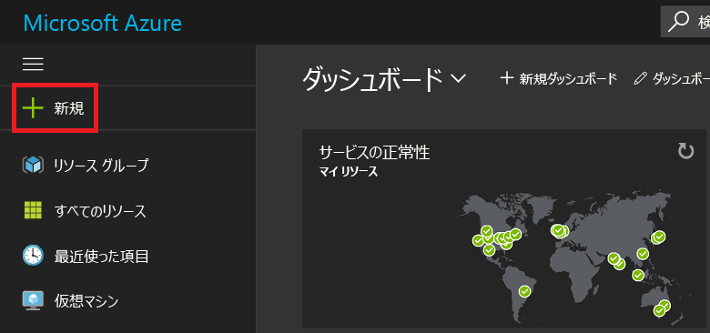
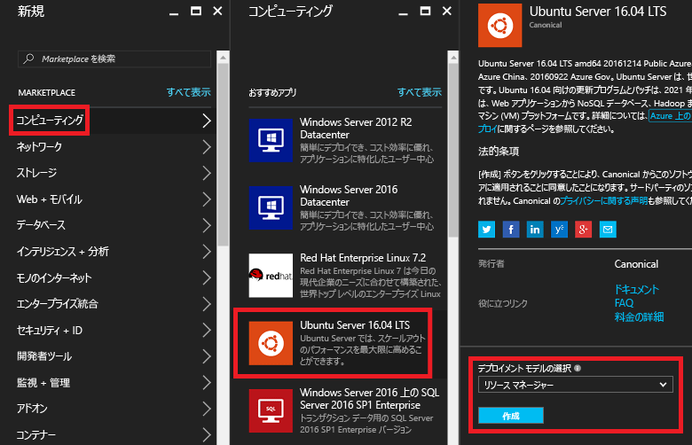
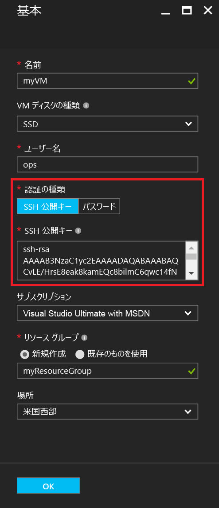
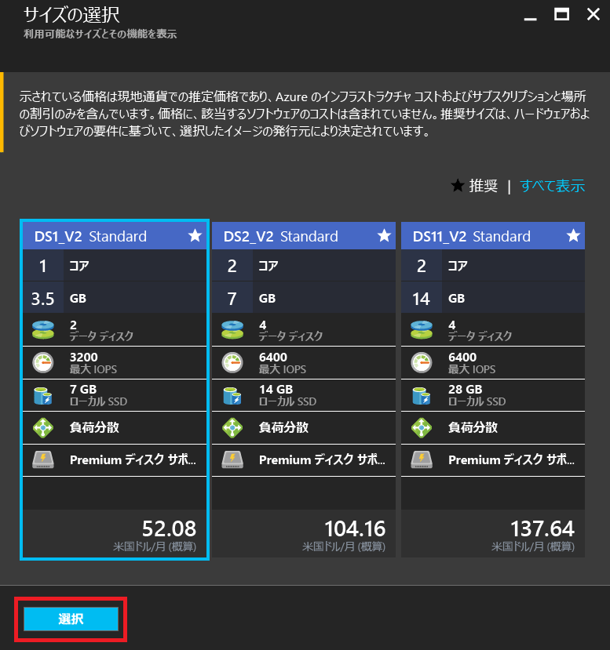
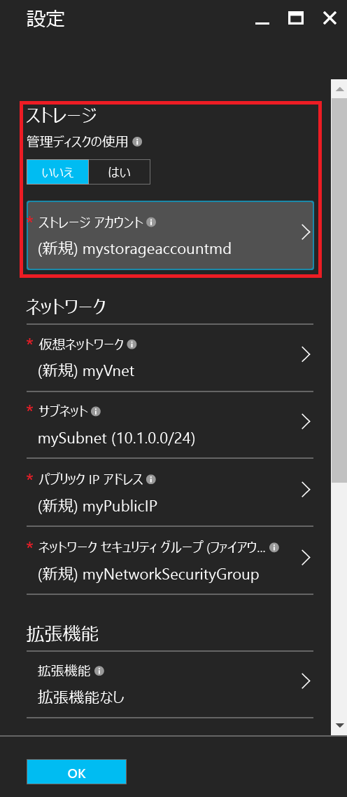
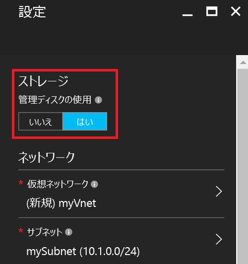
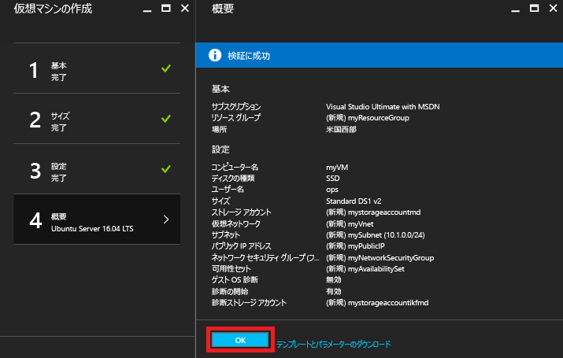
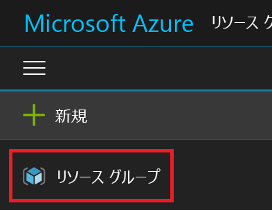
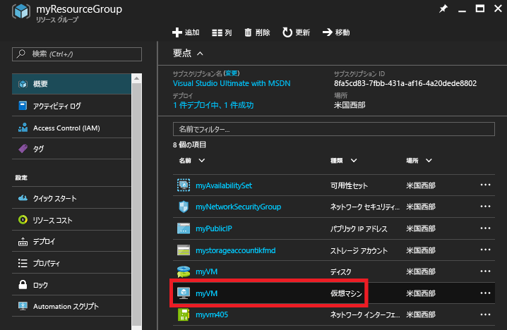
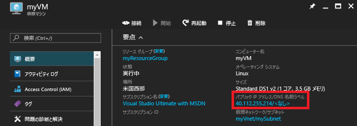

# <a name="create-a-linux-vm-on-azure-using-the-portal"></a>ポータルを使用して Azure に Linux VM を作成する
この記事では、[Azure Portal](https://portal.azure.com/) を使用して Linux 仮想マシンを作成する方法について説明します。

要件は次のとおりです。

* [Azure アカウント](https://azure.microsoft.com/pricing/free-trial/)
* [SSH パブリック キー ファイルおよびプライベート キー ファイル](virtual-machines-linux-mac-create-ssh-keys.md?toc=%2fazure%2fvirtual-machines%2flinux%2ftoc.json)

## <a name="sign-in"></a>[サインイン]
Azure アカウント ID で Azure Portal にサインインします。 左上隅にある **[+ 新規]** をクリックします。



## <a name="choose-vm"></a>VM の選択
**[Marketplace]** で **[Compute]** をクリックし、**[おすすめアプリ]** イメージ リストから **[Ubuntu Server 16.04 LTS]** を選択します。  下部でデプロイメント モデルとして `Resource Manager` が選択されていることを確認してから、 **[作成]**をクリックします。



## <a name="enter-vm-options"></a>VM オプションの入力
**[基本]** ページで、以下の項目を入力します。

* VM の名前
* VM ディスクの種類 (既定値 [SSD] または [HDD])
* 管理者ユーザーのユーザー名
* **[認証の種類]** は **[SSH 公開鍵]** に設定します
* 文字列で表された SSH 公開鍵 (`~/.ssh/` ディレクトリから取得)
* リソース グループ名 (または、既存のリソース グループを選択)

**[OK]** をクリックして続行します。 ブレードは次のスクリーンショットのようになります。



## <a name="choose-vm-size"></a>VM のサイズの選択
VM のサイズを選択します。 次の例では、Premium SSD に Ubuntu をインストールする **[DS1_V2 Standard]** を選択します。 VM のサイズの **S** は、SSD のサポートを表します。 **[選択]** をクリックして設定を構成します。



## <a name="storage-and-network"></a>ストレージとネットワーク
**[設定]** ブレードで、VM に Azure Managed Disks を使用するよう選択できます。 現在の既定の設定では、非管理対象ディスクを使用します。 Azure Managed Disks は Azure プラットフォームによって処理されるため、ディスクを格納するための準備も場所も必要ありません。 Azure Managed Disks の詳細については、「[Azure Managed Disks の概要](../storage/storage-managed-disks-overview.md)」をご覧ください。 非管理対象ディスクの場合は、仮想ハード ディスク用のストレージ アカウントを作成または選択する必要があります。



Azure Managed Disks の使用を選択した場合は、次の例に示すように、構成する追加のストレージ オプションはありません。



ネットワーク設定の残りの部分は既定値のままにします。

## <a name="confirm-vm-settings-and-launch"></a>VM 設定の確認と起動
新しい Ubuntu VM の設定を確認し、 **[OK]**をクリックします。



## <a name="select-the-vm-resource"></a>VM のリソースの選択
ポータルのホーム ページを開き、左上隅のメニューから **[リソース グループ]** を選択します。 必要な場合は、メニューの一番上にある&3; 本のバーをクリックすると、次に示すように一覧が展開されます。



リソース グループを選択し、新しい VM をクリックします。



## <a name="find-the-public-ip"></a>パブリック IP の検出
VM に割り当てられた**パブリック IP アドレス**を確認します。



## <a name="ssh-to-the-vm"></a>VM への SSH 接続
SSH 公開キーを使用して、パブリック IP に SSH 接続します。  Mac または Linux のワークステーションでは、端末から直接 SSH 接続できます。 Windows ワークステーションの場合は、Linux に SSH 接続するために、PuTTY、MobaXTerm、または Cygwin を使用する必要があります。  Windows ワークステーションで Linux に SSH 接続するための準備については、以下のドキュメントを参照してください。

[Azure 上の Windows における SSH の使用方法](virtual-machines-linux-ssh-from-windows.md?toc=%2fazure%2fvirtual-machines%2flinux%2ftoc.json)

```
ssh -i ~/.ssh/azure_id_rsa ops@40.112.255.214
```

## <a name="next-steps"></a>次のステップ
テストまたはデモンストレーション用の Linux VM を迅速に作成しました。 インフラストラクチャに合わせてカスタマイズした Linux VM を作成する方法については、次の記事を参照してください。

* [テンプレートを使用して Azure に Linux VM を作成する](virtual-machines-linux-cli-deploy-templates.md?toc=%2fazure%2fvirtual-machines%2flinux%2ftoc.json)
* [テンプレートを使用して、SSH で保護された Linux VM を Azure で作成する](virtual-machines-linux-create-ssh-secured-vm-from-template.md?toc=%2fazure%2fvirtual-machines%2flinux%2ftoc.json)
* [Azure CLI を使用して新しく Linux VM を作成する](virtual-machines-linux-create-cli-complete.md?toc=%2fazure%2fvirtual-machines%2flinux%2ftoc.json)


