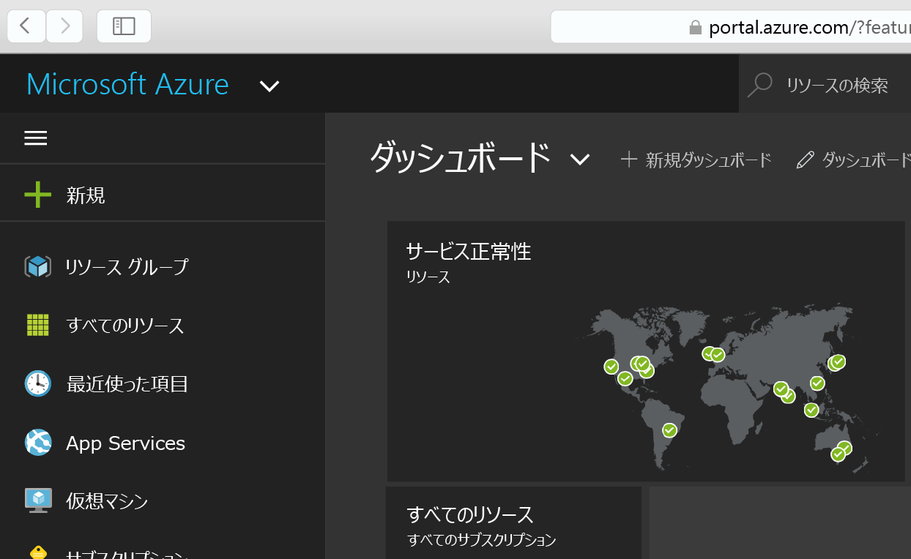
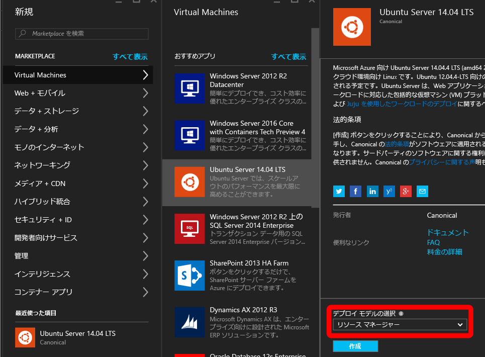
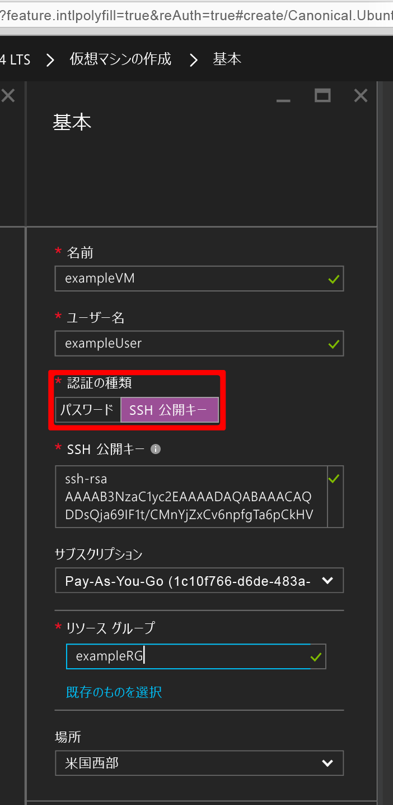
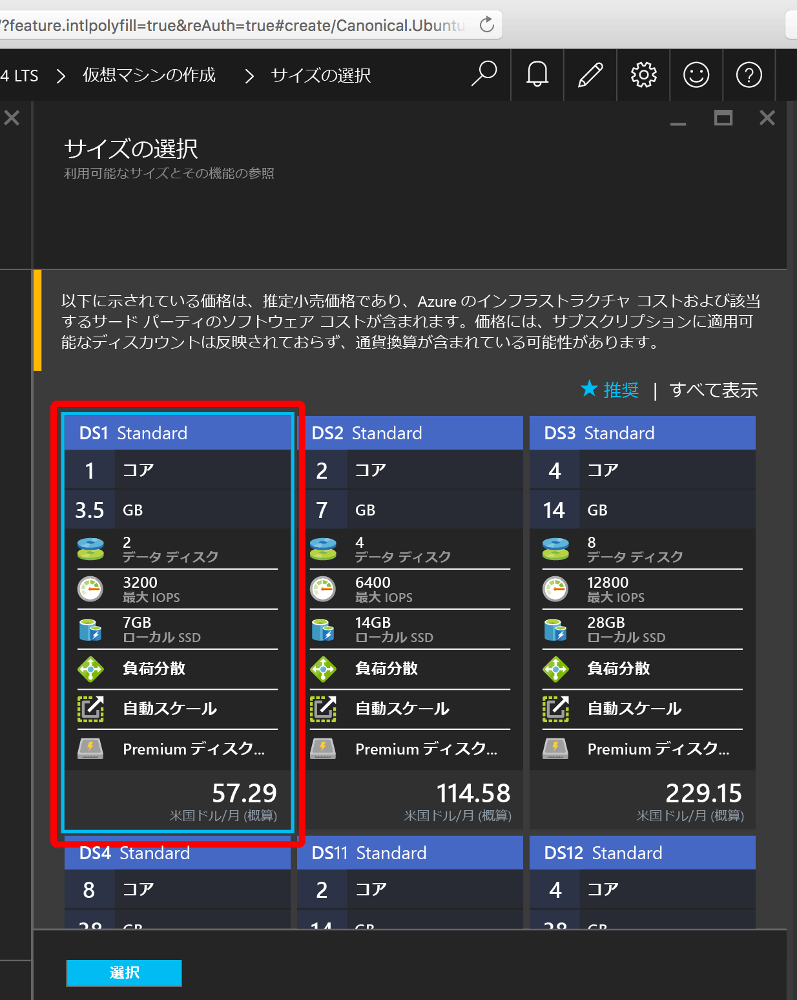
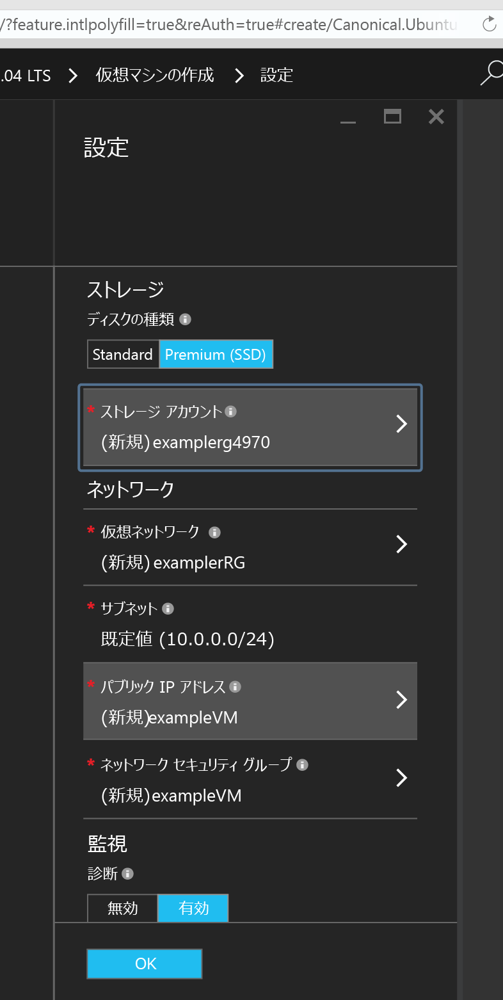
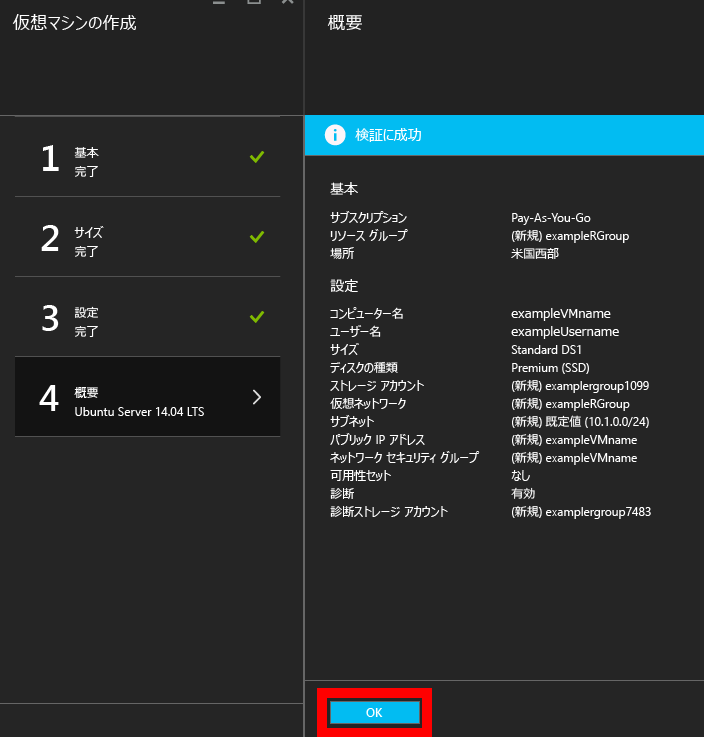
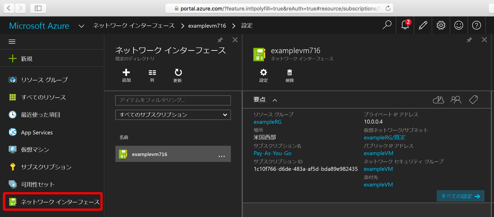
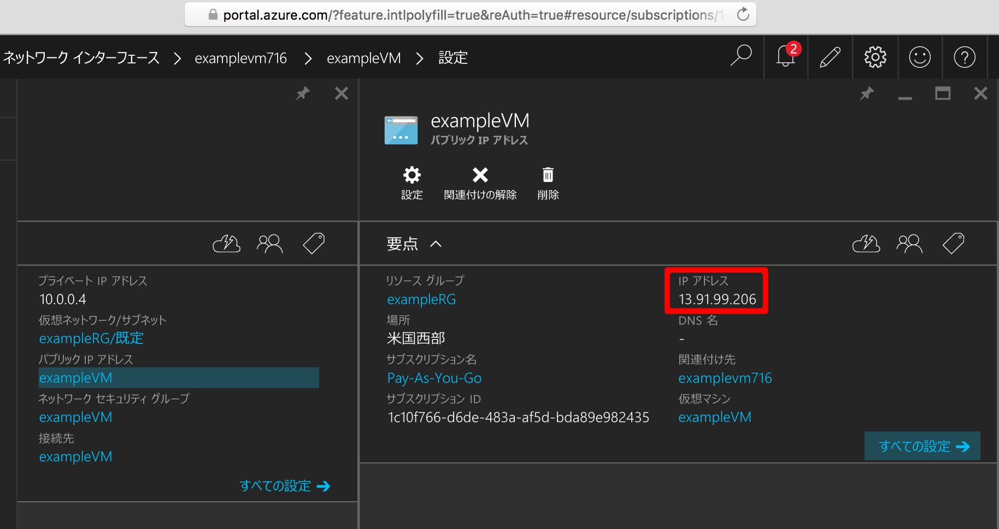

<properties
    pageTitle="Azure ポータルを使用した Linux VM の作成 | Microsoft Azure"
    description="Azure ポータルを使用して Linux VM を作成します。"
    services="virtual-machines-linux"
    documentationCenter=""
    authors="vlivech"
    manager="timlt"
    editor=""
    tags="azure-resource-manager"
/>

<tags
    ms.service="virtual-machines-linux"
    ms.workload="infrastructure-services"
    ms.tgt_pltfrm="vm-linux"
    ms.devlang="na"
    ms.topic="hero-article"
    ms.date="04/05/2016"
    ms.author="v-livech"
/>

# Azure ポータルを使用した Linux VM の作成

この記事では、[Azure ポータル](https://portal.azure.com/)を使用して、何もインストールせずに今すぐ Linux VM を作成する方法を示します。唯一の要件は、[Azure アカウント](https://azure.microsoft.com/pricing/free-trial/)および [SSH 公開キーと秘密キーのファイル](virtual-machines-linux-mac-create-ssh-keys.md)です。


1. Azure アカウント ID で Azure ポータルにサインインし、左上隅にある **[+ 新規]** をクリックします。

    

2. **[Marketplace]** で **[Virtual Machines]** をクリックし、**[おすすめアプリ]** イメージ リストから **[Ubuntu Server 14.04 LTS]** をクリックすると、以下の画面が表示されます。

    

3. 下部でデプロイ モデルとして `Resource Manager` が選択されていることを確認してから、**[作成]** をクリックします。

4. **[基本]** ページで、以下の項目を入力します。
    - VM の名前
    - 管理者ユーザーのユーザー名
    - 認証の種類 (**[SSH 公開キー]** に設定)
    - 文字列で表された SSH 公開キー (既定では、`~/.ssh/` ディレクトリから取得)
    - リソース グループ名 (新しいデプロイ グループを作成する場合)。または既存のグループを選択して、

    **[OK]** をクリックして続行し、VM サイズを選択すると、以下のように表示されます。

    

5. **[DS1]** サイズを選び (Premium SSD に Ubuntu をインストールする場合)、**[選択]** をクリックして設定を構成します。

    

6. **[設定]** の Storage と Network の値は既定値のままにし、**[OK]** をクリックして概要を表示します。

    

7. 新しい Ubuntu VM の設定を確認して、**[OK]** をクリックします。

    

8. ポータルのダッシュボードを開き、**[ネットワーク インターフェイス]** で NIC を選択します。

    

9. NIC 設定でパブリック IP アドレスのメニューを開きます。

    

10. SSH 公開キーを使用して、パブリック IP に SSH 接続します。

```
user@slackware$ ssh -i ~/.ssh/azure_id_rsa ubuntu@13.91.99.206
```

## 次のステップ

必要に応じて先に進み、[ディスクを追加](virtual-machines-linux-add-disk.md)します。

<!---HONumber=AcomDC_0413_2016-->