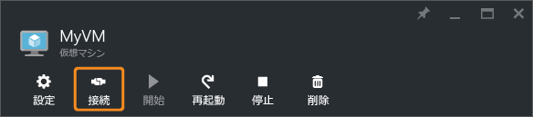

# Windows が実行されている Azure 仮想マシンに接続してログオンする方法
Azure Portal の **[接続]** ボタンを使用して、Windows デスクトップからリモート デスクトップ (RDP) セッションを開始します。 まず、仮想マシンに接続して、ログオンします。

Mac から Windows 仮想マシンに接続する場合は、[Microsoft リモート デスクトップ](https://itunes.apple.com/app/microsoft-remote-desktop/id715768417)など、Mac 用の RDP クライアントをインストールする必要があります。

## 仮想マシンへの接続
1. まだサインインしていない場合は、 [Azure ポータル](https://portal.azure.com/)にサインインします。
2. ハブ メニューで **[Virtual Machines]**をクリックします。
3. 一覧から仮想マシンを選択します。
4. 仮想マシンのブレードで、 **[接続]**をクリックします。
   
    
   
   > [!TIP]
   > ポータルの **[接続]** ボタンが淡色表示され、[Express Route](../expressroute/expressroute-introduction.md) や[サイト間 VPN 接続](../vpn-gateway/vpn-gateway-howto-site-to-site-resource-manager-portal.md)で Azure に接続されていない場合は、VM を作成してパブリック IP アドレスを割り当ててから RDP を使用する必要があります。 [Azure におけるパブリック IP アドレス](../virtual-network/virtual-network-ip-addresses-overview-arm.md)に関するページをご覧ください。
   > 
   > 

## 仮想マシンへのログオン
[!INCLUDE [virtual-machines-log-on-win-server](../../includes/virtual-machines-log-on-win-server.md)]

## 次のステップ
接続時に問題が発生した場合は、 [リモート デスクトップ接続のトラブルシューティング](virtual-machines-windows-troubleshoot-rdp-connection.md?toc=%2fazure%2fvirtual-machines%2fwindows%2ftoc.json)に関するページを参照してください。 この記事では、一般的な問題の診断と解決の手順について説明します。

