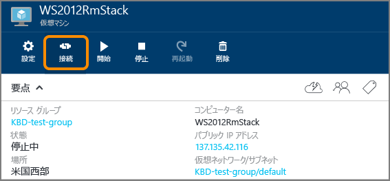

<properties
	pageTitle="Windows Server VM へのログオン | Microsoft Azure"
	description="Azure ポータルと、リソース マネージャー デプロイ モデルを使用して、Windows Server VM にログオンする方法について説明します。"
	services="virtual-machines-windows"
	documentationCenter=""
	authors="cynthn"
	manager="timlt"
	editor="tysonn"
	tags="azure-resource-manager"/>

<tags
	ms.service="virtual-machines-windows"
	ms.workload="infrastructure-services"
	ms.tgt_pltfrm="vm-windows"
	ms.devlang="na"
	ms.topic="get-started-article"
	ms.date="01/21/2016"
	ms.author="cynthn"/>

# Windows Server が実行されている仮想マシンにログオンする方法 

[AZURE.INCLUDE [learn-about-deployment-models](../../includes/learn-about-deployment-models-rm-include.md)] [classic deployment model](virtual-machines-windows-classic-connect-logon.md)

Azure ポータルの **[接続]** ボタンを使用して、リモート デスクトップ セッションを開始します まず仮想マシンに接続してからログインします。

## 仮想マシンへの接続

1. まだサインインしていない場合は、[Azure ポータル](https://portal.azure.com/)にサインインします。

2.	ハブ メニューで **[仮想マシン]** をクリックします。

3.	一覧から仮想マシンを選択します。

4. 仮想マシンのブレードで、**[接続]** をクリックします。

	

## 仮想マシンへのログオン

[AZURE.INCLUDE [virtual-machines-log-on-win-server](../../includes/virtual-machines-log-on-win-server.md)]

## トラブルシューティング

ログオンのヒントで解決できない場合、または必要な情報が掲載されていない場合は、[Windows ベースの Azure 仮想マシンへのリモート デスクトップ接続のトラブルシューティング](virtual-machines-windows-troubleshoot-rdp-connection.md)に関するページを参照してください。この記事では、一般的な問題の診断と解決の手順について説明します。

<!---HONumber=AcomDC_0323_2016-->