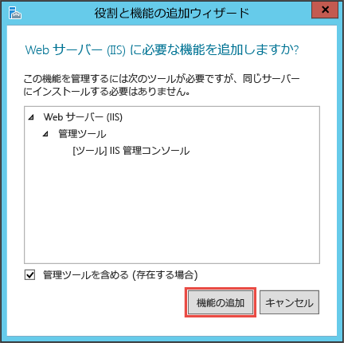
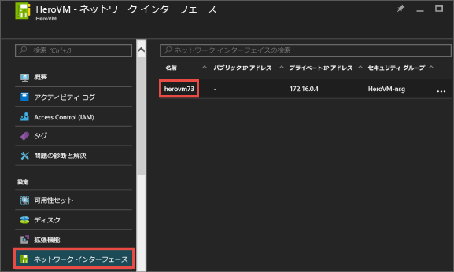
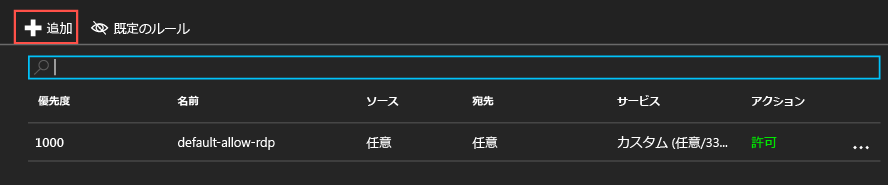
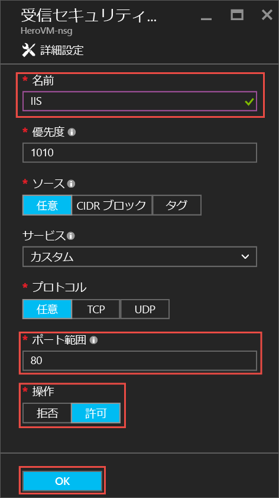
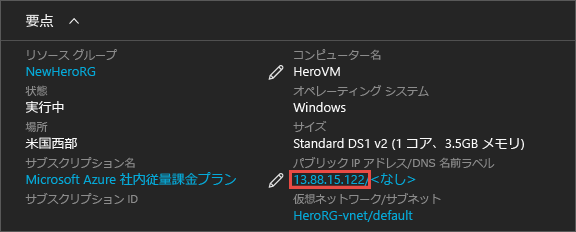
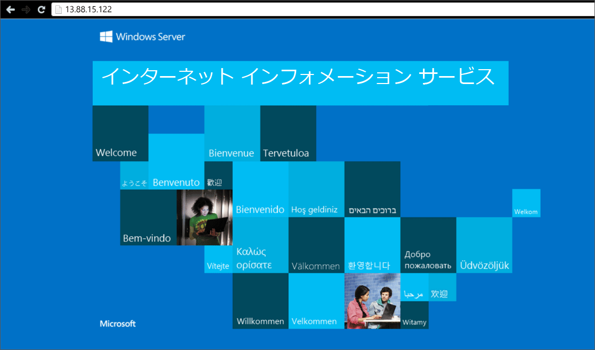

# Windows VM への役割のインストールを試してみる
最初の仮想マシン (VM) を起動して実行したら、ソフトウェアとサービスのインストールに進むことができます。 このチュートリアルでは、Windows Server VM でサーバー マネージャーを使用して IIS をインストールします。 次に、Azure Portal を使用してネットワーク セキュリティ グループ (NSG) を作成し、IIS トラフィックに対してポート 80 を開きます。 

最初の VM をまだ作成していない場合は、このチュートリアルを進める前に、「[Azure Portal で初めての Windows 仮想マシンを作成する](virtual-machines-windows-hero-tutorial.md?toc=%2fazure%2fvirtual-machines%2fwindows%2ftoc.json)」に戻ってください。

## VM が実行されていることを確認する
1. [Azure ポータル](https://portal.azure.com)を開きます。
2. ハブ メニューで **[仮想マシン]**をクリックします。 一覧から仮想マシンを選択します。
3. 状態が **[停止済み (割り当て解除)]** の場合は、VM の **[要点]** ブレードで **[開始]** ボタンをクリックします。 状態が **[実行中]**の場合は、次の手順に進むことができます。

## 仮想マシンに接続してサインインする
1. ハブ メニューで **[仮想マシン]**をクリックします。 一覧から仮想マシンを選択します。
2. 仮想マシンのブレードで、 **[接続]**をクリックします。 リモート デスクトップ プロトコル ファイル (.rdp ファイル) が作成され、ダウンロードされます。このファイルは、自分のマシンに接続するためのショートカットのように使用できます。 簡単にアクセスできるようデスクトップにファイルを保存してください。 このファイルを**開いて** VM に接続します。
   
    
3. .rdp の発行元が不明であることを示す警告が表示されます。 問題はありません。 リモート デスクトップ ウィンドウで、 **[接続]** をクリックして続行します。
   
    
4. [Windows セキュリティ] ウィンドウで、VM の作成時に作成したローカル アカウントのユーザー名とパスワードを入力します。 ユーザー名を *vmname*&#92;*username* の形式で入力し、**[OK]** をクリックします。
   
    
5. 証明書を検証できないことを示す警告が表示されますが、 問題はありません。 **[はい]** をクリックして、目的の仮想マシンであることを確認し、ログオンを完了します。
   
   

接続時に問題が発生した場合は、 [Windows ベースの Azure 仮想マシンへのリモート デスクトップ接続に関するトラブルシューティング](virtual-machines-windows-troubleshoot-rdp-connection.md?toc=%2fazure%2fvirtual-machines%2fwindows%2ftoc.json)についてのページを参照してください。

## VM への IIS のインストール
VM へのログインができたので、さらに機能を試すことができるようにサーバーの役割をインストールします。

1. まだ開いていない場合、 **[サーバー マネージャー]** を開きます。 **[スタート]** メニューをクリックし、**[サーバー マネージャー]** をクリックします。
2. **[サーバー マネージャー]** の左側のウィンドウで **[ローカル サーバー]** を選択します。 
3. メニューで **[管理]** > 、**[役割と機能の追加]** の順に選択します。
4. 役割と機能の追加ウィザードの **[インストールの種類]** ページで、**[役割ベースまたは機能ベースのインストール]** を選択し、**[次へ]** をクリックします。
   
    ![役割と機能の追加ウィザードの [インストールの種類] タブを示すスクリーンショット](./media/virtual-machines-windows-hero-tutorial/role-wizard.png)
5. サーバー プールから VM を選択し、 **[次へ]**をクリックします。
6. **[サーバーの役割]** ページで、**[Web サーバー (IIS)]** を選択します。
   
    ![役割と機能の追加ウィザードの [サーバーの役割] タブを示すスクリーンショット](./media/virtual-machines-windows-hero-tutorial/add-iis.png)
7. IIS に必要な機能の追加に関するポップアップで、**[管理ツールを含める (存在する場合)]** がオンになっていることを確認し、**[機能の追加]** をクリックします。 ポップアップが閉じたら、ウィザードの **[次へ]** をクリックします。
   
    
8. 機能ページで **[次へ]**をクリックします。
9. **[Web サーバーの役割 (IIS)]** ページで **[次へ]** をクリックします。 
10. **[役割サービス]** ページで **[次へ]** をクリックします。 
11. **[確認]** ページで **[インストール]** をクリックします。 
12. インストールが完了したら、ウィザードの **[閉じる]** をクリックします。

## ポート 80 を開く
VM がポート 80 で受信トラフィックを受け取れるようにするには、ネットワーク セキュリティ グループに受信の規則を追加する必要があります。 

1. [Azure ポータル](https://portal.azure.com)を開きます。
2. **[仮想マシン]** で、作成した VM を選択します。
3. 仮想マシンの設定で **[ネットワーク インターフェイス]** を選択し、既存のネットワーク インターフェイスを選択します。
   
    
4. ネットワーク インターフェイスの **[要点]** で、**[ネットワーク セキュリティ グループ]** をクリックします。
   
    ![ネットワーク インターフェイスの [要点] セクションを示すスクリーンショット](./media/virtual-machines-windows-hero-tutorial/select-nsg.png)
5. NSG の **[要点]** ブレードには既に、**default-allow-rdp** という既定の受信規則があります。この受信規則によって VM へのログインが許可されています。 IIS トラフィックが許可されるように、別の受信規則を追加します。 **[受信セキュリティ規則]** をクリックします。
   
    ![NSG の [要点] セクションを示すスクリーンショット](./media/virtual-machines-windows-hero-tutorial/inbound.png)
6. **[受信セキュリティ規則]** で **[追加]** をクリックします。
   
    
7. **[受信セキュリティ規則]** で **[追加]** をクリックします。 ポート範囲に「**80**」と入力し、**[許可]** を選択します。 完了したら、 **[OK]**をクリックします。
   
    

NSG のほか、受信規則と送信規則について詳しくは、「[Azure Portal を使用して VM への外部アクセスを許可する](virtual-machines-windows-nsg-quickstart-portal.md?toc=%2fazure%2fvirtual-machines%2fwindows%2ftoc.json)」をご覧ください。

## 既定の IIS Web サイトへの接続
1. Azure Portal で **[仮想マシン]** をクリックし、対象の VM を選択します。
2. **[要点]** ブレードで**パブリック IP アドレス**をコピーします。
   
    
3. ブラウザーを開き、http://<publicIPaddress> のようなパブリック IP アドレスをアドレス バーに入力します。その後、**Enter** キーを押してそのアドレスに移動します。
4. ブラウザーで既定の IIS Web ページが開きます。 次のような画面が表示されます。
   
    

## 次のステップ
* 試しに仮想マシンに[データ ディスクを接続](virtual-machines-windows-attach-disk-portal.md?toc=%2fazure%2fvirtual-machines%2fwindows%2ftoc.json)してみましょう。 データ ディスクを接続することで、仮想マシンの記憶域を増やすことができます。

<!--HONumber=Nov16_HO3-->

