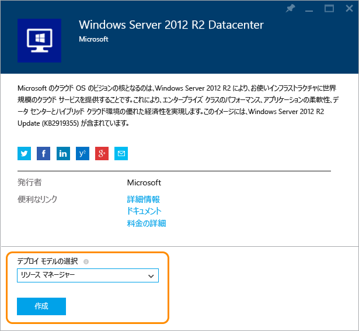
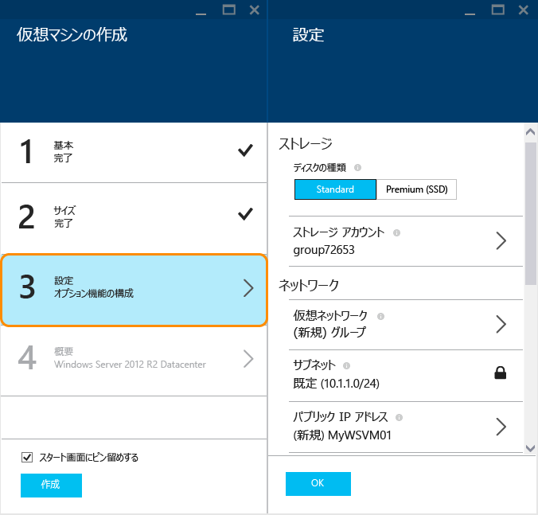
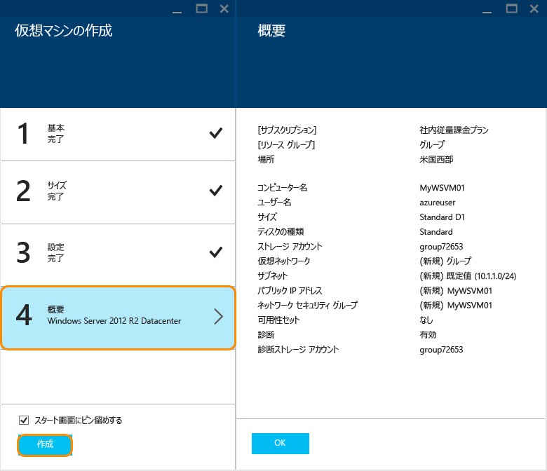

<properties
	pageTitle="Azure ポータルで Windows 仮想マシンを作成する | Microsoft Azure"
	description="Azure ポータルで Azure Marketplace を使用して Windows 仮想マシンまたは仮想コンピューターを作成する方法について説明します。"
	keywords="Windows 仮想マシン, 仮想マシンの作成, 仮想コンピューター, 仮想マシンの設定"
	services="virtual-machines-windows"
	documentationCenter=""
	authors="cynthn"
	manager="timlt"
	editor=""
	tags="azure-resource-manager"/>
<tags
	ms.service="virtual-machines-windows"
	ms.workload="infrastructure-services"
	ms.tgt_pltfrm="vm-windows"
	ms.devlang="na"
	ms.topic="hero-article"
	ms.date="03/11/2016"
	ms.author="cynthn"/>

# Azure ポータルで Windows 仮想マシンを作成する#

> [AZURE.SELECTOR]
- [ポータル](virtual-machines-windows-hero-tutorial.md)
- [PowerShell](virtual-machines-windows-create-powershell.md)
- [テンプレート](virtual-machines-windows-ps-template.md)

このチュートリアルでは、Azure ポータルで Windows 仮想マシンをわずか数分で簡単に作成する方法を示します。仮想マシンを作成するための例として、Windows Server 2012 R2 Datacenter イメージを使用しますが、これは Azure によって提供される多くのイメージの 1 つにすぎません。イメージの選択肢は、サブスクリプションによって異なります。たとえば、デスクトップ イメージは MSDN サブスクリプション会員のみが使用できますです。

[AZURE.INCLUDE [free-trial-note](../../includes/free-trial-note.md)] 

[AZURE.INCLUDE [learn-about-deployment-models](../../includes/learn-about-deployment-models-rm-include.md)] [classic deployment model](virtual-machines-windows-classic-createportal.md)

## ビデオ チュートリアル

以下は、このチュートリアルのガイドです。

[AZURE.VIDEO create-a-virtual-machine-running-windows-in-the-azure-preview-portal]
 

>[AZURE.TIP] ポータルを使用しているときに、VM を可用性セットに含める場合は、可用性セットの最初の VM の作成前または作成中にその可用性セットを作成する必要があります。可用性セットの作成と使用の詳細については、「[仮想マシンの可用性管理](virtual-machines-windows-manage-availability.md)」を参照してください。

## Windows 仮想マシン イメージを選択する

1. Azure ポータルにサインインします。

2. [ハブ] メニューで、**[新規]**、**[Compute]**、**[Windows Server 2012 R2 Datacenter]** の順にクリックします。

	

	>[AZURE.TIP] その他のイメージを見つけるには、**[Marketplace]** をクリックし、使用可能な項目を検索するか、フィルターで抽出します。

3. **[Windows Server 2012 R2 Datacenter]** ページの **[デプロイ モデルの選択]** で、**[リソース マネージャー]** を選択します。**[作成]** をクリックします。

	

## Windows 仮想マシンの作成

イメージを作成したら、ほとんどの構成で Azure の既定の設定を使用できるため、迅速に仮想マシンを作成できます。

1. **[仮想マシンの作成]** ブレードで **[基本]** をクリックします。

2. 仮想マシンの任意の**名前**を入力します。名前には、特殊文字を含めることはできません。

3. 管理用の**ユーザー名**と強力な**パスワード**を入力します。パスワードは、8 ～ 123 文字で指定する必要があります。また、1 つの小文字、1 つの大文字、1 つの数字、1 つの特殊文字のうち、少なくとも 3 つを含める必要があります。**仮想マシンにログオンする際に、このユーザー名とパスワードが必要になります。**

4. 複数のサブスクリプションがある場合は、新しい仮想マシンに対して 1 つ指定し、新規または既存の**リソース グループ**と、Azure データ センターの**場所**を指定します。

	

	
2. **[サイズ]** をクリックし、ニーズに応じた仮想マシンのサイズを選択します。それぞれのサイズによって、コンピューティング コアの数、メモリ、および Premium Storage サポートなどの他の機能が指定されており、これが価格に影響します。Azure では、ユーザーが選択したイメージに応じて、特定のサイズが自動的に推奨されます。

	

	>[AZURE.NOTE] Premium Storage は、特定のリージョンの DS シリーズの仮想マシンで使用できます。Premium Storage は、データベースなどの高負荷のワークロードに最適なストレージ オプションです。詳細については、[Premium Storage: Azure 仮想マシン ワークロード向けの高パフォーマンス ストレージ](../storage/storage-premium-storage-preview-portal.md)に関するページを参照してください。

3. **[設定]** をクリックして、新しい仮想マシンのストレージとネットワークの設定を表示します。最初の仮想マシンについては、通常、既定の設定をそのまま使用します。Premium Storage がサポートされる仮想マシンのサイズを選択した場合は、**[ディスクの種類]** の **[Premium (SSD)]** を選択することで、Premium Storage をお試しいただくことができます。

	

6. **[概要]** をクリックして、構成の選択内容を確認します。設定の確認または更新を終了したら、**[作成]** をクリックします。

	

8. Azure が仮想マシンを作成している間の進捗状況は、ハブ メニューの **[Virtual Machines]** で追跡できます。

## Windows 仮想マシンへのログオン

仮想マシンを作成したら、その仮想マシンにログオンして、その設定や、そこで実行するアプリケーションを管理できます。

>[AZURE.NOTE] 要件やトラブルシューティングのヒントについては、「[RDP または SSH で Azure 仮想マシンに接続する](https://msdn.microsoft.com/library/azure/dn535788.aspx)」を参照してください。

1. まだサインインしていない場合は、Azure ポータルにサインインします。

2. ダッシュボードでお使いの仮想マシンをクリックするか、[Virtual Machines] をクリックして一覧から選択します。

3. 仮想マシンのブレードで、**[接続]** をクリックします。

	![Azure VM ブレードの [接続] ボタンがある場所を示すスクリーンショット](./media/virtual-machines-windows-hero-tutorial/connect_vm_portal.png)

4. **[開く]** をクリックして、Windows Server 仮想マシン用に自動的に作成されたリモート デスクトップ プロトコル ファイルを使用します。

5. **[接続]** をクリックします。

6. 仮想マシンの作成時に設定したユーザー名とパスワードを入力し、**[OK]** をクリックします。

7. **[はい]** をクリックして、目的の仮想マシンであることを確認します。

これで、仮想マシンを他のサーバーとまったく同様に扱うことができます。

## 次のステップ

* Azure PowerShell と Azure CLI を使用して、[仮想マシンのイメージの検索と選択](virtual-machines-linux-cli-ps-findimage.md)を行います。
* [Azure Resource Manager テンプレート](https://azure.microsoft.com/documentation/templates/)を使用して、仮想マシンとワークロードのデプロイと管理を自動化します。
* Azure CLI を使用してすばやく [Linux 仮想マシンを作成](virtual-machines-linux-quick-create-cli.md)することもできます。

<!---HONumber=AcomDC_0323_2016-->