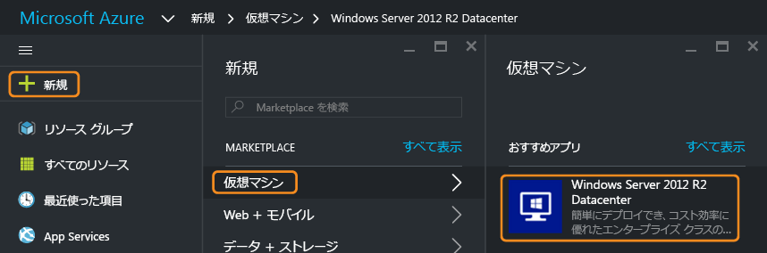
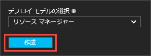
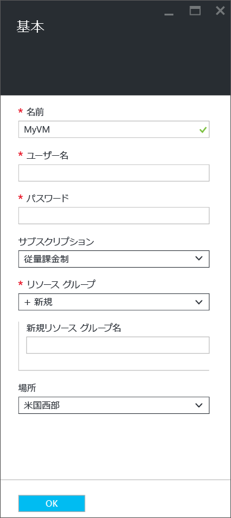
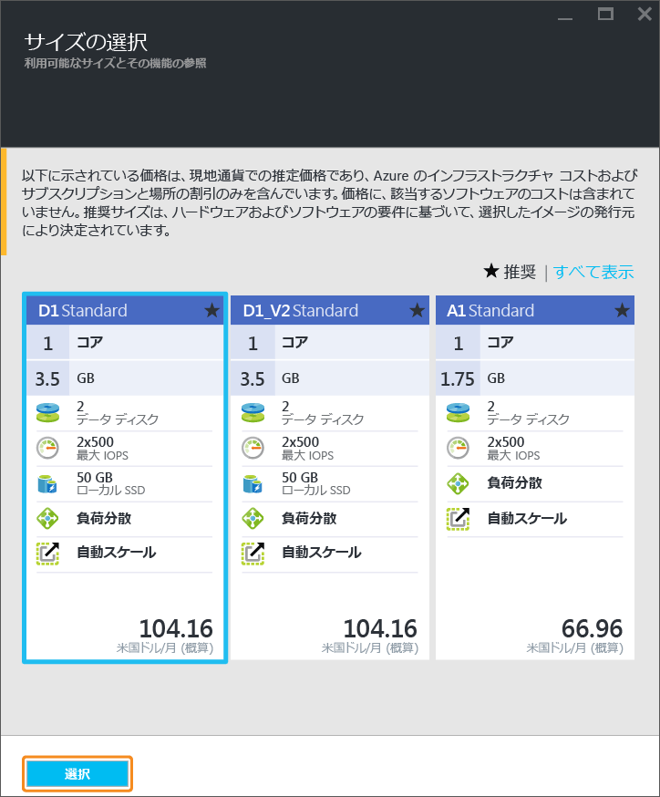
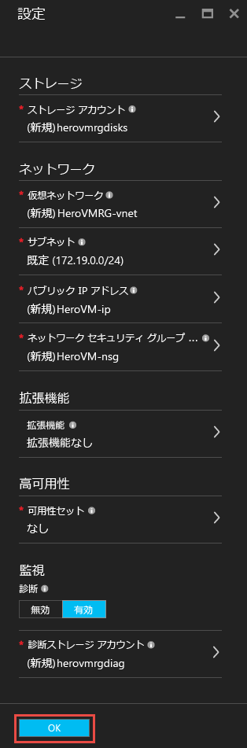
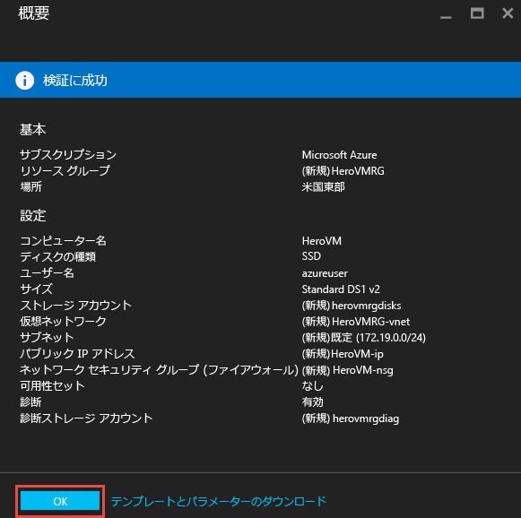
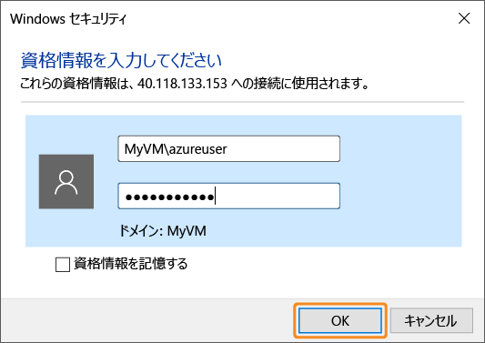
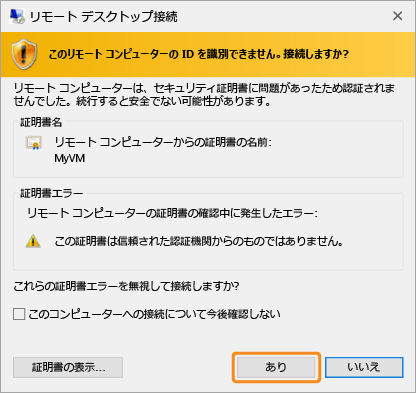
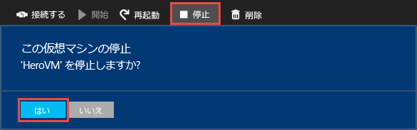

<properties
	pageTitle="初めての Windows VM の作成 | Microsoft Azure"
	description="Azure Portal を使用して初めての Windows 仮想マシンを作成する方法について説明します。"
	keywords="Windows 仮想マシン, 仮想マシンの作成, 仮想コンピューター, 仮想マシンの設定"
	services="virtual-machines-windows"
	documentationCenter=""
	authors="cynthn"
	manager="timlt"
	editor=""
	tags="azure-resource-manager"/>
<tags
	ms.service="virtual-machines-windows"
	ms.workload="infrastructure-services"
	ms.tgt_pltfrm="vm-windows"
	ms.devlang="na"
	ms.topic="hero-article"
	ms.date="09/06/2016"
	ms.author="cynthn"/>

# Azure ポータルで初めての Windows 仮想マシンを作成する

このチュートリアルでは、Azure Portal を使用して Windows 仮想マシン (VM) をわずか数分で簡単に作成する方法を示します。

Azure サブスクリプションをお持ちでない場合は、開始する前に[無料アカウント](https://azure.microsoft.com/free/)を作成してください。

## Marketplace から VM イメージを選択する

例として Windows Server 2012 R2 Datacenter イメージを使用しますが、Azure では他にも使用可能なイメージが多数あります。イメージの選択肢は、サブスクリプションによって異なります。たとえば、[MSDN サブスクライバー](https://azure.microsoft.com/pricing/member-offers/msdn-benefits-details/?WT.mc_id=A261C142F)はデスクトップ イメージをいくつか使用できます。

1. [Azure ポータル](https://portal.azure.com)にサインインします。

2. ハブ メニューで、**[新規]**、**[仮想マシン]**、**[Windows Server 2012 R2 Datacenter]** の順にクリックします。

	

3. **[Windows Server 2012 R2 Datacenter]** ブレードの **[デプロイ モデルの選択]** で、**[リソース マネージャー]** が選択されていることを確認します。**[作成]** をクリックします。

	

## Windows 仮想マシンの作成

イメージを選択したら、既定の設定を使用して仮想マシンをすぐに作成できます。

1. **[基本]** ブレードで、仮想マシンの**名前**を入力します。名前は 1 ～ 15 文字とし、特殊文字を含めることはできません。

2. VM にローカル アカウントを作成する際に使用する**ユーザー名**と強力な**パスワード**を入力します。VM へのサインインと VM の管理にはローカル アカウントを使用します。

	パスワードは、8 ～ 123 文字で指定する必要があります。また、1 つの小文字、1 つの大文字、1 つの数字、1 つの特殊文字という複雑さの 4 要件のうち、3 つを満たしている必要があります。詳しくは、[ユーザー名とパスワードの要件](virtual-machines-windows-faq.md#what-are-the-username-requirements-when-creating-a-vm)をご確認ください。

3. 既存の[リソース グループ](../resource-group-overview.md#resource-groups)を選択するか、新しいリソース グループの名前を入力します。Azure データセンターの**場所** (**米国西部**など) を入力します。

4. 完了したら、**[OK]** をクリックして次のセクションに進みます。

	

	
5. VM の[サイズ](virtual-machines-windows-sizes.md)を選び、**[選択]** をクリックして続行します。

	

6. **[設定]** ブレードでは、ストレージとネットワークのオプションを変更できます。このチュートリアルでは、既定の設定をそのまま使用します。Premium Storage がサポートされる仮想マシンのサイズを選択した場合は、**[ディスクの種類]** の **[Premium (SSD)]** を選択することで、Azure Premium Storage をお試しいただくことができます。変更が済んだら **[OK]** をクリックします。

	

7. **[概要]** をクリックして、選択内容を確認します。**"検証に成功しました"** というメッセージが表示されたら、**[OK]** をクリックします。

	

8. Azure によって仮想マシンが作成されている間の進捗状況は、ハブ メニューの **[仮想マシン]** で追跡できます。

## 仮想マシンへの接続とサインオン

1.	ハブ メニューで **[仮想マシン]** をクリックします。

2.	一覧から仮想マシンを選択します。

3. 仮想マシンのブレードで、**[接続]** をクリックします。リモート デスクトップ プロトコル ファイル (.rdp ファイル) が作成され、ダウンロードされます。このファイルは、自分のマシンに接続するためのショートカットのように使用できます。簡単にアクセスできるようデスクトップにファイルを保存してください。このファイルを**開いて** VM に接続します。

	

4. .rdp の発行元が不明であることを示す警告が表示されます。問題はありません。リモート デスクトップ ウィンドウで、**[接続]** をクリックして続行します。

	

5. [Windows セキュリティ] ウィンドウで、VM の作成時に作成したローカル アカウントのユーザー名とパスワードを入力します。ユーザー名は *vmname*&#92;*username* の形式で入力し、**[OK]** をクリックします。

	
 	
6.	証明書を検証できないことを示す警告が表示されますが、問題はありません。**[はい]** をクリックして、目的の仮想マシンであることを確認し、ログオンを完了します。

	

接続時に問題が発生した場合は、[Windows ベースの Azure 仮想マシンへのリモート デスクトップ接続に関するトラブルシューティング](virtual-machines-windows-troubleshoot-rdp-connection.md)についてのページを参照してください。

これで、仮想マシンを他のサーバーと同様に扱うことができます。

## 省略可能: VM の停止

実際に使用していないときは料金が発生しないよう VM を停止することをお勧めします。**[停止]**、**[はい]** の順にクリックするだけで停止できます。

	
再び使用する準備が整ったら **[開始]** ボタンを押して VM を再起動してください。

## 次のステップ

- [IIS をインストール](virtual-machines-windows-hero-role.md)して新しい VM でさまざまな機能を試すことができます。また、このチュートリアルでは、ネットワーク セキュリティ グループ (NSG) を使用して受信 Web トラフィックに対してポート 80 を開く方法について説明しています。

- [PowerShell を使用して Windows VM を作成する](virtual-machines-windows-ps-create.md)ことも、Azure CLI を使用して [Linux 仮想マシンを作成する](virtual-machines-linux-quick-create-cli.md)こともできます。

- デプロイの自動化に関心がある場合は、[Resource Manager テンプレートを使用した Windows 仮想マシンの作成](virtual-machines-windows-ps-template.md)に関するページをご覧ください。

<!-------HONumber=AcomDC_0912_2016--->