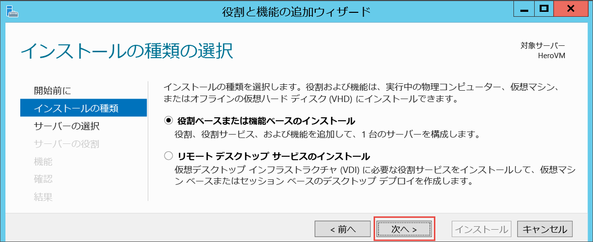
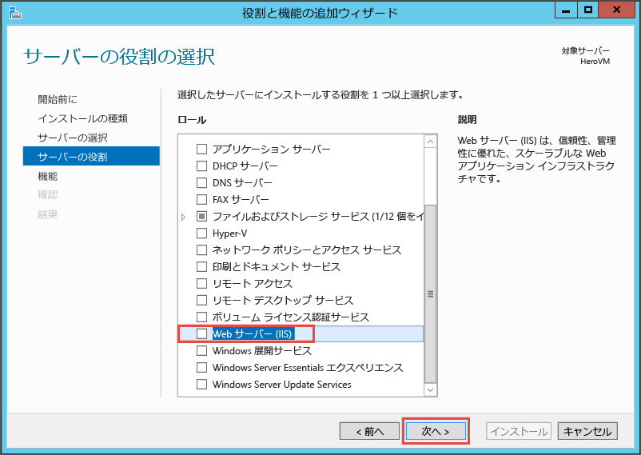
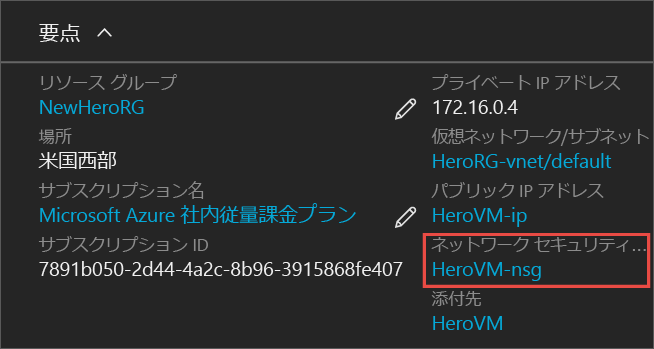
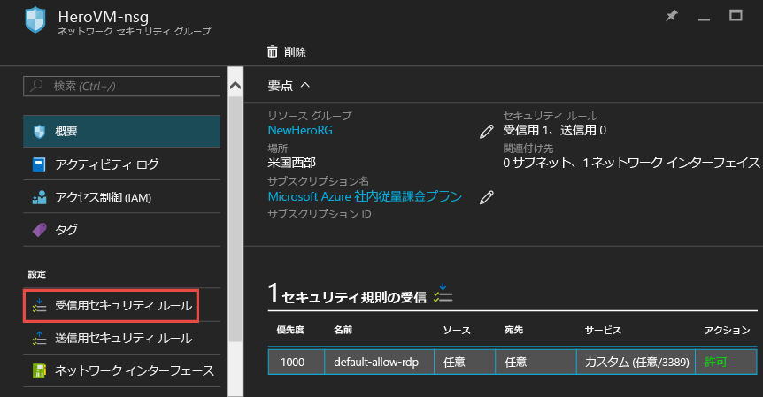

<properties
	pageTitle="初めての Windows VM の作成 | Microsoft Azure"
	description="Azure ポータルを使用して初めての Windows 仮想マシンを作成する方法について説明します。"
	keywords="Windows 仮想マシン, 仮想マシンの作成, 仮想コンピューター, 仮想マシンの設定"
	services="virtual-machines-windows"
	documentationCenter=""
	authors="cynthn"
	manager="timlt"
	editor=""
	tags="azure-resource-manager"/>
<tags
	ms.service="virtual-machines-windows"
	ms.workload="infrastructure-services"
	ms.tgt_pltfrm="vm-windows"
	ms.devlang="na"
	ms.topic="hero-article"
	ms.date="08/29/2016"
	ms.author="cynthn"/>

# Azure ポータルで初めての Windows 仮想マシンを作成する

このチュートリアルでは、Azure ポータルを使用して Windows VM を数分で簡単に作成する方法について説明します。

Azure サブスクリプションをお持ちでない場合は、[無料アカウント](https://azure.microsoft.com/free/)を数分で作成することができます。

[こちら](https://channel9.msdn.com/Blogs/Azure-Documentation-Shorts/Create-A-Virtual-Machine-Running-Windows-In-The-Azure-Preview-Portal)で、このチュートリアルのビデオをご覧いただけます。

## Marketplace から VM イメージを選択する

例として Windows Server 2012 R2 Datacenter イメージを使用しますが、Azure では他にも使用可能なイメージが多数あります。イメージの選択肢は、サブスクリプションによって異なります。たとえば、デスクトップ イメージは [MSDN サブスクライバー](https://azure.microsoft.com/pricing/member-offers/msdn-benefits-details/?WT.mc_id=A261C142F)のみが使用できます。

1. [Azure ポータル](https://portal.azure.com)にサインインします。

2. [ハブ] メニューで、**[新規]**、**[仮想マシン]**、**[Windows Server 2012 R2 Datacenter]** の順にクリックします。

	

3. **[Windows Server 2012 R2 Datacenter]** ブレードの **[デプロイ モデルの選択]** で、**[リソース マネージャー]** が選択されていることを確認します。**[作成]** をクリックします。

	

## Windows 仮想マシンの作成

イメージを作成したら、ほとんどの構成で Azure の既定の設定を使用できるため、迅速に仮想マシンを作成できます。

1. **[基本]** ブレードで、仮想マシンの**名前**を入力します。名前は 1 ～ 15 文字とし、特殊文字を含めることはできません。

2. VM にローカル アカウントを作成する際に使用する**ユーザー名**と強力な**パスワード**を入力します。VM へのログオンと VM の管理にはローカル アカウントを使用します。

	パスワードは、8 ～ 123 文字で指定する必要があります。また、1 つの小文字、1 つの大文字、1 つの数字、1 つの特殊文字という複雑さの 4 要件のうち、3 つを満たしている必要があります。詳しくは、[ユーザー名とパスワードの要件](virtual-machines-windows-faq.md#what-are-the-username-requirements-when-creating-a-vm)をご確認ください。

3. 既存の[リソース グループ](../resource-group-overview.md#resource-groups)を選択するか、新しいリソース グループの名前を入力します。Azure データセンターの**場所** (**米国西部**など) を入力します。

4. 完了したら、**[OK]** をクリックして次のセクションに進みます。

	

	
5. VM の[サイズ](virtual-machines-windows-sizes.md)を選び、**[選択]** をクリックして続行します。

	

6. **[設定]** ブレードでは、ストレージとネットワークのオプションを変更できます。このチュートリアルでは、既定の設定をそのまま使用します。Premium Storage がサポートされる仮想マシンのサイズを選択した場合は、**[ディスクの種類]** の **[Premium (SSD)]** を選択することで、Premium Storage をお試しいただくことができます。変更が済んだら **[OK]** をクリックします。

	

7. **[概要]** をクリックして、選択内容を確認します。**"検証に成功しました"** というメッセージが表示されたら、**[OK]** をクリックします。

	

8. Azure が仮想マシンを作成している間の進捗状況は、ハブ メニューの **[Virtual Machines]** で追跡できます。

## 仮想マシンへの接続とログオン

1.	ハブ メニューで **[Virtual Machines]** をクリックします。

2.	一覧から仮想マシンを選択します。

3. 仮想マシンのブレードで、**[接続]** をクリックします。リモート デスクトップ プロトコル ファイル (.rdp ファイル) が作成され、ダウンロードされます。このファイルは、自分のマシンに接続するためのショートカットのように使用できます。簡単にアクセスできるようデスクトップにファイルを保存してください。このファイルを**開いて** VM に接続します。

	

4. .rdp の発行元が不明であることを示す警告が表示されます。問題はありません。リモート デスクトップ ウィンドウで、**[接続]** をクリックして続行します。

	

5. [Windows セキュリティ] ウィンドウで、VM の作成時に作成したローカル アカウントのユーザー名とパスワードを入力します。ユーザー名は *vmname*&#92;*username* の形式で入力し、**[OK]** をクリックします。

	
 	
6.	証明書を検証できないことを示す警告が表示されますが、問題はありません。**[はい]** をクリックして、目的の仮想マシンであることを確認し、ログオンを完了します。

	

接続時に問題が発生した場合は、[Windows ベースの Azure 仮想マシンへのリモート デスクトップ接続に関するトラブルシューティング](virtual-machines-windows-troubleshoot-rdp-connection.md)についてのページを参照してください。

これで、仮想マシンを他のサーバーとまったく同様に扱うことができます。

## VM への IIS のインストール

VM へのログインができたので、さらに機能を試すことができるようにサーバーの役割をインストールします。

1. まだ開いていない場合、**[サーバー マネージャー]** を開きます。**[スタート]** メニューをクリックし、**[サーバー マネージャー]** をクリックします。
2. **[サーバー マネージャー]** の左側のウィンドウで **[ローカル サーバー]** を選択します。
3. メニューで **[管理]**、**[役割と機能の追加]** の順に選択します。
4. 役割と機能の追加ウィザードの **[インストールの種類]** ページで、**[役割ベースまたは機能ベースのインストール]** を選択してから **[次へ]** をクリックします。

	

5. サーバー プールから VM を選択し、**[次へ]** をクリックします。
6. **[サーバーの役割]** ページで、**[Web サーバー (IIS)]** を選択します。

	

7. IIS に必要な機能の追加に関するポップアップで、**[管理ツールを含める (存在する場合)]** がオンになっていることを確認し、**[機能の追加]** をクリックします。ポップアップが閉じたら、ウィザードの **[次へ]** をクリックします。

	

8. 機能ページで **[次へ]** をクリックします。
9. **[Web サーバーの役割 (IIS)]** ページで **[次へ]** をクリックします。
10. **[役割サービス]** ページで **[次へ]** をクリックします。
11. **[確認]** ページで **[インストール]** をクリックします。
12. インストールが完了したら、ウィザードの **[閉じる]** をクリックします。

## ポート 80 を開く 

VM がポート 80 で受信トラフィックを受け取れるようにするには、ネットワーク セキュリティ グループに受信の規則を追加する必要があります。

1. [Azure ポータル](https://portal.azure.com) を開きます。
2. **[仮想マシン]** で、作成した VM を選択します。
3. 仮想マシンの設定で **[ネットワーク インターフェイス]** を選択し、既存のネットワーク インターフェイスを選びます。

	

4. ネットワーク インターフェイスの **[要点]** で **[ネットワーク セキュリティ グループ]** をクリックします。

	

5. NSG の **[要点]** ブレードには既に、**default-allow-rdp** という既定の受信規則があります。この受信規則によって VM へのログインが許可されています。IIS トラフィックが許可されるように、別の受信規則を追加します。**[受信セキュリティ規則]** をクリックします。

	

6. **[受信セキュリティ規則]** で **[追加]** をクリックします。

	

7. **[受信セキュリティ規則]** で **[追加]** をクリックします。ポート範囲に「**80**」と入力し、**[許可]** を選択します。完了したら、**[OK]** をクリックします。

	
 
NSG のほか、受信規則と送信規則の詳細については、「[Azure Portal を使用して VM への外部アクセスを許可する](virtual-machines-windows-nsg-quickstart-portal.md)」を参照してください。
 
## 既定の IIS Web サイトへの接続

1. Azure Portal で **[仮想マシン]** をクリックし、対象の VM を選択します。
2. **[要点]** ブレードで**パブリック IP アドレス**をコピーします。

	

2. ブラウザーを開き、http://<publicIPaddress> のようなパブリック IP アドレスをアドレス バーに入力します。その後、**Enter** キーを押してそのアドレスに移動します。
3. ブラウザーで既定の IIS Web ページに移動します。このページは次のようになります。

	

## VM を停止する

実際に使用していないときは料金が発生しないよう VM を停止することをお勧めします。**[停止]** ボタンをクリックして **[はい]** をクリックするだけです。

	
再び使用する準備が整ったら **[開始]** ボタンを押して VM を再起動してください。

## 次のステップ

* 試しに仮想マシンに[データ ディスクを接続](virtual-machines-windows-attach-disk-portal.md)してみましょう。データ ディスクを接続することで、仮想マシンの記憶域を増やすことができます。

* [Powershell を使用して Windows VM を作成する](virtual-machines-windows-ps-create.md)ことも、Azure CLI を使用して [Linux 仮想マシンを作成する](virtual-machines-linux-quick-create-cli.md)こともできます。

* デプロイの自動化に関心がある場合は、[Resource Manager テンプレートを使用した Windows 仮想マシンの作成](virtual-machines-windows-ps-template.md)に関するページをご覧ください。

<!---HONumber=AcomDC_0831_2016-->