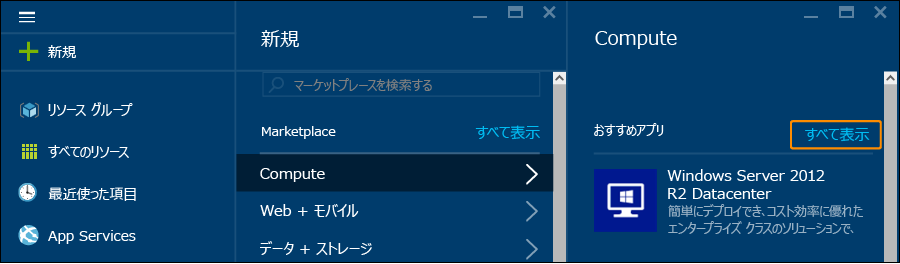
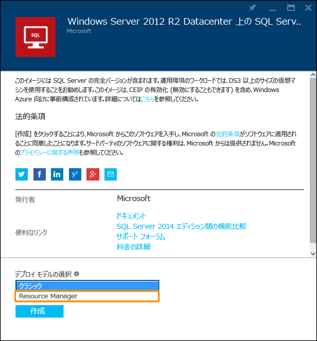
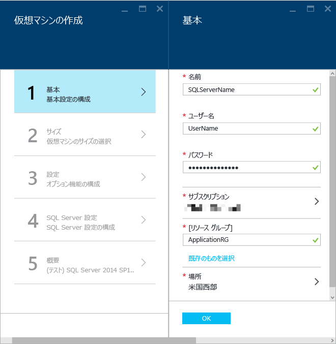
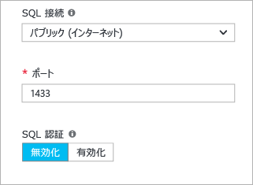
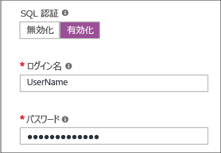
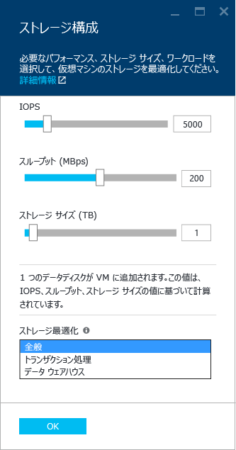
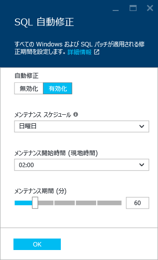
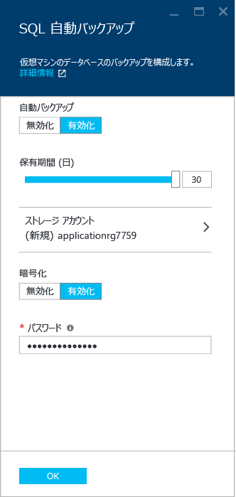
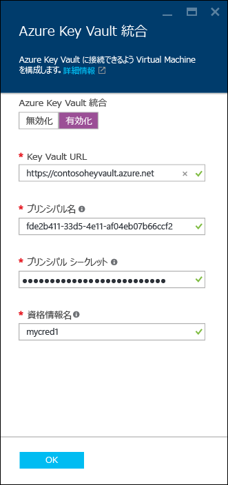

<properties
	pageTitle="Azure ポータルでの SQL Server 仮想マシンのプロビジョニング | Microsoft Azure"
	description="Azure リソース マネージャー モードで SQL Server 仮想マシンを作成します。このチュートリアルでは、スクリプトではなく、主にユーザー インターフェイスとツールを使用します。"
	services="virtual-machines-windows"
	documentationCenter="na"
	authors="MikeRayMSFT"
    editor=""
	manager="jeffreyg"
	tags="azure-resource-manager" />

<tags
	ms.service="virtual-machines-windows"
	ms.devlang="na"
	ms.topic="hero-article"
	ms.tgt_pltfrm="vm-windows-sql-server"
	ms.workload="infrastructure-services"
	ms.date="03/24/2016"
	ms.author="mikeray" />

# Azure ポータルでの SQL Server 仮想マシンのプロビジョニング

## 概要

このエンド ツー エンド チュートリアルでは、Azure リソース マネージャー モデルを使ってポータルで Azure 仮想マシンをプロビジョニングし、Azure ギャラリーのテンプレートから SQL Server を構成する方法を示します。

[AZURE.INCLUDE [learn-about-deployment-models](../../includes/learn-about-deployment-models-rm-include.md)]クラシック デプロイ モデル。

Azure 仮想マシン (VM) ギャラリーには、Microsoft SQL Server を含むイメージがいくつか用意されています。ギャラリーからいずれかの VM イメージを選択すると、わずか数クリックで、Azure 環境に VM をプロビジョニングできます。

このチュートリアルでは、次のことについて説明します。

- [Azure ポータルに接続し、リソース マネージャーのデプロイメント モデルでギャラリーから SQL VM イメージをプロビジョニングする](#Provision)

- [仮想マシンと SQL Server の設定を構成する](#ConfigureVM)

- [リモート デスクトップを使って仮想マシンを開く](#Open)

- [別のコンピューターの SQL Server Management Studio を使って SQL Server インスタンスに接続する](#Connect)

- [次のステップ](#Next)

このチュートリアルでは、Azure アカウントを既に取得していることを前提としています。Azure アカウントを持っていない場合は、[Azure の無料試用版サイト](https://azure.microsoft.com/pricing/free-trial/)にアクセスしてください。

## <a id="Provision">リソース マネージャーのデプロイ モデルでギャラリーから SQL VM イメージをプロビジョニングする

1. アカウントを使用して [Azure ポータル](https://portal.azure.com)にログインします。
1. Azure ポータルで **[+新規]** をクリックします。ポータルで **[新規]** ブレードが開きます。SQL Server VM テンプレートは、Marketplace の **[Compute]** グループにあります。

1. **[新規]** ブレードで **[Compute]** をクリックします。
1. **[Compute]** ブレードですべての種類のリソースを表示するには、**[すべて表示]** をクリックします。  
1. **[データベース サーバー]** の **[SQL Server]** をクリックすると、SQL Server で使用できるすべてのテンプレートが表示されます。**[データベース サーバー]** を下にスクロールしなければならない場合があります。
1. 	各テンプレートでは、SQL Server のバージョンとオペレーティング システムが示されています。一覧からいずれかのイメージを選択し、詳細を含むブレードを表示します。
1.	詳細ブレードでは、その仮想マシン イメージの説明が提供され、デプロイ モデルを選択できます。**[デプロイメント モデルの選択]** で **[リソース マネージャー]** を選択して **[作成]** をクリックします。  

## <a id="ConfigureVM">VM を構成する
Azure ポータルには、SQL Server 仮想マシンを構成するための 5 つのブレードがあります。

1.	基本設定を構成する
1.	仮想マシンのサイズを選択する
1.	仮想マシンの設定を構成する
1.	SQL Server を構成する
1.	概要を確認する

## 1\.基本設定を構成する
**[仮想マシンの作成]** ブレードの **[基本]** では、次の情報を入力します。

* 仮想マシンの一意の **[名前]**。
* **[ユーザー名]** ボックスには、コンピューターのローカル管理者アカウントの一意のユーザー名を入力します。このアカウントは、SQL Server sysadmin 固定サーバー ロールのメンバーにもなります。
* **[パスワード]** ボックスには、強いパスワードを入力します。
* 複数のサブスクリプションがある場合は、作成しようとしている VM に対してサブスクリプションが正しいことを確認します。
* **[リソース グループ]** ボックスには、リソース グループの名前を入力します。または、既存のリソース グループを使用する場合は、**[既存のものを選択]** をクリックします。リソース グループとは、Azure の関連するサービスのコレクションです。リソース グループの詳細については、「[Azure Resource Manager の概要](../resource-group-overview.md)」を参照してください。**[場所]** が要件に合った正しいものであることを確認します。
* **[OK]** をクリックして設定を保存します。 

>  

## 2\.仮想マシンのサイズを選択する
**[仮想マシンの作成]** ブレードの **[サイズ]** で、仮想マシンのサイズを選びます。Azure ポータルでは、推奨サイズが表示されます。仮想マシン サイズの詳細については、「[仮想マシンのサイズ](virtual-machines-linux-sizes.md)」を参照してください。サイズは、選択したテンプレートに基づきます。サイズにより、VM の実行にかかる毎月のコストが見積もられます。サーバーの VM サイズを選択します。SQL Server VM のサイズに関する考慮事項については、「[Azure Virtual Machines における SQL Server のパフォーマンスに関するベスト プラクティス](virtual-machines-windows-sql-performance.md)」を参照してください。

## 3\.仮想マシンの設定を構成する
**[仮想マシンの作成]** ブレードの **[設定]** で、仮想マシンの Azure Storage、ネットワーク、監視を構成します。

- **[Storage]** で、ディスクの種類を指定します。運用環境のワークロードには Premium Storage をお勧めします。

>[AZURE.NOTE] 既定では、Premium Storage が有効になります。Premium Storage をサポートするサイズに、コンピューターのサイズが自動的に変更されます。Premium Storage を無効にした場合は、以前のマシン サイズの選択が使用されます。

- **[ストレージ アカウント]** では、自動的にプロビジョニングされたストレージ アカウント名を受け入れるか、または **[ストレージ アカウント]** をクリックして既存のアカウントを選択し、ストレージ アカウントの種類を構成します。既定では、ローカル冗長ストレージで新しいストレージ アカウントが作成されます。

- **[ネットワーク]** では、機能に対して自動的に設定される値を使用するか、または各機能をクリックして **[仮想ネットワーク]**、**[サブネット]**、**[パブリック IP アドレス]**、および **[ネットワーク セキュリティ グループ]** を構成します。既定では、これらの値は自動的に構成されます。

- **[監視]** は、既定では VM に指定されているものと同じストレージ アカウントで有効になります。これらの設定はここで変更できます。

- **[可用性セット]** で、可用性セットを指定します。このチュートリアルでは、**[なし]** を選択します。SQL AlwaysOn 可用性グループを設定する場合は、仮想マシンを再作成しないように可用性を構成します。詳細については、「[Virtual Machines の可用性管理](virtual-machines-windows-manage-availability.md)」を参照してください。

## 4\.SQL Server を構成する
**[仮想マシンの作成]** ブレードの **[SQL Server の構成]** で、SQL Server の固有の設定と最適化を構成します。SQL Server について構成できる設定は次のとおりです。

- 接続
- 認証
- ストレージの最適化
- Patching
- バックアップ
- Key Vault の統合

### 接続
**[SQL 接続]** で **[パブリック (インターネット)]** を指定して、インターネット上のコンピューターまたはサービスから SQL Server に接続できるようにします。このオプションを選択すると、ポート 1433 のトラフィックを許可するように、ファイアウォールとネットワーク セキュリティ グループが自動的に構成されます。  

インターネット経由で SQL Server に接続するには、SQL Server 認証を有効にする必要もあります。

>[AZURE.NOTE]セキュリティのため、ネットワーク セキュリティ グループを使用してソース ポートを制限します。詳細については、「[ネットワーク セキュリティ グループ (NSG) について](../virtual-network/virtual-networks-nsg.md)」を参照してください。

インターネット経由によるデータベース エンジンへの自動接続を有効にしない場合は、次のいずれかのオプションを選択します。
- **ローカル (VM 内のみ)**: VM 内から SQL Server への接続のみを許可します。
- **プライベート (Virtual Network 内)**: 同じ仮想ネットワーク内のコンピューターまたはサービスから SQL Server への接続を許可します。

**[ポート]** の既定値は 1433 です。別のポート番号を指定できます。詳細については、「[SQL Server 仮想マシンへの接続 (Resource Manager) | Microsoft Azure](virtual-machines-windows-sql-connect.md)」を参照してください。

### 認証
SQL Server 認証が必要な場合は、**[SQL 認証]** の **[有効]** をクリックします。

   

SQL Server 認証を有効にする場合は、**[ログイン名]** と **[パスワード]** を指定します。このユーザー名が、SQL Server 認証ログインおよび sysadmin 固定サーバー ロールのメンバーになります。認証モードの詳細については、「[認証モードの選択](http://msdn.microsoft.com/library/ms144284.aspx)」を参照してください。既定では、SQL Server 認証は有効になりません。その場合、仮想マシンのローカル管理者は SQL Server インスタンスに接続できます。

>[AZURE.NOTE] インターネット経由で SQL Server にアクセスする場合 (つまりパブリック接続オプション)、ここで SQL 認証を有効にする必要があります。SQL Server へのパブリック アクセスでは、SQL 認証を使う必要があります。

### ストレージの最適化
ストレージの要件を指定するには、**[ストレージの構成]** をクリックします。1 秒間の入力/出力操作数 (IOP)、スループット (MB/秒)、およびストレージの合計サイズで、要件を指定できます。スライド スケールを使用してこれらを構成します。これらの要件に基づいて、ディスクの数が自動的に計算されます。

既定では、Azure はストレージを 5000 IOP、200 MB、1 TB の記憶域容量に最適化します。ワークロードに基づいて、これらのストレージ設定を変更できます。**[ストレージ最適化対象]** で、次のいずれかを選択します。

- **[一般]** は、既定の設定であり、ほとんどのワークロードをサポートします。
- **[トランザクション処理]** は、従来のデータベース OLTP ワークロード用にストレージを最適化します。
- **[データ ウェアハウジング]** は、分析とレポートのワークロード用にストレージを最適化します。

次の図は、[ストレージの構成] ブレードを示しています。  

>[AZURE.NOTE] ストレージ構成の制限は、仮想マシンのサイズによって異なります。詳細については、[仮想マシンのサイズ](virtual-machines-linux-sizes.md)に関するページを参照してください。

### Patching
**[SQL 自動修正]** は、既定で有効になります。自動修正を有効にすると、Azure は SQL Server とオペレーティング システムに修正プログラムを自動的に適用します。メンテナンス ウィンドウの曜日、時刻、および期間を指定します。Azure は、修正プログラムの適用をメンテナンス ウィンドウで実行します。メンテナンス ウィンドウのスケジュールでは、VM のロケールが時刻に使用されます。SQL Server とオペレーティング システムを自動的に修正しない場合は、**[無効]** をクリックします。

   

詳細については、「[Azure Virtual Machines での SQL Server の自動修正](virtual-machines-windows-classic-sql-automated-patching.md)」を参照してください。

### バックアップ
**[SQL 自動バックアップ]** では、すべてのデータベースの自動データベース バックアップを有効にできます。SQL の自動バックアップを有効にするときは、以下の構成を行います。

- バックアップ保有期間の日数
- バックアップに使用するストレージ アカウント
- バックアップを暗号化するかどうか。バックアップを暗号化するには、**[有効]** をクリックします。自動バックアップを暗号化する場合は、パスワードを指定します。Azure は、バックアップを暗号化するための証明書を作成し、指定されたパスワードを使用してその証明書を保護します。

   

 詳細については、「[Azure Virtual Machines での SQL Server の自動バックアップ](virtual-machines-windows-classic-sql-automated-backup.md)」をご覧ください。

### Key Vault の統合
暗号化のためにセキュリティ シークレットを Azure に格納するには、**[Azure Key Vault の統合]** をクリックして、**[有効]** をクリックします。

   

次の表では、Azure Key Vault の統合の構成に必要なパラメーターを示します。

|パラメーター|説明|例|
|----------|----------|-------|
|**Key Vault の URL** |Key Vault の場所。|https://contosokeyvault.vault.azure.net/ |
|**プリンシパル名** |Azure Active Directory サービスのプリンシパル名。クライアント ID とも呼ばれます。 |fde2b411-33d5-4e11-af04eb07b669ccf2|
| **プリンシパル シークレット**|Azure Active Directory サービスのプリンシパル シークレット。クライアント シークレットとも呼ばれます。 | 9VTJSQwzlFepD8XODnzy8n2V01Jd8dAjwm/azF1XDKM=|
|**資格情報名**|**資格情報名**: AKV 統合により SQL Server 内に資格情報が作成されます。VM に Key Vault にアクセスする許可が与えられます。この資格情報の名前を選択します。| mycred1|

詳細については、「[Azure VM で SQL Server 用に Azure Key Vault 統合を構成する (クラシック デプロイ)](virtual-machines-windows-classic-ps-sql-keyvault.md)」を参照してください。

## 5\.概要を確認する
概要を確認して **[OK]** をクリックし、この VM に対して指定した SQL Server、リソース グループ、リソースを作成します。Azure ポータルでデプロイメントを監視できます。画面の上部にある **[通知]** ボタンは、デプロイの基本的な状態を示します。

##<a id="Open">リモート デスクトップを使用して仮想マシンを開き、セットアップを完了する
次の手順に従い、リモート デスクトップを使用して仮想マシンを開きます。

1.	Azure VM を作成すると、Azure ダッシュボードに VM のアイコンが表示されます。アイコンをクリックして VM に関する情報を表示します。
1.	VM ブレードで、上部の **[接続]** をクリックします。ブラウザーで VM の .rdp ファイルがダウンロードされます。.rdp ファイルを開きます。
1.	リモート デスクトップ接続で、このリモート接続の発行元を識別できないことが通知され、それでも接続するかどうかの確認を求められます。**[接続]** をクリックします。
1.	**[Windows セキュリティ]** ダイアログで、**[別のアカウントを使用]** をクリックします。**[ユーザー名]** に、VM の構成時に指定した <machine name><user name> を入力します。

SQL Server 仮想マシンに接続した後は、SQL Server Management Studio を起動し、ローカル管理者の資格情報を使用して Windows 認証で接続できます。これにより、必要に応じて、プロビジョニング後にファイアウォールの設定または SQL Server の構成設定を変更することもできます。

##<a id="Connect">インターネット経由で SQL Server に接続する

インターネットから SQL Server データベース エンジンに接続する場合は、ファイアウォールの構成、SQL Server 認証の有効化、ネットワーク セキュリティ グループの構成など、いくつかの手順が必要です。ポート 1433 の TCP トラフィックを許可するネットワーク セキュリティ グループの規則が必要です。

ポータルで Resource Manager を使用して SQL Server 仮想マシン イメージをプロビジョニングする場合は、SQL 接続オプションで **[パブリック]** を選ぶと、これらの手順が自動的に実行され、SQL Server 認証が有効になりました。ただし、インターネット経由で SQL Server インスタンスにアクセスするには、他にいくつかの手順を完了する必要があります。

>[AZURE.NOTE] プロビジョニングの間に [パブリック] を選択しなかった場合、インターネット経由で SQL Server インスタンスにアクセスするには、追加の手順が必要です。詳細については、「[Azure での SQL Server 仮想マシンへの接続 (リソース マネージャー)](virtual-machines-windows-sql-connect.md)」を参照してください。

ローカルにのみ、または Virtual Network 内からのみ、仮想マシンにアクセスする場合は、次の手順は必要ありません。

> [AZURE.INCLUDE [VM リソース マネージャーで SQL Server に接続する](../../includes/virtual-machines-sql-server-connection-steps-resource-manager.md)]

##<a id="Next"> 次のステップ
Azure での SQL Server の使用に関するその他の情報については、「[Azure Virtual Machines における SQL Server](virtual-machines-windows-sql-server-iaas-overview.md)」を参照してください。

<!---HONumber=AcomDC_0413_2016---->