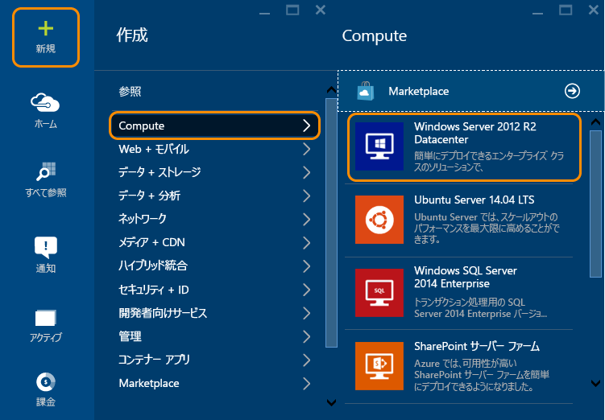
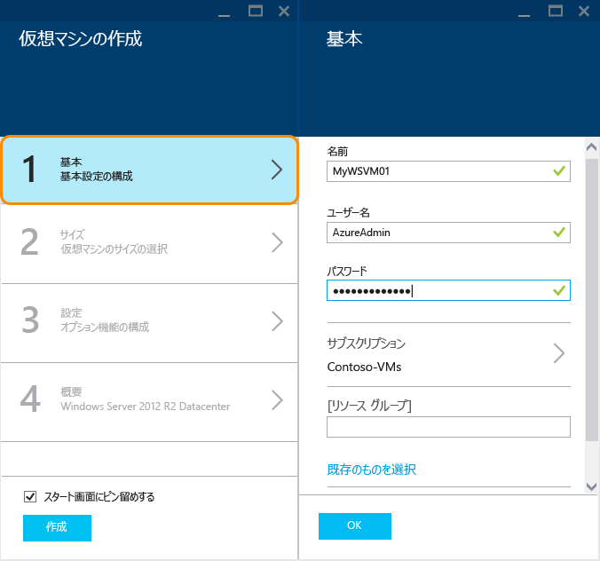
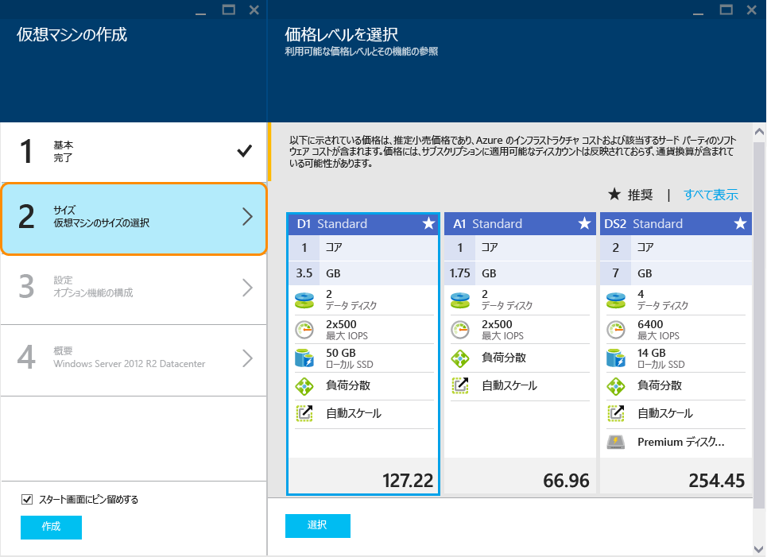

<properties
	pageTitle="Windows を実行する仮想マシンを Azure プレビュー ポータル | Microsoft Azure で作成します。"
	description="Azure プレビュー ポータルで Azure Marketplace を使用してWindows を実行する Azure VM (仮想コンピューター) を作成する方法について説明します。"
	keywords="azure vm、仮想マシンの作成、仮想コンピューター、仮想マシンの設定"
	services="virtual-machines"
	documentationCenter=""
	authors="cynthn"
	manager="timlt"
	editor=""
	tags="azure-resource-manager"/>
<tags
	ms.service="virtual-machines"
	ms.workload="infrastructure-services"
	ms.tgt_pltfrm="vm-windows"
	ms.devlang="na"
	ms.topic="hero-article"
	ms.date="08/14/2015"
	ms.author="cynthn"/>

# Windows を実行する仮想マシンを Azure プレビュー ポータルで作成する#

> [AZURE.SELECTOR]
- [Azure preview portal](virtual-machines-windows-tutorial.md)
- [Azure portal](virtual-machines-windows-tutorial-classic-portal.md)
- [PowerShell: Resource Manager deployment](virtual-machines-deploy-rmtemplates-powershell.md)
- [PowerShell: Classic deployment](virtual-machines-ps-create-preconfigure-windows-vms.md)

 

このチュートリアルでは、Azure プレビュー ポータルで Azure 仮想マシンをわずか数分で簡単に作成する方法を示します。仮想マシンを作成するための例として、Windows Server 2012 R2 Datacenter イメージを使用しますが、これは Azure によって提供される多くのイメージの 1 つにすぎません。イメージの選択肢は、サブスクリプションによって異なります。たとえば、デスクトップ イメージは MSDN サブスクリプション会員のみが使用できますです。

[AZURE.INCLUDE [learn-about-deployment-models](../../includes/learn-about-deployment-models-rm-include.md)]クラシック デプロイ モデル。リソース マネージャーの詳細については、「[Azure リソース マネージャーの概要](resource-group-overview.md)」を参照してください。

リソース マネージャーのテンプレートまたは自動化ツールと共に、独自のイメージを使用して仮想マシンを作成することもできます。さまざまな方法の詳細については、「[Windows 仮想マシンを作成するさまざまな方法](virtual-machines-windows-choices-create-vm.md)」を参照してください。

[AZURE.INCLUDE [free-trial-note](../../includes/free-trial-note.md)]

## ビデオ チュートリアル

以下は、このチュートリアルのガイドです。

[AZURE.VIDEO create-a-virtual-machine-running-windows-in-the-azure-preview-portal]

## 仮想マシンイメージを選択する

1. Azure プレビュー ポータルにサインインします。

2. [ハブ] メニューで、**[新規]**、**[Compute]**、**[Windows Server 2012 R2 Datacenter]** の順にクリックします。

	

	>[AZURE.TIP]その他のイメージを見つけるには、**[Marketplace]** をクリックし、使用可能な項目を検索するか、フィルターで抽出します。

3. **[Windows Server 2012 R2 Datacenter]** ページの **[デプロイ モデルの選択]** で、**[リソース マネージャー]** を選択します。**[作成]** をクリックします。

	

## 仮想マシンの作成

イメージを作成したら、ほとんどの構成で Azure の既定の設定を使用できるため、迅速に仮想マシンを作成できます。

1. **[仮想マシンの作成]** ブレードで **[基本]** をクリックします。仮想マシンの **[名前]**、管理者の **[ユーザー名]**、強力な **[パスワード]** を入力します。複数のサブスクリプションがある場合は、新しい仮想マシンに対して 1 つ指定し、新規または既存の**リソース グループ**と、Azure データ センターの**場所**を指定します。

	

	>[AZURE.NOTE] [ユーザー名] とは、サーバーの管理に使用する管理アカウントの名前です。覚えやすい (また、他の人が予測しずらい) パスワードを作成します。**仮想マシンにログオンする際に、このユーザー名とパスワードが必要になります。**

2. **[サイズ]** をクリックし、ニーズに応じた仮想マシンのサイズを選択します。それぞれのサイズによって、コンピューティング コアの数、メモリ、および Premium Storage サポートなどの他の機能が指定されており、これが価格に影響します。Azure では、ユーザーが選択したイメージに応じて、特定のサイズが自動的に推奨されます。

	

	>[AZURE.NOTE]Premium Storage は、特定のリージョンの DS シリーズの仮想マシンで使用できます。Premium Storage は、データベースなどの高負荷のワークロードに最適なストレージ オプションです。詳細については、[Premium Storage: Azure 仮想マシン ワークロード向けの高パフォーマンス ストレージ](storage-premium-storage-preview-portal.md)に関するページを参照してください。

3. **[設定]** をクリックして、新しい仮想マシンのストレージとネットワークの設定を表示します。最初の仮想マシンについては、通常、既定の設定をそのまま使用します。Premium Storage がサポートされる仮想マシンのサイズを選択した場合は、**[ディスクの種類]** の **[Premium (SSD)]** を選択することで、Premium Storage をお試しいただくことができます。

	

6. **[概要]** をクリックして、構成の選択内容を確認します。設定の確認または更新を終了したら、**[作成]** をクリックします。

	

8. Azure が仮想マシンを作成している間の進捗状況は、ハブ メニューの **[通知]** で確認できます。Azure で仮想マシンが作成されるとスタート画面に表示されます。ただし、**[仮想マシンの作成]** ブレードで **[スタート画面にピン留めする]** をオフにした場合は表示されません。

## 仮想マシンへのログオン

仮想マシンを作成したら、その仮想マシンにログオンして、その設定や、そこで実行するアプリケーションを管理できます。

>[AZURE.NOTE]要件やトラブルシューティングのヒントについては、「[RDP または SSH で Azure 仮想マシンに接続する](https://msdn.microsoft.com/library/azure/dn535788.aspx)」を参照してください。

1. Azure プレビュー ポータルにまだサインインしていない場合は、サインインします。

2. スタート画面の仮想マシンをクリックします。仮想マシンを探す場合は、**[すべて参照]**、**[最近使用した項目]** の順にクリックするか、**[すべて参照]**、**[仮想マシン]** の順にクリックします。その後、一覧から仮想マシンを選択します。

3. 仮想マシンのブレードで、**[接続]** をクリックします。

	![Azure VM ブレードの [接続] ボタンがある場所を示すスクリーンショット](./media/virtual-machines-windows-tutorial/connect_vm_portal.png)

4. **[開く]** をクリックして、Windows Server 仮想マシン用に自動的に作成されたリモート デスクトップ プロトコル ファイルを使用します。

5. **[接続]** をクリックします。

6. 仮想マシンの作成時に設定したユーザー名とパスワードを入力し、**[OK]** をクリックします。

7. **[はい]** をクリックして、目的の仮想マシンであることを確認します。

	これで、仮想マシンを他のサーバーとまったく同様に扱うことができます。

## 次のステップ

* Azure PowerShell と Azure CLI を使用して、[仮想マシンのイメージの検索と選択](resource-groups-vm-searching.md)を行います。
* [Azure リソース マネージャー](virtual-machines-how-to-automate-azure-resource-manager.md)と [Azure リソース マネージャー テンプレート](http://azure.microsoft.com/documentation/templates/)を使用して、仮想マシンとワークロードのデプロイと管理を自動化します。

<!---HONumber=Nov15_HO4-->