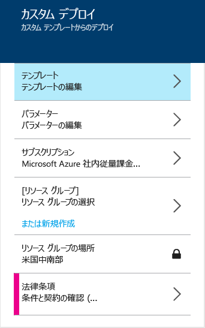
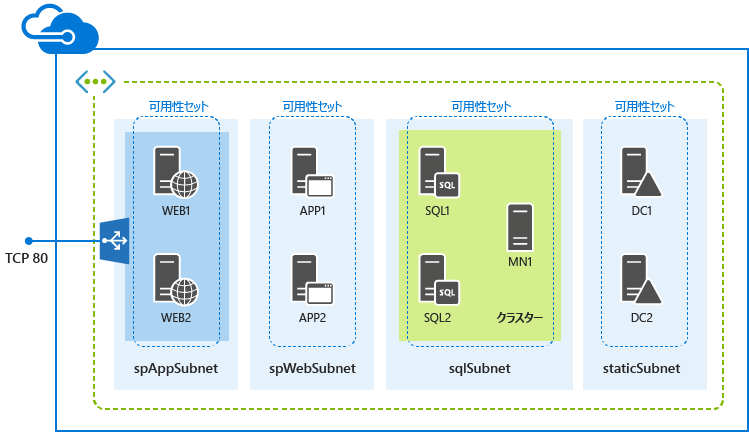

<properties
	pageTitle="ARM テンプレートを使用して SharePoint ファームをデプロイする | Microsoft Azure"
	description="リソース マネージャーのテンプレートと、Azure ポータル、Azure PowerShell、または Azure CLI を使用して、3 サーバーまたは 9 サーバーの SharePoint ファームを簡単にデプロイします。"
	services="virtual-machines"
	documentationCenter=""
	authors="JoeDavies-MSFT"
	manager="timlt"
	editor=""
	tags="azure-resource-manager"/>

<tags
	ms.service="virtual-machines"
	ms.workload="infrastructure-services"
	ms.tgt_pltfrm="vm-windows-sharepoint"
	ms.devlang="na"
	ms.topic="hero-article"
	ms.date="01/21/2016"
	ms.author="josephd"/>

# Azure リソース マネージャーのテンプレートを使用した SharePoint ファームのデプロイ

[AZURE.INCLUDE [learn-about-deployment-models](../../includes/learn-about-deployment-models-rm-include.md)]クラシック デプロイメント モデル。このリソースは、クラシック デプロイメント モデルを使用して作成することはできません。

この記事の手順では、リソース マネージャーのテンプレートを使用して、3 台または 9 台のサーバーで構成される新しい SharePoint Server 2013 ファームをデプロイします。

## 3 サーバーの SharePoint ファームのデプロイ

基本的な SharePoint Server 2013 ファームの場合、リソース マネージャーのテンプレートは、新しい仮想ネットワークの 3 つの異なるサブネットに 3 つの仮想マシンを作成します。

テンプレートは、Azure ポータル、Azure PowerShell、または Azure CLI を使用して実行できます。

> [AZURE.NOTE] また、この構成は、Azure ポータルの Azure Marketplace で [SharePoint 2013 の高可能性ファーム以外のファーム](https://azure.microsoft.com/marketplace/partners/sharepoint2013/sharepoint2013farmsharepoint2013-nonha/)のアイテムを使用して作成することもできます。

### Azure ポータル

リソース マネージャー テンプレートと Azure ポータルを使ってこのワークロードをデプロイするには、[ここ](https://portal.azure.com/#create/Microsoft.Template/uri/https%3A%2F%2Fraw.githubusercontent.com%2FAzure%2Fazure-quickstart-templates%2Fmaster%2Fsharepoint-three-vm%2Fazuredeploy.json)をクリックします。

1.	**[パラメーター]** をクリックします。**[パラメーター]** ウィンドウで、新しい値を入力、使用できる値から選択、または既定の値をそのまま使用して、**[OK]** をクリックします。
2.	必要に応じて、**[サブスクリプション]** をクリックし、適切な Azure サブスクリプションを選択します。
3.	**[リソース グループ]** をクリックし、既存のリソース グループを選択します。または、**[新規作成]** をクリックして、このワークロード用の新しいグループを作成します。
4.	必要に応じて、**[リソース グループの場所]** をクリックし、適切な Azure の場所を選択します。
6.	**[法律条項]**をクリックしてテンプレートの使用に関する条項や契約書を確認し、**[購入]** をクリックします。
7.	**[作成]** をクリックします。

テンプレートによっては、Azure でのワークロードの構築に時間がかかる場合があります。完了すると、新しい 3 サーバーの SharePoint ファームが、既存または新規のリソース グループに作成されます。

### Azure PowerShell

> [AZURE.NOTE] 次のコマンド セットは、Azure PowerShell 1.0 以降を使用します。詳細については、「[Azure PowerShell 1.0](https://azure.microsoft.com/blog/azps-1-0/)」を参照してください。

次のコマンド セットに、Azure のデプロイメント名、新しいリソース グループ名、Azure データ センターの場所を入力します。引用符内のすべての文字 (< and > を含む) を削除します。

	$deployName="<deployment name>"
	$RGName="<resource group name>"
	$locName="<Azure location, such as West US>"
	$templateURI="https://raw.githubusercontent.com/Azure/azure-quickstart-templates/master/sharepoint-three-vm/azuredeploy.json"
	New-AzureRMResourceGroup -Name $RGName -Location $locName
	New-AzureRMResourceGroupDeployment -Name $deployName -ResourceGroupName $RGName -TemplateUri $templateURI

たとえば次のようになります。

	$deployName="TestDeployment"
	$RGName="TestRG"
	$locname="West US"
	$templateURI="https://raw.githubusercontent.com/Azure/azure-quickstart-templates/master/sharepoint-three-vm/azuredeploy.json"
	New-AzureRMResourceGroup -Name $RGName -Location $locName
	New-AzureRMResourceGroupDeployment -Name $deployName -ResourceGroupName $RGName -TemplateUri $templateURI

次に、Azure PowerShell プロンプトでコマンド ブロックを実行します。

**New-AzureRMResourceGroupDeployment** コマンドを実行すると、一連のパラメーターの値を指定するよう求められます。すべてのパラメーターの値を指定すると、**New-AzureRMResourceGroupDeployment** により仮想マシンが作成、構成されます。

テンプレートの実行が完了すると、新しい 3 サーバーの SharePoint ファームが、新しいリソース グループに作成されます。

### Azure CLI

開始する前に、適切なバージョンの Azure CLI がインストールされていること、ログインしていること、新しいリソース マネージャー モードに切り替えていることを確認します。詳細については、[こちら](virtual-machines-deploy-rmtemplates-azure-cli.md#getting-ready)をクリックします。

まず、新しいリソース グループを作成します。次のコマンドを使用して、グループの名前と、デプロイ先の Azure データ センターの場所を指定します。

	azure group create <group name> <location>

次に、次のコマンドを使用して、新しいリソース グループの名前と、Azure デプロイメントの名前を指定します。

	azure group deployment create --template-uri https://raw.githubusercontent.com/Azure/azure-quickstart-templates/master/sharepoint-three-vm/azuredeploy.json <group name> <deployment name>

たとえば次のようになります。

	azure group create sp3serverfarm eastus2
	azure group deployment create --template-uri https://raw.githubusercontent.com/Azure/azure-quickstart-templates/master/sharepoint-three-vm/azuredeploy.json sp3serverfarm spdevtest

**azure group deployment create** コマンドを実行すると、一連のパラメーターの値を指定するよう求められます。すべてのパラメーター値を指定したら、Azure により仮想マシンが作成、構成されます。

新しいリソース グループに新しい 3 サーバーの SharePoint ファームが作成されます。

## 9 サーバーの SharePoint ファームのデプロイ

高可用性の SharePoint Server 2013 ファームの場合、リソース マネージャーのテンプレートは、新しい仮想ネットワークの 4 つの異なるサブネットに 9 つの仮想マシンを作成します。

> [AZURE.NOTE] この構成は、Azure ポータルの Azure Marketplace で [SharePoint 2013 の高可用性ファーム](https://azure.microsoft.com/marketplace/partners/sharepoint2013/sharepoint2013farmsharepoint2013-ha/)のアイテムを使用して作成することもできます。

### Azure ポータル

リソース マネージャー テンプレートと Azure ポータルを使ってこのワークロードをデプロイするには、[ここ](https://portal.azure.com/#create/Microsoft.Template/uri/https%3A%2F%2Fraw.githubusercontent.com%2FAzure%2Fazure-quickstart-templates%2Fmaster%2Fsharepoint-server-farm-ha%2Fazuredeploy.json)をクリックします。

1.	**[パラメーター]** をクリックします。**[パラメーター]** ウィンドウで、新しい値を入力、使用できる値から選択、または既定の値をそのまま使用して、**[OK]** をクリックします。
2.	必要に応じて、**[サブスクリプション]** をクリックし、適切な Azure サブスクリプションを選択します。
3.	**[リソース グループ]** をクリックし、既存のリソース グループを選択します。または、**[新規作成]** をクリックして、このワークロード用の新しいグループを作成します。
4.	必要に応じて、**[リソース グループの場所]** をクリックし、適切な Azure の場所を選択します。
5.	**[法律条項]**をクリックしてテンプレートの使用に関する条項や契約書を確認し、**[購入]** をクリックします。
6.	**[作成]** をクリックします。

テンプレートによっては、Azure でのワークロードの構築に時間がかかる場合があります。完了すると、新しい 9 サーバーの SharePoint ファームが、既存または新規のリソース グループに作成されます。

### Azure PowerShell

> [AZURE.NOTE] 次のコマンド セットは、Azure PowerShell 1.0 以降を使用します。詳細については、「[Azure PowerShell 1.0](https://azure.microsoft.com/blog/azps-1-0/)」を参照してください。

次のコマンド セットに、Azure のデプロイメント名、新しいリソース グループ名、Azure データ センターの場所を入力します。引用符内のすべての文字 (< and > を含む) を削除します。

	$deployName="<deployment name>"
	$RGName="<resource group name>"
	$locName="<Azure location, such as West US>"
	$templateURI="https://raw.githubusercontent.com/Azure/azure-quickstart-templates/master/sharepoint-server-farm-ha/azuredeploy.json"
	New-AzureRMResourceGroup -Name $RGName -Location $locName
	New-AzureRMResourceGroupDeployment -Name $deployName -ResourceGroupName $RGName -TemplateUri $templateURI

たとえば次のようになります。

	$deployName="TestDeployment"
	$RGName="TestRG"
	$locname="West US"
	$templateURI="https://raw.githubusercontent.com/Azure/azure-quickstart-templates/master/sharepoint-server-farm-ha/azuredeploy.json"
	New-AzureRMResourceGroup -Name $RGName -Location $locName
	New-AzureRMResourceGroupDeployment -Name $deployName -ResourceGroupName $RGName -TemplateUri $templateURI

次に、Azure PowerShell コマンド プロンプトでコマンド ブロックを実行します。

**New-AzureRMResourceGroupDeployment** コマンドを実行すると、一連のパラメーターの値を指定するよう求められます。すべてのパラメーターの値を指定すると、**New-AzureRMResourceGroupDeployment** により仮想マシンが作成、構成されます。

テンプレートの実行が完了すると、新しい 9 サーバーの SharePoint ファームが、新しいリソース グループに作成されます。

### Azure CLI

開始する前に、適切なバージョンの Azure CLI がインストールされていること、ログインしていること、新しいリソース マネージャー モードに切り替えていることを確認します。詳細については、[こちら](virtual-machines-deploy-rmtemplates-azure-cli.md#getting-ready)をクリックします。

最初に、新しいリソース グループを作成します。次のコマンドを使用して、グループの名前と、デプロイ先の Azure データ センターの場所を指定します。

	azure group create <group name> <location>

次に、次のコマンドを使用して、新しいリソース グループの名前と、Azure デプロイメントの名前を指定します。

	azure group deployment create --template-uri https://raw.githubusercontent.com/Azure/azure-quickstart-templates/master/sharepoint-server-farm-ha/azuredeploy.json <group name> <deployment name>

たとえば次のようになります。

	azure group create sphaserverfarm eastus2
	azure group deployment create --template-uri https://raw.githubusercontent.com/Azure/azure-quickstart-templates/master/sharepoint-server-farm-ha/azuredeploy.json sphaserverfarm spdevtest

**azure group deployment create** コマンドを実行すると、一連のパラメーターの値を指定するよう求められます。すべてのパラメーター値を指定したら、Azure により仮想マシンが作成、構成されます。

テンプレートの実行が完了すると、新しい 9 サーバーの SharePoint Server 2013 ファームが、新しいリソース グループに作成されます。

## 次のステップ

- Azure インフラストラクチャ サービスでの追加の [SharePoint 2013](https://technet.microsoft.com/library/dn635309.aspx) 構成を検出します。

<!---HONumber=AcomDC_0128_2016-->