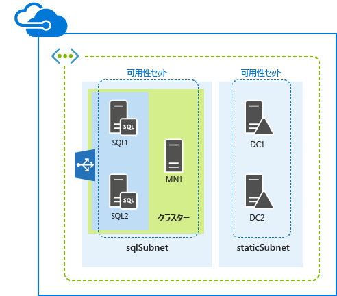
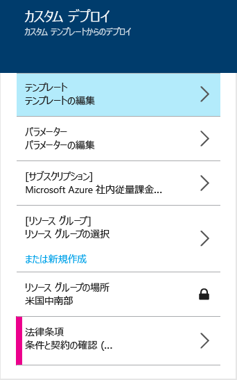

<properties
	pageTitle="Azure リソース マネージャーのテンプレートを使用した SQL Server AlwaysOn | Microsoft Azure"
	description="リソース マネージャーのテンプレートと、Azure ポータル、Azure PowerShell、または Azure CLI を使用して、SQL Server AlwaysOn をサポートする 5 つのサーバーを簡単にデプロイします。"
	services="virtual-machines"
	documentationCenter=""
	authors="davidmu1"
	manager="timlt"
	editor=""
	tags="azure-resource-manager"/>

<tags
	ms.service="virtual-machines"
	ms.workload="infrastructure-services"
	ms.tgt_pltfrm="vm-windows-sql-server"
	ms.devlang="na"
	ms.topic="hero-article"
	ms.date="10/08/2015"
	ms.author="davidmu"/>

# Azure リソース マネージャーのテンプレートを使用した SQL Server AlwaysOn のデプロイ

[AZURE.INCLUDE [learn-about-deployment-models](../../includes/learn-about-deployment-models-rm-include.md)]クラシック デプロイ モデル。このリソースは、クラシック デプロイ モデルを使用して作成することはできません。

この記事の手順を使用すると、Azure リソース マネージャーのテンプレートを使用して SQL Server AlwaysOn をデプロイできます。このテンプレートでは、新しい仮想ネットワークの 2 つの異なるサブネット上に 5 つの仮想マシンが作成されます。

テンプレートは、Azure ポータル、Azure PowerShell、または Azure CLI を使用して実行できます。

## Azure ポータル

Azure リソース マネージャー テンプレートと Azure ポータルを使ってこのワークロードをデプロイするには、[ここ](https://portal.azure.com/#create/Microsoft.Template/uri/https%3A%2F%2Fraw.githubusercontent.com%2FAzure%2Fazure-quickstart-templates%2Fmaster%2Fsql-server-2014-alwayson-dsc%2Fazuredeploy.json)をクリックします。

1.	**[テンプレート]** ウィンドウで、**[保存]** をクリックします。
2.	**[パラメーター]** をクリックします。**[パラメーター]** ウィンドウで、新しい値を入力、使用できる値から選択、または既定の値をそのまま使用して、**[OK]** をクリックします。
3.	必要に応じて、**[サブスクリプション]** をクリックし、適切な Azure サブスクリプションを選択します。
4.	**[リソース グループ]** をクリックし、既存のリソース グループを選択します。または、**[新規作成]** をクリックして、このワークロード用の新しいグループを作成します。
5.	必要に応じて、**[リソース グループの場所]** をクリックし、適切な Azure の場所を選択します。
6.	必要に応じて、**[法律条項]**をクリックして、テンプレートの使用に関する条項や契約書を確認します。
7.	**[作成]** をクリックします。

テンプレートによっては、Azure でのワークロードの構築に時間がかかる場合があります。テンプレートの実行が完了すると、5 サーバーの新しい SQL Server AlwaysOn 構成が既存または新規のリソース グループに作成されます。

## Azure PowerShell

[AZURE.INCLUDE [powershell-preview](../../includes/powershell-preview-inline-include.md)]

次のコマンド セットに、Azure のデプロイ名、新しいリソース グループ名、Azure データ センターの場所を入力します。引用符内のすべての文字 (< and > を含む) を削除します。

	$deployName="<deployment name>"
	$RGName="<resource group name>"
	$locName="<Azure location, such as West US>"
	$templateURI="https://raw.githubusercontent.com/Azure/azure-quickstart-templates/master/sql-server-2014-alwayson-dsc/azuredeploy.json"
	New-AzureRmResourceGroup -Name $RGName -Location $locName
	New-AzureRmResourceGroupDeployment -Name $deployName -ResourceGroupName $RGName -TemplateUri $templateURI

たとえば次のようになります。

	$deployName="TestDeployment"
	$RGName="TestRG"
	$locname="West US"
	$templateURI="https://raw.githubusercontent.com/Azure/azure-quickstart-templates/master/sql-server-2014-alwayson-dsc/azuredeploy.json"
	New-AzureRmResourceGroup -Name $RGName -Location $locName
	New-AzureRmResourceGroupDeployment -Name $deployName -ResourceGroupName $RGName -TemplateUri $templateURI

次に、Azure PowerShell プロンプトでコマンド ブロックを実行します。

**New-AzureRmResourceGroupDeployment** コマンドを実行すると、一連のパラメーターの値を指定するよう求められます。すべてのパラメーターの値を指定すると、**New-AzureRmResourceGroupDeployment** により仮想マシンが作成、構成されます。

テンプレートの実行が完了すると、5 サーバーの新しい SQL Server AlwaysOn 構成が新しいリソース グループに作成されます。

## Azure CLI

開始する前に、適切なバージョンの Azure CLI がインストールされていること、ログインしていること、新しいリソース マネージャー モードに切り替えていることを確認します。詳細については、[こちら](virtual-machines-deploy-rmtemplates-azure-cli.md#getting-ready)をクリックします。

まず、新しいリソース グループを作成します。次のコマンドを使用して、グループの名前と、デプロイ先の Azure データ センターの場所を指定します。

	azure group create <group name> <location>

次に、次のコマンドを使用して、新しいリソース グループの名前と、Azure デプロイの名前を指定します。

	azure group deployment create --template-uri https://raw.githubusercontent.com/Azure/azure-quickstart-templates/master/sql-server-2014-alwayson-dsc/azuredeploy.json <group name> <deployment name>

たとえば次のようになります。

	azure group create sqlao eastus2
	azure group deployment create --template-uri https://raw.githubusercontent.com/Azure/azure-quickstart-templates/master/sql-server-2014-alwayson-dsc/azuredeploy.json sqlao sqldevtest

**azure group deployment create** コマンドを実行すると、一連のパラメーターの値を指定するよう求められます。すべてのパラメーター値を指定したら、Azure により仮想マシンが作成、構成されます。

テンプレートの実行が完了すると、5 サーバーの新しい SQL Server AlwaysOn 構成が新しいリソース グループに作成されます。

## その他のリソース

[Azure リソース マネージャー テンプレートと Azure PowerShell を使用した Virtual Machines のデプロイと管理](virtual-machines-deploy-rmtemplates-powershell.md)

[Azure リソース マネージャーにおける Azure Compute、Network、Storage プロバイダー](virtual-machines-azurerm-versus-azuresm.md)

[Azure リソース マネージャーの概要](../resource-group-overview.md)

[Azure リソース マネージャー テンプレートと Azure CLI を使用した Virtual Machines のデプロイと管理](virtual-machines-deploy-rmtemplates-azure-cli.md)

[Virtual Machines のドキュメント](http://azure.microsoft.com/documentation/services/virtual-machines/)

[Azure PowerShell のインストールおよび構成方法](../install-configure-powershell.md)

<!---HONumber=AcomDC_1203_2015-->