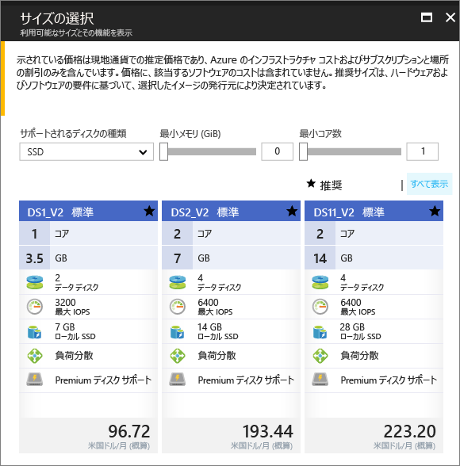

# <a name="create-a-windows-virtual-machine-in-an-availability-zone-with-the-azure-portal"></a>Azure Portal を使用して可用性ゾーン内に Windows 仮想マシンを作成する

この記事では、Azure Portal を使用して Azure 可用性ゾーン内に仮想マシンを作成する手順を説明します。 [可用性ゾーン](../../availability-zones/az-overview.md)とは、1 つの Azure リージョン内で物理的に分離されたゾーンのことです。 可用性ゾーンは、データセンター全体に及ぶ珍しい障害や損失からアプリとデータを保護するために使用します。

[!INCLUDE [availability-zones-preview-statement.md](../../../includes/availability-zones-preview-statement.md)]


## <a name="log-in-to-azure"></a>Azure へのログイン 

Azure Portal (https://portal.azure.com) にログインします。

## <a name="create-virtual-machine"></a>仮想マシンの作成

1. Azure ポータルの左上隅にある **[新規]** ボタンをクリックします。

2. **[コンピューティング]**、**[Windows Server 2016 Datacenter]** の順に選択します。 

3. 仮想マシンの情報を入力します。 ここに入力したユーザー名とパスワードが、仮想マシンへのログインに使用されます。 完了したら、**[OK]** をクリックします。

    

4. VM のサイズを選択します。 その他のサイズも表示するには、**[すべて表示]** を選択するか、**[Supported disk type (サポートされているディスクの種類)]** フィルターを変更します。 可用性ゾーン (プレビュー) でサポートされているいずれかのサイズ (*DS1_v2 Standard* など) を慎重に選択してください。 

      

5. **[設定]** > **[高可用性]** で、**[可用性ゾーン]** ドロップダウン リストからいずれかの番号付きのゾーンを選択し、残りを既定値のままにして、**[OK]** をクリックします。

    

6. 概要ページで **[購入]** をクリックして、仮想マシンの展開を開始します。

7. 対応する VM が、Azure Portal のダッシュボードにピン留めされます。 デプロイが完了すると、VM の概要が自動的に表示されます。


## <a name="zone-for-ip-address-and-managed-disk"></a>IP アドレスおよび管理ディスクのゾーン

VM が可用性ゾーン内にデプロイされると、IP アドレスと管理ディスク リソースが同じ可用性ゾーン内にデプロイされます。 Azure PowerShell を使用してゾーンの設定を確認することができます。 インストールまたはアップグレードする必要がある場合は、[Azure PowerShell モジュールのインストール](/powershell/azure/install-azurerm-ps)に関するページを参照してください。

次の例では、*myResourceGroup* という名前のリソース グループ内のリソースに関する情報を取得します。 VM の作成に使用したリソース グループの名前で置き換えます。

[Get-AzureRmPublicIpAddress](/en-us/powershell/module/azurerm.network/get-azurermpublicipaddress) を使用して、パブリック IP アドレスのゾーンを確認します。

```powershell
Get-AzureRmPublicIpAddress -ResourceGroupName myResourceGroup
```
この出力の `Zones` 設定は、パブリック IP アドレスが VM と同じ可用性ゾーン内にあることを示しています。

```powershell
Name                     : myVM-ip
ResourceGroupName        : myResourceGroup
Location                 : eastus2
Id                       : /subscriptions/e44f251c-c67e-4760-9ed6-bf99a306ecff/resourceGroups/danlep0911/providers/Micr
                           osoft.Network/publicIPAddresses/myVM-ip
Etag                     : W/"b67e14c0-7e8a-4d12-91c5-da2a5dfad132"
ResourceGuid             : 314bf57d-9b25-4474-9282-db3561d536aa
ProvisioningState        : Succeeded
Tags                     :
PublicIpAllocationMethod : Dynamic
IpAddress                : 13.68.16.25
PublicIpAddressVersion   : IPv4
IdleTimeoutInMinutes     : 4
IpConfiguration          : {
                             "Id": "/subscriptions/e44f251c-c67e-4760-9ed6-bf99a306ecff/resourceGroups/myResourceGroup/providers/Microsoft.Network/networkInterfaces/myVM11842/ipConfigurations/ipconfig1"
                           }
DnsSettings              : null
Zones                    : {2}
```


VM の管理ディスク リソースも、同じ可用性ゾーンに作成されます。 このことは、[Get-AzureRmDisk](/powershell/module/azurerm.compute/get-azurermdisk) で確認できます。

```powershell
Get-AzureRmDisk -ResourceGroupName myResourceGroup
```

この出力は、管理ディスクが VM と同じ可用性ゾーン内にあることを示しています。

```powershell
ResourceGroupName  : myResourceGroup
AccountType        : PremiumLRS
OwnerId            : /subscriptions/d5b9d4b7-6fc1-0000-0000-000000000000/resourceGroups/myResourceGroup/providers/Microsoft.
                     Compute/virtualMachines/myVM
ManagedBy          : /subscriptions/d5b9d4b7-6fc1-0000-0000-000000000000/resourceGroups/myResourceGroup/providers/Microsoft.
                     Compute/virtualMachines/myVM
Sku                : Microsoft.Azure.Management.Compute.Models.DiskSku
Zones              : {2}
TimeCreated        : 9/7/2017 6:57:26 PM
OsType             : Windows
CreationData       : Microsoft.Azure.Management.Compute.Models.CreationData
DiskSizeGB         : 127
EncryptionSettings :
ProvisioningState  : Succeeded
Id                 : /subscriptions/d5b9d4b7-6fc1-0000-0000-000000000000/resourceGroups/myResourceGroup/providers/Microsoft.
                     Compute/disks/myVM_OsDisk_1_bd921920bb0a4650becfc2d830000000
Name               : myVM_OsDisk_1_bd921920bb0a4650becfc2d830000000
Type               : Microsoft.Compute/disks
Location           : eastus2
Tags               : {}
```

## <a name="next-steps"></a>次のステップ

この記事では、可用性ゾーン内に VM を作成する方法を説明しました。 Azure VM の[リージョンと可用性](regions-and-availability.md)の詳細を確認してください。
