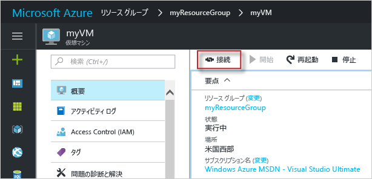

# <a name="quickstart-create-a-windows-virtual-machine-in-the-azure-portal"></a>クイック スタート: Azure portal で Windows 仮想マシンを作成する

Azure 仮想マシン (VM) は、Azure portal で作成できます。 この方法では、ブラウザー ベースのユーザー インターフェイスを使用して、VM とその関連リソースを作成できます。 このクイック スタートでは、Azure portal を使用して、Windows Server 2016 を実行する仮想マシン (VM) を Azure にデプロイする方法を示します。 次に、VM の動作を確認するために、VM に RDP 接続し、IIS Web サーバーをインストールします。

Azure サブスクリプションをお持ちでない場合は、開始する前に [無料アカウント](https://azure.microsoft.com/free/?WT.mc_id=A261C142F) を作成してください。

## <a name="sign-in-to-azure"></a>Azure へのサインイン

Azure Portal (https://portal.azure.com) にサインインします。

## <a name="create-virtual-machine"></a>仮想マシンの作成

1. Azure portal の左上隅にある **[リソースの作成]** を選択します。

2. Azure Marketplace リソースの一覧の上にある検索ボックスで **Windows Server 2016 Datacenter** を検索して選択し、**[作成]** を選択します。

3. VM 名 (たとえば、*myVM*) を指定します。ディスクの種類を *[SSD]* のままにし、ユーザー名 (たとえば、*azureuser*) を指定します。 パスワードは 12 文字以上で、[定義された複雑さの要件](faq.md#what-are-the-password-requirements-when-creating-a-vm)を満たす必要があります。

    

5. リソース グループを**新規作成**し、名前 (たとえば、*myResourceGroup*) を指定します。 **場所**を選択し、**[OK]** を選択します。

4. VM のサイズを選択します。 たとえば、"*計算の種類*" または "*ディスクの種類*" でフィルター処理することができます。 推奨される VM サイズは *D2s_v3* です。 サイズを選択した後、**[選択]** をクリックします。

    

5. **[設定]** ページで **[ネットワーク]** > **[ネットワーク セキュリティ グループ]** > **[パブリック受信ポートを選択]** の順に移動し、ドロップダウンから **[HTTP]** と **[RDP (3389)]** を選択します。 残りの部分は既定値のままにし、**[OK]** を選択します。

6. 概要ページで、**[作成]** を選択して、VM のデプロイを開始します。

7. 対応する VM が、Azure portal のダッシュボードにピン留めされます。 デプロイが完了すると、VM の概要が自動的に表示されます。

## <a name="connect-to-virtual-machine"></a>仮想マシンへの接続

仮想マシンへのリモート デスクトップ接続を作成します。 この手順では、Windows コンピューターから、VM に接続する方法を示します。 Mac では、この[リモート デスクトップ クライアント](https://itunes.apple.com/us/app/microsoft-remote-desktop/id715768417?mt=12)のような RDP クライアントを Mac App Store から入手する必要があります。

1. 仮想マシンのプロパティ ページで、**[接続]** ボタンをクリックします。 

    
    
2. **[Connect to virtual machine]\(仮想マシンへの接続\)** ページで、ポート 3389 を介して DNS 名で接続する既定のオプションをそのまま使用して、**[RDP ファイルのダウンロード]** をクリックします。

2. ダウンロードした RDP ファイルを開き、プロンプトが表示されたら **[接続]** をクリックします。 

3. **[Windows セキュリティ]** ウィンドウで、**[その他]**、**[別のアカウントを使用する]** の順に選択します。 ユーザー名として「*vmname*\\*username*」と入力し、仮想マシン用に作成したパスワードを入力して、**[OK]** をクリックします。

4. サインイン処理中に証明書の警告が表示される場合があります。 **[はい]** または **[続行]** をクリックして接続を作成します。

## <a name="install-web-server"></a>Web サーバーのインストール

VM の動作を確認するために、IIS Web サーバーをインストールします。 VM で PowerShell プロンプトを開き、次のコマンドを実行します。

```powershell
Install-WindowsFeature -name Web-Server -IncludeManagementTools
```

終了したら、VM への RDP 接続を閉じます。


## <a name="view-the-iis-welcome-page"></a>IIS のようこそページの表示

ポータルで VM を選択し、VM の概要で IP アドレスの右側にある **[クリックしてコピー]** ボタンを使用してアドレスをコピーして、ブラウザーのタブに貼り付けます。次のような、既定の IIS のようこそページが開かれます。


## <a name="clean-up-resources"></a>リソースのクリーンアップ

必要がなくなったら、リソース グループ、仮想マシン、およびすべての関連リソースを削除できます。 これを行うには、仮想マシンのリソース グループを選択し、**[削除]** を選択して、削除するリソース グループの名前を確認します。

## <a name="next-steps"></a>次の手順

このクイック スタートでは、単純な仮想マシンをデプロイし、Web トラフィック用のネットワーク ポートを開き、基本的な Web サーバーをインストールしました。 Azure 仮想マシンの詳細については、Windows VM のチュートリアルを参照してください。

> [!div class="nextstepaction"]
> [Azure Windows 仮想マシンのチュートリアル](./tutorial-manage-vm.md)
