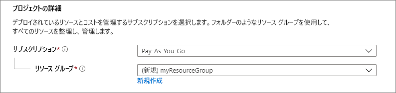
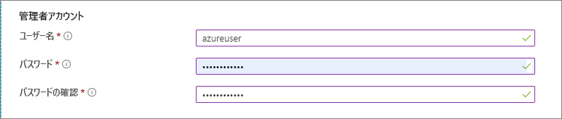
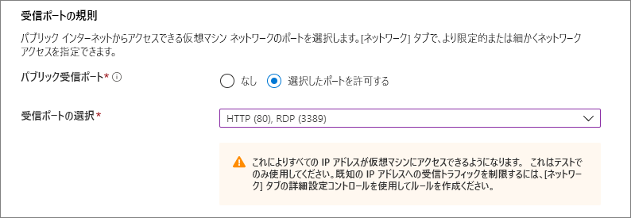

# <a name="quickstart-create-a-windows-virtual-machine-in-the-azure-portal"></a>クイック スタート:Azure ポータルで Windows 仮想マシンを作成する

Azure 仮想マシン (VM) は、Azure portal で作成できます。 この方法では、ブラウザー ベースのユーザー インターフェイスを使用して、VM とその関連リソースを作成できます。 このクイック スタートでは、Azure portal を使用して、Windows Server 2019 を実行する仮想マシン (VM) を Azure にデプロイする方法を示します。 次に、VM の動作を確認するために、VM に RDP 接続し、IIS Web サーバーをインストールします。

Azure サブスクリプションをお持ちでない場合は、開始する前に [無料アカウント](https://azure.microsoft.com/free/?WT.mc_id=A261C142F) を作成してください。

## <a name="sign-in-to-azure"></a>Azure へのサインイン

Azure Portal ( https://portal.azure.com ) にサインインします。

## <a name="create-virtual-machine"></a>仮想マシンの作成

1. 検索に「**virtual machines**」と入力します。
1. **[サービス]** で、 **[仮想マシン]** を選択します。
1. **[仮想マシン]** ページで、 **[追加]** を選択します。 
1. **[基本]** タブの **[Project details] (プロジェクトの詳細)** で、正しいサブスクリプションが選択されていることを確認し、リソース グループの **[新規作成]** を選択します。 名前として「*myResourceGroup*」と入力します。 

    

1. **[インスタンスの詳細]** で、 **[仮想マシン名]** として「*myVM*」と入力し、 **[リージョン]** として *[米国東部]* を選択し、 **[イメージ]** として *[Windows Server 2019 Datacenter]* を選択します。 他の既定値はそのままにします。

    ![[Instance details] (インスタンスの詳細) セクション](./media/quick-create-portal/instance-details.png)

1. **[Administrator account] (管理者アカウント)** で、ユーザー名 (*azureuser* など) とパスワードを指定します。 パスワードは 12 文字以上で、[定義された複雑さの要件](faq.md#what-are-the-password-requirements-when-creating-a-vm)を満たす必要があります。

    

1. **[受信ポートの規則]** で **[選択したポートを許可する]** を選択し、ドロップダウンから **[RDP (3389)]** と **[HTTP (80)]** を選択します。

    

1. 残りの既定値はそのままにして、ページの一番下にある **[Review + create] (確認および作成)** ボタンを選択します。

    ![[Review and create] (確認および作成)](./media/quick-create-portal/review-create.png)


## <a name="connect-to-virtual-machine"></a>仮想マシンへの接続

仮想マシンへのリモート デスクトップ接続を作成します。 この手順では、Windows コンピューターから、VM に接続する方法を示します。 Mac では、この[リモート デスクトップ クライアント](https://itunes.apple.com/us/app/microsoft-remote-desktop/id715768417?mt=12)のような RDP クライアントを Mac App Store から入手する必要があります。

1. 仮想マシンの概要ページで **[接続]** ボタンをクリックします。 

    
    
2. **[仮想マシンに接続する]** ページで、ポート 3389 を介して IP アドレスで接続する既定のオプションをそのまま使用して、 **[RDP ファイルのダウンロード]** をクリックします。

2. ダウンロードした RDP ファイルを開き、プロンプトが表示されたら **[接続]** をクリックします。 

3. **[Windows セキュリティ]** ウィンドウで、 **[その他]** 、 **[別のアカウントを使用する]** の順に選択します。 ユーザー名として「**localhost**\\*username*」と入力し、仮想マシン用に作成したパスワードを入力して、 **[OK]** をクリックします。

4. サインイン処理中に証明書の警告が表示される場合があります。 **[はい]** または **[続行]** をクリックして接続を作成します。

## <a name="install-web-server"></a>Web サーバーのインストール

VM の動作を確認するために、IIS Web サーバーをインストールします。 VM で PowerShell プロンプトを開き、次のコマンドを実行します。

```powershell
Install-WindowsFeature -name Web-Server -IncludeManagementTools
```

終了したら、VM への RDP 接続を閉じます。


## <a name="view-the-iis-welcome-page"></a>IIS のようこそページの表示

ポータルで VM を選択し、VM の概要で IP アドレスの右側にある **[クリックしてコピー]** ボタンを使用してアドレスをコピーして、ブラウザーのタブに貼り付けます。次のような、既定の IIS のようこそページが開かれます。


## <a name="clean-up-resources"></a>リソースをクリーンアップする

必要がなくなったら、リソース グループ、仮想マシン、およびすべての関連リソースを削除できます。 

仮想マシンのリソース グループを選択し、 **[削除]** をクリックします。 リソース グループの名前を確認してリソースの削除を終了します。

## <a name="next-steps"></a>次のステップ

このクイック スタートでは、単純な仮想マシンをデプロイし、Web トラフィック用のネットワーク ポートを開き、基本的な Web サーバーをインストールしました。 Azure 仮想マシンの詳細については、Windows VM のチュートリアルを参照してください。

> [!div class="nextstepaction"]
> [Azure Windows 仮想マシンのチュートリアル](./tutorial-manage-vm.md)