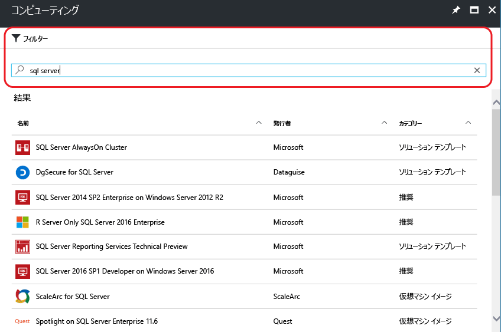
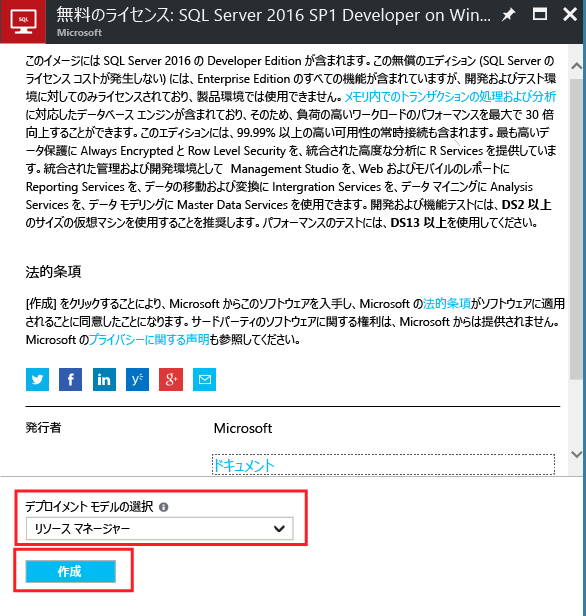
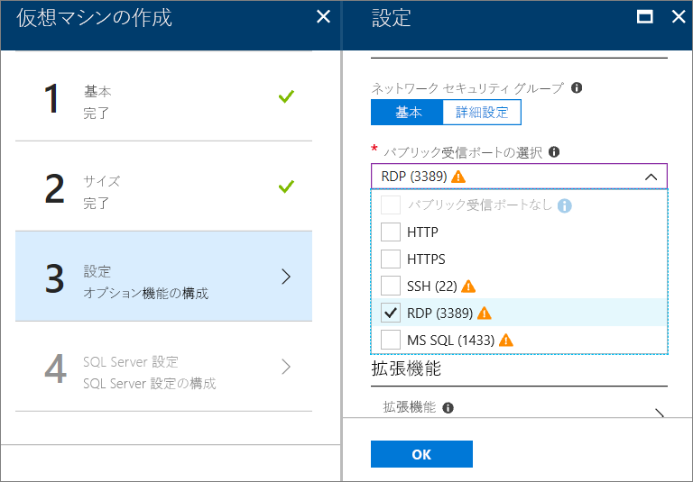
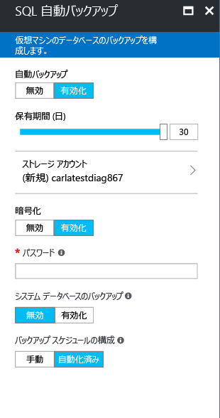

# Azure Portal で Windows SQL Server 仮想マシンをプロビジョニングする方法

このガイドでは、Azure Portal で Windows SQL Server 仮想マシンを作成する際に使用できるさまざまなオプションについて説明します。 この記事では、[SQL Server VM のクイック スタート](quickstart-sql-vm-create-portal.md)で説明されていない構成オプションについて、プロビジョニング タスクの一例を通じて詳しく説明します。 

このガイドは、SQL Server VM を作成する目的にも使用できますし、 Azure Portal で使用できるオプションを参照する目的にも使用できます。

> [!TIP]
> SQL Server の仮想マシンに関するご質問については、[よくあるご質問](virtual-machines-windows-sql-server-iaas-faq.md)に関するページをご覧ください。

Azure サブスクリプションをお持ちでない場合は、開始する前に [無料アカウント](https://azure.microsoft.com/free/?WT.mc_id=A261C142F) を作成してください。

##  SQL Server 仮想マシン ギャラリー イメージ

SQL Server 仮想マシンを作成する際には、仮想マシン ギャラリーにあるいくつかの事前構成済みイメージの中から、使用するイメージを選択できます。 次の手順は、SQL Server 2017 イメージの中から、イメージを 1 つを選択する方法を示したものです。

1. アカウントを使用して [Azure Portal](https://portal.azure.com) にログインします。

1. Azure Portal で、**[リソースの作成]** をクリックします。 **[新規]** ウィンドウが開きます。

1. **[新規]** ウィンドウで、**[Compute]** をクリックし、**[すべて表示]** をクリックします。

   ![新しい [Compute] ウィンドウ](./media/virtual-machines-windows-portal-sql-server-provision/azure-new-compute-blade.png)

1. 検索フィールドに「**SQL Server 2017**」と入力し、Enter キーを押します。

1. 次に **[フィルター]** アイコンをクリックします。

1. [フィルター] ウィンドウで、**[Windows ベース]** サブカテゴリと発行元の **[Microsoft]** をオンにします。 **[完了]** をクリックして、結果を Microsoft 発行の Windows SQL Server イメージにフィルター処理します。

   

1. 使用可能な SQL Server イメージを確認します。 各イメージは、SQL Server のバージョンとオペレーティング システムを示しています。

1. **Free SQL Server License: SQL Server 2017 Developer on Windows Server 2016** という名前のイメージを選択します。

   > [!TIP]
   > このチュートリアルでは Developer エディションを使用しています。これは、開発テスト用に SQL Server のフル機能を使用できる無償エディションです。 ユーザーは VM を実行するコストに対してのみ課金されます。 ただし、このチュートリアルでは、任意のイメージを選択してかまいません。 使用可能なイメージの説明は、[SQL Server Windows 仮想マシンの概要](virtual-machines-windows-sql-server-iaas-overview.md#payasyougo)に関する記事をご覧ください。

   > [!TIP]
   > SQL Server のライセンス コストは、作成した VM の 1 秒あたりの料金に組み込まれており、エディションやコア数によって異なります。 ただし、SQL Server Developer エディションは、無料で開発/テストできる (運用向けではない) エディションで、SQL Express は、無料で軽量のワークロード (1 GB 未満のメモリ、10 GB 未満のストレージ) を利用できるエディションです。 また、ライセンス持ち込み (BYOL) により VM の料金のみを支払うこともできます。 それらのイメージの名前には、{BYOL} というプレフィックスが付きます。 
   >
   > これらのオプションの詳細については、「[Pricing guidance for SQL Server Azure VMs (SQL Server Azure VM の料金ガイダンス)](virtual-machines-windows-sql-server-pricing-guidance.md)」を参照してください。

1. **[デプロイ モデルの選択]** で **[Resource Manager]** が選択されていることを確認します。 Resource Manager が、新しい仮想マシンに推奨されるデプロイ モデルです。 

1. **Create** をクリックしてください。

    

##  構成オプション
SQL Server 仮想マシンを構成するための 5 つのウィンドウがあります。

| 手順 | 説明 |
| --- | --- |
| **基本** |[基本設定を構成する](#1-configure-basic-settings) |
| **サイズ** |[仮想マシンのサイズを選択する](#2-choose-virtual-machine-size) |
| **設定** |[オプション機能を構成する](#3-configure-optional-features) |
| **SQL Server の設定** |[SQL Server の設定を構成する](#4-configure-sql-server-settings) |
| **まとめ** |[概要を確認する](#5-review-the-summary) |

## 1.基本設定を構成する

**[基本]** ウィンドウで、次の情報を指定します。

* 仮想マシンの一意の **名前**を入力します。

* 最適なパフォーマンスのために、VM ディスクの種類として **[SSD]** を選択します。

* VM のローカル管理者アカウントの **ユーザー名** を指定します。 このアカウントは、SQL Server の **sysadmin** 固定サーバー ロールにも追加されます。

* 強力な **パスワード**を指定します。

* 複数のサブスクリプションがある場合は、新しい VM に対してサブスクリプションが正しいことを確認します。

* **[リソース グループ]** ボックスに、新しいリソース グループの名前を入力します。 または、既存のリソース グループを使用する場合は、**[既存のものを使用]** をクリックします。 リソース グループとは、Azure の関連リソース (仮想マシン、ストレージ アカウント、仮想ネットワークなど) のコレクションです。

  > [!NOTE]
  > Azure における SQL Server のデプロイについてテストまたは調査のみを実施する場合は、新しいリソース グループを使用すると便利です。 テストが完了したら、リソース グループを削除します。そうすると、そのリソース グループに関連付けられている VM とすべてのリソースが自動的に削除されます。 リソース グループの詳細については、「[Azure Resource Manager の概要](../../../azure-resource-manager/resource-group-overview.md)」を参照してください。

* このデプロイをホストする Azure リージョンを **[場所]** で選択します。

* **[OK]** をクリックして設定を保存します。

    ![SQL の [基本] ウィンドウ](./media/virtual-machines-windows-portal-sql-server-provision/azure-sql-basic.png)

## 2.仮想マシンのサイズを選択する

この**サイズ**設定の手順では、**[サイズの選択]** ウィンドウで仮想マシンのサイズを選択します。 ウィンドウには、選択したイメージに基づいて推奨されるマシン サイズが最初に表示されます。

> [!IMPORTANT]
> **[サイズの選択]** ウィンドウに表示される月額料金の見積もりには、SQL Server のライセンス費用は含まれていません。 この見積もり料金は VM 単体の費用です。 SQL Server Express エディションと SQL Server Developer エディションでは、この見積もり料金が概算費用の合計になります。 他のエディションについては、「[Windows Virtual Machines の料金](https://azure.microsoft.com/pricing/details/virtual-machines/windows/)」で、ターゲットの SQL Server エディションを選択して確認できます。 また、「[Pricing guidance for SQL Server Azure VMs (SQL Server Azure VM の料金ガイダンス)](virtual-machines-windows-sql-server-pricing-guidance.md)」も参照してください。

運用時のワークロードについては、「[Azure Virtual Machines における SQL Server のパフォーマンスに関するベスト プラクティス](virtual-machines-windows-sql-performance.md)」のマシンのサイズと構成に関する推奨事項を参照してください。

> [!NOTE]
> 仮想マシン サイズの詳細については、[仮想マシンのサイズ](../sizes.md?toc=%2fazure%2fvirtual-machines%2fwindows%2ftoc.json)に関するページを参照してください。

マシン サイズを選択し、 **[選択]** をクリックします。

## 手順 3.オプション機能を構成する

**[設定]** ウィンドウで、仮想マシン用に Azure Storage、ネットワーク、監視を構成します。

* **[ストレージ]** で、**[Managed Disks を使用]** の下の **[はい]** を選択します。

   > [!NOTE]
   > SQL Server には、Managed Disks の使用をお勧めします。 Managed Disks はバックグラウンドでストレージを管理します。 さらに、仮想マシンと Managed Disks が同じ可用性セットにある場合、Azure は適切な冗長性を提供するためにストレージ リソースを分散させます。 詳しくは、「Azure Managed Disks の概要」(../managed-disks-overview.md) をご覧ください。 可用性セットの管理ディスクの詳細については、「[可用性セット内の VM に管理ディスクを使用する](../manage-availability.md)」を参照してください。

* **[ネットワーク]** で、**[Select public inbound ports]\(パブリック受信ポートの選択\)** の一覧からいずれかの受信ポートを選びます。 たとえば、VM へのリモート デスクトップの場合は、**[RDP (3389)]** ポートを選びます。

   

   > [!NOTE]
   > **[MS SQL (1433)]** ポートを選択すると、SQL Server にリモート アクセスできます。 ただし、「**SQL Server の設定**」の手順でもこのオプションが提供されるため、これは必要ありません。 この手順でポート 1433 を選択した場合、「**SQL Server の設定**」の手順での選択に関係なく、このポートが開かれます。

   ネットワーク設定に対して他の変更を行ったり、既定値のままにしたりできます。

* **[監視]** は、既定では VM に指定されているものと同じストレージ アカウントで有効になります。 これらの設定はここで変更できます。

* このチュートリアルでは、**[可用性セット]** を既定の **[なし]** のままにすることができます。 SQL AlwaysOn 可用性グループを設定する場合は、仮想マシンを再作成しないように可用性を構成します。  詳細については、「 [Virtual Machines の可用性管理](../manage-availability.md?toc=%2fazure%2fvirtual-machines%2fwindows%2ftoc.json)」を参照してください。

これらの設定の構成が済んだら、 **[OK]** をクリックします。

## 4.SQL Server の設定を構成する
**[SQL Server の設定]** ウィンドウで、SQL Server の個々の設定と最適化を構成します。 SQL Server について構成できる設定は次のとおりです。

| Setting |
| --- |
| [接続](#connectivity) |
| [認証](#authentication) |
| [ストレージの構成](#storage-configuration) |
| [自動修正](#automated-patching) |
| [自動化されたバックアップ](#automated-backup) |
| [Azure Key Vault の統合](#azure-key-vault-integration) |
| [SQL Server Machine Learning サービス](#sql-server-machine-learning-services) |

### 接続

**[SQL の接続]** で、この VM 上の SQL Server インスタンスに必要なアクセスの種類を指定します。 このチュートリアルでは、 **[パブリック (インターネット)]** を選択して、インターネット上のコンピューターやサービスから SQL Server に接続できるようにします。 このオプションを選択すると、ポート 1433 のトラフィックを許可するように、ファイアウォールとネットワーク セキュリティ グループが自動的に構成されます。

> [!TIP]
> 既定では、SQL Server は既知のポート (**1433**) をリッスンします。 セキュリティ強化のためには、前のダイアログでポートを変更して、1401 など、既定以外のポートをリッスンするようにします。 ポートを変更する場合は、SSMS などの任意のクライアント ツールからそのポートを使用して接続する必要があります。

インターネット経由で SQL Server に接続するには、次のセクションで説明する SQL Server 認証を有効にする必要もあります。

インターネット経由によるデータベース エンジンへの接続を有効にしない場合は、次のいずれかのオプションを選択します。

* **ローカル (VM 内のみ)** : VM 内からのみ SQL Server への接続を許可します。
* **プライベート (Virtual Network 内)** : 同じ仮想ネットワーク内のマシンまたはサービスから SQL Server への接続を許可します。

一般的に、シナリオで許容される最も制限の厳しい接続を選択すると、セキュリティが向上します。 ただし、ネットワーク セキュリティ グループの規則と SQL 認証または Windows 認証を使用すると、すべてのオプションをセキュリティで保護できます。 VM が作成された後、ネットワーク セキュリティ グループを編集することができます。 詳細については、「 [Azure Virtual Machines における SQL Server のセキュリティに関する考慮事項](virtual-machines-windows-sql-security.md)」をご覧ください。

### 認証

SQL Server 認証が必要な場合は、 **[有効]** under **[有効]** にアクセスしてください。

> [!NOTE]
> インターネット経由で SQL Server にアクセスする場合 (パブリック接続オプション)、ここで SQL 認証を有効にする必要があります。 SQL Server へのパブリック アクセスでは、SQL 認証を使う必要があります。

SQL Server 認証を有効にする場合は、**[ログイン名]** と **[パスワード]** を指定します。 このユーザー名が、SQL Server 認証ログインと **sysadmin** 固定サーバー ロールのメンバーとして構成されます。 認証モードの詳細については、「[Choose an Authentication Mode (認証モードの選択)](https://docs.microsoft.com/sql/relational-databases/security/choose-an-authentication-mode)」を参照してください。

SQL Server 認証を有効にしない場合は、VM のローカル管理者アカウントを使用して SQL Server インスタンスに接続できます。

### ストレージの構成

ストレージの要件を指定するには、 **[ストレージ構成]** をクリックします。

> [!NOTE]
> 標準のストレージを使用するように VM を手動で構成した場合は、このオプションを利用できません。 ストレージの自動最適化は、Premium Storage でのみ使用できます。

> [!TIP]
> 各スライダーの刻みの数と上限は、選択した VM のサイズに依存します。 より大きくてより強力な VM は、より多くスケールアップできます。

1 秒間の入力/出力操作数 (IOP)、スループット (MB/秒)、およびストレージの合計サイズで、要件を指定できます。 スライド スケールを使用してこれらを構成します。 ワークロードに基づいて、これらのストレージ設定を変更できます。 これらの要件に基づいて、アタッチおよび構成するディスクの数が自動的に計算されます。

**[ストレージの最適化]** で、次のいずれかのオプションを選択します。

* **[全般]** は、既定の設定であり、ほとんどのワークロードをサポートします。
* **[トランザクション]** は、従来のデータベース OLTP ワークロード用にストレージを最適化します。
* **[データ ウェアハウス]** は、分析とレポートのワークロード用にストレージを最適化します。

### 自動修正

**[自動修正]** は、既定で有効になります。 自動修正を有効にすると、Azure は SQL Server とオペレーティング システムに修正プログラムを自動的に適用します。 メンテナンス ウィンドウの曜日、時刻、および期間を指定します。 Azure は、修正プログラムの適用をこのメンテナンス ウィンドウで実行します。 メンテナンス ウィンドウのスケジュールでは、VM のロケールが時刻に使用されます。 SQL Server とオペレーティング システムに修正プログラムを自動的に適用しない場合は、 **[無効]** をクリックします。  

詳細については、 [Azure Virtual Machines での SQL Server の自動修正](virtual-machines-windows-sql-automated-patching.md)に関するページを参照してください。

### 自動化されたバックアップ

**[自動バックアップ]** では、すべてのデータベースの自動データベース バックアップを有効にすることができます。 既定では、自動バックアップは無効です。

SQL の自動バックアップを有効にするときは、以下の設定の構成を行います。

* バックアップのリテンション期間 (日数)
* バックアップに使用するストレージ アカウント
* バックアップの暗号化オプションとパスワード
* システム データベースのバックアップ
* バックアップ スケジュールの構成

バックアップを暗号化するには、 **[有効]** をクリックします。 **パスワード**を指定します。 Azure は、バックアップを暗号化するための証明書を作成し、指定されたパスワードを使用してその証明書を保護します。

 詳細については、「 [Azure Virtual Machines での SQL Server の自動バックアップ](virtual-machines-windows-sql-automated-backup.md)」をご覧ください。

### Azure Key Vault の統合

暗号化のためのセキュリティ シークレットを Azure に格納するには、**[Azure Key Vault の統合]**、**[有効]** の順にクリックします。

次の表では、Azure Key Vault の統合の構成に必要なパラメーターを示します。

| パラメーター | Description | 例 |
| --- | --- | --- |
| **Key Vault の URL** |Key Vault の場所。 |https://contosokeyvault.vault.azure.net/ |
| **プリンシパル名** |Azure Active Directory サービスのプリンシパル名。 クライアント ID とも呼ばれます。 |fde2b411-33d5-4e11-af04eb07b669ccf2 |
| **プリンシパル シークレット** |Azure Active Directory サービスのプリンシパル シークレット。 クライアント シークレットとも呼ばれます。 |9VTJSQwzlFepD8XODnzy8n2V01Jd8dAjwm/azF1XDKM= |
| **資格情報名** |**資格情報名**: AKV 統合により SQL Server 内に資格情報が作成されます。VM に Key Vault にアクセスする許可が与えられます。 この資格情報の名前を選択します。 |mycred1 |

詳細については、 [Azure VM 上の SQL Server に関する Azure Key Vault 統合の構成](virtual-machines-windows-ps-sql-keyvault.md)に関するページを参照してください。

### SQL Server Machine Learning サービス

[SQL Server Machine Learning サービス](https://msdn.microsoft.com/library/mt604845.aspx)を有効にするオプションがあります。 このオプションを使うと、SQL Server 2017 で高度な分析を使用できるようになります。 **[SQL Server の設定]** ウィンドウで **[Enable]\(有効にする\)** をクリックします。

SQL Server の設定の構成が完了したら、 **[OK]** をクリックします。

## 5.概要を確認する

**[概要]** ウィンドウで概要を確認し、**[購入]** をクリックして、この VM に対して指定した SQL Server、リソース グループ、およびリソースを作成します。

Azure Portal でデプロイを監視できます。 画面の上部にある **[通知]** ボタンをクリックすると、デプロイの基本的な状態が表示されます。

> [!NOTE]
> デプロイの時間について参考になるように、既定の設定で SQL VM を米国東部リージョンにデプロイしました。 このテスト デプロイは完了までに約 12 分間かかりました。 ただし、リージョンや選択した設定によっては、デプロイに必要な時間が変わる可能性があります。

##  リモート デスクトップを使用して VM を開く

リモート デスクトップを使用して SQL Server 仮想マシンに接続するには、次の手順に従います。

[!INCLUDE [Connect to SQL Server VM with remote desktop](../../../../includes/virtual-machines-sql-server-remote-desktop-connect.md)]

SQL Server 仮想マシンに接続した後は、SQL Server Management Studio を起動し、ローカル管理者の資格情報を使用して Windows 認証で接続できます。 SQL Server 認証を有効にした場合は、プロビジョニングの間に構成した SQL のログインとパスワードを使用して SQL 認証で接続することもできます。

マシンにアクセスすると、要件に基づいてマシンと SQL Server の設定を直接変更することができます。 たとえば、ファイアウォールの設定を構成したり、SQL Server の構成設定を変更したりできます。

##  SQL Server にリモート接続する

このチュートリアルでは、仮想マシンと **SQL Server 認証**に**パブリック** アクセスを選択しています。 これらの設定により、インターネット経由による任意のクライアントから SQL Server への接続を許可するように仮想マシンが自動的に構成されています (適切な SQL ログインを持っている場合)。

> [!NOTE]
> プロビジョニング中に [パブリック] を選択しなかった場合は、プロビジョニング後にポータルで SQL 接続設定を変更できます。 詳細については、「[Change your SQL connectivity settings (SQL 接続設定の変更)](virtual-machines-windows-sql-connect.md#change)」を参照してください。

以下のセクションでは、インターネット経由で SQL Server VM インスタンスに接続する方法を示します。

[!INCLUDE [Connect to SQL Server in a VM Resource Manager](../../../../includes/virtual-machines-sql-server-connection-steps-resource-manager.md)]

## 次の手順

Azure での SQL Server の使用に関するその他の情報については、[Azure 仮想マシンにおける SQL Server](virtual-machines-windows-sql-server-iaas-overview.md) に関する記事と[よく寄せられる質問](virtual-machines-windows-sql-server-iaas-faq.md)に関するページを参照してください。