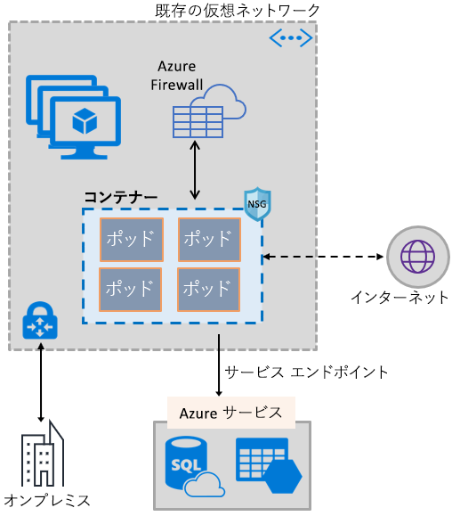
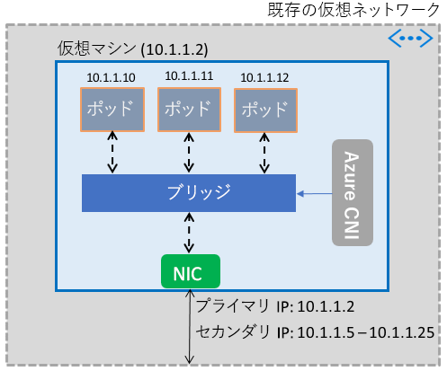

# コンテナーで Azure Virtual Network の機能を使用できるようにする

仮想マシンと同ソフトウェア定義ネットワーク スタックを利用することにより、Azure ネットワークの豊富な機能をコンテナーで使用できます。 Azure Virtual Network コンテナー ネットワーク インターフェイス (CNI) プラグインは、Azure 仮想マシンでにインストールされます。 そのプラグインは仮想マシンで起動されたコンテナーに仮想ネットワークからの IP アドレスを割り当て、それを仮想ネットワークにアタッチして、他のコンテナーと仮想ネットワーク リソースに直接接続します。 プラグインは接続のためにオーバーレイ ネットワークまたはルートに頼らず、仮想マシンと同等のパフォーマンスを提供します。 大まかに言えば、プラグインは次の機能を提供します。

- 1 つまたは複数のコンテナーで構成できるすべてのポッドに、仮想ネットワークの IP アドレスが割り当てられます。
- ポッドは、ExpressRoute またはサイト間 VPN 経由でピアリングされた仮想ネットワークおよびオンプレミスに接続できます。 ポッドには、ピアリングされたネットワークおよびオンプレミスのネットワークからも到達可能です。
- ポッドは、仮想ネットワーク サービス エンドポイントによって保護されている Azure Storage や Azure SQL Database などのサービスにアクセスできます。
- ネットワーク セキュリティ グループとルートを、ポッドに直接適用できます。
- 仮想マシンと同様に、Azure 内部またはパブリック ロード バランサーの背後にポッドを配置できます。
- ポッドにはパブリック IP アドレスを割り当てることができ、インターネットから直接アクセスできます。 ポッド自体もインターネットにアクセスできます。
- サービス、イングレス コントローラー、Kube DNS など、Kubernetes リソースとシームレスに連携します。 Azure Load Balancer を使用して、Kubernetes サービスを外部または内部に公開できます。

次の図では、プラグインが Azure 仮想ネットワークの機能をポッドに提供する方法を示します。

プラグインは、Linux プラットフォームと Windows プラットフォームの両方をサポートします。

## 仮想ネットワークへのポッドの接続

ポッドは仮想ネットワークの一部である仮想マシンで起動されます。 ポッド用の IP アドレスのプールは、仮想マシンのネットワーク インターフェイス上のセカンダリ アドレスとして構成されます。 Azure CNI は、ポッドの基本的なネットワーク接続を設定し、プール内の IP アドレスの使用を管理します。 ポッドが仮想マシンで起動すると、Azure CNI はプールから使用可能な IP アドレスを割り当て、ポッドを仮想マシン内のソフトウェア ブリッジに接続します。 ポッドが終了すると、IP アドレスはプールに戻されます。 次の図では、ポッドが仮想ネットワークに接続するしくみを示します。

## インターネットへのアクセス

ポッドがインターネットにアクセスできるようにするため、プラグインはポッドからのインターネット バインド トラフィックをネットワーク アドレス変換 (NAT) するための *iptables* を構成します。 パケットの送信元 IP アドレスは、仮想マシンのネットワーク インターフェイスのプライマリ IP アドレスに変換されます。 Windows 仮想マシンは、仮想マシンが属するサブネットの外部の IP アドレスに宛てられたトラフィックの source NAT (SNAT) を自動的に行います。 通常、仮想ネットワークの IP 範囲外の IP アドレスに送信されるすべてのトラフィックが変換されます。

## 制限

プラグインは、仮想マシンごとに最大 250 個のポッド、仮想ネットワーク内で最大 16,000 個のポッドをサポートします。 これらの制限は、[Azure Kubernetes Service](../azure-subscription-service-limits.md?toc=%2fazure%2fvirtual-network%2ftoc.json#kubernetes-service-limits) の場合と異なります。

## プラグインの使用

プラグインを次の方法で使用して、ポッドまたは Docker コンテナーに基本的な仮想ネットワーク接続を提供できます。

- **Azure Kubernetes Service**: プラグインは Azure Kubernetes Service (AKS) に統合されており、*[Advanced Networking]\(高度ネットワーク\)* オプションを選択することで使用できます。 高度ネットワークを使用すると、既存または新規の仮想ネットワークに Kubernetes クラスターを展開できます。 高度ネットワークの詳細とその設定手順については、「[Azure Kubernetes Service (AKS) のネットワーク構成](../aks/networking-overview.md?toc=%2fazure%2fvirtual-network%2ftoc.json)」をご覧ください。
- **ACS エンジン**: ACS エンジンは、Azure での Kubernetes クラスター デプロイ用 Azure Resource Manager テンプレートを生成するツールです。 詳しくは、「[ACS エンジン Kubernetes クラスター用プラグインのデプロイ](deploy-container-networking.md#deploy-plug-in-for-acs-engine-kubernetes-cluster)」をご覧ください。
- **Azure での独自の Kubernetes クラスターの作成**: プラグインを使用すると、AKS または ACS エンジンなどのツールに頼ることなく、独自にデプロイする Kubernetes クラスター内のポッドに対する基本ネットワークを提供できます。 この場合、プラグインはクラスター内のすべての仮想マシンにインストールされて有効にされます。 詳細については、[自身でデプロイした Kubernetes クラスター用プラグインのデプロイ](deploy-container-networking.md#deploy-plug-in-for-a-kubernetes-cluster)に関するページをご覧ください。
- **Azure 内の Docker コンテナーに対する仮想ネットワークのアタッチ**: Kubernetes クラスターを作成したくなく、仮想マシン内に Docker コンテナーと仮想ネットワーク アタッチを作成したい場合は、プラグインを使用できます。 詳しくは、「[Docker コンテナー用プラグインのデプロイ](deploy-container-networking.md#deploy-plug-in-for-docker-containers)」をご覧ください。

## 次の手順

Kubernetes クラスターまたは Docker コンテナー用の[プラグインをデプロイ](deploy-container-networking.md)します