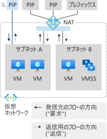
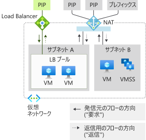
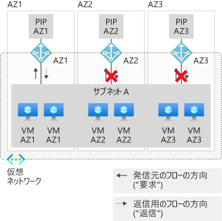
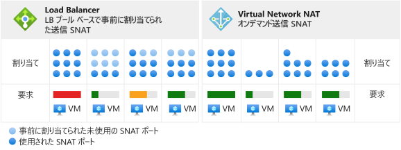
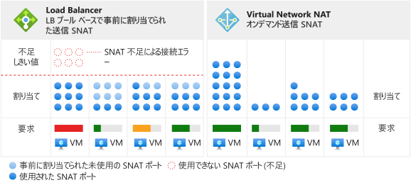

# NAT ゲートウェイ リソースを使用した仮想ネットワークの設計

NAT ゲートウェイ リソースは、[Virtual Network NAT](nat-overview.md) の構成要素であり、仮想ネットワークの 1 つまたは複数のサブネットに対してアウトバウンド インターネット接続を提供します。 どの NAT ゲートウェイを使用するかは、仮想ネットワークのサブネットで指定します。 NAT は、サブネットの送信元ネットワーク アドレス変換 (SNAT) を行う役割を果たします。  仮想マシンがアウトバウンド フローを作成するときに使用される静的 IP アドレスは、NAT ゲートウェイ リソースによって指定されます。 静的 IP アドレスは、パブリック IP アドレス リソースかパブリック IP プレフィックス リソース、またはその両方から得られます。 NAT ゲートウェイ リソースは、どちらの側からも最大 16 個の静的 IP アドレスを使用できます。

  

*図:インターネットへのアウトバウンド接続のための Virtual Network NAT*

## NAT をデプロイする方法

NAT ゲートウェイは簡単に構成、使用できるように意図されています。  

NAT ゲートウェイ リソース:
- リージョン単位またはゾーン単位 (ゾーン分離) の NAT ゲートウェイ リソースを作成する。
- パブリック IP アドレスを割り当てる。
- 必要に応じて、TCP アイドル タイムアウトを変更する (省略可)。  既定値を変更する<ins>前に</ins>、[タイマー](#timers)を確認してください。

Virtual Network:
- NAT ゲートウェイを使用するように仮想ネットワーク サブネットを構成する。

ユーザー定義ルートは必要ありません。

## リソース

以下に示した Azure Resource Manager のテンプレートに似た形式の例を見るとわかるように、リソースはシンプルになるよう設計されています。  ここでこのテンプレートに似た形式を紹介するのは、概念と構造を図示するためです。  この例には、必要に応じて変更を加えてください。  このドキュメントは、チュートリアルとしての利用を意図したものではありません。

次の図は、異なる Azure Resource Manager リソース間で書き換え可能な参照を示しています。  矢印は、書き換え可能なポイントを起点とする参照の方向を示しています。 確認 

  

*図:Virtual Network NAT のオブジェクト モデル*

[プールベースの Load Balancer のアウトバウンド接続](../load-balancer/load-balancer-outbound-connections.md)にはっきりと依存している場合を除き、NAT は、ほとんどのワークロードで推奨されます。  

Standard Load Balancer のシナリオ ([アウトバウンド規則](../load-balancer/load-balancer-outbound-rules-overview.md)を含む) から、NAT ゲートウェイに移行することができます。 移行するには、パブリック IP リソースとパブリック IP プレフィックス リソースをロード バランサーのフロントエンドから NAT ゲートウェイに移します。 NAT ゲートウェイのための新しい IP アドレスは必要ありません。 Standard のパブリック IP とプレフィックスは、IP アドレスの総数が 16 を超えない限り、再利用することができます。 移行を計画するにあたっては、切り替えの過程で生じるサービスの中断を考慮してください。  プロセスを自動化することによって、中断は最小化することができます。 まずステージング環境で移行をテストしてください。  インバウンド方向のフローに対しては、切り替え時の影響はありません。

次の例は、Azure Resource Manager テンプレートのスニペットです。  このテンプレートでは、NAT ゲートウェイなど、いくつかのリソースをデプロイします。  この例では、テンプレートに次のパラメーターがあります。

- **natgatewayname** - NAT ゲートウェイの名前。
- **location** - リソースが配置されている Azure リージョン。
- **publicipname** - NAT ゲートウェイに関連付けられているアウトバウンド パブリック IP の名前。
- **vnetname** - 仮想ネットワークの名前。
- **subnetname** - NAT ゲートウェイに関連付けられているサブネットの名前。

すべての IP アドレスとプレフィックス リソースによって提供される IP アドレスの総数が、16 個を超えることはできません。 IP アドレスの数は、1 から 16 の範囲内であれば、いくつでもかまいません。

:::code language="json" source="~/quickstart-templates/101-nat-gateway-vnet/azuredeploy.json" range="81-96":::

作成された NAT ゲートウェイ リソースは、仮想ネットワークの 1 つまたは複数のサブネット上で使用することができます。 その NAT ゲートウェイ リソースをどのサブネットで使用するかを指定してください。 1 つの NAT ゲートウェイを複数の仮想ネットワークにまたがって適用することはできません。 仮想ネットワークのすべてのサブネットに同じ NAT ゲートウェイを割り当てる必要はありません。 サブネットは、それぞれ異なる NAT ゲートウェイ リソースを使用して構成できます。

可用性ゾーンを使用しないシナリオは、リージョン単位の運用となります (ゾーン指定なし)。 可用性ゾーンを使用する場合は、ゾーンを指定することで、NAT を特定のゾーンに分離することができます。 ゾーンの冗長性はサポートされません。 NAT の[可用性ゾーン](#availability-zones)について、再確認してください。

:::code language="json" source="~/quickstart-templates/101-nat-gateway-vnet/azuredeploy.json" range="1-146" highlight="81-96":::

NAT ゲートウェイは、仮想ネットワーク内のサブネットのプロパティを使用して定義します。 仮想マシンによって仮想ネットワーク **vnetname** のサブネット **subnetname** 上で作成されたフローに、NAT ゲートウェイが使用されます。 すべてのアウトバウンド接続には、**natgatewayname** に関連付けられた IP アドレスが発信元 IP アドレスとして使用されます。

この例で使用される Azure Resource Manager テンプレートの詳細については、次を参照してください。

- [クイック スタート: NAT ゲートウェイを作成する - Resource Manager テンプレート](quickstart-create-nat-gateway-template.md)
- [Virtual Network NAT](https://azure.microsoft.com/resources/templates/101-nat-gateway-1-vm/)

## 設計ガイダンス

NAT を使用した仮想ネットワークの設計に関する考慮事項をよく理解するために、次のセクションを振り返ってみましょう。  

1. [コストの最適化](#cost-optimization)
1. [インバウンドとアウトバウンドの共存](#coexistence-of-inbound-and-outbound)
2. [Basic リソースの管理](#managing-basic-resources)
3. [可用性ゾーン](#availability-zones)

### コストの最適化

[サービス エンドポイント](virtual-network-service-endpoints-overview.md)と [Private Link](../private-link/private-link-overview.md) は、コストを最適化するために検討するオプションです。 これらのサービスに NAT は必要ありません。 サービス エンドポイントまたは Private Link に送信されたトラフィックは、仮想ネットワークの NAT では処理されません。  

サービス エンドポイントは、ご利用の仮想ネットワークに Azure サービス リソースを関連付けると共に、Azure サービス リソースへのアクセスを制御します。 たとえば Azure Storage にアクセスするときは、Storage のサービス エンドポイントを使用することで、データ処理量に対する NAT の課金を回避することができます。 サービス エンドポイントは無料です。

Private Link は、Azure PaaS サービス (または Private Link を使用してホストされるその他のサービス) を仮想ネットワーク内のプライベート エンドポイントとして公開するものです。  Private Link は時間とデータ処理量に基づいて課金されます。

これらのアプローチのどちらか一方または両方がご自分のシナリオに適しているかどうかを評価したうえで、必要に応じてご利用ください。

### インバウンドとアウトバウンドの共存

NAT ゲートウェイは、次の機能と共に利用することができます。

 - Standard Load Balancer
 - Standard パブリック IP
 - Standard パブリック IP プレフィックス

新しいデプロイを開発する際は、Standard SKU から始めるようにしてください。

  

*図:インターネットへのアウトバウンド接続のための Virtual Network NAT*

NAT ゲートウェイによって実現される、インターネットへのアウトバウンドのみのシナリオは、インターネットからのインバウンド機能を使用して拡張することができます。 それぞれのリソースは、フローの発生方向を認識します。 NAT ゲートウェイを使用したサブネットでは、インターネットへのアウトバウンド シナリオはすべて NAT ゲートウェイに取って代わられます。 インターネットからのインバウンド シナリオはそれぞれのリソースによって実現されます。

#### インスタンスレベル パブリック IP を使用した VM と NAT

  

*図:インスタンスレベル パブリック IP を使用した VM と Virtual Network NAT*

| Direction | リソース |
|:---:|:---:|
| 受信 | インスタンスレベル パブリック IP を使用した VM |
| 送信 | NAT Gateway |

VM からのアウトバウンドには NAT ゲートウェイが使用されます。  外部からのインバウンドは影響を受けません。

#### パブリック Load Balancer を使用した VM と NAT

  

*図:パブリック Load Balancer を使用した VM と Virtual Network NAT*

| Direction | リソース |
|:---:|:---:|
| 受信 | パブリック ロード バランサー |
| 送信 | NAT Gateway |

負荷分散規則またはアウトバウンド規則に含まれるアウトバウンド構成は、NAT ゲートウェイに取って代わられます。  外部からのインバウンドは影響を受けません。

#### インスタンスレベル パブリック IP とパブリック Load Balancer を使用した VM と NAT

  

*図:インスタンスレベル パブリック IP とパブリック Load Balancer を使用した VM と Virtual Network NAT*

| Direction | リソース |
|:---:|:---:|
| 受信 | インスタンスレベル パブリック IP とパブリック Load Balancer を使用した VM |
| 送信 | NAT Gateway |

負荷分散規則またはアウトバウンド規則に含まれるアウトバウンド構成は、NAT ゲートウェイに取って代わられます。  この場合も、VM からのアウトバウンドには NAT ゲートウェイが使用されます。  外部からのインバウンドは影響を受けません。

### Basic リソースの管理

Standard Load Balancer、Standard パブリック IP、Standard パブリック IP プレフィックスは NAT ゲートウェイと共に利用することができます。 NAT ゲートウェイは、サブネットのスコープ内で動作します。 これらのサービスの Basic SKU は、NAT ゲートウェイが使用されていないサブネットにデプロイする必要があります。 このように分離されていることで、両方の SKU バリアントを同じ仮想ネットワークに共存させることができます。

NAT ゲートウェイは、サブネットのアウトバウンド シナリオよりも優先されます。 目的の変換を指定して、Basic Load Balancer や Basic パブリック IP (それらに組み込まれているあらゆるマネージド サービスを含む) を調整することはできません。 サブネットにおけるインターネットへのアウトバウンド トラフィックは、NAT ゲートウェイによって制御されます。 Basic Load Balancer や Basic パブリック IP へのインバウンド トラフィックは利用できません。 Basic Load Balancer へのインバウンド トラフィックや、VM に構成されているパブリック IP へのインバウンド トラフィックは利用できません。

### 可用性ゾーン

#### ゾーン スタックを使用したゾーンの分離

  

*図:"ゾーン スタック" を複数形成するゾーンの分離を使用した Virtual Network NAT*

NAT は回復性を備えており、可用性ゾーンがなくても、複数のインフラストラクチャ コンポーネントの障害に耐えることができます。  NAT を特定のゾーンに分離するシナリオでは、この回復性の上に可用性ゾーンが構築されます。

仮想ネットワークとそのサブネットは、リージョンの構成概念です。  サブネットは特定のゾーンに制限されません。

ゾーンの分離では、NAT ゲートウェイ リソースを使用する仮想マシンのインスタンスが NAT ゲートウェイ リソースやそのパブリック IP アドレスと同じゾーンに存在するときにゾーン保証が得られます。 ゾーンを分離するために使用すべきパターンは、可用性ゾーンごとに "ゾーン スタック" を作成することです。  この "ゾーン スタック" は、同じゾーンでの使用のみを想定したサブネット上の仮想マシン インスタンス、NAT ゲートウェイ リソース、パブリック IP アドレス、プレフィックス リソースから成ります。   そうすることでコントロール プレーンの操作とデータ プレーンが特定のゾーンにアラインメントされ、そのゾーンに制限されます。 

ご利用のゾーン以外で起こった障害が NAT に影響を及ぼす心配はありません。 同じゾーンに属している仮想マシンからのアウトバウンド トラフィックは、ゾーンの分離によりエラーになります。  

#### インバウンド エンドポイントを統合する

実際のシナリオでインバウンド エンドポイントが必要になった場合、次の 2 つの選択肢があります。

| オプション | Pattern | 例 | 長所 | 短所 |
|---|---|---|---|---|
| (1) | インバウンド エンドポイントを、アウトバウンド用に作成するそれぞれの**ゾーン スタック**に合わせて**アラインメント**する。 | ゾーン フロントエンドを使用して Standard ロード バランサーを作成する。 | インバウンドとアウトバウンドとで正常性モデルと障害モードが同じ。 運用がよりシンプルになる。 | ゾーンごとに各 IP アドレスを共通の DNS 名でマスクする必要がある。 |
| (2) | **クロスゾーン** インバウンド エンドポイントでゾーン スタックを**オーバーレイ**する。 | ゾーン冗長フロントエンドを使用して Standard ロード バランサーを作成する。 | インバウンド エンドポイントに使用される IP アドレスが 1 つ。 | インバウンドとアウトバウンドとで正常性モデルと障害モードが異なる。  運用がより複雑になる。 |

>[!NOTE]
> ゾーン分離 NAT ゲートウェイでは、IP アドレスが NAT ゲートウェイのゾーンと一致している必要があります。 異なるゾーンの IP アドレスが割り当てられている NAT ゲートウェイ リソースや、ゾーンを持たない NAT ゲートウェイ リソースは許容されません。

#### クロスゾーンのアウトバウンド シナリオはサポートされない

  

*図:Virtual Network NAT はゾーンスパニング サブネットと共存できない*

同じサブネット内の複数のゾーンに仮想マシン インスタンスがデプロイされている場合、NAT ゲートウェイ リソースのゾーン保証は得られません。   また、1 つのサブネットに複数のゾーン NAT ゲートウェイがアタッチされていても、どの NAT ゲートウェイ リソースを選べばよいかが、仮想マシン インスタンスにはわかりません。

a) 仮想マシン インスタンスのゾーンとゾーン NAT ゲートウェイのゾーンとがアラインメントされていない場合や、b) リージョンの NAT ゲートウェイ リソースがゾーンの仮想マシン インスタンスで使用されている場合、ゾーン保証は得られません。

このシナリオは一見うまく行くように見えますが、可用性ゾーンの観点から見ると、正常性モデルと障害モードが不定です。 ゾーン スタックを使用するか、すべてをリージョンに揃えることを検討してください。

>[!NOTE]
>NAT ゲートウェイ リソースのゾーン プロパティは変更できません。  意図したリージョンまたはゾーンを選んで NAT ゲートウェイ リソースを再デプロイしてください。

>[!NOTE] 
>ゾーンが指定されていない場合、IP アドレスそのものはゾーン冗長ではありません。  [Standard Load Balancer のフロントエンドは、IP アドレスが特定のゾーンに作成されていなければゾーン冗長](../load-balancer/load-balancer-standard-availability-zones.md#frontend)となります。  NAT にはこれが当てはまりません。  サポートされるのは、リージョン単位の分離とゾーン単位の分離だけです。

## 送信元ネットワーク アドレス変換

送信元ネットワーク アドレス変換 (SNAT) は、別の IP アドレスが送信元となるようにフローの送信元を書き換えるものです。  NAT ゲートウェイ リソースでは、SNAT のバリアントが使用されます。これは一般にポート アドレス変換 (PAT) と呼ばれます。 PAT では、送信元アドレスと送信元ポートが書き換えられます。 SNAT では、プライベート アドレスの数とその変換後のパブリック アドレスの数との間に固定的な関係はありません。  

### 基礎

基本的な概念を説明するために、4 つのフローの例を見ていきましょう。  NAT ゲートウェイは、パブリック IP アドレス リソース 65.52.0.2 を使用しています。

| Flow | 送信元のタプル | 送信先のタプル |
|:---:|:---:|:---:|
| 1 | 192.168.0.16:4283 | 65.52.0.1:80 |
| 2 | 192.168.0.16:4284 | 65.52.0.1:80 |
| 3 | 192.168.0.17.5768 | 65.52.0.1:80 |
| 4 | 192.168.0.16:4285 | 65.52.0.2:80 |

PAT の実行後、これらのフローは次のようになります。

| Flow | 送信元のタプル | 送信元のタプル (SNAT 変換後) | 送信先のタプル | 
|:---:|:---:|:---:|:---:|
| 1 | 192.168.0.16:4283 | 65.52.0.2:234 | 65.52.0.1:80 |
| 2 | 192.168.0.16:4284 | 65.52.0.2:235 | 65.52.0.1:80 |
| 3 | 192.168.0.17.5768 | 65.52.0.2:236 | 65.52.0.1:80 |
| 4 | 192.168.0.16:4285 | 65.52.0.2:237 | 65.52.0.2:80 |

送信先から見ると、フローの送信元は 65.52.0.2 (SNAT 変換後の送信元のタプル) で、それぞれ記載したポートが割り当てられています。  前出の表に示した PAT は、ポート マスカレード SNAT とも呼ばれます。  IP とポートの背後には、複数の送信元プライベート アドレスがマスカレードされています。

この送信元ポートの割り当てパターンをすべてのケースに当てはめるのは避けてください。  前出の表は、あくまで基本的な概念を例示したものです。

NAT による SNAT は、いくつかの点で [Load Balancer](../load-balancer/load-balancer-outbound-connections.md) とは異なります。

### オンデマンド

NAT では、新しいアウトバウンド トラフィック フローにオンデマンドで SNAT ポートが割り当てられます。 インベントリにあるすべての空き SNAT ポートは、NAT が構成されているサブネット上のすべての仮想マシンによって使用されます。 

  

*図:Virtual Network NAT のオンデマンド アウトバウンド SNAT*

アウトバウンド フローは、任意の IP 構成の仮想マシンがオンデマンドで作成できます。  最悪のケースに備えたインスタンスごとのオーバープロビジョニングも含め、インスタンスごとの事前割り当て計画は必要ありません。  

  

*図:枯渇状況での相違点*

SNAT ポートが解放されると、NAT が構成されているサブネット上の任意の仮想マシンがそのポートを使用できるようになります。  割り当てはオンデマンドで行われるので、サブネット上の動的かつ多様なワークロードが必要に応じて SNAT ポートを使用できます。  空き SNAT ポートがインベントリにある限り、SNAT フローは正常に動作します。 インベントリが大きいことの効果は、SNAT ポートのホット スポットで顕著になります。 SNAT ポートをさほど必要としていない仮想マシンのために、それらのポートが未使用のまま放置されることはありません。

### Scaling

NAT のスケーリングは主に、共有された空き SNAT ポート インベントリを管理する機能です。 NAT ゲートウェイ リソースにアタッチされたすべてのサブネットのピーク アウトバウンド フローを見越して、NAT には十分な SNAT ポート インベントリを確保する必要があります。  SNAT ポート インベントリは、パブリック IP アドレス リソース、パブリック IP プレフィックス リソース、またはその両方を使用して作成できます。

SNAT は、プライベート アドレスを 1 つまたは複数のパブリック IP アドレスにマップするものです。そのプロセスの中で送信元アドレスと送信元ポートは書き換えられます。 この変換を行うために、NAT ゲートウェイ リソースは、構成されているパブリック IP アドレス 1 つにつき、64,000 個のポート (SNAT ポート) を使用します。 NAT ゲートウェイ リソースは、16 個の IP アドレスおよび ‭1,024,000‬ 個の SNAT ポートにまでスケールアップできます。 パブリック IP プレフィックス リソースが用意されている場合、プレフィックス内の各 IP アドレスによって SNAT ポート インベントリが提供されます。 さらにパブリック IP アドレスを追加すると、インベントリの空き SNAT ポートが増えます。 TCP と UDP は、別個の SNAT ポート インベントリであり、互いに独立しています。

NAT ゲートウェイ リソースは、しかるべきルールによらず送信元ポートを再利用します。 スケーリングを目的とする場合、フローごとに新しい SNAT ポートが必要になることを前提に、アウトバウンド トラフィックに使用可能な IP アドレスの総数を増やすようにしてください。

### プロトコル

NAT ゲートウェイ リソースは、UDP フローと TCP フローの IP ヘッダーおよび IP トランスポート ヘッダーに作用します。アプリケーション レイヤーのペイロードには依存しません。  他の IP プロトコルはサポートされません。

### タイマー

>[!IMPORTANT]
>アイドル タイマーを長くすると、SNAT が枯渇する可能性をむやみに高めることにつながります。 指定するタイマーが長いほど、SNAT ポートは長時間 NAT によって保持され続け、最終的にアイドル タイムアウトに達するまでは解放されません。 アイドル タイムアウトしたフローは、その後失敗に終わるので、SNAT ポート インベントリは無駄に消費されることになります。  2 時間で失敗するフローなら、既定値の 4 分でも失敗します。 アイドル タイムアウトの増加は最終手段であり、慎重に用いる必要があります。 フローが決してアイドル状態にならないのであれば、アイドル タイマーの影響は受けません。

TCP アイドル タイムアウトは、すべてのフローを対象に、4 分 (既定値) から 120 分 (2 時間) の範囲で調整できます。  さらに、フロー上のトラフィックに関して、アイドル タイマーをリセットすることができます。  長時間にわたるアイドル接続のリフレッシュやエンドポイントの生存確認に推奨されるパターンは、TCP キープアライブです。  TCP キープアライブは、エンドポイントからは重複する ACK として認識され、オーバーヘッドが低く、アプリケーション レイヤーからは見えません。

SNAT ポート解放には次のタイマーが使用されます。

| Timer | 値 |
|---|---|
| TCP FIN | 60 秒 |
| TCP RST | 10 秒 |
| TCP half open | 30 秒 |

SNAT ポートは、同じ送信先 IP アドレスおよび同じ送信先ポートに対して 5 秒後に再利用可能な状態となります。

>[!NOTE] 
>これらのタイマー設定は、変更されることがあります。 記載した値は、トラブルシューティングでの利用を意図したものです。特定のタイマーを前提とした判断は、現時点では避けてください。

## 制限事項

- NAT は、Standard SKU のパブリック IP、パブリック IP プレフィックス、ロード バランサーの各リソースと共に利用することができます。   Basic リソース (Basic Load Balancer など) やそれらから派生した製品を NAT と共存させることはできません。  Basic リソースは、NAT が構成されていないサブネットに配置する必要があります。
- サポートされるアドレス ファミリーは IPv4 です。  IPv6 アドレス ファミリーを NAT で扱うことはできません。  IPv6 プレフィックスを持つサブネットに NAT をデプロイすることはできません。
- NAT を使用している場合、NSG フロー ログはサポートされません。
- NAT を複数の仮想ネットワークにまたがって使用することはできません。

## フィードバック

サービスを改善するために、皆様のご意見をお待ちしております。 不足している機能があれば、 ぜひお聞かせください。今後の課題として、[NAT の UserVoice](https://aka.ms/natuservoice) で受け付けております。

## 次のステップ

* [仮想ネットワーク NAT](nat-overview.md) について学習する。
* [NAT ゲートウェイ リソースのメトリックとアラート](nat-metrics.md)について学習する。
* [NAT ゲートウェイ リソースのトラブルシューティング](troubleshoot-nat.md)について学習する。
* NAT ゲートウェイを検証するためのチュートリアル
  - [Azure CLI](tutorial-create-validate-nat-gateway-cli.md)
  - [PowerShell](tutorial-create-validate-nat-gateway-powershell.md)
  - [ポータル](tutorial-create-validate-nat-gateway-portal.md)
* NAT ゲートウェイ リソースをデプロイするためのクイックスタート
  - [Azure CLI](./quickstart-create-nat-gateway-cli.md)
  - [PowerShell](./quickstart-create-nat-gateway-powershell.md)
  - [ポータル](./quickstart-create-nat-gateway-portal.md)
  - [テンプレート](./quickstart-create-nat-gateway-template.md)
* NAT ゲートウェイ リソース API について学習する
  - [REST API](https://docs.microsoft.com/rest/api/virtualnetwork/natgateways)
  - [Azure CLI](https://docs.microsoft.com/cli/azure/network/nat/gateway?view=azure-cli-latest)
  - [PowerShell](https://docs.microsoft.com/powershell/module/az.network/new-aznatgateway)
* [可用性ゾーン](../availability-zones/az-overview.md)について学習する。
* [Standard Load Balancer ](../load-balancer/load-balancer-standard-overview.md) について学習する。
* [可用性ゾーンと Standard Load Balancer](../load-balancer/load-balancer-standard-availability-zones.md) について学習する。
* [UserVoice で Virtual Network NAT の新機能の構築を提案する](https://aka.ms/natuservoice)。

