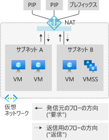

# Azure Virtual Network NAT のメトリック

Azure Virtual Network NAT ゲートウェイ リソースは、多次元メトリックを提供します。 これらのメトリックを使用して処理状況を監視したり、[トラブルシューティング](nat-metrics.md)を行ったりすることができます。  アラートは、SNAT の枯渇などの重大な問題に対して構成できます。

  

*図:インターネットへのアウトバウンド接続のための Virtual Network NAT*

>[!NOTE] 
>Virtual Network NAT は、現時点ではパブリック プレビューとして提供されています。 現在は、ご利用いただける[リージョン](nat-overview.md#region-availability)が限られています。 このプレビュー版はサービス レベル アグリーメントなしで提供されています。運用環境のワークロードに使用することはお勧めできません。 特定の機能はサポート対象ではなく、機能が制限されることがあります。 詳しくは、「[Microsoft Azure プレビューの追加使用条件](https://azure.microsoft.com/support/legal/preview-supplemental-terms)」をご覧ください。

## メトリック

NAT ゲートウェイ リソースは、Azure Monitor の次の多次元メトリックを提供します。

| メトリック | 説明 | 推奨される集計 | Dimensions |
|---|---|---|---|
| バイト | 受信および送信で処理されたバイト数 | SUM | 方向 (In、Out)、プロトコル (6 TCP、17 UDP) |
| パケット | 受信および送信で処理されたパケット数 | SUM | 方向 (In、Out)、プロトコル (6 TCP、17 UDP) |
| Dropped packets (ドロップされたパケット数) | NAT ゲートウェイによってドロップされたパケット数 | SUM | / |
| SNAT Connection Count (SNAT 接続数) | 間隔ごとの状態遷移 | SUM | 接続状態、プロトコル (6 TCP、17 UDP) |
| Total SNAT connection count (SNAT 接続数の合計) | 現在アクティブな SNAT 接続数 (使用中の SNAT ポート数) | SUM | プロトコル (6 TCP、17 UDP) |

## 警告

メトリックのアラートは、前述の[メトリック](#metrics)ごとに Azure Monitor で構成できます。

## 制限事項

Resource Health はサポートされていません。

## 次のステップ

- [Virtual Network NAT](nat-overview.md) について学習する。
- [NAT ゲートウェイ リソース](nat-gateway-resource.md)について学習する
- [Azure Monitor](../azure-monitor/overview.md) について学習する
- [NAT ゲートウェイ リソースのトラブルシューティング](troubleshoot-nat.md)について学習する。

