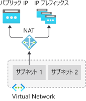
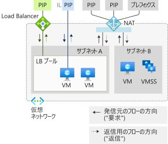
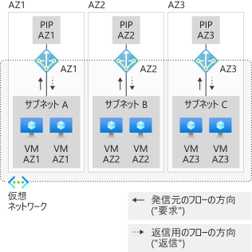

# Virtual Network NAT とは

Virtual Network NAT (ネットワーク アドレス変換) は、仮想ネットワーク用のアウトバウンドのみのインターネット接続を簡単に行えるようにするものです。 これをサブネットに対して構成した場合、指定した静的パブリック IP アドレスがすべてのアウトバウンド接続で使用されます。  ロード バランサーや、仮想マシンに直接アタッチされたパブリック IP アドレスがなくても、アウトバウンド接続が可能となります。 NAT はフル マネージドで、高い回復性を備えています。

<!-- 

-->

  

*図:Virtual Network NAT*

## アウトバウンド専用の静的 IP アドレス

NAT では、アウトバウンド接続をサブネットごとに定義できます。  同じ仮想ネットワーク内にある複数のサブネットに対し、それぞれ異なる NAT を割り当てることができます。 サブネットの構成は、使用する NAT ゲートウェイ リソースを指定することで行います。 UDP と TCP のアウトバウンド フローには、それがどの仮想マシン インスタンスから送信されたものであれ、すべて NAT が使用されます。 

NAT は、Standard SKU のパブリック IP アドレス リソースとパブリック IP プレフィックス リソースのどちらか、またはその両方を組み合わせたものと共に利用することができます。  パブリック IP プレフィックスを直接使用できるほか、複数の NAT ゲートウェイ リソースにプレフィックスのパブリック IP アドレスを割り振ることもできます。 すべてのトラフィックは、NAT によって、プレフィックスの IP アドレス範囲に調整されます。  デプロイの IP ホワイトリスト登録を容易に行うことが可能です。

サブネットのすべてのアウトバウンド トラフィックは NAT によって自動的に処理され、ユーザーによる構成は不要です。  ユーザー定義ルートは必要ありません。 NAT は他のアウトバウンド シナリオよりも優先され、サブネットの既定のインターネット宛先に取って代わります。

## スケーリングを目的とした、複数の IP アドレスによるオンデマンド SNAT

NAT は "ポート ネットワーク アドレス変換" (PNAT または PAT) を使用しており、ほとんどのワークロードに推奨されます。 アウトバウンド フローのオンデマンド割り当てを使用すれば、動的なワークロードや多様なワークロードも容易に受け入れることができます。 大がかりな事前計画や事前割り当ては不要であり、ひいてはアウトバウンド リソースのオーバープロビジョニングも避けることができます。 SNAT ポート リソースは共有され、特定の NAT ゲートウェイ リソースを使用してすべてサブネットから利用できます。また、必要に応じて提供されます。

NAT に接続された 1 つのパブリック IP アドレスで、UDP と TCP の最大 64,000 の同時フローに対応します。 最初は 1 つの IP アドレスで運用し、16 個のパブリック IP アドレスにまでスケールアップすることができます。

NAT を使用すると、仮想ネットワークからインターネットへのフローを作成することができます。 インターネットからの戻りトラフィックは、アクティブなフローへの応答でのみ許可されます。

ロード バランサーのアウトバウンド SNAT とは異なり、NAT には、アウトバウンド接続を行うことができる仮想マシン インスタンスのプライベート IP に関する制限がありません。  NAT であれば、セカンダリ IP 構成でアウトバウンド インターネット接続を作成できます。

## インバウンドとアウトバウンドの共存

NAT は、次の Standard SKU リソースと共に利用することができます。

- Load Balancer
- パブリック IP アドレス
- パブリック IP プレフィックス

これらのリソースを NAT と組み合わせることで、サブネットへのインバウンド インターネット接続が可能となります。 サブネットからのアウトバウンド インターネット接続はすべて NAT から提供されます。

NAT および NAT と共存可能な Standard SKU 機能は、フローがどちら側から開始されたかを認識します。 インバウンドとアウトバウンドのシナリオを共存させることができます。 これらのシナリオでは、各機能によってフロー方向が認識されるので、ネットワーク アドレス変換が正しく実行されます。 

<!-- 

-->

  

*図:Virtual Network NAT のフロー方向*

## フル マネージド、高い回復性

NAT は最初からスケールアウトに完全対応しています。 システムの増強 (スケールアウト) 操作は必要ありません。  NAT の操作は、Azure がお客様に代わって管理します。  NAT は常に複数の障害ドメインを有しているため、サービスの停止を招くことなく複数の障害に耐えることができます。

## フローが認識されない場合の TCP リセット

存在しない TCP 接続での通信が試行されると、NAT のプライベート側が TCP リセット パケットを送信します。 たとえば、接続がアイドル タイムアウトに達した場合が該当します。 次に受信したパケットによって、プライベート IP アドレスには TCP リセットが返され、これによって接続の終了が伝えられて、接続は強制的に終了されます。

NAT のパブリック側からは、TCP リセット パケットなどのトラフィックは一切生成されません。  出力されるのは、お客様の仮想ネットワークによって生成されたトラフィックだけです。

## 構成可能な TCP アイドル タイムアウト

4 分という TCP アイドル タイムアウトの既定値が使用されます。これは最大 120 分にまで増やすことができます。 また、アイドル タイマーは、フロー上の任意のアクティビティ (TCP キープアライブを含む) でリセットすることもできます。

## リージョン単位の分離と可用性ゾーンを使用したゾーン単位の分離

既定では、NAT はリージョン単位となっています。 [可用性ゾーン](../availability-zones/az-overview.md)のシナリオを作成する場合は、特定のゾーンに NAT を分離することができます (ゾーン デプロイ)。

<!-- 

-->

  

*図:Virtual Network NAT と可用性ゾーン*

## 監視のための多次元メトリック

ご自分の NAT の運用は、Azure Monitor で公開される多次元メトリックを通じて監視することができます。 これらのメトリックを使用して利用状況を監視したり、トラブルシューティングを行ったりすることができます。  NAT ゲートウェイ リソースでは、次のメトリックが公開されます。
- バイト
- パケット
- 破棄されたパケット
- 合計 SNAT 接続数
- 一定間隔ごとの SNAT 接続の状態遷移

<!-- "ADD when PM is done" Learn more about [NAT gateway metrics](./nat-gateway-metrics.md) -->

## SLA

一般提供時には、NAT のデータ パスの可用性が 99.9% 以上となります。

## 価格

NAT ゲートウェイは、2 つの測定値を使用して課金されます。

| 測定 | 料金 |
| --- | --- |
| リソース時間 | $0.045/時 |
| データ処理量 | $0.045/GB |

リソース時間は、NAT ゲートウェイ リソースが存在する期間に相当します。
データ処理量は、NAT ゲートウェイ リソースによって処理されたすべてのトラフィックに相当します。

## 可用性

Virtual Network NAT と NAT ゲートウェイ リソースは、すべての Azure パブリック クラウド [リージョン](https://azure.microsoft.com/global-infrastructure/regions/)で利用できます。

## サポート

NAT のサポートは、通常のサポート チャンネルを通じて提供されます。

## フィードバック

サービスを改善するために、皆様のご意見をお待ちしております。 今後の新機能に関する提案や投票も、[NAT の UserVoice](https://aka.ms/natuservoice) で受け付けております。

## 制限事項

* NAT は、Standard SKU のパブリック IP、パブリック IP プレフィックス、ロード バランサーの各リソースと共に利用することができます。 Basic リソース (Basic Load Balancer など) やそれらから派生した製品を NAT と共存させることはできません。  Basic リソースは、NAT が構成されていないサブネットに配置する必要があります。
* サポートされるアドレス ファミリーは IPv4 です。  IPv6 アドレス ファミリーを NAT で扱うことはできません。  IPv6 プレフィックスを持つサブネットに NAT をデプロイすることはできません。
* NAT を使用している場合、NSG フロー ログはサポートされません。
* NAT を複数の仮想ネットワークにまたがって使用することはできません。

## 次のステップ

* [NAT ゲートウェイ リソース](./nat-gateway-resource.md)について学習する。
* [UserVoice で Virtual Network NAT の新機能の構築を提案する](https://aka.ms/natuservoice)。

