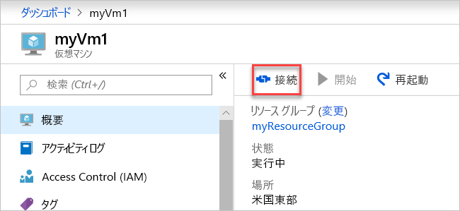

# <a name="quickstart-create-a-virtual-network-using-the-azure-portal"></a>クイック スタート:Azure ポータルを使用した仮想ネットワークの作成

仮想ネットワークによって、仮想マシン (VM) などの Azure リソースが互いにプライベートな通信を行ったりインターネットと通信したりできるようになります。 このクイック スタートでは、仮想ネットワークの作成方法について説明します。 仮想ネットワークを作成したら、2 つの VM を仮想ネットワークにデプロイします。 その後、インターネットから VM に接続し、2 つの VM の間でプライベートに通信します。

Azure サブスクリプションをお持ちでない場合は、ここで[無料アカウント](https://azure.microsoft.com/free/?WT.mc_id=A261C142F)を作成してください。

## <a name="sign-in-to-azure"></a>Azure へのサインイン

[Azure Portal](https://portal.azure.com) にサインインします。

## <a name="create-a-virtual-network"></a>仮想ネットワークの作成

1. 画面の左上で、**[リソースの作成]** > **[ネットワーキング]** > **[仮想ネットワーク]** の順に選択します。

1. **[仮想ネットワークの作成]** で、次の情報を入力または選択します。

    | Setting | 値 |
    | ------- | ----- |
    | Name | 「*myVirtualNetwork*」と入力します。 |
    | アドレス空間 | 「*10.1.0.0/16*」を入力します。 |
    | サブスクリプション | サブスクリプションを選択します。|
    | リソース グループ | **[新規作成]** を選択し、「*myResourceGroup*」と入力して、**[OK]** を選択します。 |
    | 場所 | **[米国東部]** を選択します。|
    | サブネット - 名前 | 「*myVirtualSubnet*」と入力します。 |
    | サブネット アドレス範囲 | 「*10.1.0.0/24*」と入力します。 |

1. 残りの部分は既定値のままにし、**[作成]** を選択します。

## <a name="create-virtual-machines"></a>仮想マシンを作成する

仮想ネットワークに 2 つの VM を作成します。

### <a name="create-the-first-vm"></a>最初の VM を作成する

1. 画面の左上で、**[リソースの作成]** > **[Compute]** > **[Windows Server 2016 Datacenter]** の順に選択します。

1. **[Create a virtual machine - Basics]\(仮想マシンの作成 - Basic\)** で次の情報を入力または選択します。

    | Setting | 値 |
    | ------- | ----- |
    | **プロジェクトの詳細** | |
    | サブスクリプション | サブスクリプションを選択します。 |
    | リソース グループ | **[MyResourceGroup]** を選択します。 前のセクションで作成しています。 |
    | **インスタンスの詳細** |  |
    | 仮想マシン名 | 「*myVm1*」と入力します。 |
    | リージョン | **[米国東部]** を選択します。 |
    | 可用性のオプション | 既定値 **[インフラストラクチャ冗長は必要ありません]** をそのまま使用します。 |
    | イメージ | 既定値 **[Microsoft Windows Server 2016 Datacenter]** をそのまま使用します。 |
    | サイズ | 既定値 **[Standard DS1 v2]** をそのまま使用します。 |
    | **管理者アカウント** |  |
    | ユーザー名 | 任意のユーザー名を入力します。 |
    | パスワード | 任意のパスワードを入力します。 パスワードは 12 文字以上で、[定義された複雑さの要件](../virtual-machines/windows/faq.md?toc=%2fazure%2fvirtual-network%2ftoc.json#what-are-the-password-requirements-when-creating-a-vm)を満たす必要があります。|
    | パスワードの確認 | パスワードを再入力します。 |
    | **受信ポートの規則** |  |
    | パブリック受信ポート | 既定値 **[なし]** のままにします。 |
    | **コスト削減** |  |
    | Windows ライセンスを既にお持ちの場合 | 既定値 **[なし]** のままにします。 |

1. **[Next : Disks]\(次へ : Disk\)** を選択します。

1. **[Create a virtual machine - Disks]\(仮想マシンの作成 - Disk\)** で、既定値のままにし、**[Next : Networking]\(次へ : ネットワーク\)** を選択します。

1. **[Create a virtual machine - Networking]\(仮想マシンの作成 - ネットワーク\)** で次の情報を選択します。

    | Setting | 値 |
    | ------- | ----- |
    | 仮想ネットワーク | 既定値 **[myVirtualNetwork]** のままにします。 |
    | サブネット | 既定値 **[myVirtualSubnet (10.1.0.0/24)]** のままにします。 |
    | パブリック IP | 既定値 **(new) myVm-ip\((新規) myVm-ip** のままにします。 |
    | ネットワーク セキュリティ ポート | **[選択したポートを許可する]** を選択します。 |
    | 受信ポートの選択 | **[HTTP]** と **[RDP]** を選択します。

1. **[Next : Management]\(次へ : 管理\)** を選択します。

1. **[Create a virtual machine - Management]\(仮想マシンの作成 - 管理\)** の **[診断ストレージ アカウント]** で **[新規作成]** を選択します。

1. **[ストレージ アカウントの作成]** で、以下を選択します。

    | Setting | 値 |
    | ------- | ----- |
    | Name | 「*myvmstorageaccount*」と入力します。 |
    | アカウントの種類 | 既定値 **[(汎用 v1) ストレージ]** のままにします。 |
    | [パフォーマンス] | 既定値 **[Standard]** をそのまま使用します。 |
    | レプリケーション | 既定値 **[ローカル冗長ストレージ (LRS)]** をそのまま使用します。 |

1. **[OK]** を選択します。

1. **[Review + create]\(レビュー + 作成\)** を選択します。 **[確認および作成]** ページが表示され、Azure によって構成が検証されます。

1. **検証に成功した**ことを確認したら、**[作成]** を選択します。

### <a name="create-the-second-vm"></a>2 つ目の VM を作成する

1. 前述の手順 1 と 9 を実行します。

    > [!NOTE]
    > 手順 2 で、**仮想マシン名**として「*myVm2*」と入力します。
    >
    > 手順 7. で**診断ストレージ アカウント**として、**[myvmstorageaccount]** を選択します。

1. **[Review + create]\(レビュー + 作成\)** を選択します。 **[確認および作成]** ページが表示され、Azure によって構成が検証されます。

1. **検証に成功した**ことを確認したら、**[作成]** を選択します。

## <a name="connect-to-a-vm-from-the-internet"></a>インターネットから VM に接続する

*myVm1* を作成したら、インターネット経由でそこに接続します。

1. ポータルの検索バーで、「*myVm1*」と入力します。

1. **[接続]** を選択します。

    

    **[接続]** ボタンを選択すると、**[Connect to virtual machine]\(仮想マシンに接続する\)** が開きます。

1. **[RDP ファイルのダウンロード]** を選択します。 リモート デスクトップ プロトコル (*.rdp*) ファイルが作成され、お使いのコンピューターにダウンロードされます。

1. ダウンロードされた *.rdp* ファイルを開きます。

    1. メッセージが表示されたら、**[Connect]** を選択します。

    1. VM の作成時に指定したユーザー名とパスワードを入力します。

        > [!NOTE]
        > 場合によっては、**[その他]** > **[別のアカウントを使用する]** を選択して、VM の作成時に入力した資格情報を指定する必要があります。

1. **[OK]** を選択します。

1. サインイン処理中に証明書の警告が表示される場合があります。 証明書の警告を受信する場合は、**[はい]** または **[続行]** を選択します。

1. VM デスクトップが表示されたら最小化してローカル デスクトップに戻ります。

## <a name="communicate-between-vms"></a>VM 間の通信

1. *myVm1* のリモート デスクトップで、PowerShell を開きます。

1. 「 `ping myVm2` 」を入力します。

    次のようなメッセージが返されます。

    ```powershell
    Pinging myVm2.0v0zze1s0uiedpvtxz5z0r0cxg.bx.internal.clouda
    Request timed out.
    Request timed out.
    Request timed out.
    Request timed out.

    Ping statistics for 10.1.0.5:
    Packets: Sent = 4, Received = 0, Lost = 4 (100% loss),
    ```

    `ping`インターネット制御メッセージ プロトコル (ICMP) を使用しているため、`ping` は失敗します。 既定では、Windows ファイアウォールを介した ICMP は許可されていません。

1. 後の手順で *myVm2* に *myVm1* への ping を許可するには、次のコマンドを入力します。

    ```powershell
    New-NetFirewallRule –DisplayName “Allow ICMPv4-In” –Protocol ICMPv4
    ```

    このコマンドを実行すると、Windows ファイアウォールを介して ICMP を受信できます。

1. *myVm1* へのリモート デスクトップ接続を閉じます。

1. 「[インターネットから VM に接続する](#connect-to-a-vm-from-the-internet)」の手順をもう一度実行します。ただし、ここでは *myVm2* に接続します。

1. コマンド プロンプトに `ping myvm1` と入力します。

    次のようなメッセージが返されます。

    ```powershell
    Pinging myVm1.0v0zze1s0uiedpvtxz5z0r0cxg.bx.internal.cloudapp.net [10.1.0.4] with 32 bytes of data:
    Reply from 10.1.0.4: bytes=32 time=1ms TTL=128
    Reply from 10.1.0.4: bytes=32 time<1ms TTL=128
    Reply from 10.1.0.4: bytes=32 time<1ms TTL=128
    Reply from 10.1.0.4: bytes=32 time<1ms TTL=128

    Ping statistics for 10.1.0.4:
        Packets: Sent = 4, Received = 4, Lost = 0 (0% loss),
    Approximate round trip times in milli-seconds:
        Minimum = 0ms, Maximum = 1ms, Average = 0ms
    ```

    *myVm1* から応答を受信します。これは、前の手順で *myVm1* VM での Windows ファイアウォール経由の ICMP を許可したためです。

1. *myVm2* へのリモート デスクトップ接続を閉じます。

## <a name="clean-up-resources"></a>リソースのクリーンアップ

仮想ネットワークと VM を完了したら、リソース グループと含まれるすべてのリソースを削除します。

1. ポータル上部の **[検索]** ボックスに「*myResourceGroup*」と入力します。

1. 検索結果に **[myResourceGroup]** が表示されたら、それを選択します。

1. **[リソース グループの削除]** を選択します。

1. **[TYPE THE RESOURCE GROUP NAME]\(リソース グループ名を入力してください\)** に「*myResourceGroup*」と入力し、**[削除]** を選択します。

## <a name="next-steps"></a>次の手順

このクイック スタートでは、既定の仮想ネットワークと 2 つの VM を作成しました。 インターネットから 1 つの VM に接続し、2 つの VM の間でプライベート通信を行いました。 仮想ネットワーク設定について詳しくは、[仮想ネットワークの管理](manage-virtual-network.md)に関する記事をご覧ください。

Azure では、既定で VM 間で無制限のプライベート通信を実行できます。 逆に、インターネットから Windows VM への受信リモート デスクトップ接続のみを許可しています。 さまざまな種類の VM ネットワーク通信の構成の詳細については、「[ネットワーク トラフィックをフィルター処理する](tutorial-filter-network-traffic.md)」チュートリアルを参照してください。