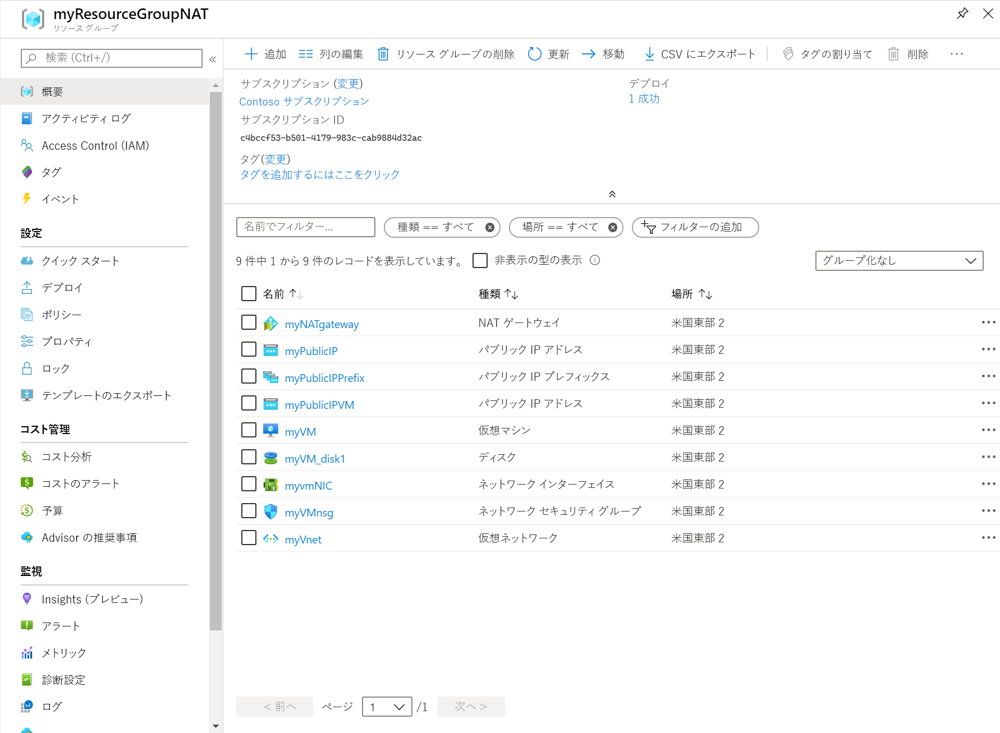

# <a name="quickstart-create-a-nat-gateway---resource-manager-template"></a>クイック スタート:NAT ゲートウェイを作成する - Resource Manager テンプレート

Azure Resource Manager テンプレートを使用して、Virtual Network NAT の使用を開始します。  このテンプレートは、仮想ネットワーク、NAT ゲートウェイ リソース、および Ubuntu 仮想マシンをデプロイします。 Ubuntu 仮想マシンは、NAT ゲートウェイ リソースに関連付けられているサブネットにデプロイされます。

[!INCLUDE [About Azure Resource Manager](../../includes/resource-manager-quickstart-introduction.md)]

Azure サブスクリプションをお持ちでない場合は、開始する前に [無料アカウント](https://azure.microsoft.com/free/?WT.mc_id=A261C142F) を作成してください。

## <a name="create-a-nat-gateway-and-supporting-resources"></a>NAT ゲートウェイとサポート リソースを作成する

このテンプレートは、以下のリソースを作成するように構成されています。 

* 仮想ネットワーク 
* NAT ゲートウェイ リソース
* Ubuntu 仮想マシン

Ubuntu VM は、NAT ゲートウェイ リソースに関連付けられているサブネットにデプロイされます。

### <a name="review-the-template"></a>テンプレートを確認する

このクイックスタートで使用されるテンプレートは [Azure クイックスタート テンプレート](https://raw.githubusercontent.com/Azure/azure-quickstart-templates/master/101-nat-gateway-1-vm/azuredeploy.json)からのものです

:::code language="json" source="~/quickstart-templates/101-nat-gateway-1-vm/azuredeploy.json" range="1-335" highlight="256-282":::

このテンプレートには、次の 9 つの Azure リソースが定義されています。

**Microsoft.Network**

* **[Microsoft.Network/natGateways](https://docs.microsoft.com/azure/templates/microsoft.network/natgateways)** : NAT ゲートウェイ リソースを作成します。

* **[Microsoft.Network/networkSecurityGroups](https://docs.microsoft.com/azure/templates/microsoft.network/networksecuritygroups)** : ネットワーク セキュリティ グループを作成します。

    * **[Microsoft.Network/networkSecurityGroups/securityRules](https://docs.microsoft.com/azure/templates/microsoft.network/networksecuritygroups/securityrules)** : セキュリティ規則を作成します。

* **[Microsoft.Network/publicIPAddresses](https://docs.microsoft.com/azure/templates/microsoft.network/publicipaddresses)** : パブリック IP アドレスを作成します。

* **[Microsoft.Network/publicIPPrefixes](https://docs.microsoft.com/azure/templates/microsoft.network/publicipprefixes)** : パブリック IP プレフィックスを作成します。

* **[Microsoft.Network/virtualNetworks](https://docs.microsoft.com/azure/templates/microsoft.network/virtualnetworks)** : 仮想ネットワークを作成します。

    * **[Microsoft.Network/virtualNetworks/subnets](https://docs.microsoft.com/azure/templates/microsoft.network/virtualnetworks/subnets)** : 仮想ネットワーク サブネットを作成します。

* **[Microsoft.Network/networkinterfaces](https://docs.microsoft.com/azure/templates/microsoft.network/networkinterfaces)** : ネットワーク インターフェイスを作成します。

**Microsoft.Compute**

* **[Microsoft.Compute/virtualMachines](https://docs.microsoft.com/azure/templates/Microsoft.Compute/virtualMachines)** : 仮想マシンを作成します。

### <a name="deploy-the-template"></a>テンプレートのデプロイ

**Azure CLI**

```azurecli-interactive
read -p "Enter the location (i.e. westcentralus): " location
resourceGroupName="myResourceGroupNAT"
templateUri="https://raw.githubusercontent.com/Azure/azure-quickstart-templates/master/101-nat-gateway-1-vm/azuredeploy.json" 

az group create \
--name $resourceGroupName \
--location $location

az group deployment create \
--resource-group $resourceGroupName \
--template-uri  $templateUri
```

**Azure PowerShell**

```azurepowershell-interactive
$location = Read-Host -Prompt "Enter the location (i.e. westcentralus)"
$templateUri = "https://raw.githubusercontent.com/Azure/azure-quickstart-templates/master/101-nat-gateway-1-vm/azuredeploy.json"

$resourceGroupName = "myResourceGroupNAT"

New-AzResourceGroup -Name $resourceGroupName -Location $location
New-AzResourceGroupDeployment -ResourceGroupName $resourceGroupName -TemplateUri $templateUri
```

**Azure Portal**

[](https://portal.azure.com/#create/Microsoft.Template/uri/https%3A%2F%2Fraw.githubusercontent.com%2FAzure%2Fazure-quickstart-templates%2Fmaster%2F101-nat-gateway-1-vm%2Fazuredeploy.json)

## <a name="review-deployed-resources"></a>デプロイされているリソースを確認する

1. [Azure portal](https://portal.azure.com) にサインインします。

2. 左側のウィンドウから **[リソース グループ]** を選択します。

3. 前のセクションで作成したリソース グループを選択します 既定のリソース グループ名は **myResourceGroupNAT** です

4. 次のリソースがリソース グループ内に作成されていることを確認します。

    

## <a name="clean-up-resources"></a>リソースをクリーンアップする

**Azure CLI**

リソース グループとそこに含まれているすべてのリソースは、不要になったら、[az group delete](/cli/azure/group#az-group-delete) コマンドを使用して削除できます。

```azurecli-interactive 
  az group delete \
    --name myResourceGroupNAT
```

**Azure PowerShell**

必要がなくなったら、[Remove-AzResourceGroup](https://docs.microsoft.com/powershell/module/az.resources/remove-azresourcegroup?view=latest) コマンドを使用して、リソース グループと、その内部に含まれているすべてのリソースを削除できます。

```azurepowershell-interactive 
Remove-AzResourceGroup -Name myResourceGroupNAT
```

**Azure Portal**

必要がなくなったら、リソース グループ、NAT ゲートウェイ、およびすべての関連リソースを削除します。 NAT ゲートウェイを含むリソース グループ **[myResourceGroupNAT]** を選択し、 **[削除]** を選択します。

## <a name="next-steps"></a>次のステップ

このクイックスタートでは、次のものを作成しました。

* NAT ゲートウェイ リソース
* 仮想ネットワーク
* Ubuntu 仮想マシン

仮想マシンは、NAT ゲートウェイに関連付けられている仮想ネットワーク サブネットにデプロイされました。 

Virtual Network NAT と Azure Resource Manager の詳細については、引き続き以下の記事を参照してください。

* [Virtual Network NAT の概要](nat-overview.md)を読む
* [NAT Gateway リソース](nat-gateway-resource.md)について読む
* [Azure Resource Manager](../azure-resource-manager/management/overview.md) の詳細を確認する
