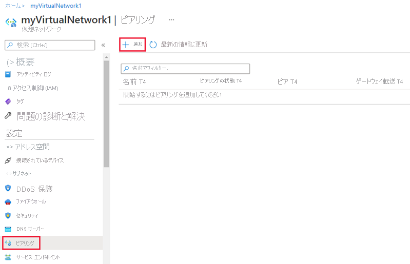
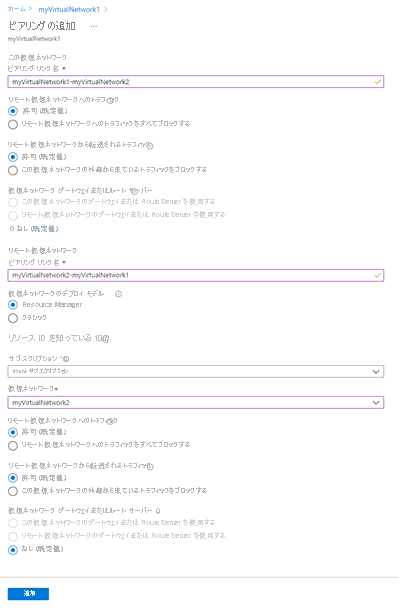
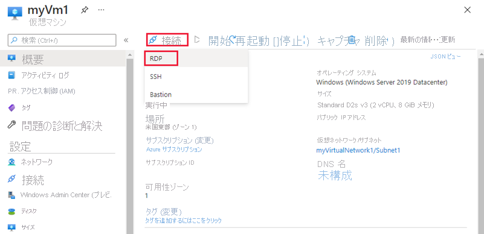

# <a name="tutorial-connect-virtual-networks-with-virtual-network-peering-using-the-azure-portal"></a>チュートリアル: Azure Portal を使用して仮想ネットワーク ピアリングで仮想ネットワークを接続する

仮想ネットワーク ピアリングを使用して、仮想ネットワークを相互に接続できます。 これらの仮想ネットワークは、同じリージョン内にあっても異なるリージョン内にあってもかまいません (グローバル VNet ピアリングとも呼ばれます)。 仮想ネットワークをピアリングすると、それぞれの仮想ネットワークに存在するリソースが、あたかも同じ仮想ネットワーク内に存在するかのような待ち時間と帯域幅で相互に通信できます。 このチュートリアルでは、以下の内容を学習します。

> [!div class="checklist"]
> * 2 つの仮想ネットワークを作成する
> * 仮想ネットワーク ピアリングを使用して 2 つの仮想ネットワークを接続する
> * 各仮想ネットワークに仮想マシン (VM) を展開する
> * VM 間の通信

好みに応じて、[Azure CLI](tutorial-connect-virtual-networks-cli.md) または [Azure PowerShell](tutorial-connect-virtual-networks-powershell.md) を使ってこのチュートリアルの手順を実行することもできます。

Azure サブスクリプションをお持ちでない場合は、開始する前に [無料アカウント](https://azure.microsoft.com/free/?WT.mc_id=A261C142F) を作成してください。

## <a name="log-in-to-azure"></a>Azure にログインする

Azure Portal (https://portal.azure.com ) にログインします。

## <a name="create-virtual-networks"></a>仮想ネットワークを作成する

1. Azure portal で、 **[リソースの作成]** を選択します。
2. **[ネットワーク]** を選択してから、 **[仮想ネットワーク]** を選択します。
3. **[基本]** タブで次の情報を入力するか選択し、それ以外の設定では既定値をそのまま使用します。

    |設定|値|
    |---|---|
    |サブスクリプション| サブスクリプションを選択します。|
    |Resource group| **[新規作成]** を選択し、「*myResourceGroup*と入力します。|
    |リージョン| **[米国東部]** を選択します。|
    |Name|myVirtualNetwork1|

4. **[IP アドレス]** タブで、 **[アドレス空間]** フィールドに「10.0.0.0/16」と入力します。 下の **[サブネットの追加]** ボタンをクリックし、 **[サブネット名]** に「*Subnet1*」と入力し、 **[サブネット アドレス範囲]** に「10.0.0.0/24」と入力します。
5. **[確認および作成]** を選択し、次に **[作成]** を選択します。
   
5. 次のように値を変更して、手順 1 から 5 を繰り返します。

    |設定|値|
    |---|---|
    |Name|myVirtualNetwork2|
    |アドレス空間|10.1.0.0/16|
    |Resource group| **[既存のものを使用]** 、 **[myResourceGroup]** の順に選択します。|
    |サブネット名 | Subnet2|
    |サブネットのアドレス範囲|10.1.0.0/24|

## <a name="peer-virtual-networks"></a>仮想ネットワークをピアリングする

1. Azure Portal の上部にある [検索] ボックスで、「*MyVirtualNetwork1*」の入力を開始します。 検索結果に **[myVirtualNetwork1]** が表示されたら、それを選択します。
2. 次の図に示すように、 **[設定]** で **[ピアリング]** を選択してから **[追加]** を選択します。

    

3. 次の情報を入力するか選択し、それ以外の設定では既定値をそのまま使用して、 **[OK]** を選択します。

    |設定|値|
    |---|---|
    |myVirtualNetwork1 からリモート仮想ネットワークへのピアリングの名前|myVirtualNetwork1-myVirtualNetwork2 - ページが初めて読み込まれるときは、ここに "remote virtual network" という語句が表示されます。 リモート仮想ネットワークを選択すると、"remote virtual network" という語句がリモート仮想ネットワークの名前に置き換えられます。|
    |サブスクリプション| サブスクリプションを選択します。|
    |仮想ネットワーク|myVirtualNetwork2 - *myVirtualNetwork2* 仮想ネットワークを選択するには、 **[仮想ネットワーク]** 、 **[myVirtualNetwork2 (myResourceGroup)]** の順に選択します。 同じリージョンまたは異なるリージョンの仮想ネットワークを選択することができます。|
    |myVirtualNetwork2 から myVirtualNetwork1 へのピアリングの名前|myVirtualNetwork2-myVirtualNetwork1|

    

    次の図に示すように、 **[ピアリング状態]** は "*接続中*" です。

    

    状態が表示されない場合は、ブラウザーを更新します。

## <a name="create-virtual-machines"></a>仮想マシンを作成する

後で仮想ネットワーク間で通信できるように、各仮想ネットワーク内に VM を作成します。

### <a name="create-the-first-vm"></a>最初の VM を作成する

1. Azure portal で、 **[リソースの作成]** を選択します。
2. **[コンピューティング]** 、 **[Windows Server 2016 Datacenter]** の順に選択します。 別のオペレーティング システムを選択することもできますが、以降の手順では、 **[Windows Server 2016 Datacenter]** を選択したという前提で説明します。 
3. **[基本]** について次の情報を入力するか選択し、それ以外の設定では既定値をそのまま使用して、 **[作成]** を選択します。

    |設定|値|
    |---|---|
    |Resource group| **[既存のものを使用]** 、 **[myResourceGroup]** の順に選択します。|
    |Name|myVm1|
    |Location| **[米国東部]** を選択します。|
    |ユーザー名| 任意のユーザー名を入力します。|
    |Password| 任意のパスワードを入力します。 パスワードは 12 文字以上で、[定義された複雑さの要件](../virtual-machines/windows/faq.md?toc=%2fazure%2fvirtual-network%2ftoc.json#what-are-the-password-requirements-when-creating-a-vm)を満たす必要があります。|
   
4. **[サイズ]** オプションで VM サイズを選択します。
5. **[ネットワーキング]** で以下の値を選択します。

    |設定|値|
    |---|---|
    |仮想ネットワーク| myVirtualNetwork1 - まだ選択されていない場合は、 **[仮想ネットワーク]** を選択し、 **[myVirtualNetwork1]** を選択します。|
    |Subnet| Subnet1 - まだ選択されていない場合は、 **[サブネット]** を選択し、 **[Subnet1]** を選択します。|
   
6. **[ネットワーク]** を選択します。 **[パブリック受信ポート]** オプションで、 **[選択したポートを許可する]** を選択します。 この下の **[受信ポートを選択]** オプションで、 **[RDP]** を選択します。 

7. 左下隅の **[確認と作成]** ボタンを選択して、VM のデプロイを開始します。

### <a name="create-the-second-vm"></a>2 つ目の VM を作成する

次のように値を変更して、手順 1 から 6 を繰り返します。

|設定|値|
|---|---|
|Name | myVm2|
|仮想ネットワーク | myVirtualNetwork2|

VM の作成には数分かかります。 両方の VM の作成が完了するまで、以降の手順に進まないでください。

## <a name="communicate-between-vms"></a>VM 間の通信

1. ポータルの上部にある *[検索]* ボックスで、「*myVm1*」の入力を開始します。 検索結果に **myVm1** が表示されたら、それを選択します。
2. 次の図に示すように、 **[接続]** を選択して *myVm1* VM へのリモート デスクトップ接続を作成します。

      

3. VM に接続するには、ダウンロードした RDP ファイルを開きます。 メッセージが表示されたら、 **[Connect]** を選択します。
4. VM の作成時に指定したユーザー名とパスワードを入力し (VM の作成時に入力した資格情報を指定するために、 **[その他]** 、 **[別のアカウントを使う]** の選択が必要になる場合があります)、 **[OK]** を選択します。
5. サインイン処理中に証明書の警告が表示される場合があります。 **[はい]** を選択して、接続処理を続行します。
6. 後の手順で、*myVm1* VM から *myVm2* VM への通信に ping を使用します。 ping は Internet Control Message Protocol (ICMP) を使用していますが、Windows ファイアウォール経由の既定では拒否されます。 *myVm1* VM で、Windows ファイアウォールを介して ICMP を有効にし、後で PowerShell を使って *myVm2* からこの VM に ping を実行できるようにします。

    ```powershell
    New-NetFirewallRule –DisplayName "Allow ICMPv4-In" –Protocol ICMPv4
    ```
    
    このチュートリアルでは VM 間の通信に ping を使用していますが、運用環境のデプロイでは Windows ファイアウォールで ICMP を許可することは推奨されません。

7. *myVm2* VM に接続するには、*myVm1* VM 上でコマンド プロンプトから以下のコマンドを入力します。

    ```
    mstsc /v:10.1.0.4
    ```
    
8. *myVm1* で ping を有効にしたため、そのマシンに対して IP アドレスで ping を実行できます。

    ```
    ping 10.0.0.4
    ```
    
9. *myVm1* と *myVm2* の両方への RDP セッションを切断します。

## <a name="clean-up-resources"></a>リソースをクリーンアップする

リソース グループとそれに含まれるすべてのリソースが不要になったら、それらを削除します。 

1. ポータル上部の **[検索]** ボックスに「*myResourceGroup*」と入力します。 検索結果に **[myResourceGroup]** が表示されたら、それを選択します。
2. **[リソース グループの削除]** を選択します。
3. **[TYPE THE RESOURCE GROUP NAME:]\(リソース グループ名を入力してください:\)** に「*myResourceGroup*」と入力し、 **[削除]** を選択します。

## <a name="next-steps"></a>次のステップ

このチュートリアルでは、仮想ネットワーク ピアリングで同じ Azure リージョン内の 2 つのネットワークを接続する方法を説明しました。 異なる[サポートされるリージョン](virtual-network-manage-peering.md#cross-region)内および[異なる Azure サブスクリプション](create-peering-different-subscriptions.md#portal)内の仮想ネットワークをピアリングすることも、ピアリングを使って[ハブとスポーク ネットワーク設計](/azure/architecture/reference-architectures/hybrid-networking/hub-spoke#virtual-network-peering)を作成することもできます。 仮想ネットワーク ピアリングについて詳しくは、[仮想ネットワーク ピアリングの概要](virtual-network-peering-overview.md)および[仮想ネットワーク ピアリングの管理](virtual-network-manage-peering.md)に関するページをご覧ください。

お使いのコンピューターを VPN 経由で仮想ネットワークに接続し、仮想ネットワーク、またはピアリングされた仮想ネットワークのリソースを操作する方法については、[仮想ネットワークへのコンピューターの接続](../vpn-gateway/vpn-gateway-howto-point-to-site-resource-manager-portal.md?toc=%2fazure%2fvirtual-network%2ftoc.json)に関するページをご覧ください。
