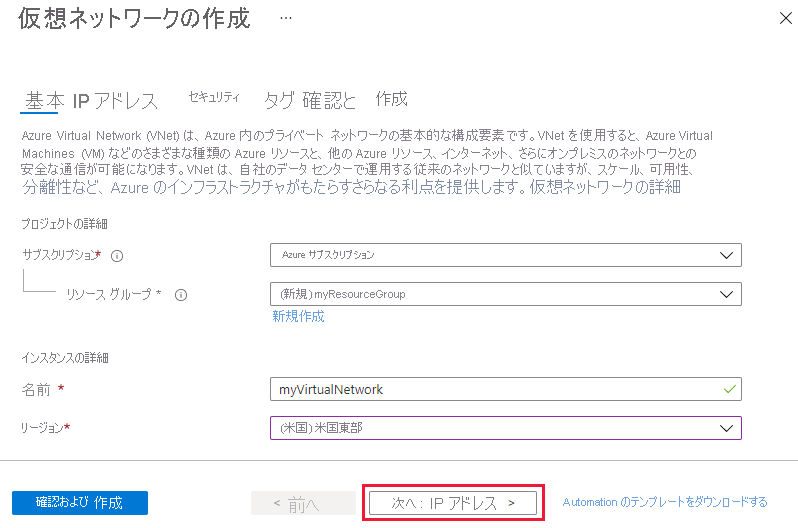
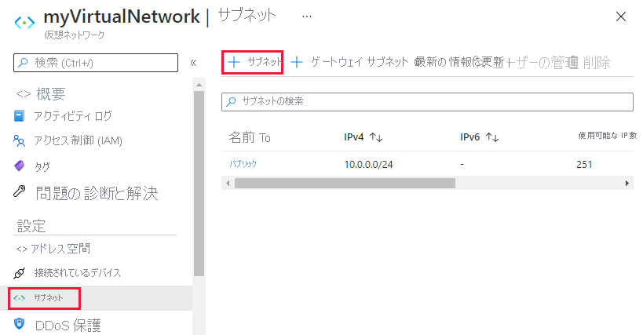
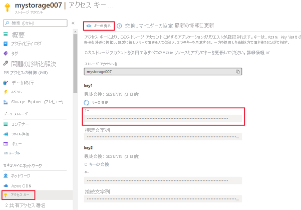
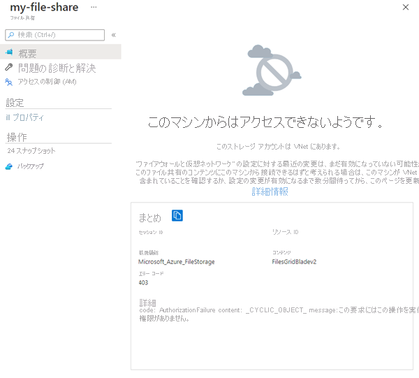

# <a name="tutorial-restrict-network-access-to-paas-resources-with-virtual-network-service-endpoints-using-the-azure-portal"></a>チュートリアル: Azure Portal を使用して仮想ネットワーク サービス エンドポイントで PaaS リソースへのネットワーク アクセスを制限する

仮想ネットワーク サービス エンドポイントを使うと、一部の Azure サービス リソースへのネットワーク アクセスを、仮想ネットワーク サブネットに制限できます。 また、リソースに対するインターネット アクセスを排除することもできます。 サービス エンドポイントにより、使用している仮想ネットワークからサポートされている Azure サービスへの直接接続が提供されるため、ご自身の仮想ネットワークのプライベート アドレス スペースを使用して、Azure サービスにアクセスできるようになります。 サービス エンドポイントを介して Azure リソースに送信されるトラフィックは、常に Microsoft Azure のバックボーン ネットワーク上に留まります。 このチュートリアルでは、以下の内容を学習します。

> [!div class="checklist"]
> * 1 つのサブネットを含む仮想ネットワークを作成する
> * サブネットを追加し、サービス エンドポイントを有効にする
> * Azure リソースを作成し、サブネットからのみネットワーク アクセスできるようにする
> * 各サブネットに仮想マシン (VM) をデプロイする
> * サブネットからリソースへのアクセスを確認する
> * サブネットおよびインターネットからリソースへのアクセスが拒否されたことを確認する

好みに応じて、[Azure CLI](tutorial-restrict-network-access-to-resources-cli.md) または [Azure PowerShell](tutorial-restrict-network-access-to-resources-powershell.md) を使ってこのチュートリアルの手順を実行することもできます。

Azure サブスクリプションをお持ちでない場合は、開始する前に [無料アカウント](https://azure.microsoft.com/free/?WT.mc_id=A261C142F) を作成してください。

## <a name="log-in-to-azure"></a>Azure にログインする

Azure Portal (https://portal.azure.com ) にログインします。

## <a name="create-a-virtual-network"></a>仮想ネットワークの作成

1. Azure Portal の左上隅にある **[+ リソースの作成]** を選択します。
2. **[ネットワーク]** を選択してから、 **[仮想ネットワーク]** を選択します。
3. 以下の情報を入力するか選んだ後、 **[作成]** を選びます。

   |設定|値|
   |----|----|
   |Name| myVirtualNetwork |
   |アドレス空間| 10.0.0.0/16|
   |サブスクリプション| サブスクリプションを選択します。|
   |Resource group | **[新規作成]** を選択し、「*myResourceGroup*と入力します。|
   |Location| **[米国東部]** を選択します。 |
   |サブネット名| パブリック|
   |サブネットのアドレス範囲| 10.0.0.0/24|
   |DDoS 保護| Basic|
   |サービス エンドポイント| 無効|
   |ファイアウォール| 無効|

   

## <a name="enable-a-service-endpoint"></a>サービス エンドポイントを有効にする

サービス エンドポイントはサービスごと、サブネットごとに有効にします。 サブネットを作成し、そのサブネットに対してサービス エンドポイントを有効にします。

1. ポータルの上部にある **[リソース、サービス、ドキュメントの検索]** ボックスに「*myVirtualNetwork*」と入力します。 検索結果に **[myVirtualNetwork]** が表示されたら、それを選択します。
2. 仮想ネットワークにサブネットを追加します。 次の図に示すように、 **[設定]** で **[サブネット]** を選んで、 **[+ サブネット]** を選びます。

     

3. **[サブネットの追加]** で以下の情報を選ぶか入力し、 **[OK]** を選びます。

    |設定|値|
    |----|----|
    |Name| プライベート |
    |アドレス範囲| 10.0.1.0/24|
    |サービス エンドポイント| **[サービス]** で **Microsoft.Storage** を選びます|

> [!CAUTION]
> リソースが含まれる既存のサブネットのサービス エンドポイントを有効にする前に、「[サブネット設定の変更](virtual-network-manage-subnet.md#change-subnet-settings)」を参照してください。

## <a name="restrict-network-access-for-a-subnet"></a>サブネットのネットワーク アクセスを制限する

既定では、サブネット内のすべての VM はすべてのリソースと通信できます。 ネットワーク セキュリティ グループを作成し、それをサブネットに関連付けることで、サブネット内のすべてのリソース間の通信を制限できます。

1. Azure Portal の左上隅にある **[+ リソースの作成]** を選択します。
2. **[ネットワーク]** を選び、 **[ネットワーク セキュリティ グループ]** を選びます。
3. **[ネットワーク セキュリティ グループの作成]** で、以下の情報を入力するか選んだ後、 **[作成]** を選びます。

    |設定|値|
    |----|----|
    |Name| myNsgPrivate |
    |サブスクリプション| サブスクリプションを選択します。|
    |Resource group | **[既存のものを使用]** を選択し、 *[myResourceGroup]* を選択します。|
    |Location| **[米国東部]** を選択します。 |

4. ネットワーク セキュリティ グループが作成された後、ポータルの上部にある *[リソース、サービス、ドキュメントの検索]* ボックスに「**myNsgPrivate**」と入力します。 検索結果に **myNsgPrivate** が表示されたら、それを選びます。
5. **[設定]** で **[送信セキュリティ規則]** を選びます。
6. **[+ 追加]** を選択します。
7. Azure Storage サービスへの送信方向の通信を許可するルールを作成します。 次の情報を入力または選択し、 **[追加]** を選択します。

    |設定|値|
    |----|----|
    |source| **VirtualNetwork** を選びます。 |
    |Source port ranges| * |
    |宛先 | **[Service Tag]\(サービス タグ\)** を選びます|
    |宛先サービス タグ | **[ストレージ]** を選びます|
    |宛先ポート範囲| * |
    |Protocol|Any|
    |アクション|Allow|
    |Priority|100|
    |Name|Allow-Storage-All|

8. インターネットへの通信を拒否する別の送信セキュリティ ルールを作成します。 このルールは、送信方向のインターネット通信を許可する、すべてのネットワーク セキュリティ グループ内の既定のルールをオーバーライドします。 次の値を使用して、手順 5 から 7 をもう一度実行します。

    |設定|値|
    |----|----|
    |source| **VirtualNetwork** を選びます。 |
    |Source port ranges| * |
    |宛先 | **[Service Tag]\(サービス タグ\)** を選びます|
    |宛先サービス タグ| **[インターネット]** を選びます|
    |宛先ポート範囲| * |
    |Protocol|Any|
    |アクション|拒否|
    |Priority|110|
    |Name|Deny-Internet-All|

9. **[設定]** で **[受信セキュリティ規則]** を選びます。
10. **[+ 追加]** を選択します。
11. 任意の場所からサブネットへのリモート デスクトップ プロトコル (RDP) トラフィックを許可する受信セキュリティ規則を作成します。 この規則は、インターネットからのすべての受信トラフィックを拒否する既定のセキュリティ規則をオーバーライドします。 後のステップで接続をテストできるように、サブネットへのリモート デスクトップ接続を許可します。 **[設定]** で **[受信セキュリティ規則]** を選択し、 **[+ 追加]** を選択し、次の値を入力して、 **[追加]** を選択します。

    |設定|値|
    |----|----|
    |source| Any |
    |Source port ranges| * |
    |宛先 | **VirtualNetwork** を選びます。|
    |宛先ポート範囲| 3389 |
    |Protocol|Any|
    |アクション|Allow|
    |Priority|120|
    |Name|Allow-RDP-All|

12. **[設定]** で、 **[サブネット]** を選択します。
13. **[+ 関連付け]** を選びます
14. **[サブネットの関連付け]** で **[仮想ネットワーク]** を選んだ後、 **[仮想ネットワークの選択]** で **myVirtualNetwork** を選びます。
15. **[サブネットの選択]** で **Private** を選び、 **[OK]** を選びます。

## <a name="restrict-network-access-to-a-resource"></a>リソースへのネットワーク アクセスを制限する

サービス エンドポイントを有効にした Azure サービスを介して作成されたリソースへのネットワーク アクセスを制限するために必要な手順は、サービスによって異なります。 各サービスの具体的な手順については、それぞれのサービスのドキュメントをご覧ください。 このチュートリアルの残りの部分では、例として、Azure Storage アカウントのネットワーク アクセスを制限する手順を示します。

### <a name="create-a-storage-account"></a>ストレージ アカウントの作成

1. Azure Portal の左上隅にある **[+ リソースの作成]** を選択します。
2. **[ストレージ]** 、 **[ストレージ アカウント - Blob、File、Table、Queue]** の順に選択します。
3. 次の情報を入力するか選び、それ以外の情報は既定値を選んで、 **[作成]** を選びます。

    |設定|値|
    |----|----|
    |Name| すべての Azure の場所で一意の名前 (3 ～ 24 文字で、数字と小文字のみを使用) を入力します。|
    |アカウントの種類|StorageV2 (汎用 v2)|
    |Location| **[米国東部]** を選択します。 |
    |レプリケーション| ローカル冗長ストレージ (LRS)|
    |サブスクリプション| サブスクリプションを選択します。|
    |Resource group | **[既存のものを使用]** を選択し、 *[myResourceGroup]* を選択します。|

### <a name="create-a-file-share-in-the-storage-account"></a>ストレージ アカウントにファイル共有を作成する

1. ストレージ アカウントを作成した後、ポータルの上部にある **[Search resources, services, and docs]\(リソース、サービス、ドキュメントの検索\)** ボックスにストレージ アカウントの名前を入力します。 指定したストレージ アカウントの名前が検索結果に表示されたら、それを選びます。
2. 次の図に示すように、 **[ファイル]** を選びます。

    

3. **[+ ファイル共有]** を選択します。
4. *[名前]* に「**my-file-share**」と入力し、 **[OK]** を選びます。
5. **[File サービス]** ボックスを閉じます。

### <a name="restrict-network-access-to-a-subnet"></a>サブネットへのネットワーク アクセスを制限する

既定では、ストレージ アカウントは、インターネットを含む任意のネットワーク上のクライアントからのネットワーク接続を受け入れます。 *myVirtualNetwork* 仮想ネットワーク内の *Private* サブネットを除く、インターネットおよびすべての仮想ネットワーク内のその他すべてのサブネットからのネットワーク アクセスを拒否します。

1. ストレージ アカウントの **[設定]** で、 **[ファイアウォールと仮想ネットワーク]** を選びます。
2. **[選択されたネットワーク]** を選択します。
3. **[+ 既存の仮想ネットワークを追加]** を選択します。
4. **[ネットワークの追加]** で次の値を選んで、 **[追加]** を選びます。

    |設定|値|
    |----|----|
    |サブスクリプション| サブスクリプションを選択します。|
    |仮想ネットワーク|**[仮想ネットワーク]** で **myVirtualNetwork** を選びます。|
    |サブネット| **[サブネット]** で **Private** を選びます|

    

5. **[保存]** を選択します。
6. **[ファイアウォールと仮想ネットワーク]** ボックスを閉じます。
7. 次の図に示すように、ストレージ アカウントの **[設定]** で、 **[アクセス キー]** を選びます。

      

8. **[キー]** の値をメモします。後の手順でファイル共有を VM のドライブ文字にマップするときに、この値を手入力する必要があります。

## <a name="create-virtual-machines"></a>仮想マシンを作成する

ストレージ アカウントへのネットワーク アクセスをテストするには、各サブネットに VM を展開します。

### <a name="create-the-first-virtual-machine"></a>最初の仮想マシンを作成する

1. Azure Portal の左上隅にある **[+ リソースの作成]** を選択します。
2. **[コンピューティング]** 、 **[Windows Server 2016 Datacenter]** の順に選択します。
3. 次の情報を入力または選択し、 **[OK]** を選択します。

   |設定|値|
   |----|----|
   |Name| myVmPublic|
   |ユーザー名|任意のユーザー名を入力します。|
   |Password| 任意のパスワードを入力します。 パスワードは 12 文字以上で、[定義された複雑さの要件](../virtual-machines/windows/faq.md?toc=%2fazure%2fvirtual-network%2ftoc.json#what-are-the-password-requirements-when-creating-a-vm)を満たす必要があります。|
   |サブスクリプション| サブスクリプションを選択します。|
   |Resource group| **[既存のものを使用]** を選択し、 **[myResourceGroup]** を選択します。|
   |Location| **[米国東部]** を選択します。|

   
4. 仮想マシンのサイズを選択して、 **[選択]** を選択します。
5. **[設定]** で **[ネットワーク]** を選び、**myVirtualNetwork** を選びます。 次の図に示すように、 **[サブネット]** を選んで、**Public** を選びます。

   

6. **[ネットワーク セキュリティ グループ]** で **[Advanced]\(高度\)** を選択します。 ポータルで、ポート 3389 を許可するネットワーク セキュリティ グループが自動的に作成されます。ポート 3389 は、後で仮想マシンに接続するために開く必要があります。 **[設定]** ページで **[OK]** を選択します。
7. **[概要]** ページで、 **[作成]** を選択して、仮想マシンのデプロイを開始します。 VM の展開には数分かかりますが、VM の作成中に次の手順に進むことができます。

### <a name="create-the-second-virtual-machine"></a>2 番目の仮想マシンを作成する

もう一度手順 1 から 7 を実行しますが、今回は手順 3 で仮想マシン名を *myVmPrivate* とし、手順 5 で **[プライベート]** サブネットを選択します。

VM のデプロイには数分かかります。 作成が完了して設定がポータルに表示されるまで、次の手順を続行しないでください。

## <a name="confirm-access-to-storage-account"></a>ストレージ アカウントへのアクセスを確認する

1. *myVmPrivate* VM の作成が完了すると、Azure にその設定が開きます。 次の図に示すように、 **[接続]** ボタンを選んで VM に接続します。

   

2. **[接続]** ボタンを選択した後、リモート デスクトップ プロトコル (.rdp) ファイルが作成され、お使いのコンピューターにダウンロードされます。  
3. ダウンロードされた rdp ファイルを開きます。 メッセージが表示されたら、 **[Connect]** を選択します。 VM の作成時に指定したユーザー名とパスワードを入力します。 場合によっては、 **[その他]** 、 **[別のアカウントを使用する]** を選択して、VM の作成時に入力した資格情報を指定する必要があります。 
4. **[OK]** を選択します。
5. サインイン処理中に証明書の警告が表示される場合があります。 警告を受け取ったら、 **[はい]** または **[続行]** を選択して接続処理を続行します。
6. *myVmPrivate* VM で、PowerShell を使って、Azure ファイル共有を Z ドライブにマップします。 次のコマンドを実行する前に、`<storage-account-key>` と `<storage-account-name>` を、前の手順で指定して「[ストレージ アカウントの作成](#create-a-storage-account)」で取得した値に置き換えます。

   ```powershell
   $acctKey = ConvertTo-SecureString -String "<storage-account-key>" -AsPlainText -Force
   $credential = New-Object System.Management.Automation.PSCredential -ArgumentList "Azure\<storage-account-name>", $acctKey
   New-PSDrive -Name Z -PSProvider FileSystem -Root "\\<storage-account-name>.file.core.windows.net\my-file-share" -Credential $credential
   ```

   PowerShell によって、次のサンプル出力のような出力が返されます。

   ```powershell
   Name           Used (GB)     Free (GB) Provider      Root
   ----           ---------     --------- --------      ----
   Z                                      FileSystem    \\vnt.file.core.windows.net\my-f...
   ```

   Azure ファイル共有は Z ドライブに正常にマップされました。

7. VM にコマンド プロンプトからインターネットへの送信接続がないことを確認します。

   ```
   ping bing.com
   ```

   *Private* サブネットに関連付けられているネットワーク セキュリティ グループはインターネットへの発信アクセスが許可されていないため、応答はありません。

8. *myVmPrivate* VM へのリモート デスクトップ セッションを閉じます。

## <a name="confirm-access-is-denied-to-storage-account"></a>ストレージ アカウントへのアクセスが拒否されたことを確認する

1. ポータルの上部にある *[リソース、サービス、ドキュメントの検索]* ボックスに「**myVmPublic**」と入力します。
2. 検索結果に **myVmPublic** が表示されたら、それを選びます。
3. 「[ストレージ アカウントへのアクセスを確認する](#confirm-access-to-storage-account)」のステップ 1 ～ 6 を、*myVmPublic* VM に対して実行します。

   少し待つと、`New-PSDrive : Access is denied` エラーが発生します。 *myVmPublic* VM が *Public* サブネットに展開されているため、アクセスが拒否されました。 *Public* サブネットには Azure Storage に対して有効になっているサービス エンドポイントがありません。 ストレージ アカウントは *Private* サブネットからのネットワーク アクセスのみを許可し、*Public* サブネットからは許可しません。

4. *myVmPublic* VM へのリモート デスクトップ セッションを閉じます。

5. お使いのコンピューターから、[Azure Portal](https://portal.azure.com) にアクセスします。
6. **[リソース、サービス、ドキュメントの検索]** ボックスに、作成したストレージ アカウントの名前を入力します。 指定したストレージ アカウントの名前が検索結果に表示されたら、それを選びます。
7. **[ファイル]** を選択します。
8. 次の図に示すようにエラーが表示されます。

   

   お使いのコンピューターは *MyVirtualNetwork* 仮想ネットワークの *Private* サブネットに含まれていないため、アクセスが拒否されます。

## <a name="clean-up-resources"></a>リソースをクリーンアップする

リソース グループとそれに含まれるすべてのリソースが不要になったら、それらを削除します。

1. ポータル上部の *[検索]* ボックスに「**myResourceGroup**」と入力します。 検索結果に **[myResourceGroup]** が表示されたら、それを選択します。
2. **[リソース グループの削除]** を選択します。
3. *[TYPE THE RESOURCE GROUP NAME:]\(リソース グループ名を入力してください:\)* に「**myResourceGroup**」と入力し、 **[削除]** を選択します。

## <a name="next-steps"></a>次のステップ

このチュートリアルでは、仮想ネットワーク サブネットのサービス エンドポイントを有効にしました。 複数の Azure サービスからデプロイされているリソースに対して、サービス エンドポイントを有効にできることを学習しました。 Azure Storage アカウントを作成し、そのストレージ アカウントへのネットワーク アクセスを、仮想ネットワーク サブネット内のリソースのみに制限しました。 サービス エンドポイントの詳細については、[サービス エンドポイントの概要](virtual-network-service-endpoints-overview.md)と[サブネットの管理](virtual-network-manage-subnet.md)に関するページをご覧ください。

アカウントに複数の仮想ネットワークがある場合は、各仮想ネットワーク内のリソースが相互に通信できるように、2 つの仮想ネットワークを接続することもできます。 仮想ネットワークを接続する方法を学習するには、次のチュートリアルに進んでください。

> [!div class="nextstepaction"]
> [仮想ネットワークを接続する](./tutorial-connect-virtual-networks-portal.md)
